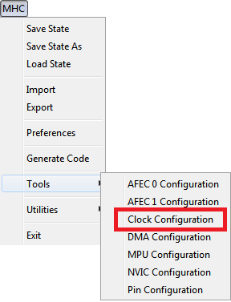
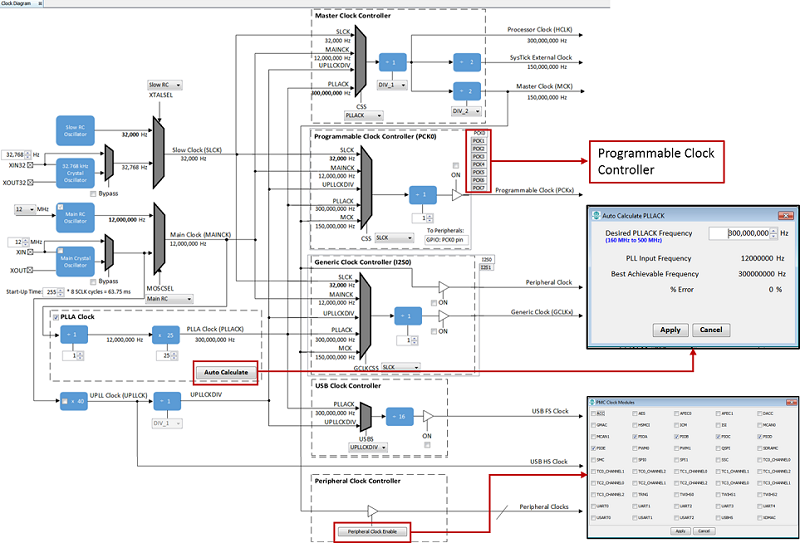

# MHC Clock Configuration

MHC plug-in consists of following plug-ins/managers based on the device selection while creating the project.

- Clock Configuration: Enables to configure Master, Generic, Peripheral and System Clocks
- Pin Configuration: Enables to configure pins in the Pin Configuration area depending upon the application requirements
- NVIC Configuration: Enables to configure enable/disable of interrupts, interrupt priority and name
- DMA Configuration: Enables to configure DMA Channels
- MPU Configuration: Enables to configure different zones of Memory Protection Unit

To open **Clock Configuration** MHC plug-in, perform this action MHC → Tools then click **Clock Configuration** .

  

**Note**: MHC plugins availability will vary depending on the device selection while creating the project.

## Clock Configuration

In the MHC, select the Clock Diagram Tab and verify that the clock is configured correctly for the selected target board. The Clock Diagram tab allows for easy setup of the master, system and peripheral clocks. See image below.

  