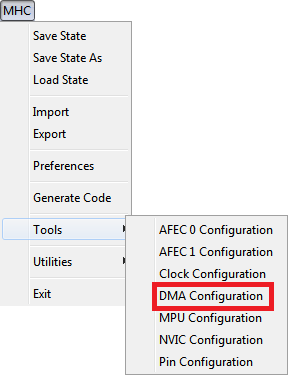
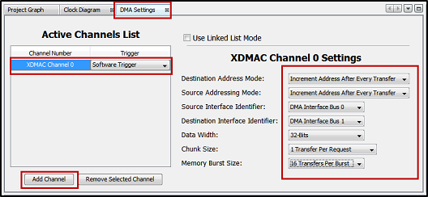

# MHC DMA Configuration

MHC plug-in consists of following plug-ins/managers based on the device selection while creating the project.

- Clock Configuration: Enables to configure Master, Generic, Peripheral and System Clocks
- Pin Configuration: Enables to configure pins in the Pin Configuration area depending upon the application requirements
- NVIC Configuration: Enables to configure enable/disable of interrupts, interrupt priority and name
- DMA Configuration: Enables to configure DMA Channels
- MPU Configuration: Enables to configure different zones of Memory Protection Unit

To open **DMA Configuration** MHC plug-in, perform this action MHC → Tools then click **DMA Configuration** .

  

**Note**: MHC plugins availability will vary depending on the device selection while creating the project.

## DMA Configuration

Users can add a channel and perform the channel settings, such as setting up source and destination address mode, interface identifier, data width, chunk size, and memory burst size. See image below.

**Note**: In the screenshot above, the MHC DMA configuration for SAME70 MCU is shown as an example. The MHC DMA configuration for other PIC or SAM MCUs may differ from the one shown above. 

## Reference Links
- <a href="https://www.microchip.com/design-centers/32-bit" target="_blank">Microchip 32-bit MCUs</a>
- <a href="https://www.microchip.com/mplab/mplab-x-ide" target="_blank">Microchip MPLAB X IDE</a>
- <a href="https://www.microchip.com/mplab/mplab-harmony" target="_blank">Microchip MPLAB Harmony</a>
- <a href="https://www.microchip.com/mplab/compilers" target="_blank">MPLAB XC32/32++ C Compiler</a>
