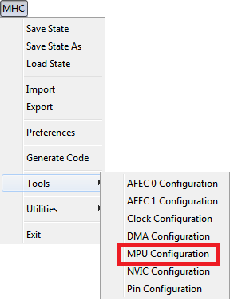
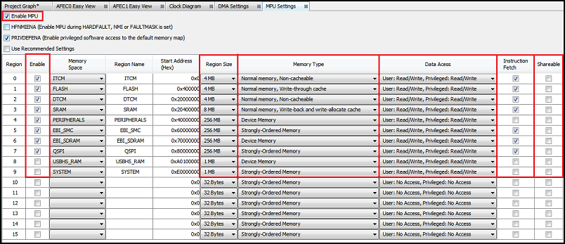

# MHC MPU Configuration

MHC plug-in consists of following plug-ins/managers based on the device selection while creating the project.

- Clock Configuration: Enables to configure Master, Generic, Peripheral and System Clocks
- Pin Configuration: Enables to configure pins in the Pin Configuration area depending upon the application requirements
- NVIC Configuration: Enables to configure enable/disable of interrupts, interrupt priority and name
- DMA Configuration: Enables to configure DMA Channels
- MPU Configuration: Enables to configure different zones of Memory Protection Unit

To open **MPU Configuration** MHC plug-in, perform this action MHC → Tools then click **MPU Configuration** .

  

**Note**: MHC plugins availability will vary depending on the device selection while creating the project.

## MPU Configuration

Users can configure MPU regions for memory spaces, such as ITCM, DTCM, Flash, SRAM, Peripherals, EBI, QSPI, USBHS and System. Users can also set the different attributes for these memory spaces. See image below:

  