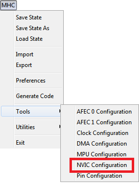
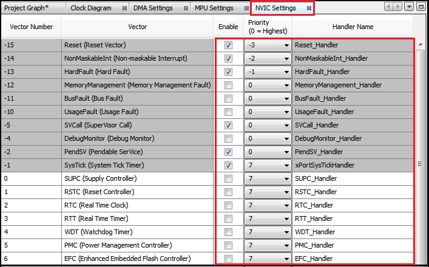

&nbsp;&nbsp;&nbsp;&nbsp;&nbsp;&nbsp;&nbsp;&nbsp;&nbsp;&nbsp;&nbsp;&nbsp;&nbsp;&nbsp;&nbsp;&nbsp;&nbsp;&nbsp;&nbsp;&nbsp;&nbsp;&nbsp;&nbsp;&nbsp;&nbsp;&nbsp;&nbsp;&nbsp; &nbsp;&nbsp;&nbsp;&nbsp;&nbsp;&nbsp;&nbsp;&nbsp;&nbsp;&nbsp;&nbsp;&nbsp;&nbsp;&nbsp;&nbsp;&nbsp;&nbsp;&nbsp;&nbsp;&nbsp;&nbsp;&nbsp;&nbsp;&nbsp;&nbsp;&nbsp;&nbsp;&nbsp;&nbsp;&nbsp;&nbsp;&nbsp;&nbsp;&nbsp;&nbsp;&nbsp;&nbsp;&nbsp;&nbsp;&nbsp;&nbsp;&nbsp;&nbsp;&nbsp;&nbsp;&nbsp;&nbsp;&nbsp;&nbsp;&nbsp;&nbsp;&nbsp;&nbsp;&nbsp;&nbsp;&nbsp;&nbsp;&nbsp;&nbsp;&nbsp;&nbsp;&nbsp;&nbsp;&nbsp;&nbsp;&nbsp;&nbsp;&nbsp;&nbsp;&nbsp;&nbsp;&nbsp; 
# MHC NVIC Configuration

MHC plug-in consists of following plug-ins/managers based on the device selection while creating the project.

- Clock Configuration: Enables to configure Master, Generic, Peripheral and System Clocks
- Pin Configuration: Enables to configure pins in the Pin Configuration area depending upon the application requirements
- NVIC Configuration: Enables to configure enable/disable of interrupts, interrupt priority and name
- DMA Configuration: Enables to configure DMA Channels
- MPU Configuration: Enables to configure different zones of Memory Protection Unit

To open **NVIC Configuration** MHC plug-in, perform this action MHC → Tools then click **NVIC Configuration** .

  

**Note**: MHC plugins availability will vary depending on the device selection while creating the project.

## NVIC Configuration

NVIC Manager allows users to enable or disable interrupts, change priority, and change names of interrupt handlers, see image below.

**Note**: In the screenshot above, the MHC NVIC configuration for SAME70 MCU is shown as an example. The MHC NVIC configuration for other PIC or SAM MCUs may differ from the one shown above. 

## Reference Links
  &nbsp; &nbsp; &nbsp;   &nbsp; &nbsp; &nbsp;   &nbsp; &nbsp;    
