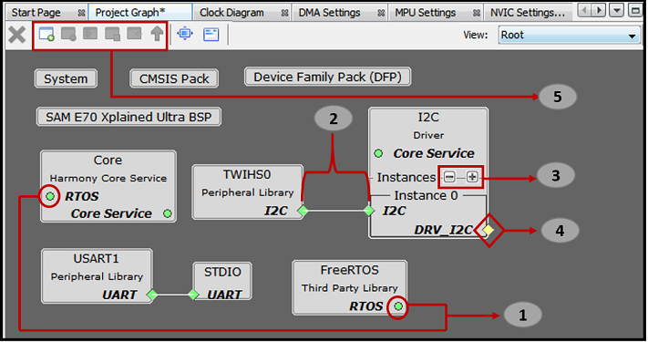
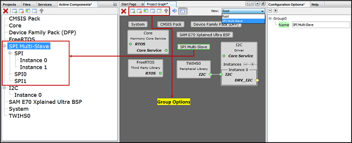
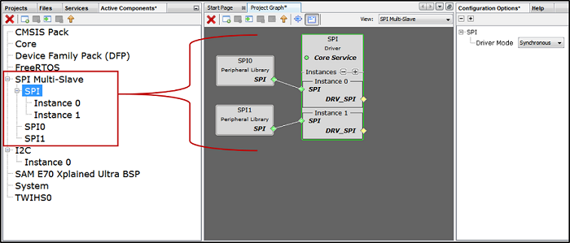

&nbsp;&nbsp;&nbsp;&nbsp;&nbsp;&nbsp;&nbsp;&nbsp;&nbsp;&nbsp;&nbsp;&nbsp;&nbsp;&nbsp;&nbsp;&nbsp;&nbsp;&nbsp;&nbsp;&nbsp;&nbsp;&nbsp;&nbsp;&nbsp;&nbsp;&nbsp;&nbsp;&nbsp; &nbsp;&nbsp;&nbsp;&nbsp;&nbsp;&nbsp;&nbsp;&nbsp;&nbsp;&nbsp;&nbsp;&nbsp;&nbsp;&nbsp;&nbsp;&nbsp;&nbsp;&nbsp;&nbsp;&nbsp;&nbsp;&nbsp;&nbsp;&nbsp;&nbsp;&nbsp;&nbsp;&nbsp;&nbsp;&nbsp;&nbsp;&nbsp;&nbsp;&nbsp;&nbsp;&nbsp;&nbsp;&nbsp;&nbsp;&nbsp;&nbsp;&nbsp;&nbsp;&nbsp;&nbsp;&nbsp;&nbsp;&nbsp;&nbsp;&nbsp;&nbsp;&nbsp;&nbsp;&nbsp;&nbsp;&nbsp;&nbsp;&nbsp;&nbsp;&nbsp;&nbsp;&nbsp;&nbsp;&nbsp;&nbsp;&nbsp;&nbsp;&nbsp;&nbsp;&nbsp;&nbsp;&nbsp; 
# MHC Project Graph

The Project Graph displays all the instantiated component blocks. In Figure below BSP, USART and STDIO modules from Peripherals (CSP), I2C module from Harmony Core Driver, and FreeRTOS from Third-Party Software components are activated. MHC uses concept of Capability and Dependency for easy instantiation of modules.

## Generic Capability and Dependency

A generic capability has a common name that identifies an interface that can be provided by a component but does not have an implementation of its own. One or more other components must implement the capability as shown in the following figure.

- Point 1: Indicates the concept of Generic capabilities and dependency, i.e. FreeRTOS has exposed a generic capability on “RTOS” on which Harmony Core Service has created a generic dependency, up on satisfying these generic dependencies the color will turn to Green. Non-required dependencies are indicated as Yellow and indicate optional functionality that will not inhibit the operation of the component if absent. Required dependencies will display as Red, indicating that an error will likely occur during generation, compilation, or at runtime if the dependency is not satisfied. Similarly, Harmony Core Service has exposed a generic capability “Core Service” on which I2C driver has created a generic dependency. Generic dependencies connect automatically to generic capabilities and no connector line is required to bind the two.
- Point 2: Indicates how I2C dependency is satisfied by binding with the capability TWIHS0. The left side block is a capability i.e. TWIHS0 and the right-side block is a dependency i.e. “Instance 0” I2C.
- Point 3: Indicates how a new component can be generated at run-time by clicking button  creates a new generator database component. A generator database component can create unique instances of itself as needed. This is for things like components like bit-bang drivers that are defined in software, and thus can be added several times to a project if desired. Similarly, by clicking button   deletes a component instantly.
- Point 4: Indicates the available capability of I2C driver. As mention above a non-required dependency is indicated as Yellow and indicates optional functionality that will not inhibit the operation of the component if absent.
- Point 5: Options to create, disband, add selected, view selected and configure group or container respectively. This is explained in detail in Section 5.3.2 Project Group Creation.
The following figure illustrates the unsatisfied direct dependency for I2C driver. User can see the list of satisfiers for a direct dependency by right-clicking on Red color diamond button.

Click button  to adjust the “Canvas Size” and button   for “Toggle Minimap”.

## Multi-Dependency and Multi-Capability

A component can have more than one dependency and capability respectively. The following figure illustrates the multi dependency and multi-capability feature of Harmony and shown with square block unlike a diamond block in single dependency. For example, in the below figure File System component is dependent on SD Card (SPI), SDHC and MEMORY components respectively whereas each of these exposes a DRV_MEDIA capability.

## Container or Group Creation

The following are different group options. The Root is the default group. See the figure 5.9 below.

- **Create Group** or click  : Creates a group. If user selects any component and clicks , then a pop-up is shown asking to automatically add selected components to the new group.
- **Disband Group** or click  : Deletes a selected group. User can delete one group at a time. If user selects any component and clicks , then a pop-up is shown asking to delete selected group.
- **Add selected to Group/Container** or click : Adds selected component in to a target container. On clicking  a pop-up with drop down menu option is shown asking user to select the target container.
- **View selected Group/Container** or click : Select a group and click  or double click a group to view the components grouped together in a container.
- **Configure Group Node** or click  : Select a group then click   to display the connections of the components if any. On clicking  a pop-up window is displayed showing the tabular list of available nodes, select the nodes to display in the group.
- **Select Next Highest Group** or click : Selects the next highest group available. Root is the default group. Select a group and click   or double click a group to view the components grouped together in a container then to select next highest group click  or to select a group under a drop down  
  
Multiple components added to group or container. This helps in simplifying the Project Graph view. The following figure illustrates the grouping of SPI Driver and SPI PLIB components. Similarly, user can create any number of group or container based on the requirement. Say for example separate container for TCP/IP and USB and so on. or based on the application need.

## Note
 *This page has been verified with the following versions of software tools:*  

 - [MPLAB Harmony v3 "csp" repo v3.7.1](https://github.com/Microchip-MPLAB-Harmony/csp/releases/tag/v3.7.1)
 - [MPLAB Harmony v3 "dev_packs" repo v3.7.0](https://github.com/Microchip-MPLAB-Harmony/dev_packs/releases/tag/v3.7.0)
 - [MPLAB Harmony v3 "mhc" repo v3.4.0](https://github.com/Microchip-MPLAB-Harmony/mhc/releases/tag/v3.4.0)
 - MPLAB Harmony Configurator Plugin v3.5.0
 - [MPLAB X IDE v5.40](https://www.microchip.com/mplab/mplab-x-ide)
 - [MPLAB XC32 Compiler v2.41](https://www.microchip.com/mplab/compilers)

 Because Microchip regularly update tools, occasionally there could be minor differences with the newer versions of the tools.   

## Reference Links
  &nbsp; &nbsp; &nbsp;   &nbsp; &nbsp; &nbsp;   &nbsp; &nbsp;    
