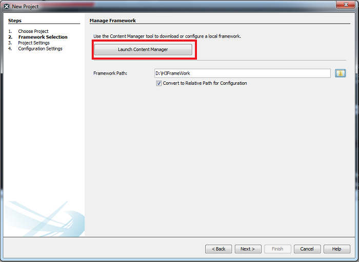
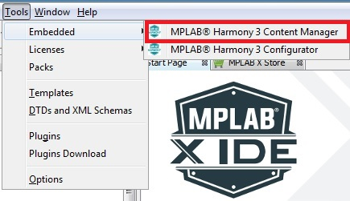
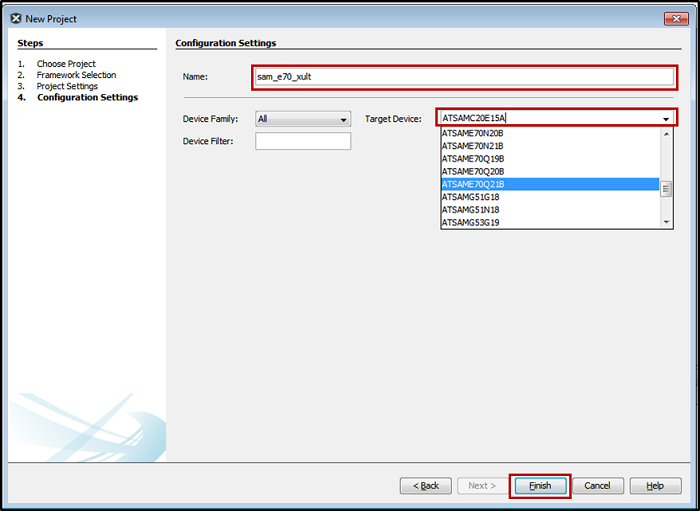
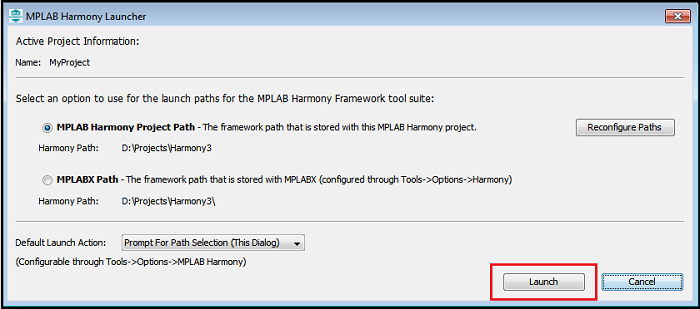
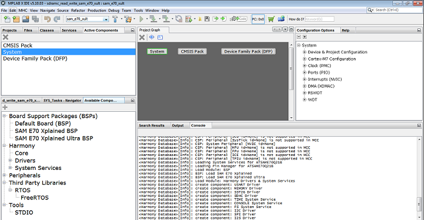
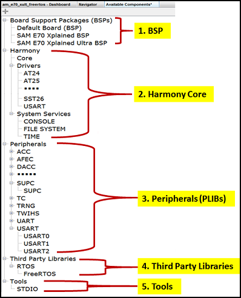

&nbsp;&nbsp;&nbsp;&nbsp;&nbsp;&nbsp;&nbsp;&nbsp;&nbsp;&nbsp;&nbsp;&nbsp;&nbsp;&nbsp;&nbsp;&nbsp;&nbsp;&nbsp;&nbsp;&nbsp;&nbsp;&nbsp;&nbsp;&nbsp;&nbsp;&nbsp;&nbsp;&nbsp; &nbsp;&nbsp;&nbsp;&nbsp;&nbsp;&nbsp;&nbsp;&nbsp;&nbsp;&nbsp;&nbsp;&nbsp;&nbsp;&nbsp;&nbsp;&nbsp;&nbsp;&nbsp;&nbsp;&nbsp;&nbsp;&nbsp;&nbsp;&nbsp;&nbsp;&nbsp;&nbsp;&nbsp;&nbsp;&nbsp;&nbsp;&nbsp;&nbsp;&nbsp;&nbsp;&nbsp;&nbsp;&nbsp;&nbsp;&nbsp;&nbsp;&nbsp;&nbsp;&nbsp;&nbsp;&nbsp;&nbsp;&nbsp;&nbsp;&nbsp;&nbsp;&nbsp;&nbsp;&nbsp;&nbsp;&nbsp;&nbsp;&nbsp;&nbsp;&nbsp;&nbsp;&nbsp;&nbsp;&nbsp;&nbsp;&nbsp;&nbsp;&nbsp;&nbsp;&nbsp;&nbsp;&nbsp; 
# MPLAB Harmony 3 Configurator (MHC)

## Introduction

<a href="https://github.com/Microchip-MPLAB-Harmony" target="_blank">MPLAB Harmony 3 </a> is a vital part of the <a href="https://www.microchip.com/development-tools/" target="_blank">MPLAB development tools </a> ecosystem for working with <a href="https://www.microchip.com/design-centers/32-bit" target="_blank">Microchip 32-bit </a> SAM® and PIC® micro controllers. It consists of a Graphical User Interface (GUI) called the MPLAB® Harmony Configurator (MHC) and an extensive set of interoperable firmware libraries that accelerate the process of developing embedded applications. The fundamental MHC GUI tools are the content manager and configurator tools. The content manager tool simplifies the process of downloading the firmware libraries, demonstration applications, and extensions to the MHC GUI. The configurator tool provides a convenient GUI for selecting libraries, initialization parameters, and optional features. It also makes it easy to connect everything together and generate C language code in a working configuration for your project.

This section describes the following MHC specific topics to get started using MPLAB® Harmony to develop embedded applications designed with Microchip 32-bit micro controllers.

- [Installation](#Installation)
	- [Prerequisites for MHC use as an MPLAB® X IDE Plugin](#Prerequisites-for-MHC-use-as-an-MPLAB®-X-IDE-Plugin)
	- [Installing MPLAB® Harmony Configurator from the Microchip Plugins Update Center](#Installing-MPLAB®-Harmony-Configurator-from-the-Microchip-Plugins-Update-Center)
	- [Updating the MPLAB® Harmony Configurator](#Updating-the-MPLAB®-Harmony-Configurator)
- [Using the MHC with the MPLAB® X IDE](#Using-the-MHC-with-the-MPLAB®-X-IDE)
	- [To Create a New Project](#To-Create-a-New-Project)
	- [To Choose an Existing Project](#To-Choose-an-Existing-Project)
	- [Selecting MPLAB® Harmony 3 Packages](#Selecting-MPLAB®-Harmony-3-Packages)
	- [Content Manager](#Content-Manager)
	- [Project Settings](#Project-Settings)
	- [Configuration Settings](#Configuration-Settings)
	- [Launching MHC](#Launching-MHC)
- [Operating Areas](#Operating-Areas)
	- [Active Components, Project Graph and Configuration Options](#Active-Components,-Project-Graph-and-Configuration-Options)
	- [Remove component](#Remove-component)
	- [Available Components](#Available-Components)

## 
## Installation

The MHC is available as a plugin extension to the <a href="https://www.microchip.com/mplab/embedded-software-center" target="_blank">MPLAB X IDE </a> and as a standalone Java application for use with other tool suites (see <a href="https://github.com/Microchip-MPLAB-Harmony/mhc/blob/master/doc/getting_started_with_mhc.md" target="_blank">here </a> for details). Regardless which form you choose, there are some prerequisites that you must have installed first. Additionally, you will need to have a supported <a href="https://www.microchip.com/DevelopmentTools/Listing/90e9a9ef-2db3-488b-b74c-956604bc395e" target="_blank">32-bit MCU board </a> on which to program, run, and debug your application.

### 
### Prerequisites for MHC use as an MPLAB® X IDE Plugin

- Install the <a href="https://www.microchip.com/mplab/mplab-x-ide" target="_blank">Microchip MPLAB X IDE</a>.
	- Refer <a href="https://microchipdeveloper.com/mplabx:installation" target="_blank">Installing MPLAB X IDE</a> guide
- Install the <a href="https://www.microchip.com/mplab/compilers" target="_blank">MPLAB XC32/32++ C Compiler</a> compiler for support of all Microchip 32-bit MCUs.
	- Refer <a href="https://microchipdeveloper.com/xc32:installation" target="_blank">Installing MPLAB XC32 Compiler</a> guide
### 
### Installing MPLAB® Harmony Configurator from the Microchip Plugins Update Center

The MHC is not automatically installed with MPLAB® X IDE. You will need to take additional steps to download and install it through Microchip Plugins Update Center:

**Steps**

1. Open the MPLAB® X IDE.
2. In the top-level menu, select to Tools > *Plugins*.
3. In the Plugins window, select the *Available Plugins* tab.
4. Select MPLAB® Harmony Configurator 3 from the list of available plugins and click the Install button. The Plugin Installer opens.
5. Click *Next* and review the License Agreement.
6. Click *Install* when you are ready for the Plugin Installer to begin downloading the MHC plugin. When the MHC plugin download is complete, MPLAB® X IDE will ask to be restarted.
7. Select *Restart* Now and click Finish. Upon restart, the plugin is installed. You can now open MHC on a new or already existing MPLAB® X IDE project.  

### 
### Updating the MPLAB® Harmony Configurator

Whenever a new version of MHC plugin is available, the MPLAB® X IDE will display a notification on the IDE window. Clicking on it will launch the plugin update wizard. In the wizard, click on the Install button to download and *install* the latest MHC plugin version.

## 
## Using the MHC with the MPLAB® X IDE

To generate code using the MHC in MPLAB® X IDE, you must first choose to create a new project or use an existing one. Then, you must follow these steps.

### 
### To Create a New Project

To create MPLAB® X IDE project, follow these steps:

1. Select *File* > *New Project* or click  New Project button to create a new project. The New Project wizard will open.
2. In the Choose Project pane, select the *Microchip Embedded category*.
3. In the Projects pane, select *32-bit MPLAB® Harmony 3 Project*, then click Next.
4. Continue by following the Selecting MPLAB® Harmony 3 Packages steps, below.  
  
**Note:** If the 32-Bit MPLAB® Harmony 3 Project type is not listed under the Microchip Embedded category, please download and install MPLAB® Harmony 3 Configurator before continuing with these steps.

### 
### To Choose an Existing Project

To choose an existing project, follow these steps:

1. Click  he Open Project window will be displayed.
2. Navigate to the desired project’s .X folder and click *Open Project*. The selected project will open in the IDE.  
**Note:** If multiple projects are open in MPLAB® X IDE, set one as the main (active) project by Right-clicking on it and selecting “*Set as Main Project*”.

### 
### Selecting MPLAB® Harmony 3 Packages

The Content Manager tool simplifies downloading of MPLAB® Harmony 3 packages. Packages contain source code, templates, documentation, MHC extensions, and other collateral for MPLAB® Harmony modules. Each package is maintained in a GIT repository that can be downloaded (or cloned) to your development system in a framework folder of your choice.

The Content Manager tool can be launched using one of the following methods:

- **Method 1**: While creating a new project from the New Project window, click the *Launch Content Manager* button.  
  
- **Method 2**: From the *Tools > Embedded > MPLAB® Harmony 3 Content Manager* menu option.  

### 
### Content Manager
Content Manager GUI helps in managing packages. It displays locally downloaded packages and remote packages available for download in a easy to use graphical interface.
User can checkout remote packages or update locally downloaded packages once remote version is updated. It helps in managing package dependencies.

Please click on below link for detailed information

GitHub → <a href="https://github.com/Microchip-MPLAB-Harmony/contentmanager/wiki" target="_blank">MPLAB Harmony 3 Content Manager</a>  
Gitee → <a href="https://gitee.com/Microchip-MPLAB-Harmony/contentmanager/wikis/" target="_blank">MPLAB Harmony 3 Content Manager</a>

### 
### Project Settings

In the New Project window, perform these settings:

1. Ensure that the Framework Path is correct. It it is not, navigate to the folder to which you previously downloaded the MPLAB® Harmony 3 packages.
**Note**: You can leave *Convert to Relative Path for Configuration* selected.
2. Click *Next* to select the project Name and Location.
3. To choose the project location, navigate to the folder in which you wish to keep your MPLAB® Harmony 3 projects and create a top-level folder for this project.
**Note**: Be sure to create a new top-level folder for this project as it will contain both the MPLAB® X IDE’s project folder (the “.X” folder) and the firmware folder into which the MHC will generate the selected source code.
4. In the Folder edit box, provide the name that will be used for the MPLAB® X IDE’s “.X” folder.
**Note**: This must be a valid directory name for your operating system.
5. In the Name edit box, enter the project’s “Virtual” name. This is the name that will be shown from within the MPLAB® X IDE.
**Note**: The Path box is not editable. It will update as you make changes to the other entries.
6. Click Next to proceed to configuration settings.  

### 
### Configuration Settings

Follow these steps to select the project’s configuration settings.

1. In the right pane, under Configuration Settings enter details for the configuration Name and choose the Target Device.  
**Note**: You can select the Device Family or enter a partial device name to filter the list if Target Devices in order to make it easier to locate the desired device.
2. After selecting the target device, Click *Finish* to launch the MHC.  
**Note**: The New Project Wizard will first open a Configuration Database Setup dialog window to allow you to review the packages that will be used by the current project. Click Launch to continue to the MHC Configurator tool.  

### 
### Launching MHC

Follow these steps to launch the MHC.

1. Open the MHC plugin tool. If the project has already been created, launch the MPLAB® Harmony 3 Configurator by selecting *Tools → Embedded → MPLAB® Harmony 3 Configurator* from the MPLAB® X IDE’s menu bar.  
  
The MPLAB® Harmony Launcher window will be displayed.
2. If necessary, reconfigure the MPLAB® X Harmony project and framework paths by clicking the *Reconfigure Paths* button. Otherwise, accept the default settings and then click *Launch*.  
  
The Configuration Database Setup window will be displayed, which shows the selected and configured Harmony packages.
3. Click **Launch** to open MHC plug-in.
  
The MHC plugin’s main window for the project will be displayed.
  

## 
## Operating Areas:

The MHC Graphical User Interface consists of following six major operating areas.

- Active Components: Displays activated/instantiated components.
- Available Components: Displays the available components based on the project configuration. Displays Board Support Packages (BSPs), list of available Peripheral Libraries (PLIBs), Harmony Core which consists of Drivers and System Services, Middleware Software, Third-Party Software and Tools.
- Project Graph: Shows the instantiated components. User can instantiate available components by double click on component. After successful component instantiation, you can see the instantiated components under Active Components panel.
- MHC Plugins: Consists of AFEC, DMA, MPU, NVIC, Clock and Pin configuration plugins. To open any of these plugins go to *MHC → Tools → select* above mentioned available plugins.
- Configuration Options: Displays the tree view of the selected component under Project Graph Area. User can do the component configuration from here.
- Console: Displays the MHC operation results
The following figure displays the MHC graphical user interface showing six operating areas.
  
**Note**: The components shown under components are based on the Microcontroller selected while creating the project. All operating areas are dockable. Each can be dragged and dropped into another position, even out of the MPLAB® X IDE main window. However, closing the IDE however will close all MHC windows, including the ones moved outside the IDE.

### 
### Active Components, Project Graph and Configuration Options

Active Component and Project Graph displays all the instantiated components. By default, the below essential components from the Chip Specific Package (CSP) repo will get auto instantiated.

- System: The CSP System component is used for the device and project specific configurations.
- CMSIS Pack: The Cortex Microcontroller Software Interface Standard (CMSIS) Pack is a vendor-independent hardware abstraction layer for the Cortex®-M processor series and defines generic tool interfaces. This pack is needed for 32-bit SAM MCU devices.
- Device Family Pack (DFP): This is the Microchip Device Family Pack retrieves the device specific information and instantiates the same.  

The following figure displays Active Components and Project Graph Area. Along with above mentioned default components, it consists of other active components like BSP, Harmony Core, I2C Driver, TWIHS, USART, SDTIO and FreeRTOS which are activated/instantiated by user.  
  
The following figure displays the project configuration of selected active “System” component. User can modify/configure activated component by selecting a component under Active component or under Project Graph. This way user can do the configuration of selected component.  
  

### 
### Remove component

To remove a component available in Active component area, follow these steps:

1. Select it (for example, FreeRTOS) in Active Component Area or in Project Graph Area then click on button .
2. A pop-up window will display asking whether to deactivate a component. The following figure deactivating the FreeRTOS component.
3. Click Yes to deactivate the FreeRTOS component.
  
**Note**: As the “System” component is the main component in CSP, except “System” all other components can be deactivated.

### 
### Available Components

This section displays the available components of the project. Available component list varies based on the Harmony Core repo synchronization and the Microcontroller selected while creating the project.

To instantiate a component, from the available components, double click on any available component. After the component is instantiated, the instantiated component will be displayed in the Project Graph Area.

The following sections cover available components and description, and for GUI see figure below.

1. Board Support Packages (BSPs): Includes default or board specific BSP.
2. Harmony Core: Includes Harmony Core Services i.e., Drivers and System Services.
3. Peripheral: Includes available peripherals like USART, TWIHS, TC and so on.
4. Third-Party Libraries: Lists the supported Third-Party software’s. Currently supported Real Time Operating System is “FreeRTOS”.
5. Tools: This lists the supported tools like Standard Input/Output (STDIO) which uses USART peripheral.

Similarly, if users sync USB or TCP/IP repositories then the respective Middleware Software section shall be displayed under the available components section.
  

## Reference Links
  &nbsp; &nbsp; &nbsp;   &nbsp; &nbsp; &nbsp;   &nbsp; &nbsp;    
