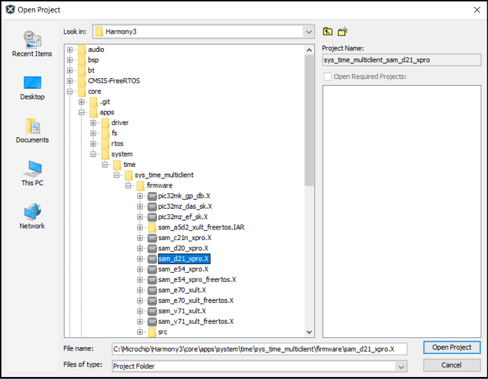
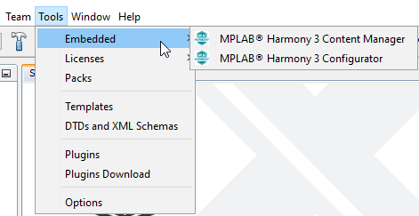
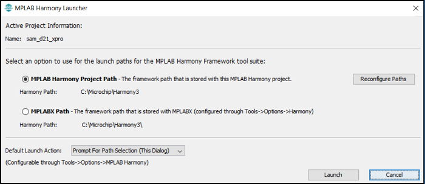
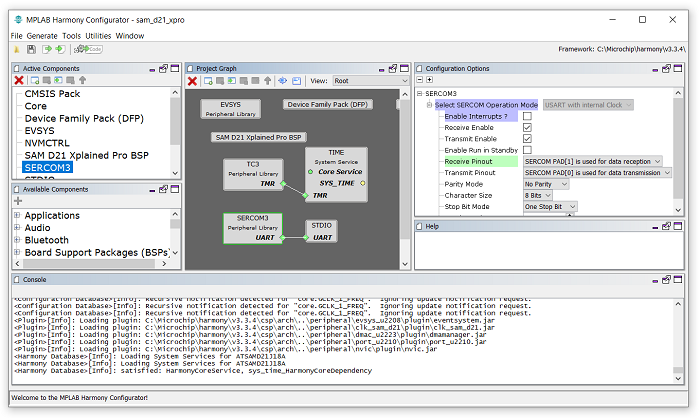

# Open an Existing Harmony 3 Project

This page shows you how to open one of the many demonstration application projects that are included in the MPLAB® Harmony framework.

Before doing this, you'll need to do the following:

- [Install the MPLAB X IDE](https://microchipdeveloper.com/mplabx:installation)
- [Install the XC32 C compiler](https://microchipdeveloper.com/xc32:installation)
- [Install the MPLAB Harmony Configurator (MHC)](../mplab_harmony_3_configurator/readme.md)
- [Download the MPLAB Harmony Framework](https://github.com/Microchip-MPLAB-Harmony/contentmanager/wiki)

If you would rather learn how to create an MPLAB Harmony project from scratch, visit the "[Create your first Harmony v3 Project](../create_first_harmony_3_project/readme.md) page.


## Steps

1. In the MPLAB X IDE, select **File** > **Open Project**.
 

2. Demonstration applications come with most of the libraries. These can be found in each library's **apps** folder. Browse to the **firmware** folder (as shown below) to find all evaluation boards that support the application. Select your evaluation board and click **Open Project**.  
 

3. After the project opens, start MHC. In the MPLAB X IDE, select **Tools  > Embedded > MPLAB® Harmony 3 Configurator**.  
 


4. Select the path to the folder containing the MPLAB Harmony framework and click **Launch**.
 

	
5. The **Configuration Database Setup** window opens. You shouldn't have to change anything in this window. Click Launch.  
Please be patient while waiting for the last window to open. It will ask if you want to open the default saved state file. This file is used to save all selections made in MHC for the project you are opening. Click **Open**.  
You can now use the MPLAB Harmony Configurator. Please see the MHC Wiki for instructions on how to use it.
 

```text
Note: You can save or load an MHC configuration at any time. The default name of the MHC state file is:
<MPLAB X project configuration name>.xml  

It can be found in the following folder:
…\<project name>\firmware\src\config\<project configuration name>\.  

If you are not using MPLAB X Project Configurations, the MHC state file can be found in the following folder:
…\<project name>\firmware\src\config\default\default.xml
```

