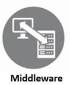

# MPLAB Harmony Middleware Documentation

This page contains quick documentation for MPLAB® Harmony 3 Middleware Libraries usage.  

- ### [Getting Started with Harmony v3 Drivers and Middleware on PIC32MZ EF MCUs using FreeRTOS](./pic32mz_getting_started_middleware/readme.md)

## Audio
- ### [MPLAB Harmony 3 Audio Overview](./harmony_3_audio_overview/readme.md)
- ### [Creating your first Audio Application](./create_first_audio_application/readme.md)
- ### [Creating Your first Audio Decoder Application](./create_first_audio_decoder_application/readme.md)
- ### [SD Card Audio Player/Reader Tutorial](./sdcard_audio_player_reader_tutorial/readme.md)
    - ### [Audio-Tone Generation Using a Lookup Table](./sdcard_audio_player_reader_tutorial/audio_tone_using_a_lookup_table/readme.md)
    - ### [Audio-Tone Generation from a Text File Stored in an SD Card](./sdcard_audio_player_reader_tutorial/audio_tone_using_text_file_in_sd_card/readme.md)
    - ### [SD Card Reader Support to Load Audio Files](./sdcard_audio_player_reader_tutorial/sd_card_reader_to_load_audio_files/readme.md)
    - ### [Play a WAV Audio File from an SD Card](./sdcard_audio_player_reader_tutorial/play_wav_audio_file_from_sd_card/readme.md)
    - ### [Display Graphics Support to Select and Play Audio File](./sdcard_audio_player_reader_tutorial/display_graphics_to_select_and_play_audio_file/readme.md)

## Graphics
- ### [Quickstart Prebuilt Graphics Applications](./quickstart_prebuilt_graphics_applications/readme.md)
- ### [Creating a new Graphics Application](./creating_a_new_graphics_application/readme.md)
- ### [Graphics Quick Start Application Guides](./graphics_quick_start_application_guides/readme.md)
- ### [Harmony Graphics Suite User Guide](./harmony_graphics_suite_user_guide/readme.md)

## USB
- ### [Create your first USB Device Application](./create_first_usb_device_application/readme.md)
- ### [Create Your First USB Host Application](./create_first_usb_host_application/readme.md)
- ### [Harmony USB Stack User Guide](./harmony_usb_stack_user_guide/readme.md)

## TCP/IP
- ### [Create your first TCP/IP Application](./create_first_tcpip_application/readme.md)
- ### [Harmony TCP/IP User Guide](./harmony_tcpip_user_guide/readme.md)

## Touch
- ### [Create a Touch Project in Harmony](./create_a_touch_project/readme.md)
- ### [Create Touch Surface & Gesture Project in Harmony](./create_touch_surface_gesture_project/readme.md)
- ### [Harmony QTouch User Guide](./harmony_qtouch_user_guide/readme.md)

## Crypto
- ### [Harmony Crypto Overview - Board Examples](./harmony_crypto_overview/readme.md)

## Wireless
- ### [Create Your First WINC Bypass Mode Example](./create_first_winc_bypass_mode_example/readme.md)
- ### [Harmony WINC Driver Architecture](./harmony_winc_driver_architecture/readme.md)

## Bluetooth
- ### [Create your First Bluetooth Application in Harmony](./create_first_bluetooth_application/readme.md)

## Web Links

1. [How to Use the MPLAB Harmony v3 Debug System Service](http://ww1.microchip.com/downloads/en/DeviceDoc/How_to_Use_Harmony_v3_Debug_System_Service_DS90003246A.pdf)

### **Note:**  
This page provides a quick reference covering the MPLAB Harmony 3 Middleware Librariesusage. MPLAB Harmony 3 solutions provides more peripheral or technology specific documentation.  
  
Peripheral/Technology specific documentation are available in technology repositories like [csp](https://github.com/Microchip-MPLAB-Harmony/csp), [core](https://github.com/Microchip-MPLAB-Harmony/core), [usb](https://github.com/Microchip-MPLAB-Harmony/usb), [net](https://github.com/Microchip-MPLAB-Harmony/net), [audio](https://github.com/Microchip-MPLAB-Harmony/audio), [gfx_apps](https://github.com/Microchip-MPLAB-Harmony/gfx_apps), etc
