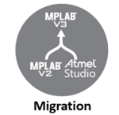

 
# MPLAB Harmony Migration Documentation

This page contains quick documentation for MPLAB® Harmony 3 Migration.   

## Harmony 2 to Harmony 3
1. ### [Differences between MPLAB Harmony 2 and Harmony 3](./differences_harmony_2_to_harmony_3/readme.md)
2. ### [MPLAB Harmony 3 Application Development Guide for MPLAB Harmony 2 Users](./harmony_2_to_harmony_3/readme.md)
3. ### [Graphics Applications](./aria_graphics_harmoy2_to_harmony_3/readme.md)
4. ### [TCP/IP Applications](./tcpiip_harmoy2_to_harmony_3/readme.md)
5. ### [USB Applications](./usb_harmoy2_to_harmony_3/readme.md)

## Atmel Studio, ASF, START to Harmony 3
1. ### [Introduction to MPLAB and Harmony 3 for Atmel Studio and ASF users](./introduction_mplabx_harmony_3_to_studio_asf_users/readme.md)
2. ### [Porting Application from ASF3 to MPLAB Harmony 3 Framework](./asf_to_harmony_3/readme.md)
3. ### [Atmel START to MPLAB Harmony 3 Migration Guide](./atmel_start_to_harmony_3/readme.md)

### **Note:**  
This page provides a quick reference covering the Migration to MPLAB Harmony 3. MPLAB Harmony 3 solutions provides more peripheral or technology specific documentation.  
  
Peripheral/Technology specific documentation are available in technology repositories like [csp](https://github.com/Microchip-MPLAB-Harmony/csp), [core](https://github.com/Microchip-MPLAB-Harmony/core), [usb](https://github.com/Microchip-MPLAB-Harmony/usb), [net](https://github.com/Microchip-MPLAB-Harmony/net), [audio](https://github.com/Microchip-MPLAB-Harmony/audio), [gfx_apps](https://github.com/Microchip-MPLAB-Harmony/gfx_apps), etc

