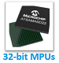

&nbsp;&nbsp;&nbsp;&nbsp;&nbsp;&nbsp;&nbsp;&nbsp;&nbsp;&nbsp;&nbsp;&nbsp;&nbsp;&nbsp;&nbsp;&nbsp;&nbsp;&nbsp;&nbsp;&nbsp;&nbsp;&nbsp;&nbsp;&nbsp;&nbsp;&nbsp;&nbsp;&nbsp; &nbsp;&nbsp;&nbsp;&nbsp;&nbsp;&nbsp;&nbsp;&nbsp;&nbsp;&nbsp;&nbsp;&nbsp;&nbsp;&nbsp;&nbsp;&nbsp;&nbsp;&nbsp;&nbsp;&nbsp;&nbsp;&nbsp;&nbsp;&nbsp;&nbsp;&nbsp;&nbsp;&nbsp;&nbsp;&nbsp;&nbsp;&nbsp;&nbsp;&nbsp;&nbsp;&nbsp;&nbsp;&nbsp;&nbsp;&nbsp;&nbsp;&nbsp;&nbsp;&nbsp;&nbsp;&nbsp;&nbsp;&nbsp;&nbsp;&nbsp;&nbsp;&nbsp;&nbsp;&nbsp;&nbsp;&nbsp;&nbsp;&nbsp;&nbsp;&nbsp;&nbsp;&nbsp;&nbsp;&nbsp;&nbsp;&nbsp;&nbsp;&nbsp;&nbsp;&nbsp;&nbsp;&nbsp; 

# Getting Started with Harmony v3 Peripheral Libraries on SAMC2x MCUs

This tutorial shows you how to use the MPLAB Harmony Configurator (MHC) to create an application that gets you started in developing applications on SAM C21x MCUs using MPLAB Harmony v3 software framework.

The application makes use of <a href="https://www.microchip.com/developmenttools/ProductDetails/atsamc21n-xpro" target="_blank">SAMC21N Xplained Pro Evaluation Kit</a> and <a href="https://www.microchip.com/Developmenttools/ProductDetails/ATIO1-XPRO" target="_blank">I/O1 Xplained Pro Extension Kit</a> (sold separately).

The application reads the current room temperature from the temperature sensor on the I/O1 Xplained Pro Extension. The temperature read is displayed on a serial console periodically every 500 milliseconds. The periodicity of the temperature values displayed on the serial console is changed to 1 second, 2 seconds, 4 seconds and back to 500 milliseconds every time you press the switch SW0 on the SAMC21N Xplained Pro Evaluation Kit. Also, an LED LED0 is toggled every time temperature is displayed on the serial console.

The application you create will utilize:

- SERCOM (as I2C) Peripheral Library (PLIB) to read the temperature from a temperature sensor.
- Real-Time Clock (RTC) PLIB to periodically sample temperature sensor data.
- SERCOM (as USART), Direct Memory Access (DMA) PLIB to print the temperature values on a COM (serial) port terminal application running on a PC.
- PORTS PLIB to toggle the LED.

For more information refer the **[links](#Web-Links)** below.

## 
## Web Links

- <a href="https://microchipdeveloper.com/harmony3:samc21-getting-started-training-module" target="_blank">Getting Started with Harmony v3 Peripheral Libraries on SAMC2x MCUs</a>

## Reference Links
  &nbsp; &nbsp; &nbsp;   &nbsp; &nbsp; &nbsp;   &nbsp; &nbsp;   
