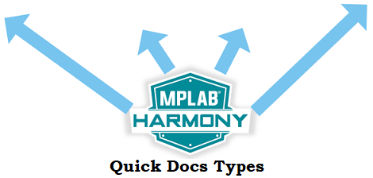

---
title: Harmony 3 Quick Docs
nav_order: 1
---
# MPLAB Harmony 3 Quick Documentation Package

MPLAB Harmony 3 is an extension of the MPLAB® ecosystem for creating
embedded firmware solutions for Microchip 32-bit SAM and PIC® microcontroller
and microprocessor devices.  Refer to the following links for more information.

- [Microchip 32-bit MCUs](https://www.microchip.com/design-centers/32-bit)
- [Microchip 32-bit MPUs](https://www.microchip.com/design-centers/32-bit-mpus)
- [Microchip MPLAB X IDE](https://www.microchip.com/mplab/mplab-x-ide)
- [Microchip MPLAB® Harmony](https://www.microchip.com/mplab/mplab-harmony)

This repository contains the MPLAB Harmony 3 Quick Documentation Package. 

Quick documents are standalone documents to help get started developing applications on Microchip 32-bit SAM and PIC MCUs using MPLAB Harmony 3 software framework.

Following are the categories of documents in this repository

- **Basic**:  
Cover topics that help get started developing applications on MPLAB Harmony 3 software framework. For Example: MPLAB Harmony 3 Configurator (MHC), Creating the first application on Harmony 3, etc

- **Migration**:  
Cover topics that help migrate from other Microchip 32-bit software solutions offering to MPLAB Harmony 3 based solution. For example: Port an existing application from Harmony 2/ASF/START to Harmony 3, etc

- **Peripheral**:  
Cover topics that help use MPLAB Harmony peripheral libraries and drivers. For Example: Getting Started with Harmony v3 Peripheral Libraries on SAM D5x/E5x MCUs

- **Middleware**:  
Cover topics that help use MPLAB Harmony middleware libraries to implement larger feature rich applications involving integration of multiple technologies. For Example: SD Card Audio Player/Reader Tutorial

The above doc types serve as a reference to evaluate solutions on 32-bit SAM and PIC MCUs by developing applications using MPLAB Harmony 3 software framework on Microchip 32-bit SAM and PIC development boards/kits.  

**Note**: 
The doc pages in this repository is a quick source covering the above types. MPLAB Harmony 3 solutions provides more peripheral or technology specific documentation. Refer the specific peripheral/technology repository to find specific documentation.

**Repository and documentation support:**
- The following table lists the fundamental and few technology specific repositories in MPLAB Harmony 3 Software Framework

| Repository	| # Documentation |
| ---                                                                               | ---|            
| [csp](https://github.com/Microchip-MPLAB-Harmony/csp)			| Covers documentation for the peripheral libraries (PLIBs) and related applications that directly control the SAM and PIC peripherals |
| [core](https://github.com/Microchip-MPLAB-Harmony/core)          | Covers documentation for drivers, system services and the related applications using them. Applications that use the drivers and system services that have advanced capabilities and a higher level of abstraction that gives better hardware independence |
| [usb](https://github.com/Microchip-MPLAB-Harmony/usb)            | Covers documentation for USB library and related applications that demonstrate the capabilities of the MPLAB Harmony USB stack |
| [net](https://github.com/Microchip-MPLAB-Harmony/net)            | Covers documentation for TCP/IP stack and related applications that demonstrate the capabilities of the MPLAB Harmony TCP/IP stack. These applications use well-known protocols like TCP, UDP, HTTP, SMTP, etc |
| [gfx](https://github.com/Microchip-MPLAB-Harmony/gfx)			| Covers documentation for the quick start applications that demonstrates MPLAB Harmony Aria/Legato Graphics Libraries |
| [gfx_apps](https://github.com/Microchip-MPLAB-Harmony/gfx_apps)	| Covers documentation for the non quick start applications that demonstrates MPLAB Harmony Aria/Legato Graphics Libraries |
| [audio](https://github.com/Microchip-MPLAB-Harmony/audio)		| Covers documentation for Harmony Audio offerings and applications that demonstrates capabilities of the MPLAB Harmony audio offerings, drivers for hardware codecs that can be connected to development boards, audio decoders, etc |

### Note: 
The above is not an exhaustive list of all MPLAB Harmony 3 packages and corresponding documentation offerings. Refer the MPLAB Harmony 3 GitHub [Launch page](https://github.com/Microchip-MPLAB-Harmony) to view the complete list of MPLAB Harmony 3 packages. In each of these packages refer the underlying documentation.

Refer to the following links for release notes and reference application information.

- [Release Notes](./release_notes.md)
- [MPLAB® Harmony License](./mplab_harmony_license.md)
- [MPLAB® Harmony 3 Quick Docs Wiki](https://github.com/Microchip-MPLAB-Harmony/quick_docs/wiki)

____

____

