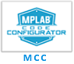

# Microchip MPLAB® Harmony 3 Release Notes
---
## Quick Docs Release v1.7.0 (Jun 2024)

### New Doc Pages
The following table provides the list of new doc pages:

| Doc Name | Doc Type - Content |
| ---      | ---                |
[Create a first application on PIC32CM JH01 Microcontrollers using MPLAB Harmony v3 with MCC](./source/basic/create_first_harmony_3_project_pic32cm_jh01/readme.md) | [Basic](./source/basic/readme.md) - Full |
[Create a first application on PIC32CM LSx Microcontrollers using MPLAB Harmony v3 with MCC](./source/basic/create_first_harmony_3_project_pic32cm_lsx/readme.md) | [Basic](./source/basic/readme.md) - Full |
[Create a first application on PIC32CX SG Microcontrollers using MPLAB Harmony v3 with MCC](./source/basic/create_first_harmony_3_project_pic32cx_sg/readme.md) | [Basic](./source/basic/readme.md) - Full |
[Create a first application on PIC32CZ CAx Microcontrollers using MPLAB Harmony v3 with MCC](./source/basic/create_first_harmony_3_project_pic32cz_cax/readme.md) | [Basic](./source/basic/readme.md) - Full |
[Arm TrustZone Getting Started Application on PIC32CK SG01 (Cortex-M33) MCUs](./source/peripheral/arm_trustzone_pic32ck_sg01_getting_started/readme.md) | [Peripheral](./source/peripheral/readme.md) - Full |
[Low Power Application on PIC32CM LE00 (Cortex M23) MCUs Using MPLAB Harmony v3 Peripheral Libraries](./source/peripheral/pic32cm_le00_low_power/readme.md) | [Peripheral](./source/peripheral/readme.md) - Full |

### Updated Doc Pages

| Doc Name | Doc Type - Content | Comments |
| ---      | ---                | ---      |
| [MPLAB® Code Configurator Overview with MPLAB Harmony Content](./source/basic/mcc_overview_with_harmony_3/readme.md) | [Basic](./source/basic/readme.md) - Full | Updated new links and steps |
| [MPLAB Code Configurator (MCC) for Harmony 3 Projects](./source/basic/mplab_harmony_3_code_configurator/readme.md) | [Basic](./source/basic/readme.md) - Full | Updated new links and steps |
| [Create a new MPLAB Harmony v3 project using MCC](./source/basic/create_new_harmony_3_project_using_mcc/readme.md) | [Basic](./source/basic/readme.md) - Full | Updated new links and steps |
| [Update and Configure an Existing MHC-based MPLAB Harmony v3 Project to MCC-based Project](./source/basic/update_mhc_harmony_3_project_to_mcc/readme.md) | [Basic](./source/basic/readme.md) - Full | Updated new links and steps |
| [Create First MPLAB Harmony 3 Project](./source/basic/create_first_harmony_3_project/readme.md) | [Basic](./source/basic/readme.md) - Full | Updated new links and steps |
| [Create "Hello World" application on SAM MCUs](./source/basic/create_hello_world_sam_mcus/readme.md) | [Basic](./source/basic/readme.md) - Full | Migrated from MHC to MCC |
| [Create "Hello World" application on PIC MCUs](./source/basic/create_hello_world_pic_mcus/readme.md) | [Basic](./source/basic/readme.md) - Full | Updated new links and steps |
| [Create IAR or Keil project using MCC](./source/basic/create_iar_or_keil_project_using_mcc/readme.md) | [Basic](./source/basic/readme.md) - Full | Updated new links and steps |
| [Create new TrustZone Project](./source/basic/create_new_trust_zone_project/readme.md) | [Basic](./source/basic/readme.md) - Full | Updated new links and steps |
| [Create first Audio Application](./source/middleware/create_first_audio_application/readme.md) | [Middleware](./source/middleware/readme.md) - Full | Updated new links and steps |
| [Create first Audio Decoder Application](./source/middleware/create_first_audio_decoder_application/readme.md) | [Middleware](./source/middleware/readme.md) - Full | Updated new links and steps |
| [MPLAB Harmony 3 Audio Overview](./source/middleware/harmony_3_audio_overview/readme.md) | [Middleware](./source/middleware/readme.md) - Full | Updated new links and steps |
| [Secure Boot on PIC32CM LS60 Curiosity Pro Evaluation Kit using MPLAB Harmony v3](./source/middleware/pic32cmls60_secure_boot/readme.md) | [Middleware](./source/middleware/readme.md) - Full | Updated new links and steps |
| [Digit Recognition AI/ML Application on SAM E51 IGAT CURIOSITY EVALUATION KIT Using MPLAB Harmony v3](./source/middleware/digit_recognition_ai_ml/readme.md) | [Middleware](./source/middleware/readme.md) - Full | Updated new links and steps |
| [Getting Started with Middleware on PIC32MZ EF MCUs](./source/middleware/pic32mz_getting_started_middleware/readme.md) | [Middleware](./source/middleware/readme.md) - Full | Migrated from MHC to MCC and updated links |
| [Rapid prototyping with Curiosity Nano Evaluation Kit using MPLAB Harmony v3](./source/middleware/rapid_prototyping/readme.md) | [Middleware](./source/middleware/readme.md) - Full | Migrated from MHC to MCC and updated links |
| [Getting Started with USB on SAM MCUs Using MPLAB Harmony v3](./source/middleware/same70_getting_started_middleware/readme.md) | [Middleware](./source/middleware/readme.md) - Full | Migrated from MHC to MCC and updated links |
| [MPLAB® Harmony v3 SD Card Audio Player/Reader Tutorial](./source/middleware/sdcard_audio_player_reader_tutorial/readme.md) | [Middleware](./source/middleware/readme.md) - Full | Migrated from MHC to MCC and updated links |
| [Getting Started with MPLAB Harmony v3 to Create a Web-Enabled Digital Photo Frame](./source/middleware/web_photo_frame/readme.md) | [Middleware](./source/middleware/readme.md) - Full | Updated new links and steps |
| [Application migration from 8-bit AVR to 32-bit SAM D21 MCU](./source/migration/atmega4809_to_samd21_migration/readme.md) | [Migration](./source/migration/readme.md) - Full | Updated new links and steps |
| [Build MPLAB Harmony v3 project with ARM GCC toolchain in MPLAB X IDE](./source/migration/build_harmony_3_project_with_gcc/readme.md) | [Migration](./source/middleware/readme.md) - Full | Updated new links and steps |
| [Migration from MC](./source/migration/code_generation_api_migration_from_mcc/readme.md) | [Migration](./source/middleware/readme.md) - Full | Updated new links and steps |
| [MPLAB Harmony v3 Project Migration](./source/migration/mplab_harmony_v3_project_migration/readme.md) | [Migration](./source/middleware/readme.md) - Full | Updated new links and steps |
| [Application migration from 8-bit PIC18F to 32-bit SAM D21 MCU](./source/migration/pic18f_to_samd21_migration/readme.md) | [Migration](./source/middleware/readme.md) - Full | Updated new links and steps |
| [Migrating ASF SAM C21 Application to MPLAB Harmony v3 PIC32CM MC](./source/migration/samc21_asf_to_pic32cmmc_harmony/readme.md) | [Migration](./source/middleware/readme.md) - Full | Migrated from MHC to MCC and updated links |
| [Arm TrustZone Getting Started Application on SAM L11 MCUs](./source/peripheral/arm_trustzone_saml11_getting_started/readme.md) | [Peripheral](./source/peripheral/readme.md) - Full | Updated new links and steps |
| [Getting Started with PLIBs on SAM9X60 MPUs](./source/peripheral/sam9x60_getting_started/readme.md) | [Peripheral](./source/peripheral/readme.md) - Full | Migrated from MHC to MCC and updated links |
| [Getting Started with Drivers on SAM C2x MCUs Using FreeRTOS](./source/peripheral/samc2x_getting_started_drivers_freertos/readme.md) | [Peripheral](./source/peripheral/readme.md) - Full | Migrated from MHC to MCC and updated links |
| [Getting Started with Drivers on SAM C2x MCUs](./source/peripheral/samc2x_getting_started/readme.md) | [Peripheral](./source/peripheral/readme.md) - Full | Migrated from MHC to MCC and updated links |
| [Getting Started with Drivers on SAM D21 MCUs Using FreeRTOS](./source/peripheral/samd21_getting_started_drivers_freertos/readme.md) | [Peripheral](./source/peripheral/readme.md) - Full | Migrated from MHC to MCC and updated links |
| [Low Power with PLIBs on SAM D21 MCUs](./source/peripheral/samd21_low_power/readme.md) | [Peripheral](./source/peripheral/readme.md) - Full | Migrated from MHC to MCC and updated links |
| [Getting Started with Drivers on SAM E5x MCUs Using FreeRTOS](./source/peripheral/same5x_getting_started_drivers_freertos/readme.md) | [Peripheral](./source/peripheral/readme.md) - Full | Updated new links and steps |
| [Getting Started with Drivers on SAM E70/S70/V70/V71 MCUs](./source/peripheral/same70_getting_started_drivers/readme.md) | [Peripheral](./source/peripheral/readme.md) - Full | Migrated from MHC to MCC and updated links |
| [Getting Started with Drivers on SAM E70/S70/V70/V71 MCUs using FreeRTOS](./source/peripheral/same70_getting_started_drivers_freertos/readme.md) | [Peripheral](./source/peripheral/readme.md) - Full | Migrated from MHC to MCC and updated links |
| [Getting Started with PLIBs on PIC32MK GP MCUs](./source/peripheral/pic32mk_getting_started/readme.md) | [Peripheral](./source/peripheral/readme.md) - Full | Migrated from MHC to MCC and updated links |
| [Getting Started with PLIBs on PIC32MX 470 MCUs](./source/peripheral/pic32mx_getting_started/readme.md) | [Peripheral](./source/peripheral/readme.md) - Full | Migrated from MHC to MCC and updated links |
| [Getting Started with PLIBs on PIC32MZ EF MCUs](./source/peripheral/pic32mz_getting_started/readme.md) | [Peripheral](./source/peripheral/readme.md) - Full | Migrated from MHC to MCC and updated links |
| [Getting Started with PLIBs on SAMC2x MCUs](./source/peripheral/samc2x_getting_started/readme.md) | [Peripheral](./source/peripheral/readme.md) - Full | Updated new links and steps |
| [Low Power Application on SAMC2x (Cortex M0+) MCUs Using MPLAB Harmony v3 Peripheral Libraries](./source/peripheral/samc2x_low_power/readme.md) | [Peripheral](./source/peripheral/readme.md) - Full | Updated new links and steps |
| [Getting Started with PLIBs on SAM D5x/E5x MCUs](./source/peripheral/samd5x_getting_started/readme.md) | [Peripheral](./source/peripheral/readme.md) - Full | Migrated from MHC to MCC and updated links |
| [Getting Started with PLIBs on SAM D21 MCUs](./source/peripheral/samd21_getting_started/readme.md) | [Peripheral](./source/peripheral/readme.md) - Full | Migrated from MHC to MCC and updated links |
| [Low Power Application on SAM E54 (Cortex M4) MCUs Using MPLAB Harmony v3 Peripheral Libraries](./source/peripheral/same54_low_power/readme.md) | [Peripheral](./source/peripheral/readme.md) - Full | Updated new links and steps |
| [Getting Started with PLIBs on SAM E70/S70/V70/V71 MCUs](./source/peripheral/same70_getting_started/readme.md) | [Peripheral](./source/peripheral/readme.md) - Full | Migrated from MHC to MCC and updated links |
| [Getting Started with PLIBs on SAM L10 MCUs](./source/peripheral/saml10_getting_started/readme.md) | [Peripheral](./source/peripheral/readme.md) - Full | Migrated from MHC to MCC and updated links |
| [Low Power Application on SAM L10 (Cortex M23) MCUs Using MPLAB Harmony v3 Peripheral Libraries](./source/peripheral/saml10_low_power/readme.md) | [Peripheral](./source/peripheral/readme.md) - Full | Updated new links and steps |
| [Low Power Application on SAM L21 (Cortex M0+) MCUs Using MPLAB Harmony v3 Peripheral Libraries](./source/peripheral/saml21_low_power/readme.md) | [Peripheral](./source/peripheral/readme.md) - Full | Updated new links and steps |

- New Weblinks and Video added in [Basic](./source/basic/readme.md#web-links) page
- New Weblinks and Video added in [Peripheral](./source/peripheral/readme.md#web-links) page
- New Weblinks and Video added in [Middleware](./source/middleware/readme.md#videos) page
- New Weblinks and Video added in [Peripheral](./source/peripheral/readme.md#videos) page

### Known Issues
    - NA -

---

## Quick Docs Release v1.6.0 (Sep 2023)

### New Doc Pages
The following table provides the list of new doc pages:

| Doc Name | Doc Type - Content |
| ---      | ---                |
[MPLAB Code Configurator Overview with MPLAB Harmony Content](./source/basic/mcc_overview_with_harmony_3/readme.md) | [Basic](./source/basic/readme.md) - Brief Overview and Web link |
[MPLAB Code Configurator Options](./source/basic/mcc_plugin_configurations/readme.md) | [Basic](./source/basic/readme.md) - Full |
[Getting Started with MPLAB Harmony v3 to Create a Web-Enabled Digital Photo Frame](./source/middleware/web_photo_frame/readme.md) | [Middleware](./source/middleware/readme.md) - Brief Overview and Web link |
[Secure Boot on PIC32CM LS60 Curiosity Pro Evaluation Kit using MPLAB Harmony v3](./source/middleware/pic32cmls60_secure_boot/readme.md) | [Middleware](./source/middleware/readme.md) - Brief Overview and Web link |
[File Transfer Protocol Using MPLAB Harmony v3 TCP/IP Stack for SAM E54 MCU](./source/middleware/ftp_harmony_tcpip/readme.md) | [Middleware](./source/middleware/readme.md) - Brief Overview and Web link |
[Develop a harmony based application for SAM9X60 MPU using MPLAB® X IDE](./source/basic/sam9x60_getting_started_application_using_mcc/readme.md) | [Basic](./source/basic/readme.md) - Full |
[Configure first stage bootloader for SAM9X60 MPU](./source/basic/sam9x60_configure_first_stage_bootloader/readme.md) | [Basic](./source/basic/readme.md) - Full |
[Configure/built and debug second stage bootloader(at91bootstrap) for SAM9X60 MPU](./source/basic/sam9x60_configure_second_stage_bootloader/readme.md) | [Basic](./source/basic/readme.md) - Full |
[Flash the at91bootstrap and harmony application binaries using SAM-BA tool](./source/basic/sam9x60_flash_boot_application_using_samba/readme.md) | [Basic](./source/basic/readme.md) - Full |
[Configure at91bootstrap to enable QSPI-XIP on MPUs](./source/basic/configure_at91bootstrap_to_enable_qspi_xip_mpus/readme.md) | [Basic](./source/basic/readme.md) - Full |
[Develop a harmony based application executed from QSPI for SAM9X60 MPU using MPLAB® X IDE](./source/basic/sam9x60_qspi_xip_application_using_mcc/readme.md) | [Basic](./source/basic/readme.md) - Full |
[Configure first stage bootloader for SAMA7G5 MPU](./source/basic/sama7g54_configure_first_stage_bootloader/readme.md) | [Basic](./source/basic/readme.md) - Full |
[Configure/built and debug second stage bootloader(at91bootstrap) for SAMA7G5 MPU](./source/basic/sama7g54_configure_second_stage_bootloader/readme.md) | [Basic](./source/basic/readme.md) - Full |
[SAM-BA installation and initialization for SAMA7G5 MPU](./source/basic/sama7g54_samba_installation_setup/readme.md) | [Basic](./source/basic/readme.md) - Full |
[Flash the at91bootstrap and harmony application binaries of SAMA7G5 MPU using SAM-BA tool](./source/basic/sama7g54_flash_boot_application_using_samba/readme.md) | [Basic](./source/basic/readme.md) - Full |
[Migrating SAM9X60-EK Harmony Application to SAM9X60 Curiosity Development Board](./source/migration/sam9x60_ek_to_sam9x60_curiosity_harmony/readme.md) | [Migration](./source/migration/readme.md) - Brief Overview and Web link |
[Getting Started with Harmony v3 Peripheral Libraries on SAM9X60 MPUs ](./source/peripheral/sam9x60_getting_started/readme.md) | [Peripheral](./source/peripheral/readme.md) - Brief Overview and Web link |

### Updated Doc Pages

| Doc Name | Doc Type - Content | Comments |
| ---      | ---                | ---      |  
| [Create First MPLAB Harmony 3 Project](./source/basic/create_first_harmony_3_project/readme.md) | [Basic](./source/basic/readme.md) - Full | Migrated from MHC to MCC |  
| [Create Hello World application on SAM MCUs](./source/basic/create_hello_world_sam_mcus/readme.md) | [Basic](./source/basic/readme.md) - Full | Migrated from MHC to MCC |  
| [MCC Clock Configuration](./source/basic/mcc_clock_configuration/readme.md) | [Basic](./source/basic/readme.md) - Full | Migrated from MHC to MCC |  
| [MCC Pin Configuration](./source/basic/mcc_pin_configuration/readme.md) | [Basic](./source/basic/readme.md) - Full | Migrated from MHC to MCC |  
| [MCC NVIC Configuration](./source/basic/mcc_nvic_configuration/readme.md) | [Basic](./source/basic/readme.md) - Full | Migrated from MHC to MCC |  
| [MCC Project Graph](./source/basic/mcc_project_graph/readme.md) | [Basic](./source/basic/readme.md) - Full | Migrated from MHC to MCC |  
| [MCC DMA Configuration](./source/basic/mcc_dma_configuration/readme.md) | [Basic](./source/basic/readme.md) - Full | Migrated from MHC to MCC |  
| [MCC Memory protection Unit Configuration](./source/basic/mcc_memory_protection_unit_configuration/readme.md) | [Basic](./source/basic/readme.md) - Full | Migrated from MHC to MCC |  
| [MCC Code Generation](./source/basic/mcc_code_generation/readme.md) | [Basic](./source/basic/readme.md) - Full | Migrated from MHC to MCC |  
| [Create Hello World application on PIC MCUs](./source/basic/create_hello_world_pic_mcus/readme.md) | [Basic](./source/basic/readme.md) - Full | Migrated from MHC to MCC |  
| [Creating an IAR or KEIL project using MCC](./source/basic/create_iar_or_keil_project_using_mcc/readme.md) | [Basic](./source/basic/readme.md) - Full | Migrated from MHC to MCC |  
| [Creating a New TrustZone Project](./source/basic/create_new_trust_zone_project/readme.md) | [Basic](./source/basic/readme.md) - Full | Migrated from MHC to MCC |  

### Deleted Doc Pages  

| Doc Name | Doc Type - Content | Comments |
| ---      | ---                | ---      |  
| Getting started with SAM MPUs using MPLAB Harmony 3 | Full | Deleted this document as new alternative pages created |  
| MPLAB Harmony 3 Configurator (MHC) | Full | Deleted this document as UI is migrated from MHC and an alternative page for the same on MCC is available |  
| Open an Existing Harmony 3 Project | Full | Deleted this document as UI is migrated from MHC and an alternative page for the same on MCC is available |  
| MHC Window Manager and Log Level | Full | Deleted this document as UI is migrated from MHC to MCC and no corresponding pages exist in MCC |  
| Harmony 3 Packages | Full | Deleted this document. Refer to https://github.com/Microchip-MPLAB-Harmony for the list of packages |  

- New Weblink added in [Basic](./source/basic/readme.md#web-links) page
- New Weblink added in [Peripheral](./source/peripheral/readme.md#web-links) page
- New video Weblinks added in [Middleware](./source/middleware/readme.md#videos) page
- New video Weblinks added in [Peripheral](./source/peripheral/readme.md#videos) page

### Known Issues
	- NA -

---

## Quick Docs Release v1.5.0 (June 2022)

### New Doc Pages
The following table provides the list of new doc pages:

| Doc Name | Doc Type - Content |
| ---      | ---                |
[MPLAB Harmony v3 Project Migration](./source/migration/mplab_harmony_v3_project_migration/readme.md) |[Migration](./source/migration/readme.md) - Brief Overview and Web link |
[Digit Recognition AI/ML Application on SAM E51 IGAT CURIOSITY EVALUATION KIT Using MPLAB Harmony v3](./source/middleware/digit_recognition_ai_ml/readme.md) |[Middleware](./source/middleware/readme.md) - Brief Overview and Web link |
[MPLAB Code Configurator (MCC) for Harmony 3 Projects](./source/basic/mplab_harmony_3_code_configurator/readme.md) |[Basic](./source/basic/readme.md) - Brief Overview and Web link |

### Updated Doc Pages

| Doc Name | Doc Type - Content | Comments |
| ---      | ---                | ---      |  
| [Getting started with SAM MPUs using MPLAB® Harmony 3](./source/basic/sam_mpus_getting_started_harmony_3/readme.md) | [Basic](./source/basic/readme.md) - Full | Updated reference to bootstrap and new project steps |  

- New Weblink added in [Peripheral](./source/peripheral/readme.md#web-links) page
- New Weblink added in [Middleware](./source/middleware/readme.md#web-links) page
- New video Weblinks added in [Basic](./source/basic/readme.md#videos) page
- New video Weblinks added in [Middleware](./source/middleware/readme.md#videos) page

### Known Issues
	- NA -

---

## Quick Docs Release v1.4.0 (December 2021)

### New Doc Pages
The following table provides the list of new doc pages:

| Doc Name | Doc Type - Content |
| ---      | ---                |
[Create a new MPLAB Harmony v3 project using MCC](./source/basic/create_new_harmony_3_project_using_mcc/readme.md) |[Basic](./source/basic/readme.md) - Brief Overview and Web link |
[Update and Configure an Existing MHC-based MPLAB Harmony v3 Project to MCC-based Project](./source/basic/update_mhc_harmony_3_project_to_mcc/readme.md) |[Basic](./source/basic/readme.md) - Brief Overview and Web link |
[Low Power Application on SAM D21 (Cortex M0+) MCU Using MPLAB Harmony v3 Peripheral Libraries](./source/peripheral/samd21_low_power/readme.md) |[Peripheral](./source/peripheral/readme.md) - Brief Overview and Web link |
[Rapid prototyping with Curiosity Nano Evaluation Kit using MPLAB Harmony v3](./source/middleware/rapid_prototyping/readme.md) |[Middleware](./source/middleware/readme.md) - Brief Overview and Web link |
[Add a New Configuration to an Existing MPLAB Harmony v3 Project](./source/basic/add_new_configuration_to_harmony_3_project/readme.md) |[Basic](./source/basic/readme.md) - Brief Overview and Web link |
[MPLAB Harmony v3 Project Manifest Feature](./source/basic/harmony_3_project_manifest/readme.md) |[Basic](./source/basic/readme.md) - Brief Overview and Web link |

- New Weblink added in [Peripheral](./source/peripheral/readme.md#web-links) page
- New Weblink added in [Middleware](./source/middleware/readme.md#web-links) page
- New video Weblinks added in [Basic](./source/basic/readme.md#videos) page
- New video Weblinks added in [Middleware](./source/middleware/readme.md#videos) page
- [Basic](./source/basic/readme.md) pages are added with a note on MCC support

### Known Issues
	- NA -

---

## Quick Docs Release v1.3.0 (June 2021)

### New Doc Pages
The following table provides the list of new doc pages:

| Doc Name | Doc Type - Content |
| ---      | ---                |
[Getting Started with Harmony v3 Drivers on SAM E5x MCUs Using FreeRTOS](./source/peripheral/same5x_getting_started_drivers_freertos/readme.md) |[Peripheral](./source/peripheral/readme.md) - Brief Overview and Web link |
[Getting Started with Harmony v3 Drivers on SAM C2x MCUs Using FreeRTOS](./source/peripheral/samc2x_getting_started_drivers_freertos/readme.md) |[Peripheral](./source/peripheral/readme.md) - Brief Overview and Web link |

- New video Weblinks added in [Basic](./source/basic/readme.md) page

### Known Issues
	- NA -

---

## Quick Docs Release v1.2.0 (January 2021)

### New Doc Pages

The following table provides the list of new doc pages:

| Doc Name | Doc Type - Content |
| ---      | ---                |
[Difference Between MPLAB Harmony v3 PLIBs and Drivers](./source/basic/harmony_drivers_plibs/readme.md) |[Basic](./source/basic/readme.md) - Brief Overview and Web link |
[MPLAB Harmony v3 Synchronous drivers and their usage in FreeRTOS based applications](./source/basic/harmony_sync_drivers_freertos/readme.md) |[Basic](./source/basic/readme.md) - Brief Overview and Web link |
[Arm TrustZone Getting Started Application on SAM L11 MCUs](./source/peripheral/arm_trustzone_saml11_getting_started/readme.md) |[Peripheral](./source/peripheral/readme.md) - Brief Overview and Web link |
[Getting Started with Harmony v3 Drivers on SAM D21 MCUs Using FreeRTOS](./source/peripheral/samd21_getting_started_drivers_freertos/readme.md) |[Peripheral](./source/peripheral/readme.md) - Brief Overview and Web link |
[Code generation and API considerations for migration from MCC](./source/migration/code_generation_api_migration_from_mcc/readme.md)								|[Migration](./source/migration/readme.md) - Brief Overview and Web link |
[Migrating ASF SAM C21 Application to MPLAB Harmony v3 PIC32CM MC](./source/migration/samc21_asf_to_pic32cmmc_harmony/readme.md)								|[Migration](./source/migration/readme.md) - Brief Overview and Web link |
[Getting Started with USB on SAM MCUs Using MPLAB® Harmony v3](./source/middleware/same70_getting_started_middleware/readme.md)								|[Middleware](./source/middleware/readme.md) - Brief Overview and Web link |

### Updated Doc Pages

| Doc Name | Doc Type - Content | Comments |
| ---      | ---                | ---      |  
[Application migration from 8-bit AVR to 32-bit SAM D21 MCU](./source/migration/atmega4809_to_samd21_migration/readme.md) | [Migration](./source/migration/readme.md) - Full |Updated image source with corrected extension for missing images |  
[Application migration from 8-bit PIC18F to 32-bit SAM D21 MCU](./source/migration/pic18f_to_samd21_migration/readme.md) | [Migration](./source/migration/readme.md) - Full |Updated image source with corrected extension for missing images |  

- New video Weblinks added in [Basic](./source/basic/readme.md) page
- New video Weblinks added in [Peripheral](./source/peripheral/readme.md) page

### Known Issues
	- NA -

---

## Quick Docs Release v1.1.0 (September 2020)

- Repo restructured to move offline documentation to "docs" folder

### New Doc Pages

The following table provides the list of new doc pages:

| Doc Name | Doc Type - Content |
| ---      | ---                |
[Application migration from 8-bit PIC18F to 32-bit SAM D21](./source/migration/pic18f_to_samd21_migration/readme.md)											|[Migration](./source/migration/readme.md) - Full |
[Application migration from 8-bit AVR to 32-bit SAM D21](./source/migration/atmega4809_to_samd21_migration/readme.md)											|[Migration](./source/migration/readme.md) - Full |
[Build MPLAB Harmony v3 project with ARM GCC toolchain in MPLAB X IDE](./source/migration/build_harmony_3_project_with_gcc/readme.md)											|[Migration](./source/migration/readme.md) - Full |
[Differences Between MPLAB Harmony v3 Synchronous and Asynchronous Drivers](./source/basic/harmony_sync_async_drivers/readme.md)											|[Basic](./source/basic/readme.md) - Brief Overview and Web link |
[Low Power Application on SAM L10 MCUs using Harmony v3 PLIBs](./source/peripheral/saml10_low_power/readme.md)									|[Peripheral](./source/peripheral/readme.md) - Brief Overview and Web link |  
[Low Power Application on SAM E54 MCU using Harmony v3 PLIBs](./source/peripheral/same54_low_power/readme.md)									|[Peripheral](./source/peripheral/readme.md) - Brief Overview and Web link |  
[Create your first Motor Control Application using MPLAB Harmony v3](./source/middleware/create_first_motor_control_application/readme.md)								|[Middleware](./source/middleware/readme.md) - Brief Overview and Web link |

### Updated Doc Pages

| Doc Name | Doc Type - Content | Comments |
| ---      | ---                | ---      |  
[Harmony 3 Packages](./source/basic/harmony_3_packages/readme.md) |[Basic](./source/basic/readme.md) - Full | Updated the Harmony 3 Package readme.md with the latest release contents. |  
[MPLAB Harmony 3 Configurator (MHC)](./source/basic/mplab_harmony_3_configurator/readme.md) | [Basic](./source/basic/readme.md) - Full | Updated the MPLAB Harmony Configurator 3 plugin installation screenshot |  
[Create “Hello World” application on PIC MCUs](./source/basic/create_hello_world_pic_mcus/readme.md) | [Basic](./source/basic/readme.md) - Full |Updated the Pin Settings UI screenshot |  
[Creating a New TrustZone Project](./source/basic/create_new_trust_zone_project/readme.md) | [Basic](./source/basic/readme.md) - Full |Updated screenshots of Project creation completion window and Project properties window |  

- New video Weblinks added in [Basic](./source/basic/readme.md) page
- New video Weblinks added in [Peripheral](./source/peripheral/readme.md) page
- New doc Weblink added in [Peripheral](./source/peripheral/readme.md) page

### Known Issues
	- NA -

---

## Quick Docs Release v1.0.0 (June 2020)
### New Doc Pages

The following table provides the list of new doc pages:

| Doc Name | Doc Type - Content |
| ---      | ---                |
[MPLAB Harmony 3 Configurator (MHC)](./source/basic/mplab_harmony_3_configurator/readme.md)											|[Basic](./source/basic/readme.md) - Full |
[MHC Project Graph](./source/basic/mhc_project_graph/readme.md)														|[Basic](./source/basic/readme.md) - Full |
[MHC Clock Configuration](./source/basic/mhc_clock_configuration/readme.md)													|[Basic](./source/basic/readme.md) - Full |
[MHC Pin Configuration](./source/basic/mhc_pin_configuration/readme.md)													|[Basic](./source/basic/readme.md) - Full |
[MHC NVIC Configuration](./source/basic/mhc_nvic_configuration/readme.md)													|[Basic](./source/basic/readme.md) - Full |
[MHC DMA Configuration](./source/basic/mhc_dma_configuration/readme.md)													|[Basic](./source/basic/readme.md) - Full |
[MHC Memory Protection Unit Configuration](./source/basic/mhc_memory_protection_unit_configuration/readme.md)													|[Basic](./source/basic/readme.md) - Full |
[MHC Code Generation](./source/basic/mhc_code_generation/readme.md)														|[Basic](./source/basic/readme.md) - Full |
[MHC Window Manager and Log Level](./source/basic/mhc_window_manager_log_level/readme.md)											|[Basic](./source/basic/readme.md) - Full |
[Create First MPLAB Harmony 3 Project](./source/basic/create_first_harmony_3_project/readme.md)										|[Basic](./source/basic/readme.md) - Full |
[Create "Hello World" application on SAM MCUs](./source/basic/create_hello_world_sam_mcus/readme.md)										|[Basic](./source/basic/readme.md) - Full |
[Create "Hello World" application on PIC MCUs](./source/basic/create_hello_world_pic_mcus/readme.md)										|[Basic](./source/basic/readme.md) - Full |
[Open an Existing Harmony 3 Project](./source/basic/open_an_existing_harmony_3_project/readme.md)										|[Basic](./source/basic/readme.md) - Full |
[Harmony 3 Packages ](./source/basic/harmony_3_packages/readme.md)														|[Basic](./source/basic/readme.md) - Full |
[Create IAR or Keil project using MHC ](./source/basic/create_iar_or_keil_project_using_mhc/readme.md)										|[Basic](./source/basic/readme.md) - Full |
[Create new TrustZone Project](./source/basic/create_new_trust_zone_project/readme.md)												|[Basic](./source/basic/readme.md) - Full |
[Getting Started with MPLAB Harmony v3 on the SAMA5D2 ](./source/basic/sam_mpus_getting_started_harmony_3/readme.md)										|[Basic](./source/basic/readme.md) - Full |
[Getting started with SAM MPU Devices on MPLAB X Tools](./source/basic/sam_mpus_getting_started_mplabx/readme.md)												|[Basic](./source/basic/readme.md) - Full |
[Differences between MPLAB Harmony 2 and Harmony 3](./source/migration/differences_harmony_2_to_harmony_3/readme.md)								|[Migration](./source/migration/readme.md) - Brief Overview and Web link |
[MPLAB Harmony 3 Application Development Guide for MPLAB Harmony 2 Users](./source/migration/harmony_2_to_harmony_3/readme.md)							|[Migration](./source/migration/readme.md) - Brief Overview and Web link |  
[Graphics Applications](./source/migration/aria_graphics_harmoy2_to_harmony_3/readme.md)											|[Migration](./source/migration/readme.md) - Brief Overview and Web link |  
[TCP/IP Applications](./source/migration/tcpiip_harmoy2_to_harmony_3/readme.md)												|[Migration](./source/migration/readme.md) - Brief Overview and Web link |  
[USB Applications](./source/migration/usb_harmoy2_to_harmony_3/readme.md)													|[Migration](./source/migration/readme.md) - Brief Overview and Web link |  
[Introduction to MPLAB and Harmony 3 for Atmel Studio and ASF users](./source/migration/introduction_mplabx_harmony_3_to_studio_asf_users/readme.md)				|[Migration](./source/migration/readme.md) - Brief Overview and Web link |  
[Porting Application from ASF3 to MPLAB Harmony 3 Framework](./source/migration/asf_to_harmony_3/readme.md)									|[Migration](./source/migration/readme.md) - Brief Overview and Web link |  
[Atmel START to MPLAB Harmony 3 Migration Guide](./source/migration/atmel_start_to_harmony_3/readme.md)									|[Migration](./source/migration/readme.md) - Brief Overview and Web link |
[Getting Started with Harmony v3 PLIBs on SAMC2x MCUs](./source/peripheral/samc2x_getting_started/readme.md)									|[Peripheral](./source/peripheral/readme.md) - Brief Overview and Web link |  
[Getting Started with Harmony v3 PLIBs on SAM D5x/E5x MCUs](./source/peripheral/samd5x_getting_started/readme.md)								|[Peripheral](./source/peripheral/readme.md) - Brief Overview and Web link |  
[Getting Started with Harmony v3 PLIBs on SAM E70/S70/V70/V71 MCUs](./source/peripheral/same70_getting_started/readme.md)							|[Peripheral](./source/peripheral/readme.md) - Brief Overview and Web link |  
[Getting Started with Harmony v3 PLIBs on SAM L10 MCUs](./source/peripheral/saml10_getting_started/readme.md)									|[Peripheral](./source/peripheral/readme.md) - Brief Overview and Web link |  
[Getting Started with Harmony v3 PLIBs on SAM D21 MCUs](./source/peripheral/samd21_getting_started/readme.md)									|[Peripheral](./source/peripheral/readme.md) - Brief Overview and Web link |  
[Getting Started with Harmony v3 PLIBs on PIC32MZ EF MCUs](./source/peripheral/pic32mz_getting_started/readme.md)								|[Peripheral](./source/peripheral/readme.md) - Brief Overview and Web link |  
[Getting Started with Harmony v3 PLIBs on PIC32MX 470 MCUs](./source/peripheral/atmel_start_to_harmony_3/readme.md)								|[Peripheral](./source/peripheral/readme.md) - Brief Overview and Web link |  
[Getting Started with Harmony v3 PLIBs on PIC32MK GP MCUs](./source/peripheral/atmel_start_to_harmony_3/readme.md)								|[Peripheral](./source/peripheral/readme.md) - Brief Overview and Web link |  
[Low Power Application on SAMC2x MCUs Using Harmony v3 PLIBs](./source/peripheral/samc2x_low_power/readme.md)									|[Peripheral](./source/peripheral/readme.md) - Brief Overview and Web link |  
[Low Power Application on SAM L21 MCUs using Harmony v3 PLIBs](./source/peripheral/saml21_low_power/readme.md)									|[Peripheral](./source/peripheral/readme.md) - Brief Overview and Web link |  
[Getting Started with Harmony v3 Drivers and System Services on SAM E70](./source/peripheral/same70_getting_started_drivers/readme.md)						|[Peripheral](./source/peripheral/readme.md) - Brief Overview and Web link |  
[Getting Started with Harmony v3 Drivers on SAM E70 using FreeRTOS](./source/peripheral/same70_getting_started_drivers_freertos/readme.md)					|[Peripheral](./source/peripheral/readme.md) - Brief Overview and Web link |
[Getting Started with Harmony v3 Middleware on PIC32MZ EF using FreeRTOS](./source/middleware/pic32mz_getting_started_middleware/readme.md)			|[Middleware](./source/middleware/readme.md) - Brief Overview and Web link |  
[MPLAB Harmony 3 Audio Overview](./source/middleware/harmony_3_audio_overview/readme.md)											|[Middleware](./source/middleware/readme.md) - Brief Overview and Web link |
[Creating your first Audio Application](./source/middleware/create_first_audio_application/readme.md)										|[Middleware](./source/middleware/readme.md) - Brief Overview and Web link |
[Creating Your first Audio Decoder Application](./source/middleware/create_first_audio_decoder_application/readme.md)								|[Middleware](./source/middleware/readme.md) - Brief Overview and Web link |
[SD Card Audio Player/Reader Tutorial](./source/middleware/sdcard_audio_player_reader_tutorial/readme.md)									|[Middleware](./source/middleware/readme.md) - Brief Overview and Web link |
[Audio-Tone Generation Using a Lookup Table](./source/middleware/sdcard_audio_player_reader_tutorial/audio_tone_using_a_lookup_table/readme.md)				|[Middleware](./source/middleware/readme.md) - Brief Overview and Web link |
[Audio-Tone Generation from a Text File Stored in an SD Card](./source/middleware/sdcard_audio_player_reader_tutorial/audio_tone_using_text_file_in_sd_card/readme.md)		|[Middleware](./source/middleware/readme.md) - Brief Overview and Web link |
[SD Card Reader Support to Load Audio Files](./source/middleware/sdcard_audio_player_reader_tutorial/sd_card_reader_to_load_audio_files/readme.md)				|[Middleware](./source/middleware/readme.md) - Brief Overview and Web link |
[Play a WAV Audio File from an SD Card](./source/middleware/sdcard_audio_player_reader_tutorial/play_wav_audio_file_from_sd_card/readme.md)					|[Middleware](./source/middleware/readme.md) - Brief Overview and Web link |
[Display Graphics Support to Select and Play Audio File](./source/middleware/sdcard_audio_player_reader_tutorial/display_graphics_to_select_and_play_audio_file/readme.md)	|[Middleware](./source/middleware/readme.md) - Brief Overview and Web link |
[Quickstart Prebuilt Graphics Applications](./source/middleware/quickstart_prebuilt_graphics_applications/readme.md)								|[Middleware](./source/middleware/readme.md) - Brief Overview and Web link |
[Creating a new Graphics Application](./source/middleware/creating_a_new_graphics_application/readme.md)									|[Middleware](./source/middleware/readme.md) - Brief Overview and Web link |
[Graphics Quick Start Application Guides](./source/middleware/graphics_quick_start_application_guides/readme.md)								|[Middleware](./source/middleware/readme.md) - Brief Overview and Web link |
[Harmony Graphics Suite User Guide](./source/middleware/harmony_graphics_suite_user_guide/readme.md)										|[Middleware](./source/middleware/readme.md) - Brief Overview and Web link |
[Create your first USB Device Application](./source/middleware/create_first_usb_device_application/readme.md)									|[Middleware](./source/middleware/readme.md) - Brief Overview and Web link |
[Create Your First USB Host Application](./source/middleware/create_first_usb_host_application/readme.md)									|[Middleware](./source/middleware/readme.md) - Brief Overview and Web link |
[Harmony USB Stack User Guide](./source/middleware/harmony_usb_stack_user_guide/readme.md)											|[Middleware](./source/middleware/readme.md) - Brief Overview and Web link |
[Create your first TCP/IP Application](./source/middleware/create_first_tcpip_application/readme.md)										|[Middleware](./source/middleware/readme.md) - Brief Overview and Web link |
[Harmony TCP/IP User Guide](./source/middleware/harmony_tcpip_user_guide/readme.md)												|[Middleware](./source/middleware/readme.md) - Brief Overview and Web link |
[Create a Touch Project in Harmony](./source/middleware/create_a_touch_project/readme.md)											|[Middleware](./source/middleware/readme.md) - Brief Overview and Web link |
[Create Touch Surface & Gesture Project in Harmony](./source/middleware/create_touch_surface_gesture_project/readme.md)							|[Middleware](./source/middleware/readme.md) - Brief Overview and Web link |
[Harmony QTouch User Guide](./source/middleware/harmony_qtouch_user_guide/readme.md)												|[Middleware](./source/middleware/readme.md) - Brief Overview and Web link |
[Harmony Crypto Overview - Board Examples](./source/middleware/harmony_crypto_overview/readme.md)										|[Middleware](./source/middleware/readme.md) - Brief Overview and Web link |
[Create Your First WINC Bypass Mode Example](./source/middleware/create_first_winc_bypass_mode_example/readme.md)								|[Middleware](./source/middleware/readme.md) - Brief Overview and Web link |
[Harmony WINC Driver Architecture](./source/middleware/harmony_winc_driver_architecture/readme.md)										|[Middleware](./source/middleware/readme.md) - Brief Overview and Web link |
[Create your First Bluetooth Application in Harmony](./source/middleware/create_first_bluetooth_application/readme.md)								|[Middleware](./source/middleware/readme.md) - Brief Overview and Web link |

### Updated Doc Pages
	- NA -

### Known Issues
	- NA -

## Reference Links
  &nbsp; &nbsp; &nbsp;   &nbsp; &nbsp; &nbsp;   &nbsp; &nbsp;   
