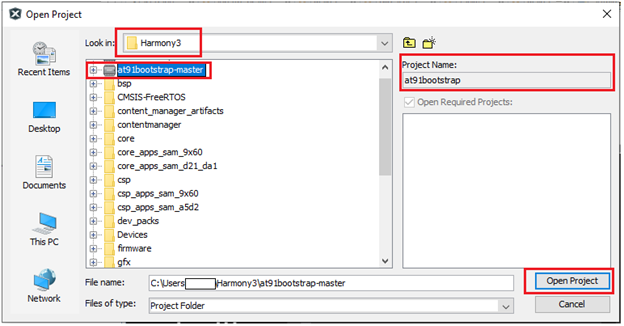
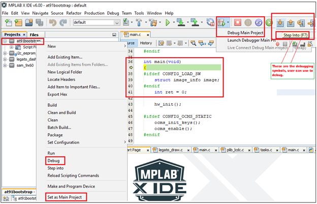

&nbsp;&nbsp;&nbsp;&nbsp;&nbsp;&nbsp;&nbsp;&nbsp;&nbsp;&nbsp;&nbsp;&nbsp;&nbsp;&nbsp;&nbsp;&nbsp;&nbsp;&nbsp;&nbsp;&nbsp;&nbsp;&nbsp;&nbsp;&nbsp;&nbsp;&nbsp;&nbsp;&nbsp; &nbsp;&nbsp;&nbsp;&nbsp;&nbsp;&nbsp;&nbsp;&nbsp;&nbsp;&nbsp;&nbsp;&nbsp;&nbsp;&nbsp;&nbsp;&nbsp;&nbsp;&nbsp;&nbsp;&nbsp;&nbsp;&nbsp;&nbsp;&nbsp;&nbsp;&nbsp;&nbsp;&nbsp;&nbsp;&nbsp;&nbsp;&nbsp;&nbsp;&nbsp;&nbsp;&nbsp;&nbsp;&nbsp;&nbsp;&nbsp;&nbsp;&nbsp;&nbsp;&nbsp;&nbsp;&nbsp;&nbsp;&nbsp;&nbsp;&nbsp;&nbsp;&nbsp;&nbsp;&nbsp;&nbsp;&nbsp;&nbsp;&nbsp;&nbsp;&nbsp;&nbsp;&nbsp;&nbsp;&nbsp;&nbsp;&nbsp;&nbsp;&nbsp;&nbsp;&nbsp;&nbsp;&nbsp; 

### Note:
 **This guide will teach you how to configure at91bootstrap(Second Stage Bootloader) to enable QSPI-XIP on MPUs.**
- [SAM9X60 boot process click here ](https://www.microchip.com/en-us/education/developer-help/learn-products/mcu-mpu/32bit-mpu/sam9x60-boot-process)
- [SAM9X60 data sheet](https://www.microchip.com/en-us/product/SAM9X60)
- [SAMA7G54 Evaluation kit](https://www.microchip.com/en-us/development-tool/EV21H18A)
- [SAMA7G5 series data sheet](https://www.microchip.com/en-us/product/sama7g54)

## Introduction
This training module describes the following for at91bootstrap, a second-stage bootloader for Microchip Technology Arm®-based Microprocessor Units (MPU), 
  where to get the source code, how to configure, compile and debug using MPLAB® X IDE on windows host.

* The following solution is tested based on **at91bootstrap version 4.0.7**.

* The at91bootstrap bootloader can be stored in external NVMs like (SD Memory Card), Multimedia Card (MMC), Embedded Multimedia Card (eMMC), NAND Flash, Serial Flash, QSPI Flash, Data Flash memory). 
  The first-stage bootloader (ROM Boot Code) will load at91bootstrap from external NVM depending on the value of the Boot Configuration Packet. 

* [Click here to learn how to configure Boot Configuration Packet for SAM9X60.](../sam9x60_configure_first_stage_bootloader/readme.md)  
Note: ***To learn about the boot process and first stage boot configuration, refer section:Boot Strategies of the respective MPUs data sheet.***  

* at91bootstrap if configured to do so, will initialize the following peripherals and memory controllers:
  * **Advanced Interrupt Controller (AIC)**
  * **Peripheral I/O Controller (PIO)**
  * **Power Management Controller (PMC)**
  * **Clock Generator (CKGR)**
  * **Static Memory Controller (HSMC)**
  * **NAND Flash Controller (NFC)**
  * **Multiport DDR-SDRAM Controller (MPDDRC)**
  * **Secure Digital Multimedia Card Controller (SDMMC)**  

* at91bootstrap is written and maintained by Microchip Technology and hosted on GitHub.

## Required software and hardware tools

  
 Details

   
This document is written with the assumption that the user is aware of the external NVMS & DDR memory available in the respective MPU boards (Like Evaluation Kits, Curiosity  Boards, SIP or SOM) by reading the respective user guide.

* To build/debug at91bootstrap using MPLAB® X IDE on windows host, the following tools should be installed properly:
  * [Download and install MPLAB® X IDE.](https://www.microchip.com/en-us/tools-resources/develop/mplab-x-ide)
  * [Download and install XC32 Compiler.](https://www.microchip.com/en-us/tools-resources/develop/mplab-xc-compilers)
* User can use below hardware tools:
  * [SAM9X60 Evaluation kit.](https://www.microchip.com/en-us/development-tool/DT100126) (or) [SAM9X60 Curiosity Development Board.](https://www.microchip.com/en-us/development-tool/EV40E67A)
  * External J32 debugger if SAM9X60 Curiosity Development Board is used.
  * [SAMA7G54 Evaluiation Kit](https://www.microchip.com/en-us/development-tool/EV21H18A)
  

 

## Getting at91bootstrap Source Code

  
 Details

   
  
  1. **Create a Project Directory:** Create a project directory to keep all the sources together for a given project. For the purpose of this tutorial topic, the created project directory is  **Harmony3**. 

  2. **Get at91bootstrap:** Get the complete source code of at91bootstrap by either of the following ways:
      * If you have git installed , clone the repo into the project directory by using the command:
         
		 $ git clone git@https://github.com/linux4sam/at91bootstrap
      * If you don't have git installed, then
        [Download at91bootstrap](https://github.com/linux4sam/at91bootstrap) and unzip into your project directory.
          
	  * **Note:** Use at91bootstrap version  v4.0.7 or higher

 
 
## Configure, build and debug at91bootstrap

  
 Details

   

User should follow the below steps to build the at91bootstrap either to debug the harmony application executed from QSPI on MPLAB® X IDE or to run the harmony application executed from QSPI :
1. Preparing the build Environment.
2. Configure the at91bootstrap.
3. Building the at91bootstrap.
4. Debugging the at91bootstrap.

### 1. Preparing the build Environment

  
 Details

   
  
  1.1. **Open at91Bootstrap project:** To begin, launch MPLAB® X IDE and then go to File --> Open Project -->choose downloaded at91bootstrap project.
      

    Now set it as main project.
  

  1.2. **Compiler setting:** User can use XC32 compiler to build at91bootstrap.   
       Go to Project --> Properties --> Makefile ---> Copy the XC32 installation path and update it in the build/debug and clean command --> Apply ---> ok .

   E.g.  
       Build/Debug command: ***make CROSS_COMPILE="C:/Program Files/Microchip/xc32/v4.30/bin/bin/pic32c-"***   
       Clean command: ***make mplabclean CROSS_COMPILE="C:/Program Files/Microchip/xc32/v4.30/bin/bin/pic32c-"***

   
 

### 2. Configure the at91bootstrap

  
 Details

   
The at91bootstrap can be configured to debug harmony application executed from QSPI flash on MPLAB® X IDE or to run harmony application from QSPI flash by using KCONFIG.

#### 2.1 Configure at91bootstrap to debug harmony application executed from QSPI flash on MPLAB® X IDE

  
 Details

    

To configure at91bootstrap to debug harmony application executed from QSPI flash on MPLAB® X IDE, go to
Project --> Properties --> Kconfig --> load --> **project directory** --> configs --> (board)df_qspi_uboot_defconfig --> Open.

Then perform the following changes:
  * Primary Operation --> Load and Stop.
  * Flash Memory --> QSPI Configuration --> eXecute In Place
  * Next software type --> Load 4MB into the start of SDRAM.
  * Demo application image storage setup:
     * Flash offset --> QSPI offset where a user wants to flash the application.
     * Demo app image size --> Size of the app image.
     * External RAM address to load Demo-App image --> Provide the QSPI starting address of the application. It should match the .text load address in your application linker script.  
       External QSPI address of SAM9X60 board starts from 0x70000000 – 0x708000000. Please refer to the data sheet for more details.  
	   External QSPI address of SAMA7G5 board starts from 0x20000000 – 0x280000000. Please refer to the data sheet for more details.  
	   
An example configuration for SAMA7G5-EK is shown below.

Now Click Apply --> OK.  

The boot file(at91bootstrap.elf) generated by doing this kconfig, can be used to debug harmony application executed from QSPI flash on  MPLAB® X IDE.

#### 2.2. Configure at91bootstrap to run harmony application from QSPI flash

  
 Details

   

To configure at91bootstrap to debug harmony application executed from QSPI flash on MPLAB® X IDE this, go to
Project --> Properties --> Kconfig --> load --> **project directory** --> configs --> (board)df_qspi_uboot_defconfig --> Open.

Then perform the following changes:
  * Primary Operation --> Load and Launch next software.
  * Flash Memory --> QSPI Configuration --> eXecute In Place
  * Next software type --> Load 4MB into the start of SDRAM.
  * Demo application image storage setup:
     * Flash offset --> QSPI offset where a user wants to flash the application.
     * Demo app image size --> Size of the app image.
     * External RAM address to load Demo-App image --> Provide the QSPI starting address of the application. It should match the .text load address in your harmony application linker script. 
       External QSPI address of SAM9X60 board starts from 0x70000000 – 0x708000000. Please refer to the data sheet for more details. 
	   External QSPI address of SAMA7G5 board starts from 0x20000000 – 0x280000000. Please refer to the data sheet for more details.
	   
An example configuration for SAMA7G5-EK is shown below.

Now Click Apply --> OK.  

The boot file(at91bootstrap.elf) generated by doing this kconfig, can be used to run harmony application executed from QSPI flash.

### 3. Building the at91bootstrap

  
 Details

    
To build the at91bootstrap go to project --> Clean and build or simply click the build icon in the IDE.

 

**Note:** When building using XC32 compiler, if a user doesn’t have XC32 pro compiler, a warning saying cannot optimize size will pop up in the compiler output window as follows. To avoid this either use XC32 pro compiler or just ignore this.

 

Once the build is successful, you will get the build success message in the IDE as shown in the above Image.

Now user will be able to see the boot.bin file in the **project directory**/build/binaries.

boot.bin file is the at91bootstrap file.

 

### 4. Debugging the at91bootstrap

  
 Details

   
To debug the at91bootstrap, go to project --> Set as main project.
Then click project --> Debug or simply click the debug icon in the IDE.
Now user can start debugging the at91bootstrp by clicking the debug symbols available in the IDE like Step into, Reset, Step over etc.

When debugging the application, serial console outputs can be monitored by connecting windows host with the board (Eg: SAM9X60-EK) through a terminal emulation program.
For example, refer to [this link](https://microchipdeveloper.com/32mpu:sam9x60-ek-console) to download terminal emulation program and follow the steps to establish a serial communication with SAM9X60-EK.
An example image showing the serial console output while debugging at91bootstrap is shown below.

## Note
  * **[Click here to learn how to configure first stage bootloader for SAM9X60 MPU](../sam9x60_configure_first_stage_bootloader/readme.md)**
  * **[Click here to develop a harmony based application executed from QSPI for SAM9X60 MPU using MPLAB® X IDE ](../sam9x60_qspi_xip_application_using_mcc/readme.md)**

## Reference Links
  &nbsp; &nbsp; &nbsp;   &nbsp; &nbsp; &nbsp;   &nbsp; &nbsp;    
