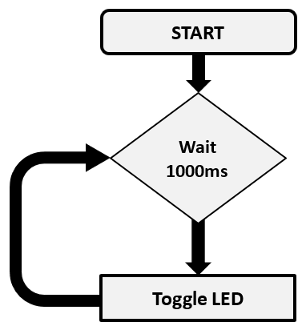
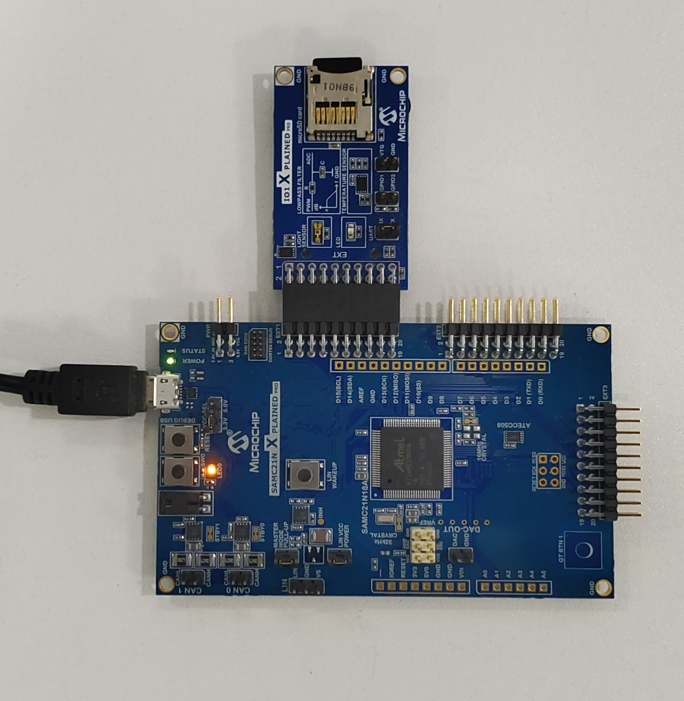
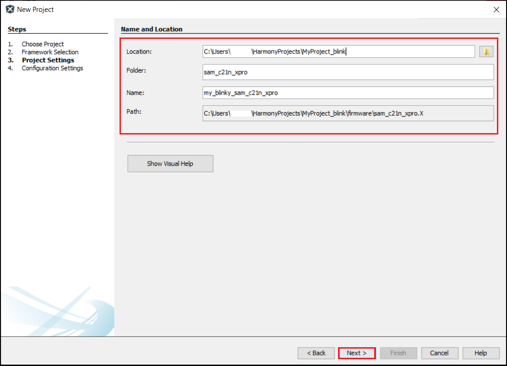
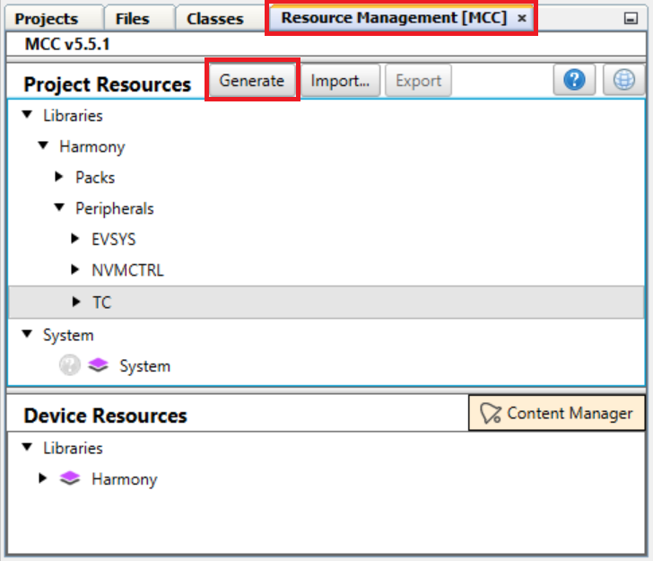
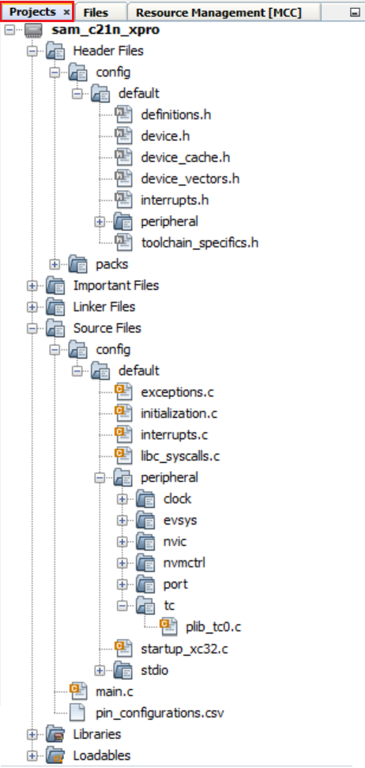
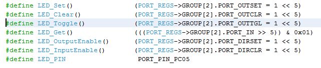

&nbsp;&nbsp;&nbsp;&nbsp;&nbsp;&nbsp;&nbsp;&nbsp;&nbsp;&nbsp;&nbsp;&nbsp;&nbsp;&nbsp;&nbsp;&nbsp;&nbsp;&nbsp;&nbsp;&nbsp;&nbsp;&nbsp;&nbsp;&nbsp;&nbsp;&nbsp;&nbsp;&nbsp; &nbsp;&nbsp;&nbsp;&nbsp;&nbsp;&nbsp;&nbsp;&nbsp;&nbsp;&nbsp;&nbsp;&nbsp;&nbsp;&nbsp;&nbsp;&nbsp;&nbsp;&nbsp;&nbsp;&nbsp;&nbsp;&nbsp;&nbsp;&nbsp;&nbsp;&nbsp;&nbsp;&nbsp;&nbsp;&nbsp;&nbsp;&nbsp;&nbsp;&nbsp;&nbsp;&nbsp;&nbsp;&nbsp;&nbsp;&nbsp;&nbsp;&nbsp;&nbsp;&nbsp;&nbsp;&nbsp;&nbsp;&nbsp;&nbsp;&nbsp;&nbsp;&nbsp;&nbsp;&nbsp;&nbsp;&nbsp;&nbsp;&nbsp;&nbsp;&nbsp;&nbsp;&nbsp;&nbsp;&nbsp;&nbsp;&nbsp;&nbsp;&nbsp;&nbsp;&nbsp;&nbsp;&nbsp;[](../../../readme.md) [](../readme.md)


# Create First MPLAB Harmony 3 Project

## Overview
The purpose of this tutorial is to show you how to use Microchip MPLAB® Harmony 3 to create a simple “heartbeat” LED application that flashes an LED using the MPLAB® X IDE and the MPLAB® Code Configurator (MCC). As a bonus, you can reuse the heartbeat LED application in future projects as a simple indicator of system health. This tutorial focuses on direct use of MPLAB® Harmony peripheral libraries to build an application. If you are interested in using interoperable MPLAB® Harmony drivers, services, or middleware in your application, please see “Creating Your First Project – Harmony” when you’ve finished with this tutorial.
The application can be defined by the following flowchart:



## Required Software
The instructions in this tutorial assume that you have already installed following software.

- <a href="https://www.microchip.com/mplab/mplab-x-ide" target="_blank">MPLAB X Integrated Development Environment</a>
- <a href="https://www.microchip.com/mplab/compilers" target="_blank">MPLAB XC32/32++ C Compiler</a>

## Required Hardware
The instructions in this tutorial use <a href="https://www.microchip.com/developmenttools/ProductDetails/atsamc21n-xpro" target="_blank">SAMC21N Xplained Pro Evaluation Kit</a> and it has one Yellow Color user LED (PC05) connected GPIO. Similar kits will work similarly, but the setup and steps may not be exactly as described.

**Setup**: The following figure shows the hardware setup details:

- Connect SAMC21N Xplained Pro Evaluation Kit micro USB port to PC using a micro USB cable

    

## Procedure
The following are the steps to create, generate, build and flash LED Blinking application. Before proceeding, make sure you have downloaded the required Harmony 3 packages (for directions, the MPLAB® Code Configurator (MCC) User’s Guide) and setup the required hardware as shown previously.

## Create a new project
1. Open the MPLAB® X IDE.
2. Create a New Project by clicking the New Project icon  or by selecting File > New Project.
3. In the New Project window select **32-Bit MCC Harmony Project**.
4. Click Next.

    

    **Note**: If the option 32-Bit MPLAB Harmony v3 Project is not available, install the **MPLAB® Harmony 3 Launcher** plug-in from **Tools > Plugins > Available Plugins** before continuing with this demonstration.
5. Enter the path to the folder in which you downloaded the MPLAB® Harmony 3 packages in the Framework Path edit box.

    

6. In the Project Setting dialog window, fill in or select the information needed as follows:
    - Location: Create a “**MyProject_blink**” folder in the location of your choice.
    - Folder: Project Folder name i.e. “**sam_c21n_xpro**”
    - Name: Project Name i.e. “**my_blinky_sam_c21n_xpro**”

    

7. In the Configuration Settings dialog window, enter the configuration name as “**sam_c21n_xpro**” and select the Target Device **ATSAMC21N18A** from the drop-down menu as shown below.

    

8. Click **Finish**.
9. While the MCC tool launches, Click on **Select MPLAB Harmony** content type.

    

    Click on the **Finish** Button in the MCC Content Manager Wizard.
	
	
	
## Setup MPLAB® Harmony Project Configurator to Generate Code
1. Click on the **Resource Management [MCC]** tab, In the **Device Resources** , expand **Harmony > Peripherals > TC**.

    Select and double click on **TC0** to add the TC0 to the project.
    

2. Click on the “**TC0**” component and configure as below and in the figure:

    - Select Prescaler value to “**Prescaler: GCLK_TC/1024**”
    - Set Time (Milli Sec) to “**500**”

    

    This will toggle the LED every 0.5 seconds, producing a LED blink every second.

3. Launch the **Pin Configuration** manager by clicking **Project Graph > Plugins > Pin Configuration**.

    

4. Setup pin “**PC05**” as the board’s **LED**, set custom name as “LED” and Direction as “**Out**”:

    

    This is necessary because the project doesn’t use a Board Support Package (BSP).

5. Generate the application’s code for the first time.

6. Generate the code by using MCC. From the left side tab, **Resource Management [MCC]**, go to **Project Resources** and click on the **Generate** button.

   

7. Let’s examine the software just created in the Projects panel of MPLAB® X IDE Header Files are shown on the top and Source Files are shown on the bottom.

    **Note:** The icons used in this picture of the project’s organization make it seem like the files of the project are organized this way on disk. In fact, this is a virtual organization of these files, not an actual one. On disk, the source and header files are not separated.
    The following table describes the Header and Source files generated from the sample project:

    |  # |  Source File | Descriptions  |
    | ---|---|---|
    |  1 |definitions.h	   |Provides configuration-specific definitions   |
    |  2 |exceptions.c	   |Implements exception handlers    |
    |  3 |initialization.c	   |Implements SYS_Initialize to initializes all libraries and applications   |
    |  4 |interrupts.c	   |Implements the interrupt vectors   |
    |  5 |peripheral [libraries]	   | Implements peripheral libraries used by the project   |
    |  6 |startup.c	   | Startup code for the application  |

    If you click on the **Projects** tab you will see the actual organization of these files on your drive:

    

## Adding Code to main.c
Double click on **main.c** to bring up an editor window and update it to obtain the following code:
	
```c

static bool volatile bToggleLED = false;

// This function is called after period expires
void TC0_CH0_TimerInterruptHandler(TC_TIMER_STATUS status, uintptr_t context)
{
    bToggleLED = true;
}

// *****************************************************************************
// *****************************************************************************
// Section: Main Entry Point
// *****************************************************************************
// *****************************************************************************

int main ( void )
{
    // Initialize all modules
    SYS_Initialize(NULL);

    // Register callback function for CH0 period interrupt
    TC0_TimerCallbackRegister(TC0_CH0_TimerInterruptHandler, (uintptr_t)NULL);

    // Start the timer channel 0
    TC0_TimerStart();

    while ( true )
    {
        if ( bToggleLED )
        {
            bToggleLED = false;
            LED_Toggle();
        }
    }

    // Execution should not come here during normal operation
    return EXIT_FAILURE;
}
```

If you do a control click on “LED_Toggle()” the editor will bring up where this token is defined in the file plib_port.h:




## Upload project to SAMC21N Xplained pro Evaluation Kit
1. Do a right mouse click on the project’s name and bring up the Project Properties dialog:

    

2. Under Categories section, select Conf: (sam_c21n_xpro), and in the Configuration section, select the hardware tool and XC32 Compiler toolchain (here v4.30). Click Apply, and then click OK

    

3. Build and run the project: The board’s LED should flash with a 1 second period

    

We have now implemented a heartbeat for future applications. The LED blinking indicates that the application hasn’t frozen or isn’t stuck in a while(1){} loop (e.g.: assert or exception).

## Result
If configured correctly, the LED PC05 on the <a href="https://www.microchip.com/developmenttools/ProductDetails/atsamc21n-xpro" target="_blank">SAMC21N Xplained Pro Evaluation Kit</a> should now flash ON/OFF at **500 ms** intervals.

## Note
<span style="color:blue"> *This page has been verified with the following versions of software tools:*</span>

- [MPLAB Harmony v3 "csp" repo v3.18.0](https://github.com/Microchip-MPLAB-Harmony/csp/releases/tag/v3.18.0)
- [MPLAB Harmony v3 "dev_packs" repo v3.18.0](https://github.com/Microchip-MPLAB-Harmony/dev_packs/releases/tag/v3.18.0)
- MPLAB Harmony 3 Launcher Plugin v3.6.4
- [MPLAB X IDE v6.10](https://www.microchip.com/mplab/mplab-x-ide)
- [MPLAB XC32 Compiler v4.30](https://www.microchip.com/mplab/compilers)

<span style="color:blue"> Because Microchip regularly update tools, occasionally there could be minor differences with the newer versions of the tools. </span>

## References
- <a href="https://www.microchip.com/developmenttools/ProductDetails/atsamc21n-xpro" target="_blank">SAMC21N Xplained Pro Evaluation Kit User Guide and Datasheet</a>
- <a href="https://www.microchip.com/mplab/mplab-x-ide" target="_blank">MPLAB X IDE User’s Guide</a> see Documentation section at bottom of the page.
    - <a href="http://www.microchip.com/mymicrochip/filehandler.aspx?ddocname=en556757" target="_blank">User’s Guide direct download</a>

## Reference Links
[<a href="https://www.microchip.com/design-centers/32-bit" target="_blank">  </a>]()  &nbsp; &nbsp; &nbsp; [<a href="https://www.microchip.com/design-centers/32-bit-mpus" target="_blank">  </a>]()  &nbsp; &nbsp; &nbsp; [<a href="https://www.microchip.com/mplab/mplab-x-ide" target="_blank">  </a>]()  &nbsp; &nbsp; [<a href="https://www.microchip.com/mplab/mplab-harmony" target="_blank">  </a>]() [<a href="https://www.microchip.com/mplab/compilers" target="_blank">  </a>]()
