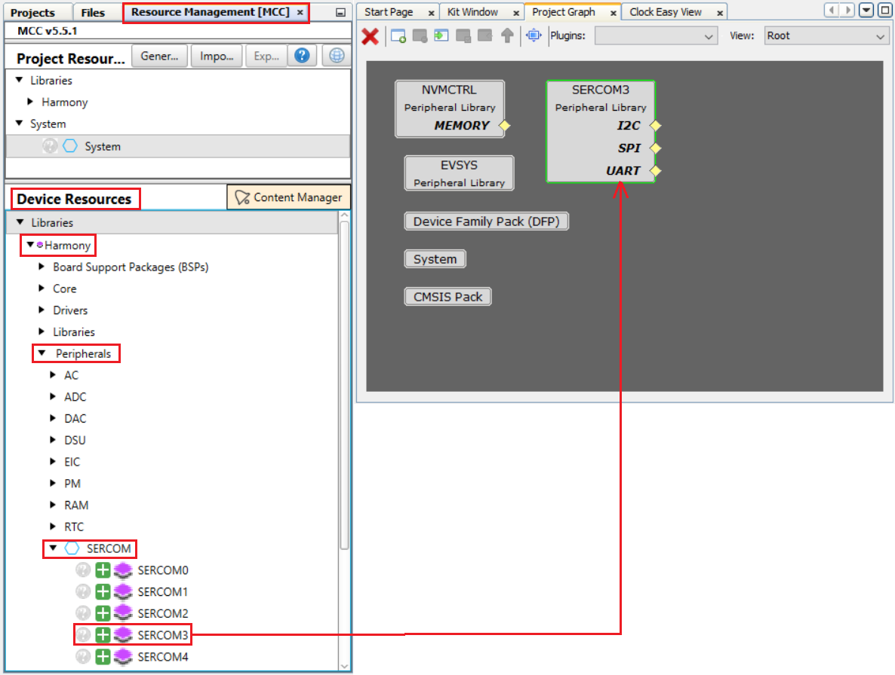
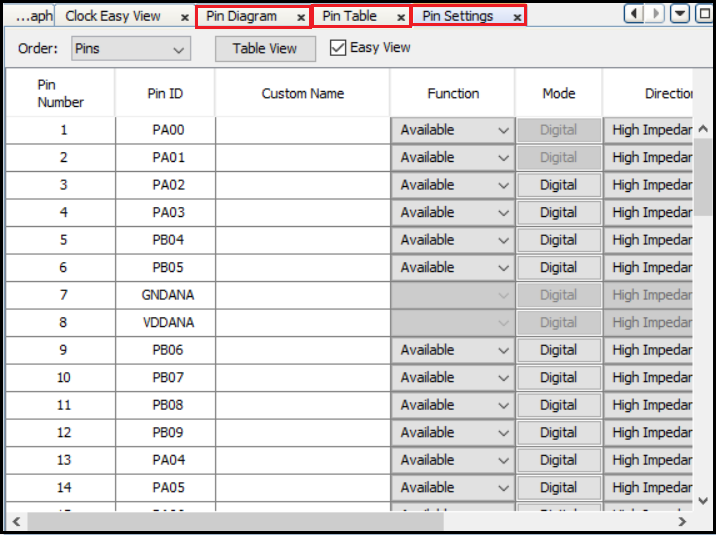
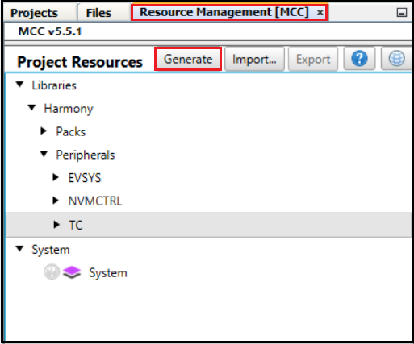
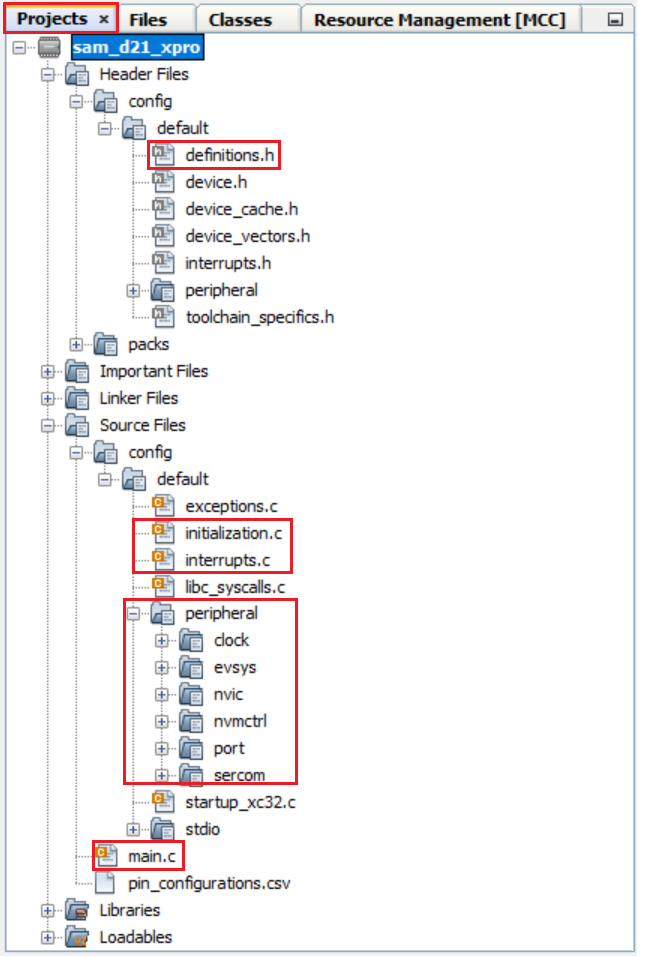
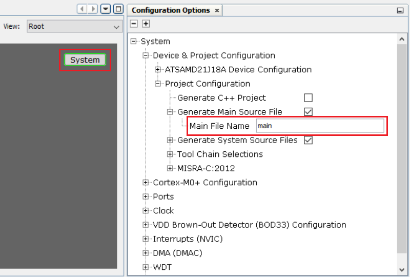
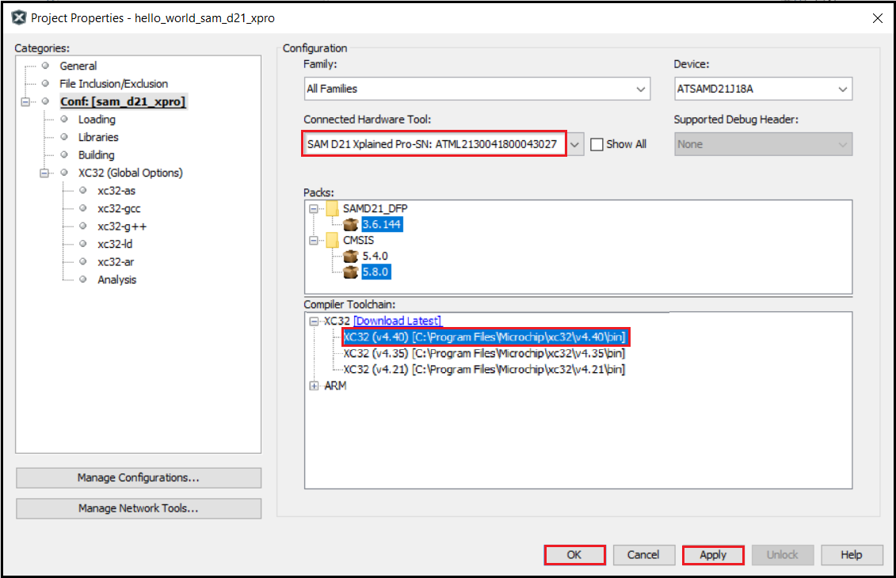

&nbsp;&nbsp;&nbsp;&nbsp;&nbsp;&nbsp;&nbsp;&nbsp;&nbsp;&nbsp;&nbsp;&nbsp;&nbsp;&nbsp;&nbsp;&nbsp;&nbsp;&nbsp;&nbsp;&nbsp;&nbsp;&nbsp;&nbsp;&nbsp;&nbsp;&nbsp;&nbsp;&nbsp; &nbsp;&nbsp;&nbsp;&nbsp;&nbsp;&nbsp;&nbsp;&nbsp;&nbsp;&nbsp;&nbsp;&nbsp;&nbsp;&nbsp;&nbsp;&nbsp;&nbsp;&nbsp;&nbsp;&nbsp;&nbsp;&nbsp;&nbsp;&nbsp;&nbsp;&nbsp;&nbsp;&nbsp;&nbsp;&nbsp;&nbsp;&nbsp;&nbsp;&nbsp;&nbsp;&nbsp;&nbsp;&nbsp;&nbsp;&nbsp;&nbsp;&nbsp;&nbsp;&nbsp;&nbsp;&nbsp;&nbsp;&nbsp;&nbsp;&nbsp;&nbsp;&nbsp;&nbsp;&nbsp;&nbsp;&nbsp;&nbsp;&nbsp;&nbsp;&nbsp;&nbsp;&nbsp;&nbsp;&nbsp;&nbsp;&nbsp;&nbsp;&nbsp;&nbsp;&nbsp;&nbsp;&nbsp;[](../../../readme.md) [](../readme.md)


# Create "Hello World" application on SAM MCUs

## Introduction
<a href="https://www.microchip.com/mplab/mplab-harmony" target="_blank">MPLAB Harmony v3</a> is a software development framework consisting of compatible and interoperable modules that include peripheral libraries (PLIBs), drivers, system services, middleware and third-party libraries. The MPLAB Code Configurator (MCC) is a GUI-based tool that provides an easy way to enable and configure various MPLAB Harmony modules. The MCC is a plug-in to the MPLAB X Integrated Development Environment (IDE).
This page explains how to create a simple application on an Arm® Cortex®-based SAM Microcontroller (MCU) using the MCC with MPLAB Harmony v3 modules. This application sends a “Hello World!” string to a console running on a computer. For this demonstration, the following MPLAB Harmony v3 modules are used and configured using the MCC:

- Clock PLIB using the Clock Manager to configure the microcontroller clock.
- PORT PLIB using the Pin Manager to configure the microcontroller I/Os.
- Serial Communication (SERCOM) USART PLIB to configure USART peripheral as serial port.

## Required Software
The instructions in this tutorial assume that you have already installed following software.

- <a href="https://www.microchip.com/mplab/mplab-x-ide" target="_blank">MPLAB X Integrated Development Environment </a>
- <a href="https://www.microchip.com/mplab/compilers" target="_blank">MPLAB XC32/32++ C Compiler</a>

## Required Hardware
The instructions in this tutorial use <a href="https://www.microchip.com/DevelopmentTools/ProductDetails/ATSAMD21-XPRO" target="_blank">SAMD21 Xplained Pro board</a> and it has one Yellow Color user LED (PB30) connected GPIO. Similar kits will work similarly, but the setup and steps may not be exactly as described.

**Setup**: The following figure shows the hardware setup details:

- Connect SAMD21 Xplained Pro Board micro USB port to PC using a micro USB cable

    

## Procedure

### Step 1: To create an MPLAB Harmony v3-based project, follow these steps:
1. Launch MPLAB X IDE.
2. In MPLAB X IDE, select *File > New Project* (or click the New Project icon).
3. In the **New Project** window, select **Microchip Embedded** in the **Categories** pane and select **32-bit MCC Harmony Project** in the **Projects** pane.

    **Note**: If the option 32-Bit MPLAB Harmony v3 Project is not available, install the **MPLAB® Harmony 3 Launcher** plug-in from Tools > Plugins > Available Plugins before continuing with this demonstration.

    

4. Click **Next**.
5. Under the **Manage Framework** section, enter the **Framework Path** (Path to the folder in which the MPLAB Harmony v3 packages are downloaded). For this demonstration, the MPLAB Harmony v3 packages are downloaded in the following location: *C/harmony3*.

    

    **Note**: For this demonstration application, the following MPLAB Harmony v3 packages are required:
    **dev_packs**, and **csp**. The MPLAB Harmony 3 Content Manager tool simplifies the downloading of the MPLAB
    Harmony v3 packages. If these packages are not downloaded, then the user can use the <a href="https://github.com/Microchip-MPLAB-Harmony/contentmanager/wiki" target="_blank">MPLAB Harmony 3 Content Manager</a> tool to download them onto their computer.

6. Click **Next**.
7. Under the **Name and Location** section, enter the following details:
    - Location: Indicates the path to the root folder of the new project. All project files will be placed in this
    folder. The project location can be any valid path, for example: *C:/Users/HarmonyProjects/tech_brief*.
    - Folder: Indicates the name of the MPLAB X IDE folder. Enter hello_world to create a hello_world.X
    folder.
    - Name: Enter name of the project as *hello_world_sam_d21_xpro*. This name will be displayed in the
    MPLAB X IDE.
    - Path: The path information will be updated as and when users make changes to other fields.

    

    **Note**: Click the **Show Visual Help** button to open a contextual help window for a detailed description of
    various fields in the Project Settings.

8. Click **Next**.
9. Under the **Configuration Settings** section, enter the details as given below:
    - Name: Enter the configuration name as **sam_d21_xpro**
    - Target Device: Choose **ATSAMD21J18A**.

    

    **Note**: Click the **Show Visual Help** button to open a contextual help window for a detailed description of
    various fields in the Project Settings.
10. Click **Finish** to launch the MCC.

    **Note**: After clicking the Finish button, if MCC does not launch, users can launch it by selecting *Tools > Embedded > MPLAB® Code Configurator v5* from the MPLAB X IDE.
11. While the MCC tool launches, Click on Select MPLAB Harmony content type.

    

    Click on the Finish Button in the MCC Content Manager Wizard.
	
	
12. The MCC plug-in will open in a new window. The image below highlights different section available in the
MCC.

    


### Step 2: To add and configure the MPLAB Harmony components using the MCC, follow these steps:
1. Launch the Clock Configuration manager by clicking Project Graph > Plugins > Clock Configuration.

    

    The Clock Easy View window will be displayed inside the MCC Window.
2. In the Clock Easy View window, scroll to the right and verify that the Main Clock is set to 48 MHz.

    

3. To add and configure the USART Peripheral Library follow these steps:
    - Click on the Resource Management [MCC] tab, In the Device Resources , expand Harmony > Peripherals > SERCOM.
    - Double-click on the SERCOM3 to add it to the project

    

4. Select the SERCOM3 Peripheral Library in the Project Graph, and in the Configuration Options window,
configure it as follows:
    - SERCOM Operation mode is set for USART with Internal Clock (default setting).
    - Clear Receive Enable, as the string will only be transmitted in this example.
    - Set the Baud Rate to 9600.
    - For Transmit Pinout choose SERCOM PAD[0] (default setting).
    - By default, the Receive Pinout is SERCOM PAD[0]. If the Receive Pinout feature is disabled, it will not
    affect the operation.

    

5. Configure the USART pin in the Pin Settings: In the MCC, select Project Graph > Plugins > Pin Configuration to open the Pin
Settings window.

    

6. The MCC Pin Settings window will open and display these options: Pin Diagram, Pin Table, and Pin Settings.

    

    **Note**: According to the schematic of the SAMD21 Xplained Pro board, the on-board Embedded Debugger
    (EDBG) can be used as Virtual Com Port to have serial communication between the SAMD21 device and a
    connected computer console. Therefore, the PA22 (Pin #43) of the SAMD21 must be configured as USART_TX
    (SERCOM3 PAD0).
7. Click the Pin Settings tab and configure the PA22 pin as SERCOM3_PAD0.

    

8. The same pin (PA22) can be configured by clicking the Pin Table tab.

    

    **Note**:
    - The USART_TX function (Transmit Pinout) is by default configured to be on SERCOM3 PAD0, for additional information, refer to MCC SERCOM Configuration.
    - In the SERCOM3 USART configuration, the USART is enabled only for transmit functionality. Therefore, the USART receive pin is not configured.

### Step 3: To generate the code, follow these steps:
1. Generate the code by using MCC. From the left side tab, Resource Management (MCC), go to Project Resources and click on the Generate button.

    

2. The above step triggers these actions in MCC:
    - Generate the code as per the configurations done.
    - Place the generated code and required MPLAB Harmony framework files in the MPLAB Harmony project directory, in this case: *C:/Users/HarmonyProjects/tech_brief/firmware/src*.
    - Add all generated codes and MPLAB Harmony framework files into the MPLAB Harmony project, as shown in the following figure.

    

    **Note**: The MPLAB Harmony project will be shown in another window as this project is in Standalone mode.

3. The generated code descriptions are as follows:

    - definitions.h: Includes all the header files required for the project.
    - initialization.c: Initializes all the MPLAB Harmony modules used in the application.
    - interrupts.c: Contains the mapping of all the interrupt vectors on the selected device.
    - main.c: A function call to initialize the system present in this file. The user needs to develop their application in this file.
    - peripheral: All peripheral source codes are added in this folder.

    **Note**: The MCC provides an option to change the generated file name, and if this option is not used, by default, the file name **main.c** is generated.

    

### Step 4: To develop and run an application, follow these steps:
1. Developing an application: For this demo application, add the highlighted codes (as shown in image below) in the main.c file. This will send the “Hello World!” string to the console running on the PC. The following code is provided for convenience:

    ```c
    uint8_t buffer[]= "Hello World!\r\n";

    SERCOM3_USART_Write(&buffer[0], sizeof(buffer));
    ```
    

2. Selecting Hardware Tool and Compiler: In the MPLAB X IDE Project Properties window perform these actions:
3. Under Categories section, select Conf: (sam_d21_xpro), and in the Configuration section, select the hardware tool and compiler toolchain.

    

4. Click **OK**.
5. Connecting Hardware: Connect a micro-USB cable between the DEBUG USB on the board and the PC. This enables the programming of the microcontroller and provide a serial connection with the console device (computer).

    

6. Setting up the Serial Console: Open a terminal application, such as Tera Term on the PC and perform the serial port setup. Below is the default setup details for Tera Term.

    

7. Programing and Running the Application: Build and program the SAMD21 Xplained Pro kit by using the MPLAB X IDE.

    

8. Observing the Output: Observe the “Hello World!” string on the console. If the desired output is not found on the console, press the Reset button on the Xplained Pro board to reset the device, and ensure that the UART message is communicated.

    

## Note
<span style="color:blue"> *This page has been verified with the following versions of software tools:*</span>

- [MPLAB X IDE v6.15](https://www.microchip.com/mplab/mplab-x-ide)
- [MPLAB XC32 Compiler v4.30](https://www.microchip.com/mplab/compilers)
- [MPLAB Code Configurator v5.3.7](https://www.microchip.com/en-us/tools-resources/configure/mplab-code-configurator) 
- MCC Harmony v1.3.2
- [MPLAB Harmony v3 "csp" repo v3.18.0](https://github.com/Microchip-MPLAB-Harmony/csp/releases/tag/v3.18.0)
- [MPLAB Harmony v3 "dev_packs" repo v3.18.0](https://github.com/Microchip-MPLAB-Harmony/dev_packs/releases/tag/v3.18.0)

<span style="color:blue"> Because Microchip regularly update tools, occasionally there could be minor differences with the newer versions of the tools. </span>

## Reference Links
[<a href="https://www.microchip.com/design-centers/32-bit" target="_blank">  </a>]()  &nbsp; &nbsp; &nbsp; [<a href="https://www.microchip.com/design-centers/32-bit-mpus" target="_blank">  </a>]()  &nbsp; &nbsp; &nbsp; [<a href="https://www.microchip.com/mplab/mplab-x-ide" target="_blank">  </a>]()  &nbsp; &nbsp; [<a href="https://www.microchip.com/mplab/mplab-harmony" target="_blank">  </a>]() [<a href="https://www.microchip.com/mplab/compilers" target="_blank">  </a>]() [<a href="https://www.microchip.com/en-us/tools-resources/configure/mplab-code-configurator" target="_blank">  </a>]()
