&nbsp;&nbsp;&nbsp;&nbsp;&nbsp;&nbsp;&nbsp;&nbsp;&nbsp;&nbsp;&nbsp;&nbsp;&nbsp;&nbsp;&nbsp;&nbsp;&nbsp;&nbsp;&nbsp;&nbsp;&nbsp;&nbsp;&nbsp;&nbsp;&nbsp;&nbsp;&nbsp;&nbsp; &nbsp;&nbsp;&nbsp;&nbsp;&nbsp;&nbsp;&nbsp;&nbsp;&nbsp;&nbsp;&nbsp;&nbsp;&nbsp;&nbsp;&nbsp;&nbsp;&nbsp;&nbsp;&nbsp;&nbsp;&nbsp;&nbsp;&nbsp;&nbsp;&nbsp;&nbsp;&nbsp;&nbsp;&nbsp;&nbsp;&nbsp;&nbsp;&nbsp;&nbsp;&nbsp;&nbsp;&nbsp;&nbsp;&nbsp;&nbsp;&nbsp;&nbsp;&nbsp;&nbsp;&nbsp;&nbsp;&nbsp;&nbsp;&nbsp;&nbsp;&nbsp;&nbsp;&nbsp;&nbsp;&nbsp;&nbsp;&nbsp;&nbsp;&nbsp;&nbsp;&nbsp;&nbsp;&nbsp;&nbsp;&nbsp;&nbsp;&nbsp;&nbsp;&nbsp;&nbsp;&nbsp;&nbsp; 

# Creating an IAR or KEIL project using MCC
When creating projects for IAR or KEIL IDEs, MCC is launched as an application (as opposed to a plugin in MPLAB® X, when creating MPLAB® X projects). We refer to this mode of operation of MCC as "standalone" throughout this document.  Follow the steps detailed below to create an project for IAR or KEIL using MCC Standalone.

## Installing the MPLAB Code Configurator (MCC) Standalone

* Goto the MPLAB Code Configurator (MCC) webpage and download the MCC Standalone version for the respective operating system. 
    

	- Download the MCC Standalone from [here](https://www.microchip.com/en-us/tools-resources/configure/mplab-code-configurator).

## Launching MCC Standalone 

* Launch the MPLAB Code Configurator (MCC) Standalone application from the Start Menu. 
	- It will appears as a separate application as below:

	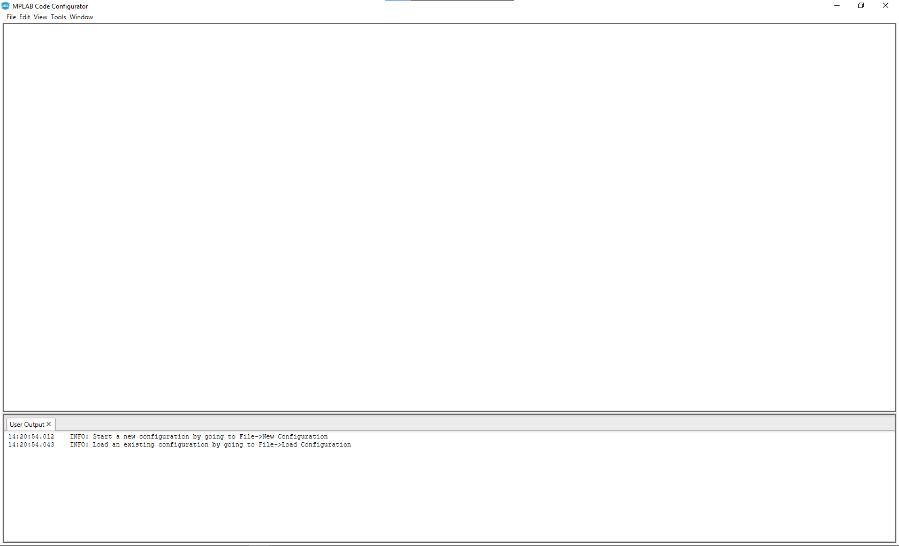

## Setting user preferences
User preferences can be set by navigating to Tools -> Options. MCC allows user to configure two preferences

* **Diff** - Allows user to configure a diff tool. This is an important configuration, and is explained further down in project generation section. We can configure any third party diff tool. To set diff tool,  navigate to its installation directory using the browse button and select the executable. {0} and {1} are place holders for the files that need to diffed during project file generation. In this example, we are using WinMerge as the diff tool.

     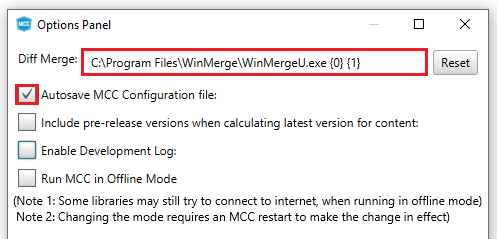

* **Log** - Allows user to set the log level. MCC displays the logs in the console window (seen at the bottom of the main window). It also saves them in the mcc.log file under .mh3 folder in user's home directory. This log level decides the kind of messages that will get logged.

     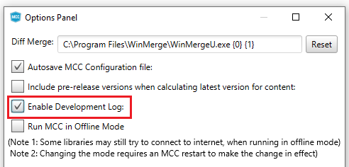

## Creating a new configuration
To create a new mcc configuration, choose File -> **New 32-bit MCC Harmony configuration**. 

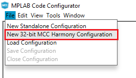

A new configuration creation dialog will popup, where we can enter the details of the configuration that we are about to create.

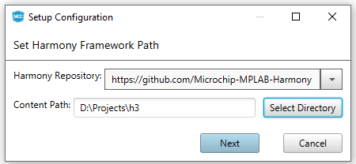

* **Framework Path** - This is not configurable. Framework path defaults to the parent folder of the MCC repository. This folder is should contain relevant harmony 3 repositories required for project creation. Recommend using content manager for downloading and setting up  Harmony 3 repositories. Make sure that the "Convert to relative path for configuration" check box is unchecked.

Then, Click Next for Setup Configuration.

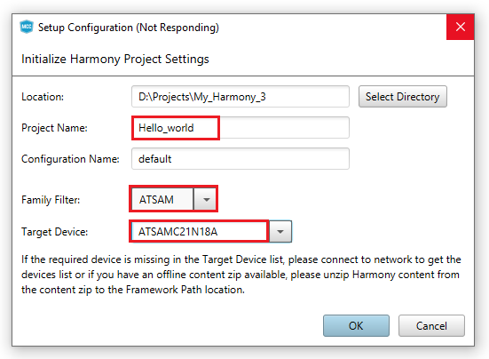

* **Project information** - Under project information, user can choose the location of the project, name of the project and the name of the configuration.
  * *Location* - Location where the project and configuration will be created
  * *Project name*  -Used by MCC when creating projects for target IDEs. If you want a KEIL or IAR project with specific name, it should be entered in this field
  * *Configuration name* - Used by MCC when creating configuration data
  * *Family Filter* - Allows us to choose the family filter of this configuration. In this example, select **ATSAM** in the family filter configuration.
  * *Target Device* - Device Family drop down limits the options to a specific family when choosing the target device, while Device Filter allows searching for a device by entering few characters.  In this instance, **ATSAMC21N18A** MCU is chosen for creating the configuration.

* Download the Required Mandatory Harmony Content if not downloaded.
    - The below MCC Content Manager window will open if the Mandatory Harmony Contents are not present in the **Harmony Content Path** mentioned in the above Step 4.

        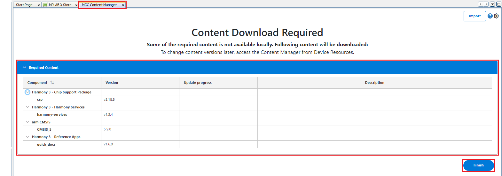

    - Click on the **Finish** Button in the MCC Content Manager Wizard to start downloading the Mandatory **Harmony Content**.
    -  **Note**: For this demonstration application, the following MPLAB Harmony v3 packages are required:
    **csp**, **harmony-services**, **CMSIS**, and **quick_docs**. The MPLAB Harmony 3 Content Manager tool simplifies the downloading of the MPLAB
    Harmony v3 packages. If these packages are not downloaded, then the user can use the <a href="https://youtu.be/0rNFSlsVwVw?si=tTK6mX9aV6slOcjA&t=145" target="_blank">MPLAB Harmony 3 Content Manager</a> tool to download them onto their computer.
        - If you need you can select the optional contents like bsp, core, CMSIS-FreeRTOS, etc and click apply, then Content Manager will start downloading these selected packages under the **Harmony Content** path.

            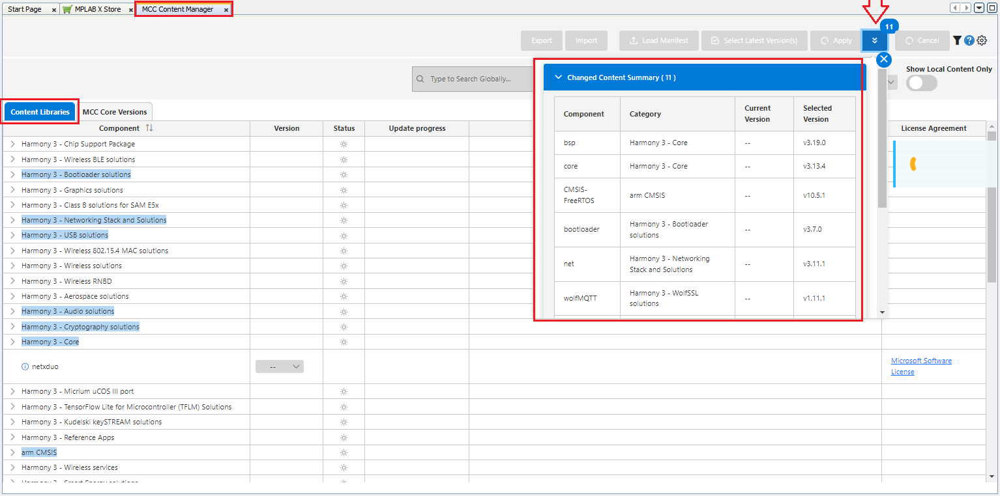

        - Similarly, update the MCC Core Versions to the latest if not already updated.

            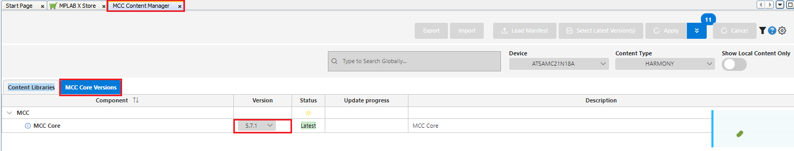

## Making changes to the configuration
Refer to documentation on how to use the project graph for configuring Harmony 3 components using MCC.

## Generating code and project associated with a configuration

* Select the target toolchain by clicking the system component in the project graph and choosing System -> Project Configuration -> Toolchain selections -> Compilers in the configuration option window. Available options are XC32, IAR and KEIL. Some of these options might not be available for all targets. Choosing IAR or KEIL as the target compiler, will result in MCC creating IAR embedded workbench or Keil uVision IDE projects for the selected target. In this case, we have chosen KEIL as the toolchain.
	- **Note**: If the IAR Workbench or KEIL was not installed on the PC, MCC Standalone does not generate the project for the selected toolchain.
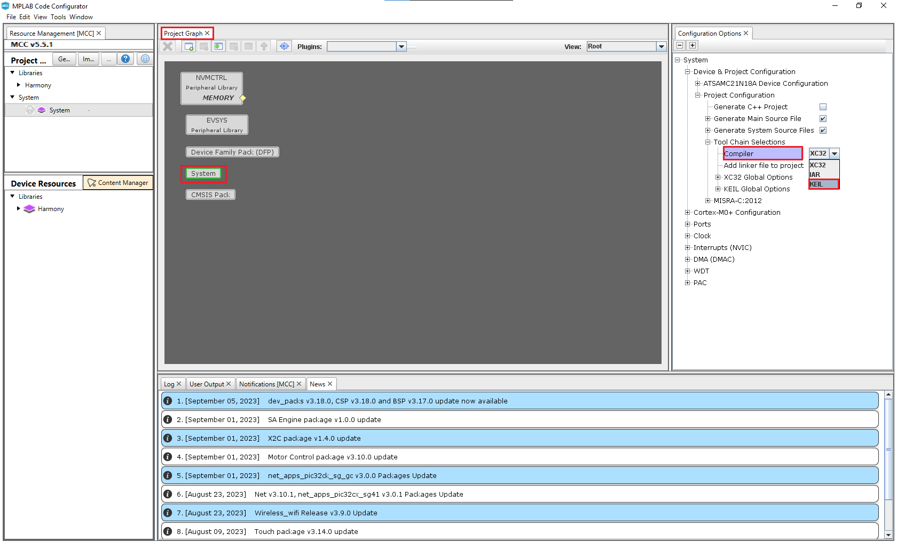
* Click **Generate** button in Project Resources to start project generation. In the generation window, we can choose the merge strategies.

   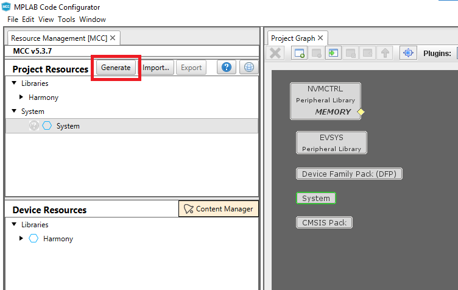

* MCC identifies that there is a diff in the files it generated (for eg: modification within the project IDE), it will launch the configured diff tool. We can bring in the changes that are relevant and ignore the rest. Once the diff tool is closed, the project generation sequence is continued until the entire configuration is generated.

* If IAR or KEIL is chosen as the toolchain, MCC will also create a folder containing the relevant project files which can then be opened using the corresponding IDE. The path of this folder, follows the rules explained in the "Setup Configuration" section. In this example, it would be under `"D:/Projects/My_Harmony_3/firmware/Hello_world/Hello_world.uvprojx"`, since we choose keil as the the toolchain.

## Note
 *This page has been verified with the following versions of software tools:*

- [MPLAB X IDE v6.20](https://www.microchip.com/mplab/mplab-x-ide)
- [MPLAB XC32 Compiler v4.40](https://www.microchip.com/mplab/compilers)
- [MPLAB Code Configurator Plugin v5.5.1](https://www.microchip.com/en-us/tools-resources/configure/mplab-code-configurator)
- [MPLAB Harmony v3 "csp" repo v3.18.5](https://github.com/Microchip-MPLAB-Harmony/csp/releases/tag/v3.18.5)

 Because Microchip regularly update tools, occasionally there could be minor differences with the newer versions of the tools. 

## Reference Links
  &nbsp; &nbsp; &nbsp;   &nbsp; &nbsp; &nbsp;   &nbsp; &nbsp;   