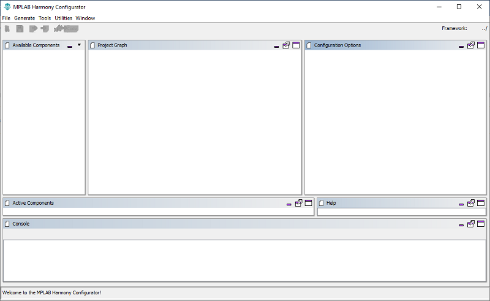
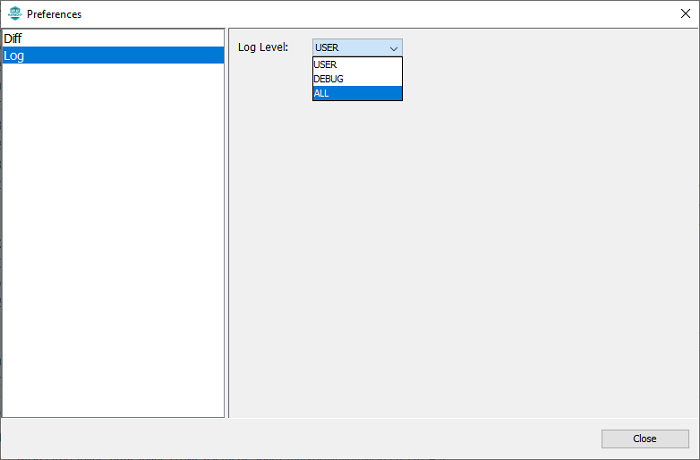
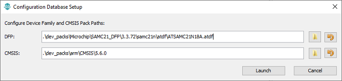
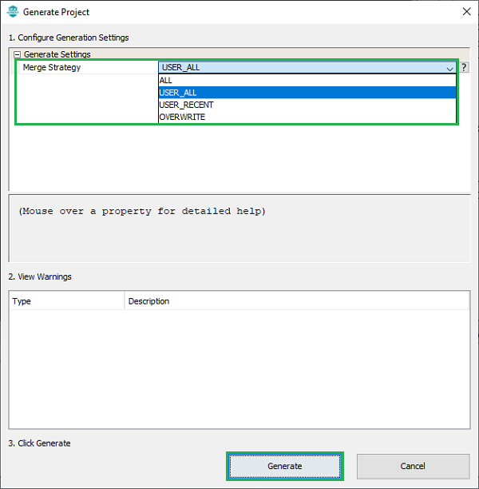

&nbsp;&nbsp;&nbsp;&nbsp;&nbsp;&nbsp;&nbsp;&nbsp;&nbsp;&nbsp;&nbsp;&nbsp;&nbsp;&nbsp;&nbsp;&nbsp;&nbsp;&nbsp;&nbsp;&nbsp;&nbsp;&nbsp;&nbsp;&nbsp;&nbsp;&nbsp;&nbsp;&nbsp; &nbsp;&nbsp;&nbsp;&nbsp;&nbsp;&nbsp;&nbsp;&nbsp;&nbsp;&nbsp;&nbsp;&nbsp;&nbsp;&nbsp;&nbsp;&nbsp;&nbsp;&nbsp;&nbsp;&nbsp;&nbsp;&nbsp;&nbsp;&nbsp;&nbsp;&nbsp;&nbsp;&nbsp;&nbsp;&nbsp;&nbsp;&nbsp;&nbsp;&nbsp;&nbsp;&nbsp;&nbsp;&nbsp;&nbsp;&nbsp;&nbsp;&nbsp;&nbsp;&nbsp;&nbsp;&nbsp;&nbsp;&nbsp;&nbsp;&nbsp;&nbsp;&nbsp;&nbsp;&nbsp;&nbsp;&nbsp;&nbsp;&nbsp;&nbsp;&nbsp;&nbsp;&nbsp;&nbsp;&nbsp;&nbsp;&nbsp;&nbsp;&nbsp;&nbsp;&nbsp;&nbsp;&nbsp; 

### Note:
 **MPLAB Harmony v3 is now configurable through MPLAB Code Configurator (MCC). Though the instructions in this guide are for the MPLAB Harmony Configurator (MHC), the flow and experience of creating a project, configuring peripherals, and generating code using MCC is similar. Refer to the below links for specific instructions to use MPLAB Harmony v3 with MCC.**
- [Create a new MPLAB Harmony v3 project using MCC](https://microchipdeveloper.com/harmony3:getting-started-training-module-using-mcc)
- [Update and Configure an Existing MHC-based MPLAB Harmony v3 Project to MCC-based Project](https://microchipdeveloper.com/harmony3:update-and-configure-existing-mhc-proj-to-mcc-proj)
- [Getting Started with MPLAB Harmony v3 Using MPLAB Code Configurator](https://www.youtube.com/watch?v=KdhltTWaDp0)

# Creating an IAR or KEIL project using MHC
When creating projects for IAR or KEIL IDEs, MHC is launched as an application (as opposed to a plugin in MPLAB® X, when creating MPLAB® X projects). We refer to this mode of operation of MHC as "standalone" mode throughout this document.  Follow the steps detailed below to create an project for IAR or KEIL using MHC

## Launching MHC in standalone mode
Navigate to the local clone of this repository and run the script that is appropriate for your operating system. That is

* For Windows, run the script **`runmhc.bat`**
* For Linux/MacOS, run the script **`runmhc.sh`**

This will launch the MHC as an application (see below):

## Setting user preferences
User preferences can be set by navigating to File -> Preferences. MHC allows user to configure two preferences

* **Diff** - Allows user to configure a diff tool. This is an important configuration, and is explained further down in project generation section. We can configure any third party diff tool. To set diff tool,  navigate to its installation directory using the browse button and select the executable. {0} and {1} are place holders for the files that need to diffed during project file generation. In this example, we are using WinMerge as the diff tool.

    - 

* **Log** - Allows user to set the log level. There are three levels of logging available (ALL, DEBUG, USER). MHC displays the logs in the console window (seen at the bottom of the main window). It also saves them in the mhc.log file under .mh3 folder in user's home directory. This log level decides the kind of messages that will get logged.

    - 

## Creating a new configuration
To create a new mhc configuration, choose File -> New configuration. A new configuration creation dialog will popup, where we can enter the details of the configuration that we are about to create.

* **Framework Path** - This is not configurable. Framework path defaults to the parent folder of the MHC repository. This folder is should contain relevant harmony 3 repositories required for project creation. Recommend using content manager for downloading and setting up  Harmony 3 repositories. Make sure that the "Convert to relative path for configuration" check box is unchecked.

* **Project information** - Under project information, user can choose the location of the project, name of the project and the name of the configuration.
  * *Location* - Location where the project and configuration will be created
  * *Project name*  -Used by MHC when creating projects for target IDEs. If you want a KEIL or IAR project with specific name, it should be entered in this field
  * *Configuration name* - Used by MHC when creating configuration data
  * *Path* - Shows the location where the new configuration will be created. Paths used by MHC for creating the project and configuration follows these rules
    * configuration information will be created under  `<location>/firmware/source/config/<configuration_name>` folder. In this example it will be "D:/Projects/My_Harmony_3/firmware/src/config/default" folder
    * IDE projects will be created under `<location>/firmware/<configuration_name>.<IDE name>` folder. In this example, if we choose to create an IAR project, it will be created under "D:/Projects/My_Harmony_3/firmware/default.IAR" folder

* **Configuration Options** - Allows us to choose the target device of this confifuration. Device Family drop down limits the options to a specific family when choosing the target device, while Device Filter allows searching for a device by entering few characters.  In this instance, ATSAMC21N18A MCU is chosen for creating the configuration.

Clicking finish button will popup a confirmation dialog. We can change the default Device Family Pack (DFP) and CMSIS Pack used for creating the configuration from this dialog. Click on the launch button to create a new configuration.

## Making changes to the configuration
Refer to documentation on how to use the project graph for configuring Harmony 3 components using mplabx Harmony 3 configurator.

## Generating code and project associated with a configuration

* Select the target toolchain by clicking the system component in the project graph and choosing System -> Project Configuration -> Toolchain selections -> Compilers in the configuration option window. Available options are XC32, IAR and KEIL. Some of these options might not be available for all targets. Choosing IAR or KEIL as the target compiler, will result in MHC creating IAR embedded workbench or Keil uVision IDE projects for the selected target. In this case, we have chosen KEIL as the toolchain.

* Select Generate - > Generate code option in menu bar to start project generation. In the generation window, we can choose the merge strategies.

* 

* Based on the choosen merge startegy, when MHC identifies that there is a diff in the files it generated (for eg: modification within the project IDE), it will launch the configured diff tool. We can bring in the changes that are relevant and ignore the rest. Once the diff tool is closed, the project generation sequence is continued until the entire configuration is generated.

* If IAR or KEIL is chosen as the toolchain, MHC will also create a folder containing the relevant project files which can then be opened using the  corresponding IDE. The path of this folder, follows the rules explained in the "configuration" section. In this example, it would be under `"D:/Projects/My_Harmony_3/firmware/default.KEIL"`, since we choose keil as the the toolchain.

## Note
 *This page has been verified with the following versions of software tools:*

- [MPLAB Harmony v3 "csp" repo v3.10.0](https://github.com/Microchip-MPLAB-Harmony/csp/releases/tag/v3.10.0)
- [MPLAB Harmony v3 "dev_packs" repo v3.10.0](https://github.com/Microchip-MPLAB-Harmony/dev_packs/releases/tag/v3.10.0)
- [MPLAB Harmony v3 "mhc" repo v3.8.2](https://github.com/Microchip-MPLAB-Harmony/mhc/releases/tag/v3.8.2)
- MPLAB Harmony 3 Launcher Plugin v3.6.4
- [MPLAB X IDE v5.50](https://www.microchip.com/mplab/mplab-x-ide)
- [MPLAB XC32 Compiler v3.01](https://www.microchip.com/mplab/compilers)

 Because Microchip regularly update tools, occasionally there could be minor differences with the newer versions of the tools. 

## Reference Links
  &nbsp; &nbsp; &nbsp;   &nbsp; &nbsp; &nbsp;   &nbsp; &nbsp;    
