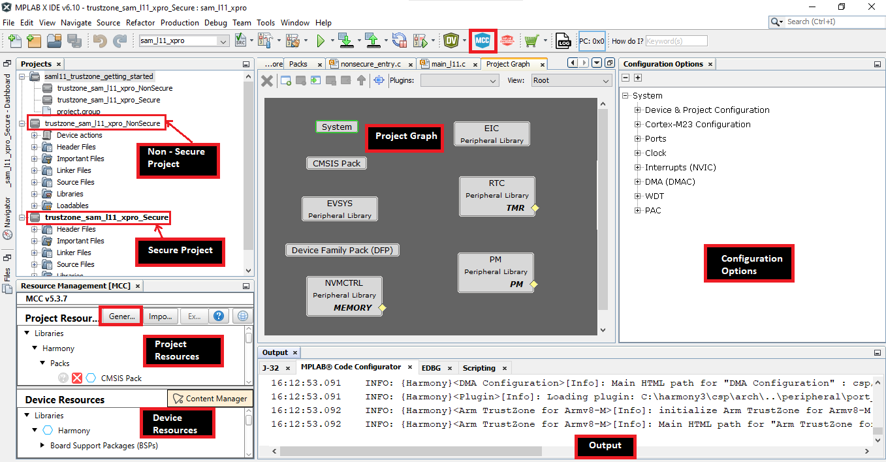
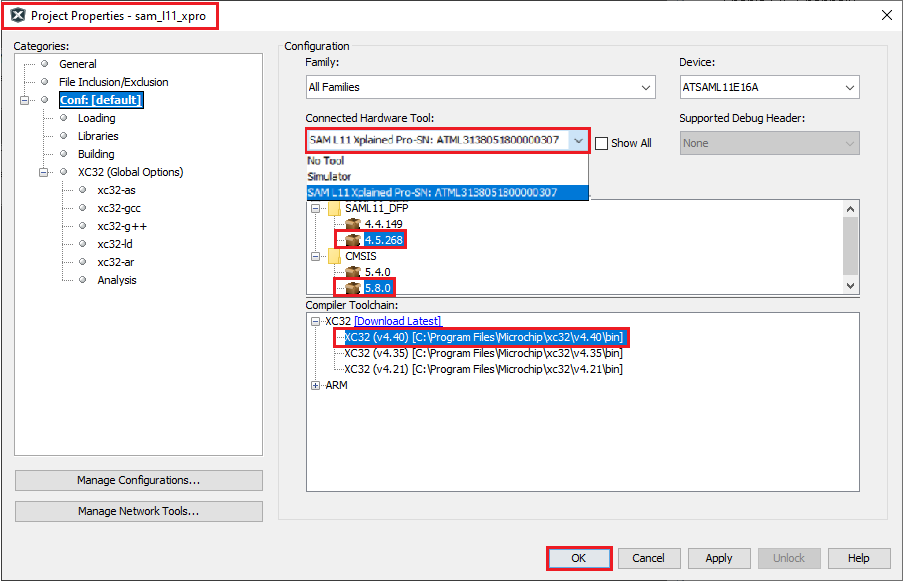

&nbsp;&nbsp;&nbsp;&nbsp;&nbsp;&nbsp;&nbsp;&nbsp;&nbsp;&nbsp;&nbsp;&nbsp;&nbsp;&nbsp;&nbsp;&nbsp;&nbsp;&nbsp;&nbsp;&nbsp;&nbsp;&nbsp;&nbsp;&nbsp;&nbsp;&nbsp;&nbsp;&nbsp; &nbsp;&nbsp;&nbsp;&nbsp;&nbsp;&nbsp;&nbsp;&nbsp;&nbsp;&nbsp;&nbsp;&nbsp;&nbsp;&nbsp;&nbsp;&nbsp;&nbsp;&nbsp;&nbsp;&nbsp;&nbsp;&nbsp;&nbsp;&nbsp;&nbsp;&nbsp;&nbsp;&nbsp;&nbsp;&nbsp;&nbsp;&nbsp;&nbsp;&nbsp;&nbsp;&nbsp;&nbsp;&nbsp;&nbsp;&nbsp;&nbsp;&nbsp;&nbsp;&nbsp;&nbsp;&nbsp;&nbsp;&nbsp;&nbsp;&nbsp;&nbsp;&nbsp;&nbsp;&nbsp;&nbsp;&nbsp;&nbsp;&nbsp;&nbsp;&nbsp;&nbsp;&nbsp;&nbsp;&nbsp;&nbsp;&nbsp;&nbsp;&nbsp;&nbsp;&nbsp;&nbsp;&nbsp; 

# Creating a New TrustZone Project
To create a new TrustZone project, in MPLAB® X IDE, Select File > New Project or click . The New Project wizard will open. Perform following steps:

1. Choose Project:
    - In the Choose Project pane, select the Microchip Embedded category.
    - In the Projects pane, select 32-bit MPLAB® Harmony 3 Project, then click Next.

    - 

    **Note**: If the 32-Bit MPLAB® Harmony 3 Project type is not listed under the Microchip Embedded category, please download and install MPLAB® Harmony 3 Configurator before continuing with these steps.
2. Framework Selection:
    - Provide the framework path where Harmony 3 repositorries have been downloaded, then click Next.

    - 

3. Project Settings:
    - Location: Indicates the path to the root folder of the new project. All project files will be placed in this folder.
    - Folder: Indicates the name of the MPLAB® X IDE folder.
    - Name: Enter name of the project which you want to see in MPLAB® X IDE, click Next.
    - Path: The path information will be updated automatically as and when users make changes to other fields.

    - 

    **Note**: Click the "Show Visual Help" button to open a contextual help window for a detailed description of various fields in the Project Settings.

4. Configuration Settings:
    - Name: Enter the configuration name.
    - Target Device: Choose target device
    - Click Finish button to launch MPLAB® Harmony Configurator (MHC). After clicking the Finish button, MHC will create Secure and Non-secure MPLAB® X Projects.

    - 

    - **Note**:
        - By default the **TrustZone Enabled** checkbox is selected by MHC for TrustZone devices, user can't disable the TrustZone functionality for that specific device.
        - After clicking the Finish button, if MHC does not launch, user can launch it by selecting **Tools > Embedded > MPLAB® Harmony 3 Configurator** from the MPLAB® X IDE.

    - The MHC plug-in will open either inside MPLAB® X window (native mode) or in a new window (standalone mode). This setting can be done in ***MPLAB® X > Tools > Options > Plugins > MPLAB® 3 Harmony Launcher > Window Manager***.

    - 

    - TrustZone Project uses two projects viz., **Secure** and **Non-Secure** Project that work together on the same MCU and offering security isolation between the Trusted and the Non-trusted resources in the device.
    - **Secure Project:**
        - Secure project contains harmony project file harmony.prj. And this project also contains a configuration file for both Secure and Non-secure project.
        - Secure project must be selected as Main Project to launch MHC.
        - Once the Harmony code is generated, Secure user application should be developed in secure "main.c". And "veneer.c" and "veneer.h" files should be used for the Non-secure to Secure function calls and vice versa.
        - Secure project is a loadable project from the Non-secure project. When Secure Project builds it generates Secure Gateway (SG) library ([configuration name]_Secure_sg_veneer.lib) which will be used by the Non-secure project while building the Non-secure project.
    - **Non-secure Project:**
        - Once the Harmony code is generated, Non-secure user application should be developed in Non-secure "main.c".
        - When Non-secure Project builds, it first builds Secure Project and then Non-secure project and  generates target binaries to be executed on the device.

## Runing TrustZone Project
Following steps need to be done to run TrustZone project:
- In MPLAB® X Non-secure Project properties, appropriate compiler, hardware tools and DFP should be selected as shown in the figure below.

    - 

- Select Non-secure Project as Main Project, Non-secure Project can be then build and programmed using MPLAB® X "Make and Program Device Main Project" option.

## Note
 *This page has been verified with the following versions of software tools:*

- [MPLAB Harmony v3 "csp" repo v3.9.1](https://github.com/Microchip-MPLAB-Harmony/csp/releases/tag/v3.9.1)
- [MPLAB Harmony v3 "dev_packs" repo v3.9.0](https://github.com/Microchip-MPLAB-Harmony/dev_packs/releases/tag/v3.9.0)
- [MPLAB Harmony v3 "mhc" repo v3.7.2](https://github.com/Microchip-MPLAB-Harmony/mhc/releases/tag/v3.7.2)
- MPLAB Harmony 3 Launcher Plugin v3.6.4
- [MPLAB X IDE v5.50](https://www.microchip.com/mplab/mplab-x-ide)
- [MPLAB XC32 Compiler v3.00](https://www.microchip.com/mplab/compilers)
 Because Microchip regularly update tools, occasionally there could be minor differences with the newer versions of the tools. 

## Reference Links
  &nbsp; &nbsp; &nbsp;   &nbsp; &nbsp; &nbsp;   &nbsp; &nbsp;    