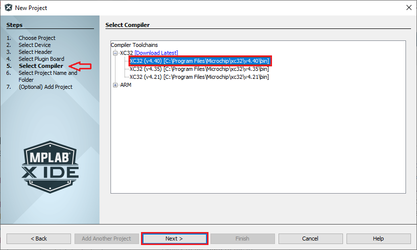

&nbsp;&nbsp;&nbsp;&nbsp;&nbsp;&nbsp;&nbsp;&nbsp;&nbsp;&nbsp;&nbsp;&nbsp;&nbsp;&nbsp;&nbsp;&nbsp;&nbsp;&nbsp;&nbsp;&nbsp;&nbsp;&nbsp;&nbsp;&nbsp;&nbsp;&nbsp;&nbsp;&nbsp; &nbsp;&nbsp;&nbsp;&nbsp;&nbsp;&nbsp;&nbsp;&nbsp;&nbsp;&nbsp;&nbsp;&nbsp;&nbsp;&nbsp;&nbsp;&nbsp;&nbsp;&nbsp;&nbsp;&nbsp;&nbsp;&nbsp;&nbsp;&nbsp;&nbsp;&nbsp;&nbsp;&nbsp;&nbsp;&nbsp;&nbsp;&nbsp;&nbsp;&nbsp;&nbsp;&nbsp;&nbsp;&nbsp;&nbsp;&nbsp;&nbsp;&nbsp;&nbsp;&nbsp;&nbsp;&nbsp;&nbsp;&nbsp;&nbsp;&nbsp;&nbsp;&nbsp;&nbsp;&nbsp;&nbsp;&nbsp;&nbsp;&nbsp;&nbsp;&nbsp;&nbsp;&nbsp;&nbsp;&nbsp;&nbsp;&nbsp;&nbsp;&nbsp;&nbsp;&nbsp;&nbsp;&nbsp; 

# Creating a New TrustZone Project
To create a new TrustZone project, in MPLAB® X IDE, Select File > New Project or click . The New Project wizard will open. Perform following steps:

1. Open the MPLAB® X IDE.
2. Create a New Project by clicking the New Project icon  or by selecting File > New Project.
3. In the New Project window select **Application Project(s)**.
4. Click Next.

    

    **Note**:
    - If the option 32-Bit MPLAB Harmony v3 Project is not available, install the **MPLAB® Harmony 3 Launcher** plug-in from **Tools > Plugins > Available Plugins** before continuing with this demonstration.
    - If the **Harmony Content Path** and **Repository** is not set, then go to **Tools > Options**, select **Pugins** and select the **Harmony Repository** and enter the your **Harmony Content Path** as shown in the below figure to download the Harmony packages.

        

5. In the Select Device dialog window, select the target Device **ATSAML11E16A** from the drop-down menu as shown below and Click Next.

    

6. In the Select Compiler dialog window, select the latest or needed Compiler as follows:

    

    - Click Next.

7. In the Select Project Name and Folder dialog window, fill in or select the information needed as follows:
    - Project Name: Project naame i.e. “**sam_l11_xpro**”
    - Project Location: Select or Enter the Project Location of your choice.
        - For Example: **sam_l11** and the Project Location is:
            - `C:/Users/<user_id>/MPLABXProjects/trustzone/sam_l11/firmware`
        - **Note:**
            - Kindly suffix the **firmware** folder name after the Project folder “**sam_l11**”.
    - Project Folder: This is a read-only field, MCC automatically creates a Secure and Non-Secure project folder as shown below.
        - Secure Project: `C:/Users/<user_id>/MPLABXProjects/trustzone/sam_l11/firmware_secure`
            - Secure project .X folder can be fount at:
                - `C:/Users/<user_id>/MPLABXProjects/trustzone/sam_l11/firmware_secure/sam_l11_xpro.X`
        - Non-Secure Project: `C:/Users/<user_id>/MPLABXProjects/trustzone/sam_l11/firmware`
            - Non-Secure project .X folder can be fount at:
                - `C:/Users/<user_id>/MPLABXProjects/trustzone/sam_l11/firmware/sam_l11_xpro.X`
        - **Note:**
            - The project group is created in the Non-Secure project path i.e.,
            - `C:/Users/<user_id>/MPLABXProjects/trustzone/sam_l11/firmware/sam_l11_xprogroup`

        

8. Click **Finish**.
9. Download the Required Mandatory Harmony Content if not downloaded.
    - The below MCC Content Manager window will open if the Mandatory Harmony Contents are not present in the **Harmony Content Path** mentioned in the **Step 4**.

        

    - Click on the **Finish** Button in the MCC Content Manager Wizard to start downloading the Mandatory **Harmony Content**.
    -  **Note**:
        - For this demonstration application, the following MPLAB Harmony v3 packages are required: **csp**, **harmony-services**, **CMSIS**, and **quick_docs**. The MPLAB Harmony 3 Content Manager tool simplifies the downloading of the MPLAB Harmony v3 packages. If these packages are not downloaded, then the user can use the <a href="https://youtu.be/0rNFSlsVwVw?si=tTK6mX9aV6slOcjA&t=145" target="_blank">MPLAB Harmony 3 Content Manager</a> tool to download them onto their computer.
        - If you need you can select the optional contents like bsp, core, CMSIS-FreeRTOS, etc and click apply, then Content Manager will start downloading these selected packages under the **Harmony Content** path.

            

        - Similarly, update the MCC Core Versions to the latest if not already updated.

            

    - The MCC plug-in will open inside MPLAB® X window

    - 

    - TrustZone Project uses two projects viz., **Secure** and **Non-Secure** Project that work together on the same MCU and offering security isolation between the Trusted and the Non-trusted resources in the device.
    - **Secure Project:**
        - Secure project must be selected as Main Project to launch MCC.
        - Once the Harmony code is generated, Secure user application should be developed in secure "main.c".
        - "nonsecure_entry.c" and "nonsecure_entry.h" files should be used for the Non-secure to Secure function calls.
        - Secure project is a loadable project from the Non-secure project. When Secure Project builds it generates Secure Gateway (SG) library ([configuration name]_Secure_sg_veneer.lib) which will be used by the Non-secure project while building the Non-secure project.
    - **Non-secure Project:**
        - Once the Harmony code is generated, Non-secure user application should be developed in Non-secure "main.c".
        - When Non-secure Project builds, it first builds Secure Project and then Non-secure project and  generates target binaries to be executed on the device.

## Running TrustZone Project
Following steps need to be done to run TrustZone project:
- In MPLAB® X Non-secure Project properties, appropriate compiler, hardware tools and DFP should be selected as shown in the figure below.

    - 

- Select Non-secure Project as Main Project, Non-secure Project can be then build and programmed using MPLAB® X "Make and Program Device Main Project" option.

## Note
 *This page has been verified with the following versions of software tools:*

- [MPLAB X IDE v6.20](https://www.microchip.com/mplab/mplab-x-ide)
- [MPLAB XC32 Compiler v4.40](https://www.microchip.com/mplab/compilers)
- [MPLAB Code Configurator Plugin v5.5.1](https://www.microchip.com/en-us/tools-resources/configure/mplab-code-configurator)
- [MPLAB Harmony v3 "csp" repo v3.18.5](https://github.com/Microchip-MPLAB-Harmony/csp/releases/tag/v3.18.5)

 Because Microchip regularly update tools, occasionally there could be minor differences with the newer versions of the tools. 

## References
- <a href="https://www.microchip.com/en-us/development-tool/DM320205" target="_blank">SAML11 Xplained Pro Evaluation Kit User Guide and Datasheet</a>
- <a href="https://www.microchip.com/content/dam/mchp/documents/MCU32/ProductDocuments/SupportingCollateral/Creating-the-First-Application-on-PIC32CM-LSx-Microcontrollers-Using-MPLAB-Harmony-v3-with-MPLAB-Code-Configurator-DS90003342.pdf" target="_blank">Creating the First Application on PIC32CM LSx Microcontrollers Using MPLAB Harmony v3 with MPLAB Code Configurator (MCC)</a>
- <a href="https://ww1.microchip.com/downloads/aemDocuments/documents/MCU32/ProductDocuments/SupportingCollateral/Dual-Developer-Application-Development-Use-Case-with-TrustZone-on-SAM-L11-Using-MPLAB-Harmony-DS90003306.pdf" target="_blank"> Dual Developer Application Development Use Case with TrustZone on SAM L11 Using MPLAB Harmony v3</a>
- <a href="https://developerhelp.microchip.com/xwiki/bin/view/software-tools/harmony/saml11-trustzone-getting-started-training-module/" target="_blank">Arm® TrustZone® Getting Started Application on SAM L11 MCUs</a>
- <a href="https://youtu.be/0rNFSlsVwVw?si=njPYitpENsH-qBBx" target="_blank">How to Set up the Tools Required to Get Started with MPLAB® Harmony v3 and MCC</a>
- <a href="https://youtu.be/0rNFSlsVwVw?si=tTK6mX9aV6slOcjA&t=145" target="_blank">MPLAB Harmony 3 Content Manager</a>

## Reference Links
  &nbsp; &nbsp; &nbsp;   &nbsp; &nbsp; &nbsp;   &nbsp; &nbsp;   
