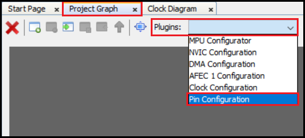
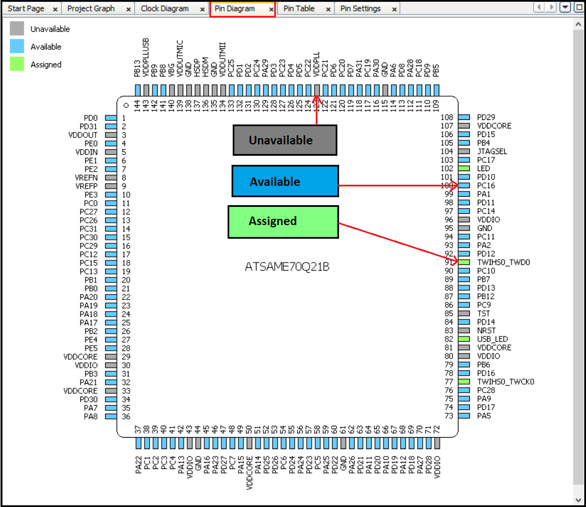
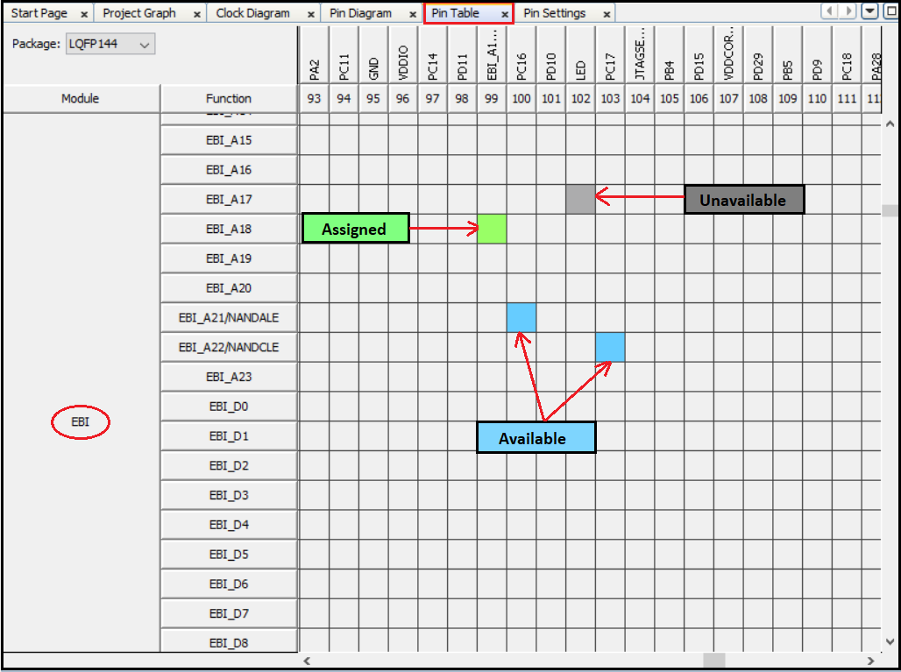
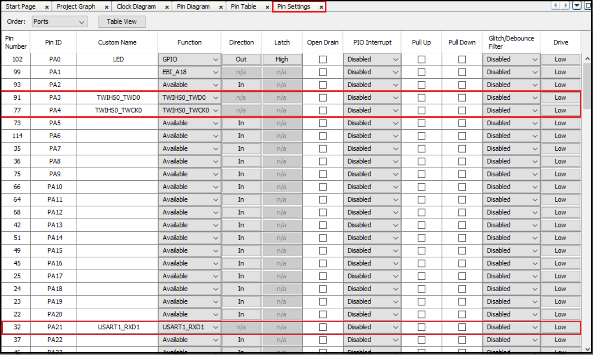

&nbsp;&nbsp;&nbsp;&nbsp;&nbsp;&nbsp;&nbsp;&nbsp;&nbsp;&nbsp;&nbsp;&nbsp;&nbsp;&nbsp;&nbsp;&nbsp;&nbsp;&nbsp;&nbsp;&nbsp;&nbsp;&nbsp;&nbsp;&nbsp;&nbsp;&nbsp;&nbsp;&nbsp; &nbsp;&nbsp;&nbsp;&nbsp;&nbsp;&nbsp;&nbsp;&nbsp;&nbsp;&nbsp;&nbsp;&nbsp;&nbsp;&nbsp;&nbsp;&nbsp;&nbsp;&nbsp;&nbsp;&nbsp;&nbsp;&nbsp;&nbsp;&nbsp;&nbsp;&nbsp;&nbsp;&nbsp;&nbsp;&nbsp;&nbsp;&nbsp;&nbsp;&nbsp;&nbsp;&nbsp;&nbsp;&nbsp;&nbsp;&nbsp;&nbsp;&nbsp;&nbsp;&nbsp;&nbsp;&nbsp;&nbsp;&nbsp;&nbsp;&nbsp;&nbsp;&nbsp;&nbsp;&nbsp;&nbsp;&nbsp;&nbsp;&nbsp;&nbsp;&nbsp;&nbsp;&nbsp;&nbsp;&nbsp;&nbsp;&nbsp;&nbsp;&nbsp;&nbsp;&nbsp;&nbsp;&nbsp; 

# MCC Pin Configuration
MCC plug-in consists of following plug-ins/managers based on the device selection while creating the project.

- **Clock Configuration**: Enables to configure Master, Generic, Peripheral and System Clocks
- **Pin Configuration**: Enables to configure pins in the Pin Configuration area depending upon the application requirements
- **NVIC Configuration**: Enables to configure enable/disable of interrupts, interrupt priority and name
- **DMA Configuration**: Enables to configure DMA Channels
- **MPU Configuration**: Enables to configure different zones of Memory Protection Unit

To open **Pin Configuration** MCC plug-in, perform the action, Project Graph → Plugins then click **Pin Configuration** .

- 

**Note**: MCC plugins availability will vary depending on the device selection while creating the project.

## Pin Configuration
The Pin Manager consists of Pin Settings, the Pin Diagram, and the Pin Table tabs, which enables users to configure (assign peripheral function, set pin direction, configure pull-up or pull-down and so on) and map the I/O pins.
The following color combinations are associated with the pins in the graphical or table View:

- **Gray**: This pin is not usable in the selected configuration, and there is no enabled module which has any functionality on that pin. The grayed-out locks on a white background indicates the pins that are locked out by selected system functions.
- **Blue**: This pin is available and can be allocated to a module.
- **Green** (with a lock): This pin is allocated and selected for a module. The name displayed against the pin is either the name of the pin in the module’s context or a custom name entered.

### Pin Diagram
It is the pictorial representation of the available, assigned and not available pins of the Microcontroller. See image below.

- 

### Pin Table
The pin table provides the Pin Manager Grid View. Using Pin Table users can perform these actions:

- The device package can be selected from the drop-down list.
- The package can be selected from the upper left side of the Pin Manager Table View.
The Package drop-down list shows the LQFP144 package is selected and the selected package details are displayed in the Package View. The pin numbers in the Table View provides the pin numbers for the selected package. The three leftmost columns in the Table View indicate the module’s name, functionality name, and the direction.

- 

### Pin Settings
Pin settings enables the user to configure the pins. Users can provide custom name for pin, change the pin function, direction, latch and other properties, see image below.

- 

**Note**: In the screenshots above, the MCC pin configuration for SAME70 MCU is shown as an example. The MCC pin configuration for other PIC or SAM MCUs may differ from the one shown above.

## Note
 *This page has been verified with the following versions of software tools:*
- [MPLAB X IDE v6.15](https://www.microchip.com/mplab/mplab-x-ide)
- [MPLAB XC32 Compiler v4.30](https://www.microchip.com/mplab/compilers)
- [MPLAB Code Configurator v5.3.7](https://www.microchip.com/en-us/tools-resources/configure/mplab-code-configurator) 
- MCC Harmony v1.3.2
- [MPLAB Harmony v3 "csp" repo v3.18.0](https://github.com/Microchip-MPLAB-Harmony/csp/releases/tag/v3.18.0)
- [MPLAB Harmony v3 "dev_packs" repo v3.18.0](https://github.com/Microchip-MPLAB-Harmony/dev_packs/releases/tag/v3.18.0)

 Because Microchip regularly update tools, occasionally there could be minor differences with the newer versions of the tools. 

## Reference Links
  &nbsp; &nbsp; &nbsp;   &nbsp; &nbsp; &nbsp;   &nbsp; &nbsp;  
