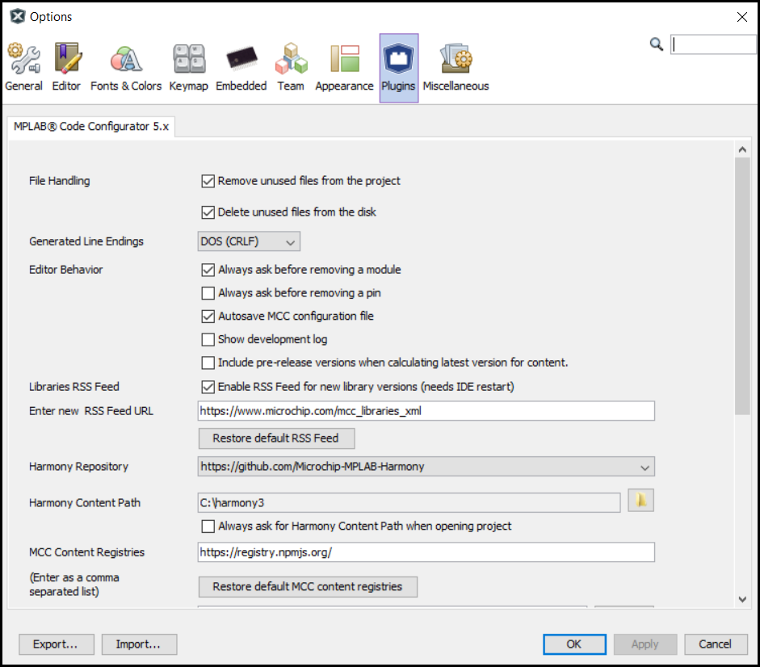
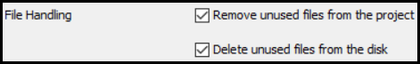
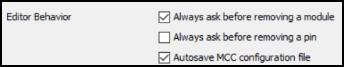
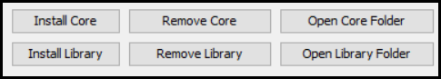

&nbsp;&nbsp;&nbsp;&nbsp;&nbsp;&nbsp;&nbsp;&nbsp;&nbsp;&nbsp;&nbsp;&nbsp;&nbsp;&nbsp;&nbsp;&nbsp;&nbsp;&nbsp;&nbsp;&nbsp;&nbsp;&nbsp;&nbsp;&nbsp;&nbsp;&nbsp;&nbsp;&nbsp; &nbsp;&nbsp;&nbsp;&nbsp;&nbsp;&nbsp;&nbsp;&nbsp;&nbsp;&nbsp;&nbsp;&nbsp;&nbsp;&nbsp;&nbsp;&nbsp;&nbsp;&nbsp;&nbsp;&nbsp;&nbsp;&nbsp;&nbsp;&nbsp;&nbsp;&nbsp;&nbsp;&nbsp;&nbsp;&nbsp;&nbsp;&nbsp;&nbsp;&nbsp;&nbsp;&nbsp;&nbsp;&nbsp;&nbsp;&nbsp;&nbsp;&nbsp;&nbsp;&nbsp;&nbsp;&nbsp;&nbsp;&nbsp;&nbsp;&nbsp;&nbsp;&nbsp;&nbsp;&nbsp;&nbsp;&nbsp;&nbsp;&nbsp;&nbsp;&nbsp;&nbsp;&nbsp;&nbsp;&nbsp;&nbsp;&nbsp;&nbsp;&nbsp;&nbsp;&nbsp;&nbsp;&nbsp; 

# MPLAB® Code Configurator Options
Several aspects of the operation of the MPLAB® Code Configurator (MCC) can be managed by using the **Options** panel which can be invoked by clicking **Tools>Options>Plugins**.

## File Handling
There are two options for file handling:

**Remove unused files from the project**:  Enabling this option tells the MCC to remove .c and .h files for modules which were removed from the MCC configuration between the subsequent generation procedures. This option ensures that the files which are included in the project (and thus in the compilation) are only those which are strictly necessary. However, this will not delete the files from the disk.

**Delete unused files from the disk**:  This option gets enabled only when selecting 'Remove unused files from the project'. This performs the additional task of deleting unused files from the disk and therefore, files cannot be recovered anymore.
## MCC Line Endings
Specify the type of line endings to use in the files generated by MCC.

The default is DOS (CRLF).

Unix line endings (LF) may be specified.

## Editor Behaviour
There are three options for the IDE operations.

**Always ask before removing a module**: Enabling this control enables the **Are you sure?** dialog box which appears while disabling or removing an enabled module.

**Always ask before removing a pin**: Enabling this control enables the **Are you sure?** dialog box which appears while deallocating or removing a pin from a
peripheral.

**Autosave MCC Configuration file**: By default, the Autosave MPLAB® Code Configuration (MCC) configuration file option is enabled. That means MCC automatically saves your MCC configurations.

## MCC Libraries
Libraries can be added or removed through this setup.

1. Use the Install Library/Core button to add an MCC modular Library or Core to the MCC plugin.
2. Use the Open Library Core Folder button to view the MCC modular Libraries/Core folder.
3. Use the Remove Library/Core button to remove an MCC Library or Core to the MCC plugin.

## Note
 *This page has been verified with the following versions of software tools:*
- [MPLAB Harmony v3 "csp" repo v3.18.0](https://github.com/Microchip-MPLAB-Harmony/csp/releases/tag/v3.18.0)
- [MPLAB Harmony v3 "dev_packs" repo v3.18.0](https://github.com/Microchip-MPLAB-Harmony/dev_packs/releases/tag/v3.18.0)
- MPLAB Harmony 3 Launcher Plugin v3.6.4
- [MPLAB X IDE v6.10](https://www.microchip.com/mplab/mplab-x-ide)
- [MPLAB XC32 Compiler v4.30](https://www.microchip.com/mplab/compilers)

 Because Microchip regularly update tools, occasionally there could be minor differences with the newer versions of the tools. 

## Reference Links
  &nbsp; &nbsp; &nbsp;   &nbsp; &nbsp; &nbsp;   &nbsp; &nbsp;  
