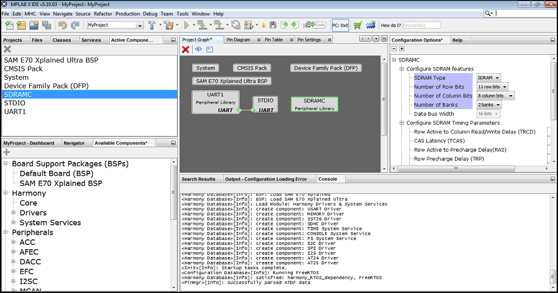
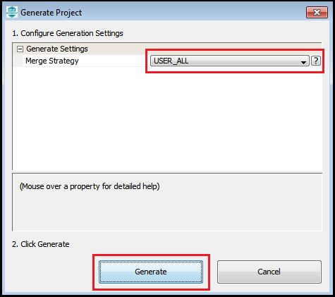
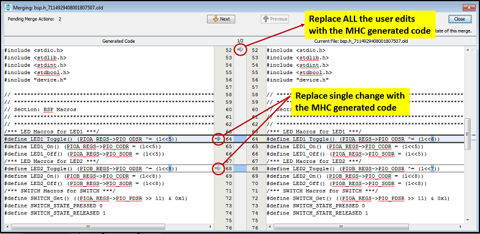
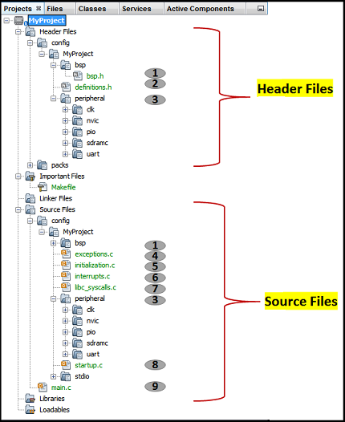

&nbsp;&nbsp;&nbsp;&nbsp;&nbsp;&nbsp;&nbsp;&nbsp;&nbsp;&nbsp;&nbsp;&nbsp;&nbsp;&nbsp;&nbsp;&nbsp;&nbsp;&nbsp;&nbsp;&nbsp;&nbsp;&nbsp;&nbsp;&nbsp;&nbsp;&nbsp;&nbsp;&nbsp; &nbsp;&nbsp;&nbsp;&nbsp;&nbsp;&nbsp;&nbsp;&nbsp;&nbsp;&nbsp;&nbsp;&nbsp;&nbsp;&nbsp;&nbsp;&nbsp;&nbsp;&nbsp;&nbsp;&nbsp;&nbsp;&nbsp;&nbsp;&nbsp;&nbsp;&nbsp;&nbsp;&nbsp;&nbsp;&nbsp;&nbsp;&nbsp;&nbsp;&nbsp;&nbsp;&nbsp;&nbsp;&nbsp;&nbsp;&nbsp;&nbsp;&nbsp;&nbsp;&nbsp;&nbsp;&nbsp;&nbsp;&nbsp;&nbsp;&nbsp;&nbsp;&nbsp;&nbsp;&nbsp;&nbsp;&nbsp;&nbsp;&nbsp;&nbsp;&nbsp;&nbsp;&nbsp;&nbsp;&nbsp;&nbsp;&nbsp;&nbsp;&nbsp;&nbsp;&nbsp;&nbsp;&nbsp; 

### Note:
 **MPLAB Harmony v3 is now configurable through MPLAB Code Configurator (MCC). Though the instructions in this guide are for the MPLAB Harmony Configurator (MHC), the flow and experience of creating a project, configuring peripherals, and generating code using MCC is similar. Refer to the below links for specific instructions to use MPLAB Harmony v3 with MCC.**
- [Create a new MPLAB Harmony v3 project using MCC](https://microchipdeveloper.com/harmony3:getting-started-training-module-using-mcc)
- [Update and Configure an Existing MHC-based MPLAB Harmony v3 Project to MCC-based Project](https://microchipdeveloper.com/harmony3:update-and-configure-existing-mhc-proj-to-mcc-proj)
- [Getting Started with MPLAB Harmony v3 Using MPLAB Code Configurator](https://www.youtube.com/watch?v=KdhltTWaDp0)
- [MPLAB® Code Configurator Content Manager for MPLAB Harmony v3 Projects](https://www.youtube.com/watch?v=PRewTzrI3iE)

# MHC Code Generation
The following covers the basic MHC operations and code generation process, which helps users to setup and configure MHC according to their needs.

## Selecting and Configuring Modules
After opening the MHC, the peripheral and library modules can be added to the project by following these steps:
1. In the Available Components Area, select the peripheral or library module which needs to be configured by clicking on the module’s name. See 2. below image.
2. Configure the peripheral as required for the application in the Configuration Options Area.
3. Configure the pins in the Pin Manager depending on the application requirements.

## Code Generation
To perform the following actions, press   MHC Generate button in the Project Resources window.

## Saving and Loading the MHC Configuration
Saving and loading the MHC configuration is integrated into the MPLAB® X IDE Save and Load functions. The MHC configuration is saved whenever the Generate button is pressed. You can also save the MHC configuration by clicking on the MPLAB® X IDE Save tool or selecting Save from the File menu.The MHC configuration file is included in the MPLAB® X IDE project, under the Important Files folder. The configuration file uses the extension .xml. Double-clicking on the MHC configuration file will cause that MHC configuration to be loaded.

## Merge Window
If any of the files generated by the MHC has been edited outside of MHC and saved to the disk, then the Merge [MHC] window will appear in the Configuration Options. The Merge [MHC] window allows you to decide whether to keep the edits, or to replace them with the MHC newly generated code.
When the newly generated MHC content has been accepted, MHC makes the changes to the file. To the MPLAB® X IDE, these changes are the same as if you typed in the new content. The normal MPLAB® X IDE edit undo can be used in the MHC Merge operation.

A list of all the files that need to be merged appear one after another after resolving the merge conflicts. You must resolve merge conflicts to ensure that all the newly generated code is incorporated into the project.
At the top of the Merge [MHC] window, in the center margin, there is an arrow, as shown in the following **[Merge Window Figure](#Merge-Window)**. Clicking on the arrow will replace all your edits in the current file with the MHC updated code that the MHC has just generated. The numbers above the arrow indicate the current difference and the total number of differences.
The individual lines of MHC Updated Code can be selected to replace the edited code. As shown in the following **[Merge Window Figure](#Merge-Window)**, clicking on the arrows in the right margin of the left window will copy the MHC Updated Code to the generated driver file. Once the changes are accepted, the Merge mechanism will remove the highlighted file and highlight the next file on the list. To insure all updates are completed, a warning will be generated if the Merge mechanism is closed before all the changes are accepted.

**Note**: Your edits will never be overwritten by the MHC generated code, except by explicit action in the Merge [MHC] window.

When changes have been made both to a generated file and in the corresponding MHC UI within the Configuration Options, the Merge [MHC] window shown in the following **[Merge Window Figure](#Merge-Window)** will be displayed. The Merge [MHC] window allows you to resolve the conflicts between the newly generated file and the edits you have made to the file.

## 
## Merge Window Figure

## Generated Source and Header Files
The generated code will be included in the active MPLAB® X IDE Project as shown in the below image. The header files are shown on the top and source files are shown on the bottom.

**Note**: In the image below, the icons are used to organize the project virtual organization of files, not an actual one.

The following table provides the Header and Source files generated from the sample project:

|  # |  Source File | Descriptions  |
| ---|---|---|
|  1 |bsp.h |Provides Board Support Package   |
|  2 |definitions.h |Provides all library headers and definitions needed for the application    |
|  3 |Peripheral (libs) |Supports peripherals used by the project   |
|  4 |exceptions.c |Implements all exception handlers   |
|  5 |initialization.c | Initializes all libraries and applications   |
|  6 |interrupts.c | Provides the interrupt vector table  |
|  7 |libc_syscalls.c | Provides the Harmony specific system calls  |
|  8 |startup.c | Startup code for the application  |
|  9 |main.c | Applications Main source file  |

## Note
 *This page has been verified with the following versions of software tools:*
- [MPLAB Harmony v3 "csp" repo v3.10.0](https://github.com/Microchip-MPLAB-Harmony/csp/releases/tag/v3.10.0)
- [MPLAB Harmony v3 "dev_packs" repo v3.10.0](https://github.com/Microchip-MPLAB-Harmony/dev_packs/releases/tag/v3.10.0)
- [MPLAB Harmony v3 "mhc" repo v3.8.2](https://github.com/Microchip-MPLAB-Harmony/mhc/releases/tag/v3.8.2)
- MPLAB Harmony 3 Launcher Plugin v3.6.4
- [MPLAB X IDE v5.50](https://www.microchip.com/mplab/mplab-x-ide)
- [MPLAB XC32 Compiler v3.01](https://www.microchip.com/mplab/compilers)

 Because Microchip regularly update tools, occasionally there could be minor differences with the newer versions of the tools. 

## Reference Links
  &nbsp; &nbsp; &nbsp;   &nbsp; &nbsp; &nbsp;   &nbsp; &nbsp;  
