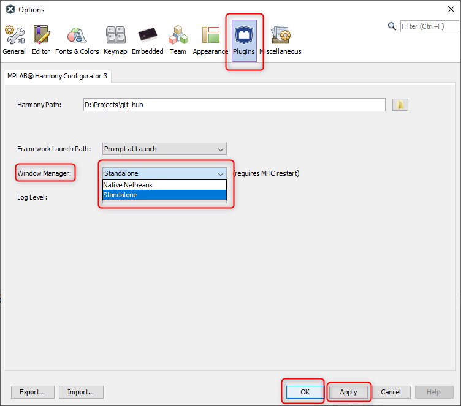

&nbsp;&nbsp;&nbsp;&nbsp;&nbsp;&nbsp;&nbsp;&nbsp;&nbsp;&nbsp;&nbsp;&nbsp;&nbsp;&nbsp;&nbsp;&nbsp;&nbsp;&nbsp;&nbsp;&nbsp;&nbsp;&nbsp;&nbsp;&nbsp;&nbsp;&nbsp;&nbsp;&nbsp; &nbsp;&nbsp;&nbsp;&nbsp;&nbsp;&nbsp;&nbsp;&nbsp;&nbsp;&nbsp;&nbsp;&nbsp;&nbsp;&nbsp;&nbsp;&nbsp;&nbsp;&nbsp;&nbsp;&nbsp;&nbsp;&nbsp;&nbsp;&nbsp;&nbsp;&nbsp;&nbsp;&nbsp;&nbsp;&nbsp;&nbsp;&nbsp;&nbsp;&nbsp;&nbsp;&nbsp;&nbsp;&nbsp;&nbsp;&nbsp;&nbsp;&nbsp;&nbsp;&nbsp;&nbsp;&nbsp;&nbsp;&nbsp;&nbsp;&nbsp;&nbsp;&nbsp;&nbsp;&nbsp;&nbsp;&nbsp;&nbsp;&nbsp;&nbsp;&nbsp;&nbsp;&nbsp;&nbsp;&nbsp;&nbsp;&nbsp;&nbsp;&nbsp;&nbsp;&nbsp;&nbsp;&nbsp; 
# Configuring MHC Plugin to select Window manager and log level

Select MHC Plugin configuration using ***Tools > Options > Plugins > MPLAB® Harmony Configurator 3***

## Window manager selection
The MHC plug-in will open either in a new window (standalone mode) or inside MPLAB® X window (native mode). Select window manager mode

  

## Log Level selection
There are three levels of logging available (ALL, DEBUG, USER). MHC displays the logs in the console window (seen at the bottom of the main window). It also saves them in the mhc.log file under .mh3 folder in user's home directory. This log level decides the kind of messages that will get logged.  Select the log level

  

## Note
 *This page has been verified with the following versions of software tools:*  

 - [MPLAB Harmony v3 "csp" repo v3.7.1](https://github.com/Microchip-MPLAB-Harmony/csp/releases/tag/v3.7.1)
 - [MPLAB Harmony v3 "dev_packs" repo v3.7.0](https://github.com/Microchip-MPLAB-Harmony/dev_packs/releases/tag/v3.7.0)
 - [MPLAB Harmony v3 "mhc" repo v3.4.0](https://github.com/Microchip-MPLAB-Harmony/mhc/releases/tag/v3.4.0)
 - MPLAB Harmony Configurator Plugin v3.5.0
 - [MPLAB X IDE v5.40](https://www.microchip.com/mplab/mplab-x-ide)
 - [MPLAB XC32 Compiler v2.41](https://www.microchip.com/mplab/compilers)

 Because Microchip regularly update tools, occasionally there could be minor differences with the newer versions of the tools.   

## Reference Links
  &nbsp; &nbsp; &nbsp;   &nbsp; &nbsp; &nbsp;   &nbsp; &nbsp;    
