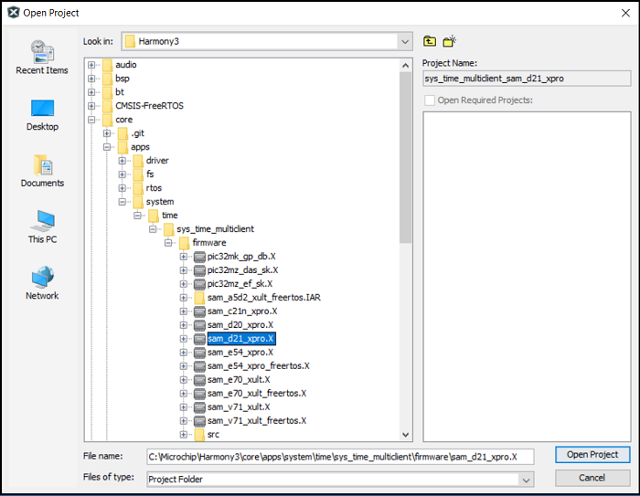
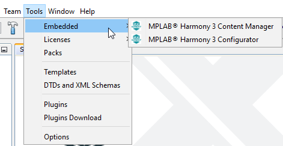
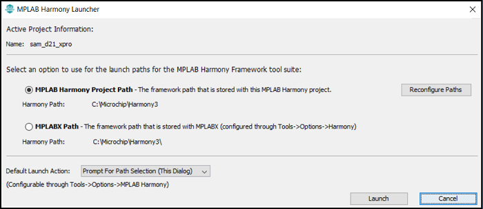
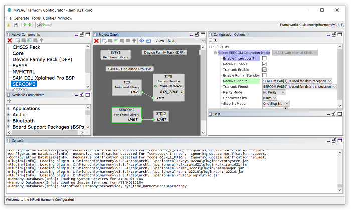

&nbsp;&nbsp;&nbsp;&nbsp;&nbsp;&nbsp;&nbsp;&nbsp;&nbsp;&nbsp;&nbsp;&nbsp;&nbsp;&nbsp;&nbsp;&nbsp;&nbsp;&nbsp;&nbsp;&nbsp;&nbsp;&nbsp;&nbsp;&nbsp;&nbsp;&nbsp;&nbsp;&nbsp; &nbsp;&nbsp;&nbsp;&nbsp;&nbsp;&nbsp;&nbsp;&nbsp;&nbsp;&nbsp;&nbsp;&nbsp;&nbsp;&nbsp;&nbsp;&nbsp;&nbsp;&nbsp;&nbsp;&nbsp;&nbsp;&nbsp;&nbsp;&nbsp;&nbsp;&nbsp;&nbsp;&nbsp;&nbsp;&nbsp;&nbsp;&nbsp;&nbsp;&nbsp;&nbsp;&nbsp;&nbsp;&nbsp;&nbsp;&nbsp;&nbsp;&nbsp;&nbsp;&nbsp;&nbsp;&nbsp;&nbsp;&nbsp;&nbsp;&nbsp;&nbsp;&nbsp;&nbsp;&nbsp;&nbsp;&nbsp;&nbsp;&nbsp;&nbsp;&nbsp;&nbsp;&nbsp;&nbsp;&nbsp;&nbsp;&nbsp;&nbsp;&nbsp;&nbsp;&nbsp;&nbsp;&nbsp;[](../../../readme.md) [](../readme.md)


### Note:
<span style="color:blue"> **MPLAB Harmony v3 is now configurable through MPLAB Code Configurator (MCC). Though the instructions in this guide are for the MPLAB Harmony Configurator (MHC), the flow and experience of creating a project, configuring peripherals, and generating code using MCC is similar. Refer to the below links for specific instructions to use MPLAB Harmony v3 with MCC.**</span>
- [Create a new MPLAB Harmony v3 project using MCC](https://microchipdeveloper.com/harmony3:getting-started-training-module-using-mcc)
- [Update and Configure an Existing MHC-based MPLAB Harmony v3 Project to MCC-based Project](https://microchipdeveloper.com/harmony3:update-and-configure-existing-mhc-proj-to-mcc-proj)
- [Getting Started with MPLAB Harmony v3 Using MPLAB Code Configurator](https://www.youtube.com/watch?v=KdhltTWaDp0)
- [MPLAB® Code Configurator Content Manager for MPLAB Harmony v3 Projects](https://www.youtube.com/watch?v=PRewTzrI3iE)


# Open an Existing Harmony 3 Project
This page shows you how to open one of the many demonstration application projects that are included in the MPLAB® Harmony framework.

Before doing this, you'll need to do the following:

- <a href="https://microchipdeveloper.com/mplabx:installation" target="_blank">Install MPLAB X IDE</a>
- <a href="https://microchipdeveloper.com/xc32:installation" target="_blank">Install MPLAB XC32 Compiler</a>
- <a href="https://microchipdeveloper.com/harmony3:mhc-overview#install" target="_blank">Install the MPLAB Harmony Configurator (MHC)</a>
- <a href="https://github.com/Microchip-MPLAB-Harmony/contentmanager/wiki" target="_blank">Download the MPLAB Harmony Framework</a>

## Steps
1. In the MPLAB X IDE, select **File** > **Open Project**.

    

2. Demonstration applications come with most of the libraries. These can be found in each library's **apps** folder. Browse to the **firmware** folder (as shown below) to find all evaluation boards that support the application. Select your evaluation board and click **Open Project**.

    

3. After the project opens, start MHC. In the MPLAB X IDE, select **Tools  > Embedded > MPLAB® Harmony 3 Configurator**.

    

4. Select the path to the folder containing the MPLAB Harmony framework and click **Launch**.

    

5. The **Configuration Database Setup** window opens. You shouldn't have to change anything in this window. Click Launch.Please be patient while waiting for the last window to open. It will ask if you want to open the default saved state file. This file is used to save all selections made in MHC for the project you are opening. Click **Open**.You can now use the MPLAB Harmony Configurator. Please see the MHC Wiki for instructions on how to use it.

    

**Note:** You can save or load an MHC configuration at any time. The default name of the MHC state file is:
```text
<MPLAB X project configuration name>.xml
```
It can be found in the following folder:
```text
…/<project name>/firmware/src/config/<project configuration name>/.
```

If you are not using MPLAB X Project Configurations, the MHC state file can be found in the following folder:
```text
…/<project name>/firmware/src/config/default/default.xml
```

## Note
<span style="color:blue"> *This page has been verified with the following versions of software tools:*</span>
- [MPLAB Harmony v3 "csp" repo v3.10.0](https://github.com/Microchip-MPLAB-Harmony/csp/releases/tag/v3.10.0)
- [MPLAB Harmony v3 "dev_packs" repo v3.10.0](https://github.com/Microchip-MPLAB-Harmony/dev_packs/releases/tag/v3.10.0)
- [MPLAB Harmony v3 "mhc" repo v3.8.2](https://github.com/Microchip-MPLAB-Harmony/mhc/releases/tag/v3.8.2)
- MPLAB Harmony 3 Launcher Plugin v3.6.4
- [MPLAB X IDE v5.50](https://www.microchip.com/mplab/mplab-x-ide)
- [MPLAB XC32 Compiler v3.01](https://www.microchip.com/mplab/compilers)

<span style="color:blue"> Because Microchip regularly update tools, occasionally there could be minor differences with the newer versions of the tools. </span>
## Reference Links
[<a href="https://www.microchip.com/design-centers/32-bit" target="_blank">  </a>]()  &nbsp; &nbsp; &nbsp; [<a href="https://www.microchip.com/design-centers/32-bit-mpus" target="_blank">  </a>]()  &nbsp; &nbsp; &nbsp; [<a href="https://www.microchip.com/mplab/mplab-x-ide" target="_blank">  </a>]()  &nbsp; &nbsp; [<a href="https://www.microchip.com/mplab/mplab-harmony" target="_blank">  </a>]() [<a href="https://www.microchip.com/mplab/compilers" target="_blank">  </a>]()
