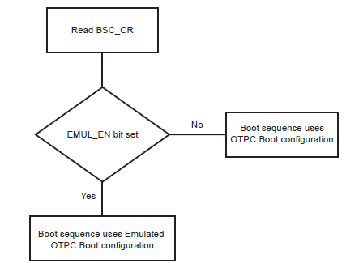

&nbsp;&nbsp;&nbsp;&nbsp;&nbsp;&nbsp;&nbsp;&nbsp;&nbsp;&nbsp;&nbsp;&nbsp;&nbsp;&nbsp;&nbsp;&nbsp;&nbsp;&nbsp;&nbsp;&nbsp;&nbsp;&nbsp;&nbsp;&nbsp;&nbsp;&nbsp;&nbsp;&nbsp; &nbsp;&nbsp;&nbsp;&nbsp;&nbsp;&nbsp;&nbsp;&nbsp;&nbsp;&nbsp;&nbsp;&nbsp;&nbsp;&nbsp;&nbsp;&nbsp;&nbsp;&nbsp;&nbsp;&nbsp;&nbsp;&nbsp;&nbsp;&nbsp;&nbsp;&nbsp;&nbsp;&nbsp;&nbsp;&nbsp;&nbsp;&nbsp;&nbsp;&nbsp;&nbsp;&nbsp;&nbsp;&nbsp;&nbsp;&nbsp;&nbsp;&nbsp;&nbsp;&nbsp;&nbsp;&nbsp;&nbsp;&nbsp;&nbsp;&nbsp;&nbsp;&nbsp;&nbsp;&nbsp;&nbsp;&nbsp;&nbsp;&nbsp;&nbsp;&nbsp;&nbsp;&nbsp;&nbsp;&nbsp;&nbsp;&nbsp;&nbsp;&nbsp;&nbsp;&nbsp;&nbsp;&nbsp; 

### Note:
 **This guide will explain how to configure first stage bootloader for SAM9X60 family of microprocessors.**
- [SAM9X60 boot process click here ](https://www.microchip.com/en-us/education/developer-help/learn-products/mcu-mpu/32bit-mpu/sam9x60-boot-process)
- [SAM9X60 data sheet](https://www.microchip.com/en-us/product/SAM9X60)
- [SAM9X60 curiosity development board ](https://www.microchip.com/en-us/development-tool/EV40E67A)
- [SAM9X60 Evaluation kit ](https://www.microchip.com/en-us/development-tool/dt100126)

# Introduction
This document guides the user on how to configure boot configuration packet for first stage bootloader and how to ensure a valid code in second stage bootloader.

The First stage bootloader (ROM code or Boot ROM or NVM bootloader) is a small piece of mask code, executed on power-on or reset, responsible for loading the second-stage bootloader(Harmony uses the at91Bootstrap as its second stage boot loader)/ User Application from an external NVM into the internal SRAM and execute it.

# First stage bootloader - Boot Sequence

* The boot sequence is an ordered list of embedded memory controllers from which the ROM code tries to boot. User can modify the boot sequence by writing a valid Boot Configuration packet in the OTPC/Emulated OTPC.
* When no Boot Configuration Packet is available, ROM code will try to boot from one of the external NVMs in the following order:
  * **SDMMC0 IOSET0**
  * **SDMMC1 IOSET0**
  * **QSPI0 IOSET0**
  * **SPI0 IOSET0**
  * **NAND0 IOSET0**

If no bootable file/valid boot code is found in these memories, the ROM code goes to the SAM-BA monitor.

# First stage bootloader- Boot flow process

* The ROM code boot flow process is shown below:
 

* The boot flow process is based on the values of the Boot Configuration Packet.

* By default, the value of the Boot Configuration Packet is 0x0.

* On a default boot, the following events occur:
  * **External NVM is initialized in a sequence to locate  valid boot code and copied to internal SRAM.**
  * **DBGU is initialized and configured for serial communication.**
  * **JTAG port is enabled for debugging.**
  * **If no valid code is found in any On-board NVM, SAM-BA Monitor is enabled.**

# Configure First stage bootloader
* User can write the boot configuration packet either to the OTP matrix or emulation SRAM by setting emulation bit in the boot sequence controller configuration register (BSC_CR).

* Boot configuration loading step is explained in the below flowchart:
 

* Using boot configuration packet, user can:
  * **Modify the boot sequence steps by enabling only the user preferred NVMs like QSPI, NAND, SDCARD etc.**
  * **Configure the console serial communications.**
  * **Enable/Disable JTAG port for debugging.**
  * **Enable/Disable SAM-BA Monitor.**
  
* User can write boot sequence controller configuration register(BSC_CR) and the boot configuration packet to OTP/Emulated SRAM using **SAM-BA** tool.

* [Go to this link to download and configure SAM-BA.](https://microchipdeveloper.com/32mpu:sam-ba-install)

* [Refer this document for SAM-BA commands to configure BSC_CR and boot configuration packet](../sam9x60_flash_boot_application_using_samba/readme.md)
* **Note:**
  * Using Emulated OTP enables the user to test several boot configurations options without programming the OTP.

  * It is recommended to set Emulation bit and then write boot configuration packet to Emulated SRAM during development phase.

  * User can simply skip boot configurations if the focus is more on building application, in this case default boot configuration is applicable. 
  
# How first stage bootloader ensures the presence of valid second stage bootloader
* The Boot ROM reads and analyzes the first 28 bytes corresponding to the first seven Arm exception vectors of second Stage bootloader (at91bootstrap) to decide whether the AT91bootstrap can be considered as valid, or it should be skipped. 

* Except for the sixth vector, other exception vector bytes must implement the Arm instructions for either branch or load PC with PC-relative addressing. The ROM code fetches the 6th exception vector value to know exactly how many bytes it should transfer from the external NVM instead of reading the maximum size allowed to the user application, hence speeding up the boot process.

* If the external NVM chosen is SD/eMMC card, then BootROM looks for boot.bin file in the FAT formatted SDCard/e.MMC in addition to the arm-exception vectors check.

* The at91bootstrap code ensures the presence of the valid code by having the proper exception vector. [It can be seen in crt0_gnu.s file in at91bootstrap source code.](https://github.com/linux4sam/at91bootstrap/blob/master/crt0_gnu.S)

 

# **NOTE**

  * **[Click here to learn how to configure/built and debug second stage bootloader(at91bootstrap) for SAM9X60 MPU](../sam9x60_configure_second_stage_bootloader/readme.md)**
  * **[Click here to develop a harmony based application for SAM9X60 MPU using MPLAB® X IDE ](../sam9x60_getting_started_application_using_mcc/readme.md)**
  * **[Click here to flash the at91bootstrap and harmony application binaries using SAM-BA tool](../sam9x60_flash_boot_application_using_samba/readme.md)**
  
## Reference Links
  &nbsp; &nbsp; &nbsp;   &nbsp; &nbsp; &nbsp;   &nbsp; &nbsp;    
