&nbsp;&nbsp;&nbsp;&nbsp;&nbsp;&nbsp;&nbsp;&nbsp;&nbsp;&nbsp;&nbsp;&nbsp;&nbsp;&nbsp;&nbsp;&nbsp;&nbsp;&nbsp;&nbsp;&nbsp;&nbsp;&nbsp;&nbsp;&nbsp;&nbsp;&nbsp;&nbsp;&nbsp; &nbsp;&nbsp;&nbsp;&nbsp;&nbsp;&nbsp;&nbsp;&nbsp;&nbsp;&nbsp;&nbsp;&nbsp;&nbsp;&nbsp;&nbsp;&nbsp;&nbsp;&nbsp;&nbsp;&nbsp;&nbsp;&nbsp;&nbsp;&nbsp;&nbsp;&nbsp;&nbsp;&nbsp;&nbsp;&nbsp;&nbsp;&nbsp;&nbsp;&nbsp;&nbsp;&nbsp;&nbsp;&nbsp;&nbsp;&nbsp;&nbsp;&nbsp;&nbsp;&nbsp;&nbsp;&nbsp;&nbsp;&nbsp;&nbsp;&nbsp;&nbsp;&nbsp;&nbsp;&nbsp;&nbsp;&nbsp;&nbsp;&nbsp;&nbsp;&nbsp;&nbsp;&nbsp;&nbsp;&nbsp;&nbsp;&nbsp;&nbsp;&nbsp;&nbsp;&nbsp;&nbsp;&nbsp; 

### Note:
 **This guide will teach you how to configure the second stage bootloader for SAM9X60 based MPUs.**
- [SAM9X60 boot process click here ](https://www.microchip.com/en-us/education/developer-help/learn-products/mcu-mpu/32bit-mpu/sam9x60-boot-process)
- [SAM9X60 data sheet](https://www.microchip.com/en-us/product/SAM9X60)
- [SAM9X60 curiosity development board ](https://www.microchip.com/en-us/development-tool/EV40E67A)
- [SAM9X60 Evaluation kit ](https://www.microchip.com/en-us/development-tool/dt100126)

## Introduction
This training module describes the following for at91bootstrap, a second-stage bootloader for Microchip Technology Arm®-based Microprocessor Units (MPU), 
  where to get the source code, how to configure, compile and debug using MPLAB® X IDE on windows host.

* The following solution is tested based on **at91bootstrap version 4.0.5**.

* The at91bootstrap bootloader can be stored in external NVMs like (SD Memory Card), Multimedia Card (MMC), Embedded Multimedia Card (eMMC), NAND Flash, Serial Flash, QSPI Flash, Data Flash memory). 
  The first-stage bootloader (ROM Boot Code) will load at91bootstrap from external NVM depending on the value of the Boot Configuration Packet. 

* [Click here to learn how to configure Boot Configuration Packet for SAM9X60.](../sam9x60_configure_first_stage_bootloader/readme.md)

* at91bootstrap if configured to do so, will initialize the following peripherals and memory controllers:
  * **Advanced Interrupt Controller (AIC)**
  * **Peripheral I/O Controller (PIO)**
  * **Power Management Controller (PMC)**
  * **Clock Generator (CKGR)**
  * **Static Memory Controller (HSMC)**
  * **NAND Flash Controller (NFC)**
  * **Multiport DDR-SDRAM Controller (MPDDRC)**
  * **Secure Digital Multimedia Card Controller (SDMMC)**

* at91bootstrap can be configured to load one of the following from external NVM into external volatile memory (DRAM) (main memory) and jump to:
  * **The third-stage bootloader(for example, Das U-Boot or BusyBox).**
  * **The Linux® kernel directly, thus it does not require a third-stage bootloader.**
  * **The Real Time Operating System (RTOS application).**
  * **Turn over control to the debugger (JTAG-Debugging alone).**
  * **The main program (Baremetal application).**

* at91bootstrap is written and maintained by Microchip Technology and hosted on GitHub.

* **NOTE** 
  * If you want to simply debug the application and load it to SD card and test using prebuilt at91bootstrap, [jump to develop harmony application examples section.](../sam9x60_getting_started_application_using_mcc/readme.md)

## Required software and hardware tools

  
 Details

   
This document is written with the assumption that the user is aware of the external NVMS & DDR memory available in the respective SAM9X60 boards (Like Evaluation Kits, Curiosity  Boards, SIP or SOM) by reading the respective user guide.

* To build/debug at91bootstrap using MPLAB® X IDE on windows host, the following tools should be installed properly:
  * [Download and install MPLAB® X IDE.](https://www.microchip.com/en-us/tools-resources/develop/mplab-x-ide)
  * [Download and install XC32 Compiler.](https://www.microchip.com/en-us/tools-resources/develop/mplab-xc-compilers)
* User can use below hardware tools:
  * [SAM9X60 Evaluation kit.](https://www.microchip.com/en-us/development-tool/DT100126) (or) [SAM9X60 Curiosity Development Board.](https://www.microchip.com/en-us/development-tool/EV40E67A)
  * External J32 debugger if SAM9X60 Curiosity Development Board is used.
  

 

## Getting at91bootstrap Source Code

  
 Details

   
  
  1. **Create a Project Directory:** Create a project directory to keep all the sources together for a given project. For the purpose of this tutorial topic, the created project directory is  **Harmony3**. 

  2. **Get at91bootstrap:** Get the complete source code of at91bootstrap by either of the following ways:
      * If you have git installed , clone the repo into the project directory by using the command:
         
		 $ git clone git@https://github.com/linux4sam/at91bootstrap
      * If you don't have git installed, then
        [Download at91bootstrap](https://github.com/linux4sam/at91bootstrap) and unzip into your project directory.
        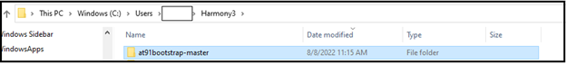

 
 
## Configure, build and debug at91bootstrap

  
 Details

   
at91bootstrap can be configured to load the final application from any of the external NVMs available on the board like QSPI, NAND, SD CARD to DRAM and execute from it.

User should follow the below steps to build the at91bootstrap as per their external NVM preference:
1. Preparing the build Environment.
2. Configure the at91bootstrap.
3. Create a Custom Board Configuration.
4. Building the at91bootstrap.
5. Debugging the at91bootstrap.

### 1. Preparing the build Environment

  
 Details

   
  
  1.1. **Open at91Bootstrap project:** To begin, launch MPLAB® X IDE and then go to File --> Open Project -->choose downloaded at91bootstrap project.
      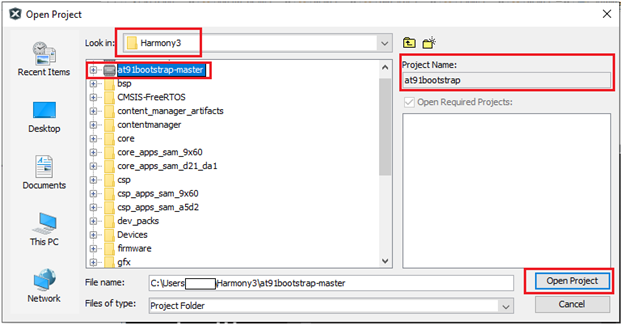

    Now set it as main project.
  

  1.2. **Compiler setting:** User can use XC32 compiler to build at91bootstrap.   
       Go to Project --> Properties --> Makefile ---> Copy the XC32 installation path and update it in the build/debug and clean command --> Apply ---> ok .

   E.g. Build/Debug command: make CROSS_COMPILE="C:/Program Files/Microchip/xc32/v4.10/bin/bin/pic32c-"

       Clean command: make mplabclean CROSS_COMPILE="C:/Program Files/Microchip/xc32/v4.10/bin/bin/pic32c-"

   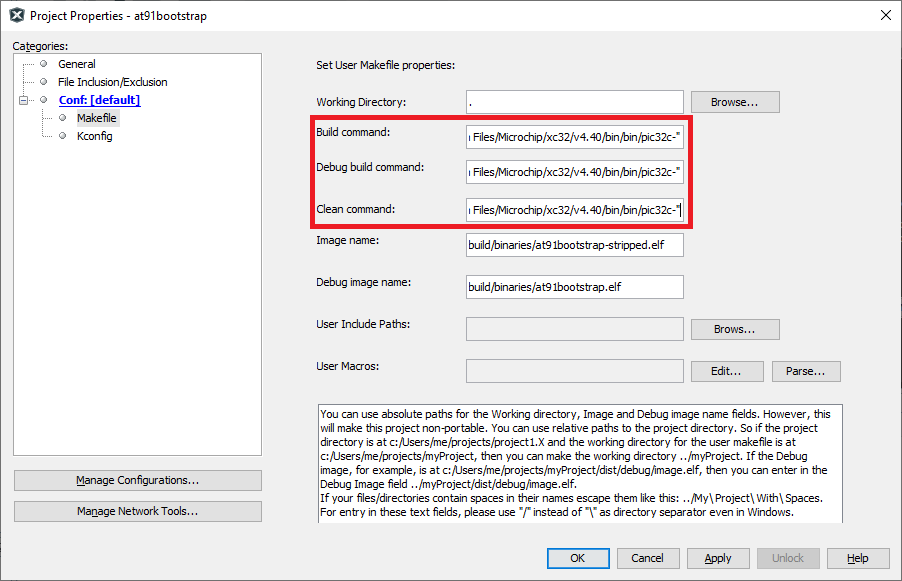
 
 

### 2. Configure the at91bootstrap

  
 Details

   
The at91bootstrap can be configured to load from any one of the user-preferred NVMs by using KCONFIG. 

Depending on your hardware setup (sam9x60<board>) and the preferred NVMs(Either QSPI or NAND or SD-Card) or to debug on MPLAB® X IDE, select one of the below options explained in the following sub-chapters.

**Legendry:** **board** can be evaluation Kit (ek), Curiosity board (_curiosity), or SIP (sip). E.g., sam9x60ek.

   2.1. Configure at91bootstrap for debug use with MPLAB® X IDE.
   
   2.2. Configure at91bootstrap to load application from QSPI.
   
   2.3. Configure at91bootstrap to load application from NAND.
   
   2.4. Configure at91bootstrap to load application from SDCARD.

In addition to the above configuration for the external NVMs, user can also customize the default configuration like external RAM size and type, external clock source etc. which is explained in section 2.5.

#### 2.1 Configure at91bootstrap for debug use with MPLAB® X IDE

  
 Details

    
The at91bootstrap built from sam9x60<board>_bkptnone_defconfig can only be used for debugging the application using MPLAB® X IDE.

**Note:** bkptnone_defconfig configures the at91bootstrap to continuously loops at the end of its execution, hence IDE can take over control (time-out message) and now continue to download the application in the user space. Therefore, this bkptnone_defconfig should be used only to debug the application using MPLAB X IDE.

To do this, go to
Project --> Properties --> Kconfig --> load --> **project directory** --> configs --> sam9x60(board)_bkptnone_defconfig --> Open.

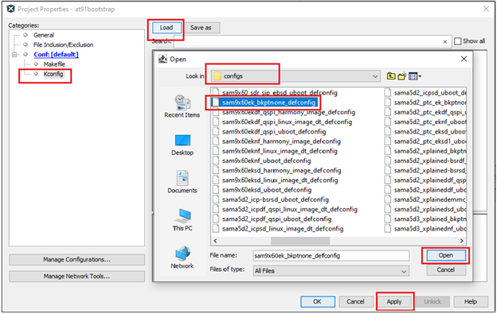

This will do the kconfig for building at91bootstrap for debug use with MPLAB X IDE.

After opening the configuration file, the Kconfig will be as shown below.
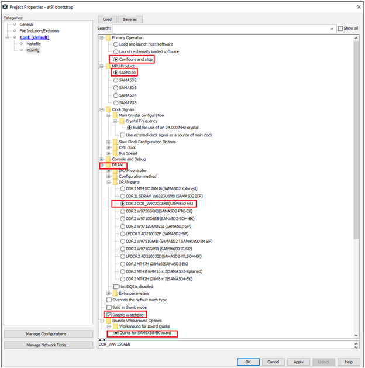

Now Click Apply --> OK.

#### 2.2. Configure at91bootstrap to load application from QSPI

  
 Details

   

at91bootstrap can be configured to load the harmony application from QSPI into external volatile memory (DRAM) as follows.

To do this, go to
Project --> Properties --> Kconfig --> load --> **project directory** --> configs --> sam9x60(board)df_qspi_linux_image_dt_defconfig or sam9x60(board)df_qspi_uboot_defconfig  --> Open.

**Legendry:** df --> Data Flash

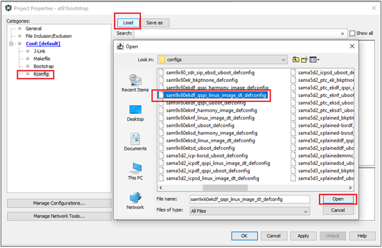

Then perform the following changes:
  * Next software type --> Load 4MB into the start of SDRAM.
  * Demo application image storage setup:
     * Flash offset --> QSPI offset where a user wants to flash the application.
     * Demo app image size --> Size of the app image to be copied from QSPI to DRAM by at91bootstrap.
     * External RAM address to load Demo-App image --> It should match the .text load address in your application linker script.
       External RAM address of SAM9X60 board starts from 0x20000000 – 0x3FFFFFFF. Please refer to the data sheet for more details.

An example configuration for SAM9X60-EK is shown below.

This completes the configuration for building at91bootstrap to load the harmony application from QSPI into external volatile memory (DRAM) and then execute it from DRAM.

#### 2.3. Configure at91bootstrap to load application from NAND

  
 Details

   
at91bootstrap can be configured to load the harmony application from NAND flash into external volatile memory (DRAM) as follows.

**Dependencies:** at91bootstrap needs Python 3.x.y (python3). This is needed for the scripts generating the PMECC headers for NAND Flash memories.

Project --> Properties --> Kconfig --> load --> **project directory** --> configs --> sam9x60(board)nf_linux_image_dt_defconfig or sam9x60(board)nf_uboot_defconfig --> Open.

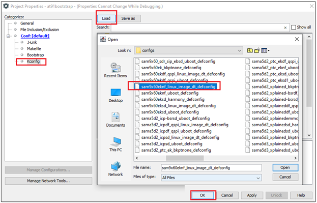

Then perform the following changes:
  * Next software type --> Load 4MB into the start of SDRAM.
  * Demo application image storage setup:
    * Flash offset for Demo App --> NAND flash offset where a user wants to flash the application.
    * Demo app image size --> Size of the app image to be copied from NAND to DRAM by at91bootstrap.
    * External RAM address to load Demo-App image --> It should match the .text load address in your application linker script.

An example configuration for SAM9X60-EK is shown below.
 
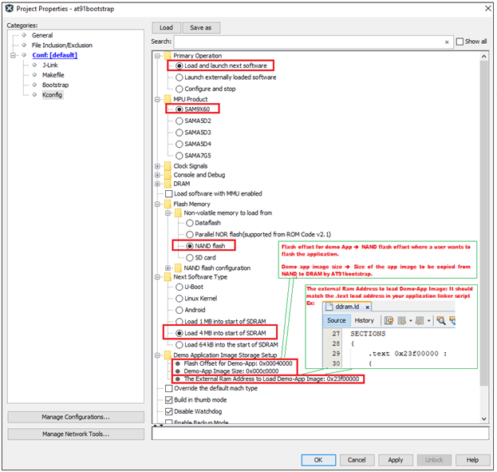

It completes the kconfig for building at91bootstrap to load the harmony application from NAND flash into external volatile memory (DRAM) and then execute it from DRAM.

#### 2.4. Configure at91bootstrap to load application from SDCARD

  
 Details

    

at91bootstrap can be configured to load the harmony application from SD card memory into external volatile memory (DRAM) as follows.
Project --> Properties --> Kconfig --> load --> **project directory** --> configs --> sam9x60(board)sd_linux_image_dt_defconfig or sam9x60(board)sd_uboot_defconfi --> Open.

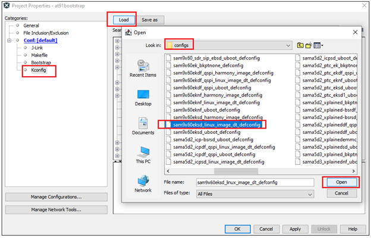
 
Then perform the following changes:
  * Next software type --> Load 4MB into the start of SDRAM.
  * Demo application image storage setup.
    * External RAM address to load Demo-App image --> It should match the .text load address of your application linker script.
    * Next Software Image File name --> Name of your application binary. Eg:harmony.bin.

An example configuration for SAM9X60-EK is shown below.

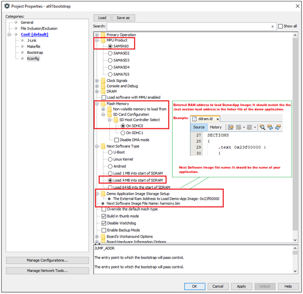

It completes the kconfig for building at91bootstrap to load the harmony application from SD memory card into external volatile memory (DRAM) and then execute it from DRAM.

#### 2.5. Customizing other default configuration

  
 Details

   
User can customize the clock source, Display Banner (Display banner is the output string in the serial console when at91bootstrap begins running), external RAM-type and size, different SD card slot if SDCard is the user preferred NVM on the default configuration.

To do this, go to Project --> Properties --> Kconfig.

An example customization using SAM9X60-EK board is shown below:
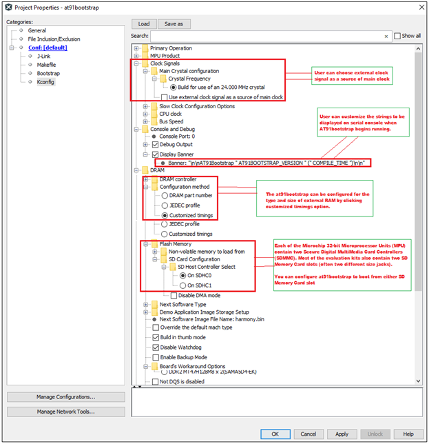

### 3. Create a Custom Board Configuration

  
 Details

   
This section is for advanced developers who wish to create a custom board configuration (almost from scratch) for the at91bootstap bootloader for their custom board. 

* **Dependencies**
  * **Linux Host:** It is recommended to do customization using Linux Host.

  * **GIT:** Install GIT and clone at91bootstrap by using the following command:
  
       $ git clone https://github.com/linux4sam/at91bootstrap.git
  
  * Then follow the steps in [this link](https://microchipdeveloper.com/32mpu:at91bootstrap-board) to do customization and contribution of your customized code to Microchip at91bootstrap.

### 4. Building the at91bootstrap

  
 Details

    
To build the at91bootstrap go to project --> Clean and build or simply click the build icon in the IDE.

 

**Note:** When building using XC32 compiler, if a user doesn’t have XC32 pro compiler, a warning saying cannot optimize size will pop up in the compiler output window as follows. To avoid this either use XC32 pro compiler or just ignore this.

 

Once the build is successful, you will get the build success message in the IDE as shown in the above Image.

Now user will be able to see the boot.bin file in the **project directory**/build/binaries.

boot.bin file is the at91bootstrap file.

 

Now the user can use the boot.bin file to 
  * [Flash it to the respective NVM.](../sam9x60_flash_boot_application_using_samba/readme.md)
                                     (or)
  * [Use the at91bootstrap to debug the harmony application on MPLAB X IDE.](../sam9x60_getting_started_application_using_mcc/readme.md)
                                    (or)
  * Debug the at91bootstrap using MPLAB X IDE as explained in the next section.

### 5. Debugging the at91bootstrap

  
 Details

   
To debug the at91bootstrap, go to project --> Set as main project.
Then click project --> Debug or simply click the debug icon in the IDE.
Now user can start debugging the at91bootstrp by clicking the debug symbols available in the IDE like Step into, Reset, Step over etc.

When debugging the application, serial console outputs can be monitored by connecting windows host with the board (Eg: SAM9X60-EK) through a terminal emulation program.
For example, refer to [this link](https://microchipdeveloper.com/32mpu:sam9x60-ek-console) to download terminal emulation program and follow the steps to establish a serial communication with SAM9X60-EK.
An example image showing the serial console output while debugging at91bootstrap is shown below.

This completes the training module to configure, build & debug at91bootstrap for different user preferred NVMs.

## Note
  * **[Click here to learn how to configure first stage bootloader for SAM9X60 MPU](../sam9x60_configure_first_stage_bootloader/readme.md)**
  * **[Click here to develop a harmony based application for SAM9X60 MPU using MPLAB® X IDE ](../sam9x60_getting_started_application_using_mcc/readme.md)**
  * **[Click here to flash the at91bootstrap and harmony application binaries using SAM-BA tool](../sam9x60_flash_boot_application_using_samba/readme.md)**

## Reference Links
  &nbsp; &nbsp; &nbsp;   &nbsp; &nbsp; &nbsp;   &nbsp; &nbsp;    
