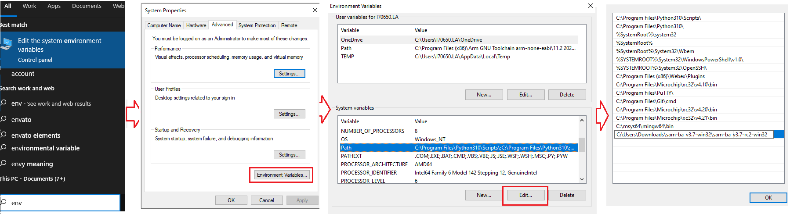

&nbsp;&nbsp;&nbsp;&nbsp;&nbsp;&nbsp;&nbsp;&nbsp;&nbsp;&nbsp;&nbsp;&nbsp;&nbsp;&nbsp;&nbsp;&nbsp;&nbsp;&nbsp;&nbsp;&nbsp;&nbsp;&nbsp;&nbsp;&nbsp;&nbsp;&nbsp;&nbsp;&nbsp; &nbsp;&nbsp;&nbsp;&nbsp;&nbsp;&nbsp;&nbsp;&nbsp;&nbsp;&nbsp;&nbsp;&nbsp;&nbsp;&nbsp;&nbsp;&nbsp;&nbsp;&nbsp;&nbsp;&nbsp;&nbsp;&nbsp;&nbsp;&nbsp;&nbsp;&nbsp;&nbsp;&nbsp;&nbsp;&nbsp;&nbsp;&nbsp;&nbsp;&nbsp;&nbsp;&nbsp;&nbsp;&nbsp;&nbsp;&nbsp;&nbsp;&nbsp;&nbsp;&nbsp;&nbsp;&nbsp;&nbsp;&nbsp;&nbsp;&nbsp;&nbsp;&nbsp;&nbsp;&nbsp;&nbsp;&nbsp;&nbsp;&nbsp;&nbsp;&nbsp;&nbsp;&nbsp;&nbsp;&nbsp;&nbsp;&nbsp;&nbsp;&nbsp;&nbsp;&nbsp;&nbsp;&nbsp; 

### Note:
 **This guide will explain how to use SAM-BA to  Write Boot Configuration Packet & Flash at91bootstrap, RTOS/Baremetal applications to external NVM for SAM9X60.**
- [SAM9X60 boot process click here](https://www.microchip.com/en-us/education/developer-help/learn-products/mcu-mpu/32bit-mpu/sam9x60-boot-process)
- [SAM9X60 data sheet](https://www.microchip.com/en-us/product/SAM9X60)
- [SAM9X60 curiosity development board ](https://www.microchip.com/en-us/development-tool/EV40E67A)
- [SAM9X60 Evaluation kit ](https://www.microchip.com/en-us/development-tool/dt100126)

# Introduction
This document will guide the user on how to, 
  * Write boot sequence controller configuration register(BSC_CR) & boot configuration packet to configure first stage bootloader.
  * Flash boot.bin (at91bootstrap) & harmony.bin (RTOS/Baremetal application) file to external NVMs like QSPI,NAND & SD-Card.

# Prerequisites

  
 Details

    

* Familiar with the features of the SAM9X60_board (board can be evaluation Kit or Curiosity board) and understanding about the jumpers & Connectors in the board.
* Install SAM-BA tool on your windows host PC.
  * To Download the latest version of SAM-BA tool for Windows [click this link](https://www.microchip.com/en-us/development-tool/SAM-BA-In-system-Programmer).
  * Download the ZIP file and unzip it into a working directory of your choice.
  * Add the SAM-BA directory path to the environment variables.
    * To do this from your PC --> Open the Start Search, type in “env”.
    * Choose “Edit the system environment variables” --> Click "Environment Variables" --> "System Variables" --> add SAM-BA directory path to path variables.
      
  * Once the SAM-BA Host program has been installed, the execution of the application is from the Windows command prompt.
  * Now open Windows command prompt and enter the below command to ensure sam-ba is installed properly. 
    ***sam-ba -v*** 
	

* [Refer this link](../sam9x60_configure_second_stage_bootloader/readme.md) to configure and build the at91bootstrap to load the application from the user preferred NVM like QSPI, NAND or SDCard.
  
  **Note:** This resultant at91bootstrap file (boot.bin) built with the preferred NVM configuration only to be used here.
* [Refer this link](../sam9x60_configure_second_stage_bootloader/readme.md) to build harmony application.

 

# Setup SAM-BA Host to Monitor Communications 

  
 Details

    
In this section you will establish SAM-BA Host Application communications with the target’s (SAM9X60) SAM-BA Monitor. Then you will use the SAM-BA Host Applet (qspiflash) to erase and then write the boot.bin (at91bootstrap) and harmony.bin (MPLAB Harmony 3 application) binary images to NOR Flash Memory. 
 

Step 1: To communicate with the SAM-BA Monitor on the target, you must have installed the SAM-BA Host on a Host Computer. 

Step 2: Ensure there is no SD memory card inserted.

Step 3: Power the board by connecting a Micro-B USB cable to USBA port (J7) on the SAM9X60-EK or (J1) on the SAM9X60 Curiosity Development Board.

Step 4: Establish UART serial communication with PC through J24 on SAM9X60 Evaluation Kit or J11 on SAM9X60 Curiosity Development Board.

Step 5: Open Disable boot Jumper(J13) on SAM9X60 Evaluation Kit or Open the J4 NAND boot jumper on SAM9X60 Curiosity Development Board.

Step 6:
  * If you are using SAM9X60 Evaluation Kit follow these steps:
    * 5.1. Push and hold the "DIS_BOOT" button.(This disables booting from the onboard memories - NAND and NOR(QSPI) flash Memory)
	* 5.2. Reset the board by pressing and then releasing the reset "nRST" button.
    * 5.3. Release the "DIS_BOOT" button.

  * If you are using SAM9X60 Curiosity Development Board follow these steps:
    * 5.1. Open the J4 NAND boot jumper.(This disables booting from the NAND flash Memory)
	* 5.2. Reset the board by pressing and then releasing the reset "RESET" button.
    * 5.3. Close the J4 NAND boot jumper.

Now, the SAM9X60_board will boot to the SAM-BA Monitor and start communications with the SAM-BA Host Application. 

***Note:***
  * SAM-BA communication Port can be j-link, serial or secure.

  * If user want to program the SAM9X60 Evaluation Kit, using  j-link instead of serial UART port, then connect J22 with PC via USB cable and replace “serial” in SAM-BA commands with “j-link”.

    * Eg: Replace **sam-ba -p serial -b sam9x60-ek -a lowlevel** with ***sam-ba -p j-link -b sam9x60-ek -a lowlevel***

 

<mark>***The board variant for SAM9X60 Curiosity might not be available yet in SAM-BA, so you can choose the SAM9X60-EK with the -b parameter of SAM-BA.*** </mark>
# 1. Program external QSPI flash memory

  
 Details

   

## 1.1. Erase QSPI flash memory
   Erase the contents of the QSPI Flash memory on the SAM9X60*board* with the following command: 
   
   ***sam-ba -p serial -b sam9x60-ek -a qspiflash -c erase***

   <mark>Example:</mark>

## 1.2. Program boot.bin to QSPI flash memory
   Program the boot.bin file on the SAM9X60_board with the following command: 
   
   ***sam-ba -p serial -b sam9x60-ek -a qspiflash -c writeboot:boot.bin***
   * Note: Change directory to the location of boot.bin

   <mark>Example:</mark>

**Note:** [Refer this link](../sam9x60_configure_second_stage_bootloader/readme.md) to configure and build the at91bootstrap to load the application from QSPI.

The at91bootstrap file (boot.bin) built with QSPI configuration only to be used here.

## 1.3. Program harmony.bin to QSPI flash memory
   To program the application binary, harmony.bin file on the SAM9X60_board, use the following command:
   
   ***sam-ba -p serial -b sam9x60-ek -a qspiflash -c write:harmony.bin:QSPI_OFFSET***
   
   **Note:** 
     * The QSPI_OFFSET should be the same offset used in the KCONFIG, while configuring the at91bootstrap to load from external QSPI  
     * Change directory to the location of harmony.bin.

   <mark>Example:</mark>

## <mark>Note:</mark>
To learn about more SAM-BA applet commands, refer your **SAM-BA installation directory**/doc/applet.html

 

# 2. Program External NAND Flash Memory

  
 Details

    
<mark>Note:By default PMECC configuration for the NAND populated on the SAM9X60 Curiosity Development Board is not aligned with the one of the SAM9X60-EK board.
           The PMECC parameter for the SAM9X60 Curiosity board with MX30LF4G28AD-XKI NAND flash memory is 0xc2605007.
		   User has to do the below two modification to use sam9x60-ek sam-ba applet on curiosity to program NAND flash memory.
		   For information on NAND header values, please refer to SAM9X60 datasheet section "12.4.7.1.1 Method 1 (recommended): NAND Flash Specific Header Detection".</mark>
		   
  * To modify the PMECC parameter in the SAM-BA Applet --> open **sam-ba installation directory**/qml/SAMBA/Device/SAM9X60/SAM9X60EK.qml and modify the NAND Flash header to ***0xc2605007***

   
  * Set the NAND header of the SAM9X60 Curiosity Development boadr using the below command. 
 ***sam-ba -p serial -b sam9x60-ek -a nandflash:::0xc2605007*** 

  

## 2.1. Erase NAND flash memory
   Erase the contents of the NAND Flash memory on the SAM9X60_board with the following command:
   
   ***sam-ba -p serial -b sam9x60-ek -a nandflash -c erase***
   
  <mark>Example:</mark>

## 2.2. Program boot.bin to NAND flash memory
   Program the boot.bin file on the SAM9X60_board_ with the following command:
   
   ***sam-ba -p serial -b sam9x60-ek -a nandflash -c writeboot:boot.bin***
  * Note: Change directory to the location of boot.bin
 <mark>Example:</mark>

**Note:** [Refer this link](../sam9x60_configure_second_stage_bootloader/readme.md) to configure and build the at91bootstrap to load the application from NAND flash memory.

The at91bootstrap file (boot.bin) built with NAND configuration only to be used here.

## 2.3. Program harmony.bin to NAND flash memory
   To program the application binary, harmony.bin file on the SAM9X60_board, use the following command:
   
   ***sam-ba -p serial -b sam9x60-ek -a nandflash -c write:harmony.bin:NAND_OFFSET***

   **Note:**  
      * The NAND_OFFSET should be same as the one used in the KCONFIG, while configuring the at91bootstrap to load from external NAND flash. 
      * Change directory to the location of harmony.bin. 

   <mark>Example:</mark>

## <mark>Note:</mark>
To learn about more SAM-BA applet commands, refer your **SAM-BA installation directory**/doc/applet.html

 

# 3. Program External SD CARD

  
 Details

    
To program the at91bootstrap -boot.bin file and application binary -harmony.bin file on SD-card:

  * (i)  Format the SD card using your PC/Laptop.
  * (ii) Copy and paste boot.bin and harmony.bin into the SD card from your host PC.

**Note:** [Refer this link](../sam9x60_configure_second_stage_bootloader/readme.md) to configure and build the at91bootstrap to load the application from SD Card.

The at91bootstrap file (boot.bin) built with SD card configuration should be used here.

# 4. Program BSC_CR & Boot Configuration Packet

  
 Details

    
After a reset, The ROM code reads the Boot Configuration Packet from the SRAM dedicated to Emulation mode if the bit BSC_CR.EMUL_EN is set to 1 or from the OTP matrix and configure boot sequence, Enable/Disable Monitor, configure the serial console UART.

Using Emulated OTP enables the user to test several boot configuration options, including secure boot mode without programming the OTP.

**Note:** If Emulation mode is enabled, the emulation SRAM is not backed up. After a power off/on, the configuration and content are lost.

## 4.1. Enable/Disable Emulation mode in BSC_CR

To Enable/Disable Emulation mode in Boot Sequence Controller Configuration Register (BSC_CR), the following SAM-BA command should be used:

//To Enable Emulation Mode:

***sam-ba -p serial -d sam9x60 -a bootconfig -c writecfg:bscr: EMULATION_ENABLED***

//To Disable Emulation Mode:

***sam-ba -p serial -d sam9x60 -a bootconfig -c writecfg:bscr: EMULATION_DISABLED***

## 4.2. Steps to write Boot Configuration Packet to emulated SRAM
 1. Emulation enable : sam-ba -p serial -d sam9x60 -a bootconfig -c writecfg:bscr:EMULATION_ENABLED
 2. Reset            : sam-ba -p serial -d sam9x60 -a bootconfig -c resetemul
 3. Refresh config   : sam-ba -p serial -d sam9x60 -a bootconfig -c refreshcfg:emul
 4. Write Config     : sam-ba -p serial -d sam9x60 -a bootconfig -c writecfg:bcp-emul:NFC_IOSET1 // Refer section 4.4. for different configurations
 5. Lock config      : sam-ba -p serial -d sam9x60 -a bootconfig -c lockcfg:bcp-emul

## 4.3. Steps to write Boot Configuration Packet to OTP
 1. Emulation disable: sam-ba -p serial -d sam9x60 -a bootconfig -c writecfg:bscr:EMULATION_DISABLED
 2. Refresh config   : sam-ba -p serial -d sam9x60 -a bootconfig -c refreshcfg:otp
 3. Write Config     : sam-ba -p serial -d sam9x60 -a bootconfig -c writecfg:bcp-otp:NFC_IOSET1 // Refer section 4.4. for different configurations
 4. Lock config      : sam-ba -p serial -d sam9x60 -a bootconfig -c lockcfg:bcp-otp

## 4.4.	Boot Configuration Packet- different configurations available:
The writecfg command programs the Boot Configuration Packet (BCP) into the ***Emulated SRAM***, if the ***emulation mode of the OTPC is enabled***. Else BCP packets are stored inside the ***OTP matrix***.

User can use the below command to get the full list of boot configurations possible:

***sam-ba -p serial -d sam9x60 -a bootconfig -c writecfg:help***

<mark>Example boot configurations:</mark>

// boot config with Serial Console on FLEXCOM0, boot from SDMMC1 (PA10 as card-detect pin) store in OTP matrix

***sam-ba -p serial -d sam9x60 -a bootconfig -c writecfg: bcp-otp:FLEXCOM0_USART_IOSET1,SDMMC1_IOSET1_PA10***

// Empty boot configuration packet in OTP matrix

***sam-ba -p serial -d sam9x60 -a bootconfig -c writecfg: bcp-otp:***

// boot config with SAM-BA Monitor Disabled, boot from SDMMC1 (PA10 as card-detect pin) store in OTP-Emulation mode

***sam-ba -p serial -d sam9x60 -a bootconfig -c writecfg: bcp-emul:MONITOR_DISABLED,SDMMC1_IOSET1_PA10***

// Empty boot configuration packet in OTP-Emulation mode- Emulated SRAM

***sam-ba -p serial -d sam9x60 -a bootconfig -c writecfg: bcp-emul:***

## <mark>Note:</mark>

To learn about more bootconfig SAM-BA applet commands: Refer your **SAM-BA installation directory**/doc/bootconfig-otp.html

**Links**
  * **[Click here to learn how to configure first stage bootloader for SAM9X60 MPU](../sam9x60_configure_first_stage_bootloader/readme.md)**
  * **[Click here to learn how to configure/built and debug second stage bootloader(at91bootstrap) for SAM9X60 MPU](../sam9x60_configure_second_stage_bootloader/readme.md)**
  * **[Click here to develop a harmony based application for SAM9X60 MPU using MPLAB® X IDE ](../sam9x60_getting_started_application_using_mcc/readme.md)**

## Reference Links
  &nbsp; &nbsp; &nbsp;   &nbsp; &nbsp; &nbsp;   &nbsp; &nbsp;    
