&nbsp;&nbsp;&nbsp;&nbsp;&nbsp;&nbsp;&nbsp;&nbsp;&nbsp;&nbsp;&nbsp;&nbsp;&nbsp;&nbsp;&nbsp;&nbsp;&nbsp;&nbsp;&nbsp;&nbsp;&nbsp;&nbsp;&nbsp;&nbsp;&nbsp;&nbsp;&nbsp;&nbsp; &nbsp;&nbsp;&nbsp;&nbsp;&nbsp;&nbsp;&nbsp;&nbsp;&nbsp;&nbsp;&nbsp;&nbsp;&nbsp;&nbsp;&nbsp;&nbsp;&nbsp;&nbsp;&nbsp;&nbsp;&nbsp;&nbsp;&nbsp;&nbsp;&nbsp;&nbsp;&nbsp;&nbsp;&nbsp;&nbsp;&nbsp;&nbsp;&nbsp;&nbsp;&nbsp;&nbsp;&nbsp;&nbsp;&nbsp;&nbsp;&nbsp;&nbsp;&nbsp;&nbsp;&nbsp;&nbsp;&nbsp;&nbsp;&nbsp;&nbsp;&nbsp;&nbsp;&nbsp;&nbsp;&nbsp;&nbsp;&nbsp;&nbsp;&nbsp;&nbsp;&nbsp;&nbsp;&nbsp;&nbsp;&nbsp;&nbsp;&nbsp;&nbsp;&nbsp;&nbsp;&nbsp;&nbsp; 

### Note:
 **This document shows you how to create an MPLAB X IDE Harmony v3 project for a SAM9X60 Curiosity Development Board from scratch using the MPLAB Harmony v3 software framework.**
- [SAM9X60 data sheet](https://www.microchip.com/en-us/product/SAM9X60)
- [SAM9X60 curiosity development board ](https://www.microchip.com/en-us/development-tool/EV40E67A)

## Introduction
This document shows you how to create an MPLAB X IDE Harmony v3 project for a SAM9X60D1G MPU from scratch using the MPLAB Harmony v3 software framework.
This document explains how to write and read from the onboard EEPROM on SAM9X60 Curiosity Development Board and display the data using serial debug interface.
This project demonstrates below: 
  * Print serial console debug messages.
  * Write, Read and Compare the data from the EEPROM .
  * Print TEST PASS if write and read data from EEPROM matches and turn ON the blue LED on the board.

## Hardware Used:

- [SAM9X60 Curiosity development board](https://www.microchip.com/en-us/development-tool/EV40E67A)
- External JTAG
- Micro SD Card

## Software/Tools Used:
- [MPLAB® X IDE](https://microchipdeveloper.com/mplabx:installation)
- [MPLAB® XC32 Compiler](https://microchipdeveloper.com/install:xc32)
- [MPLAB® Code Configurator (MCC)](https://microchipdeveloper.com/install:mcc)

 This project has been verified to work with the following versions of software tools:
  * mcc_version: v5.3.0
  * mcc_core_version: v5.5.0
  * mplabx_version: v6.05
  * harmony_version: v1.2.0
  * compiler: XC32 (v4.21) 

## Hardware Setup : 
- Power up the board by connecting the USB cable to the USB port J1 on the SAM9X60 curiosity development board.
- Connect external debugger to J12.     
- Ensure J14(1-2) and J15(1-2) jumpers on the board are closed towards DBGU to enable UART serial debug.

## Create a new MPLAB Harmony v3 SAM9X60 Curiosity project Using MCC on MPLAB X IDE
### Step 1: Create project and configure the MPU

  
 Details

    

* <mark>1.1.</mark> Select **File --> New Project** from the main IDE menu.
* <mark>1.2.</mark> In the **Categories** pane of the **New Project** dialog, select **Microchip Embedded**. In the **Projects** pane, select **32-bit MCC Harmony Project**, then click **Next**.

 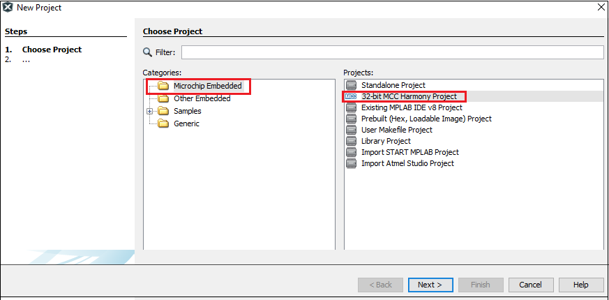

  **Note:** If 32-bit MCC Harmony Project is not displayed, <a href="https://microchipdeveloper.com/harmony3:getting-started-training-module-using-mcc#Install_MCC_anchor" target="_blank">install MCC</a>.

* <mark>1.3.</mark> In the **Framework Path** edit box, browse to the folder where you downloaded the framework. 

  **Note:** For more information on the content manager, see the <a href="https://microchipdeveloper.com/harmony3:new-proj-with-mcc#download" target="_blank">Download MPLAB Harmony Framework</a> section.

 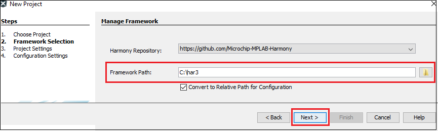

* <mark>1.4.</mark> In the **Project Settings** window, apply the following settings:
  * **Location:** Indicates the path to the root folder of the new project. All project files will be placed inside this folder. The project location can be any valid path, for example: *<Folder of your choice>\dev\sam9x60_getting_started*.
  * **Folder:** Indicates the name of the *MPLABX .X* folder. Enter "sam9x60_cu" to create a *sam9x60_cu.X* folder.

    **Note:** This must be a valid directory name for your operating system.

  * **Name:** Enter the project’s logical name as "getting_started_sam9x60". This is the name that will be shown from within MPLAB X IDE.

    **Note:** The **Path** box is read-only. It will update as you make changes to the other entries.

  * Click **Next** to proceed to Configuration Settings.

 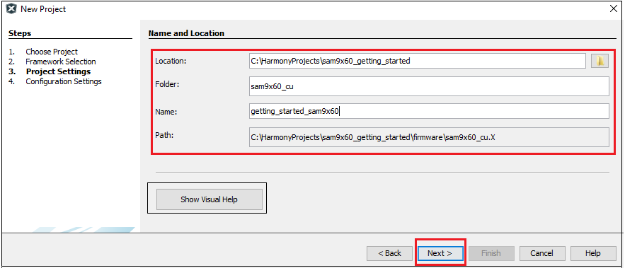

  **Note:** Clicking on the **Show Visual Help** button will open a help window providing a detailed description of the various fields in the **Project Settings** window.

 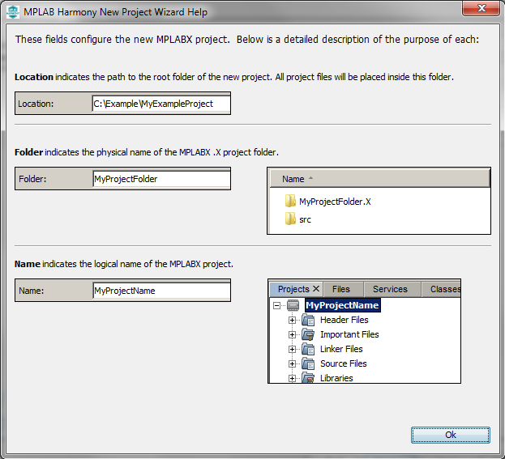

* <mark>1.5.</mark> Follow the steps below to set the project’s Configuration Settings:
  * **Name:** Enter the configuration name as “sam9x60_cu”.
  * **Device Family:** SAM.
  * **Target Device:** Select SAM9X60D1G as the target device.
  * After selecting the target device, click Finish to create and open MPLAB Harmony v3 Project.

    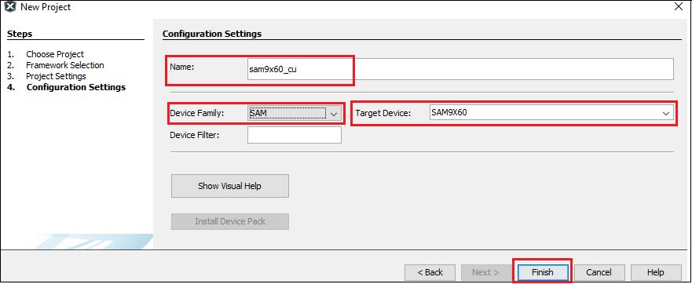
This creates an empty project.

 
### Step 2: Launch MCC and Project graph

  
 Details

   
  
* <mark>2.1.</mark> After the project is created, MCC will be automatically launched.
To launch MCC manually, from main menu --> click on “Tools” --> “Embedded” --> “MPLAB Code Configurator” or click simply MCC logo . It will launch Content manger Wizard.

   Then select MPLAB Harmony.

    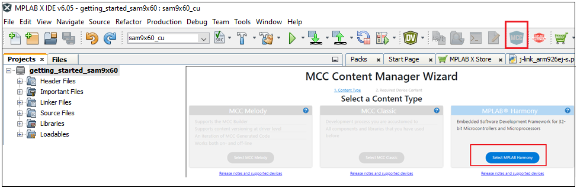

* <mark>2.2.</mark> In addition to the required packages (csp, dev_packs), download the optional packages bsp, core, gfx_apps_sam_9x60, csp_apps_sam_9x60,core_apps_sam_9x60 and then click Finish.
Content download will take some time, please wait till all the contents are downloaded.

    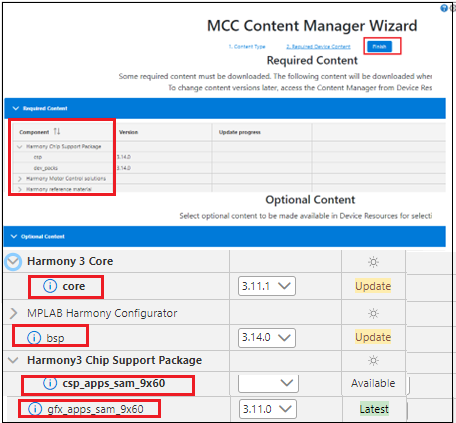

* <mark>2.3.</mark> Save the MCC configuration inside your project directory.

    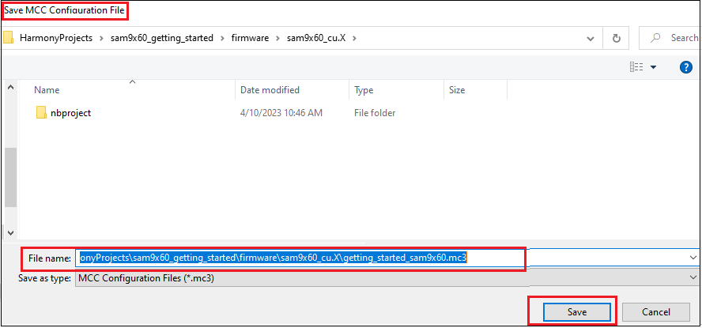
	
* <mark>2.4.</mark> Now, the MCC plugin’s main window for the project will be displayed.
    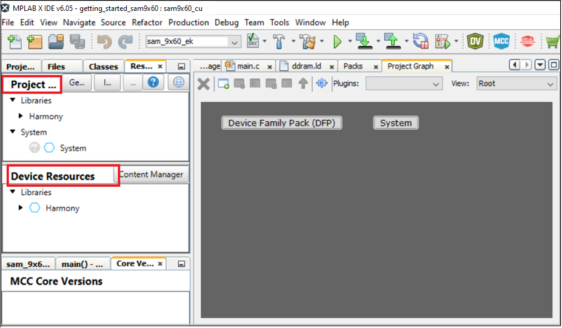
 
 *	Resource Manager has two sections one is Project Resources and another one is Device Resources.
    *	Project Resources area displays all the peripherals currently configured for the project. For example (CMSIS and Device Family Packs (DFP)).
    *	Device Resources area displays available peripherals for the device. Click on the peripheral you want to add to your project. The peripheral moves to the MCC Project Resources area and is ready to be figured to your project's requirements.

* <mark>2.5.</mark> To autosave the MCC configuration, go to Tools --> Option --> Plugins --> Editor
Behavior --> Autosave MCC Configuration File.
    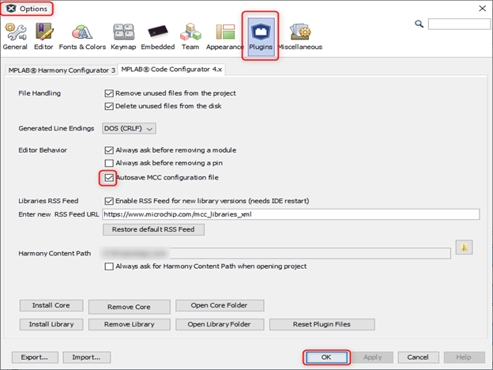

### Step 3: Configure the required peripheral libraries

  
 Details

    

* <mark>3.1.</mark> Observe the Project Graph pane in the top center of the window. The Device Family Pack (DFP) and System libraries have been automatically added to the project.

* <mark>3.2.</mark> Before proceeding to the next step refer SAM9X60 Curiosity user guide, SAM9X60 data sheet and find the pin details for the peripherals/modules used in this project.
   * Refer section <mark>3.3.3</mark> of the user guide and find that PA0 and PA1 are used to read/write data from/to EEPROM via I2C compatible 2-wire serial interface.
   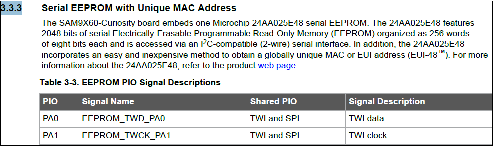
      * Refer SAM9X60 data sheet and find that PA0 and PA1 are flexcom0 , 2-wire serial interface peripherals.
	   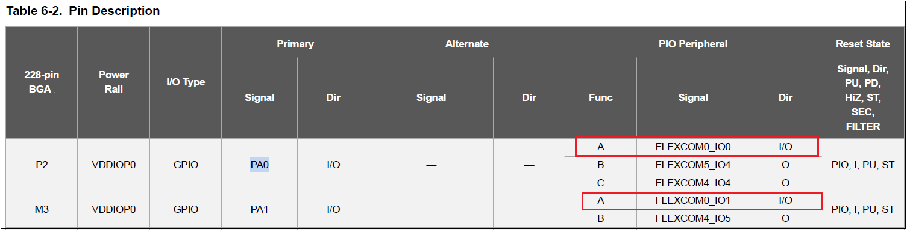
   * Refer section <mark>3.5.1</mark> of the user guide and find that PA9 and PA10 are used to transmit and receive data for serial debug com port.
   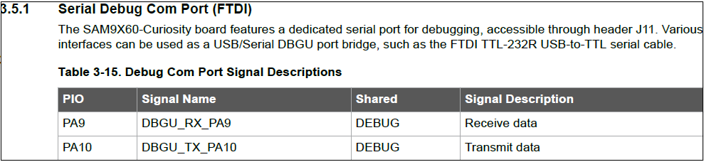
   * Refer section <mark>3.5.4</mark> of the user guide and find that PD21 is used to connect Blue LED.
    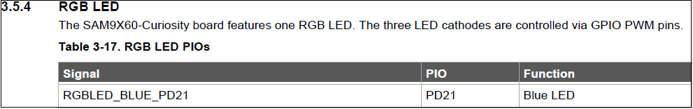

* <mark>3.3.</mark> Now, add SAM9X60 Curiosity BSP to the project graph by clicking "+" symbol from Device Resource --> Libraries --> Board Support Packages(BSPs) --> SAM9X60 curiosity BSP.
       This will configure LEDs and SWITCH (user push button).

    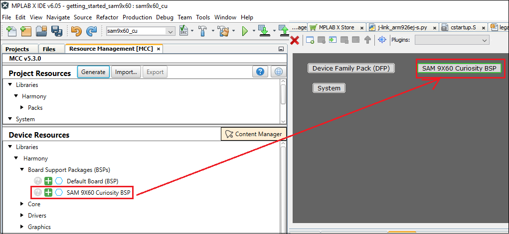

* <mark>3.4.</mark> Add Flexcom0 to the project graph by clicking "+" symbol from Device Resource --> Peripherals ---> Flexcom --> Flexcom0.
         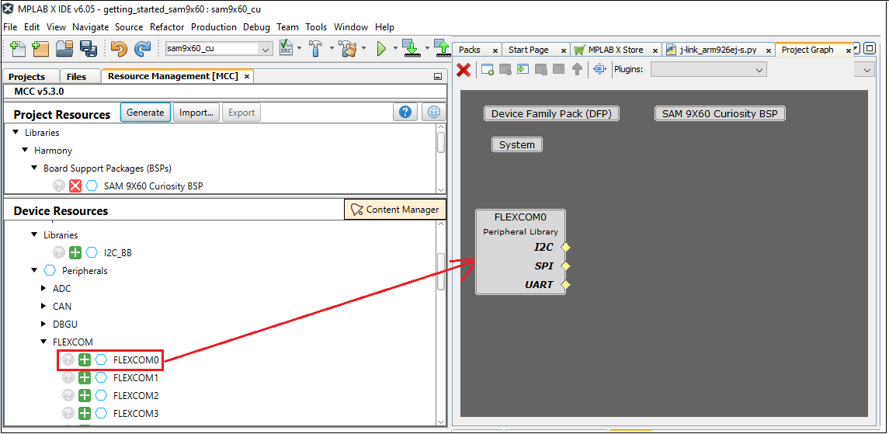

* <mark>3.5.</mark> Add serial debug peripheral to the project graph by clicking "+" symbol from Device Resource --> Peripherals --> DBGU.
       This will add the serial debug com port to the project graph.
	   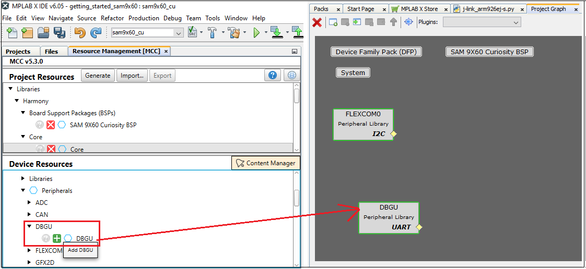

* <mark>3.6.</mark> Open the configuration option of debug peripheral, added by clicking on the DBGU peripheral in the project graph.
  * Ensure the com port settings of serial debug as follows:
	    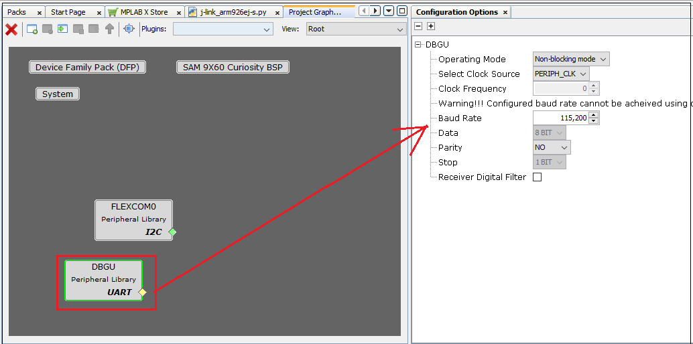  

  * Ensure flexcom configurations are proper as shown below , by clicking flexcom.
  	    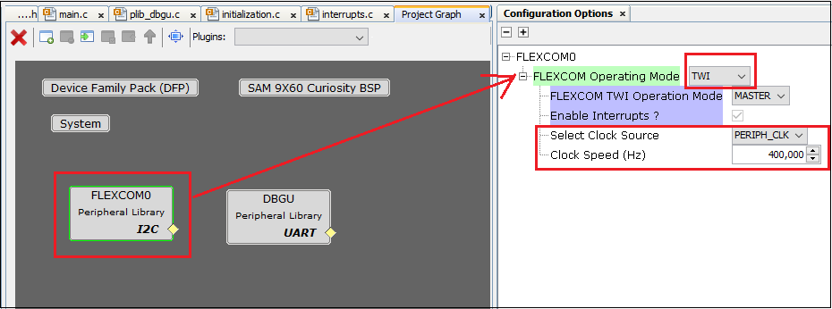  

  * Similarly check clock configurations for flexcom and debug unit are enabled by clicking system .
  	    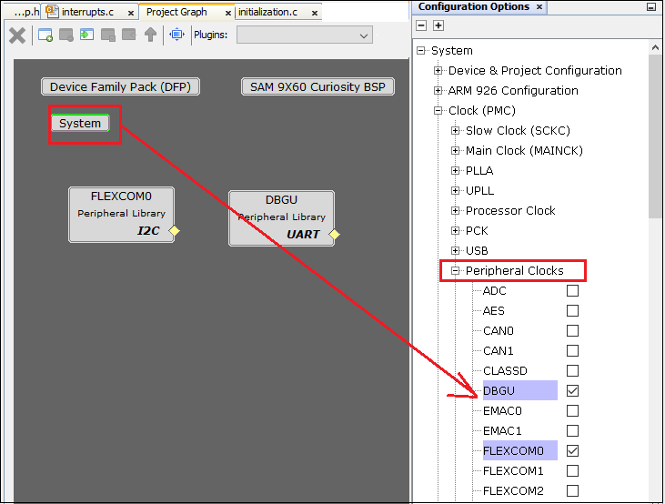  
		
* <mark>3.7.</mark> From the Project Graph tab, select Plugins --> Pin Configuration to launch the Pin Configuration windows. 
       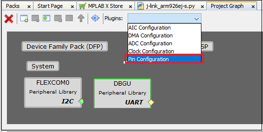

* <mark>3.8.</mark> The Pin Configuration window provides three different views:
    1.	Pin Settings (which can be ordered by Pins or Ports)
    2.	Pin Table
    3.	Pin Diagram
	

* <mark>3.9.</mark> In the Pin Settings view, select Ports from the Order drop-down menu. The view will be ordered by Port name (labeled as Pin ID).  
	   Ensure the pins mentioned in the above section 3.2. is configured as follows.

	          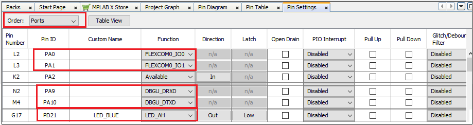
* <mark>3.10.</mark> Save your configuration by clicking on the Save icon or selecting File --> Save Configuration from the menu bar.
This completes the configuration of the required peripheral libraries.

### Step 4: Generate Code

  
 Details

    
* <mark>4.1.</mark> Now, generate the code by using MCC. From the left side tab, Resource Management (MCC), go to Project Resources and click on the Generate button.  
	          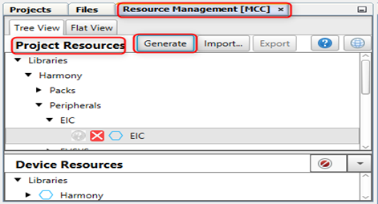

* <mark>4.2.</mark> As the code is generated, MCC displays the progress.
	          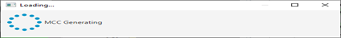
			  
* <mark>4.3.</mark> Examine the generated code files.
	          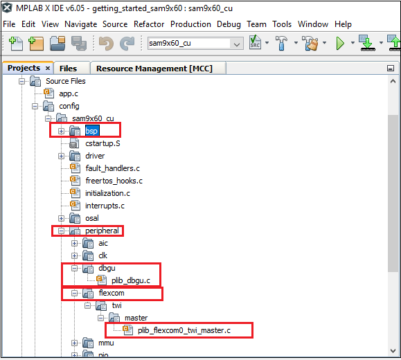
MCC will include all the MPLAB Harmony v3 library files and generate the code based on the MCC selections. The generated code will add files and folders to your Harmony project.
Among the generated code, notice the library files generated for BSP and peripheral libraries Debug, Flexcom. MCC also generates a template main file main.c.

### Step 5: Add application Code to the Project and build the application

  
 Details

    
  
* <mark>5.1.</mark> Up to this point in the project creation process, MPLAB Code Configurator(MCC) generated code to initialize the device (SAM9X60D1G) and initialize the peripherals. 
  All that is left is for the user to write the application code in main.c file.
  Documentation for each of the peripheral libraries or diver libraries can be accessed as follows:
  1.	Peripheral libraries APIs can be accessed as a HTML file (*.html) from the Harmony 3 Framework path. (framework_path\csp\docs\index.html)
  2.    BSP libraries APIs can be found in bsp.h
  3.    Driver libraries APIs can be accessed as a HTML file (*.html) from the Harmony 3 Framework path. (framework_path\core\docs\index.html)

* <mark>5.2.</mark> User can see DBGU_Initialize(), BSP_Initialize(), FLEXCOM0_TWI_Initialize() getting called in SYS_Initialze() function called from main.c.

* <mark>5.3.</mark> This project demonstrates below: 
  * Print serial console debug messages.
  * Write, Read and Compare the data from the EEPROM .
  * Print TEST PASS if write and read data from EEPROM matches and turn ON the blue LED on the board.

* <mark>5.4.</mark> API used are as follows:
  * bool DBGU_Write( void* buffer, const size_t size );
  * bool DBGU_WriteIsBusy( void );
  * bool FLEXCOMx_TWI_Write(uint16_t address, uint8_t *pdata, size_t length);
  * bool FLEXCOMx_TWI_WriteRead(uint16_t address, uint8_t *wdata, size_t wlength, uint8_t *rdata, size_t rlength);
  * bool FLEXCOMx_TWI_IsBusy(void);
  * LED_BLUE_On();

**Note:** Refer section 5.1. to get the detailed API informations.
	
* <mark>5.5.</mark> Sample code to do the functionality mentioned in 5.3. is given below.
  * Global definition snippet:
  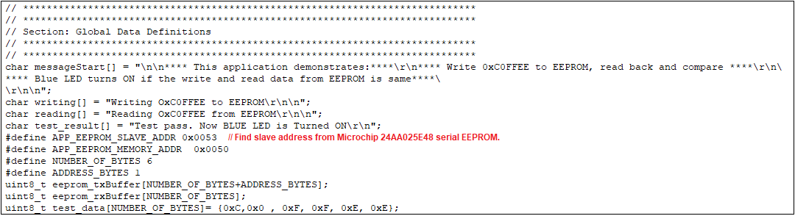
  
  * Initialization snippet:
  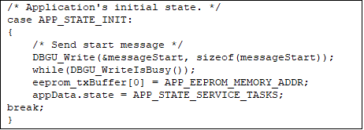

  * Main code snippet:
  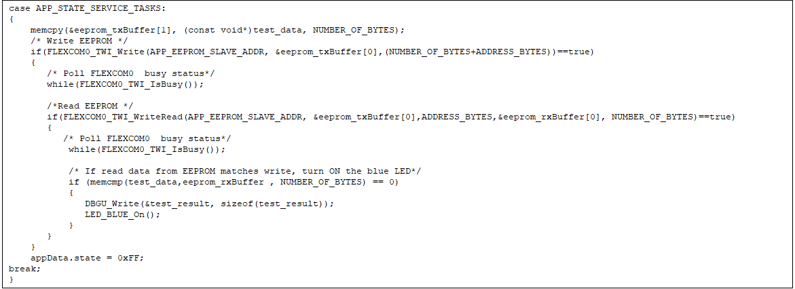

*  <mark>5.6.</mark> [**Sample code to access EEPROM is available here.**](https://github.com/Microchip-MPLAB-Harmony/csp_apps_sam_9x60/blob/master/apps/flexcom/flexcom_twi_eeprom/firmware/src/main.c)

       Note: Modify the code as per the requirement.

* <mark>5.7.</mark> Click on the Clean and Build Project icon from the tools bar or select Project --> Clean and Build Project from the menu bar. Observe that the build was completed successfully from the Output pane.
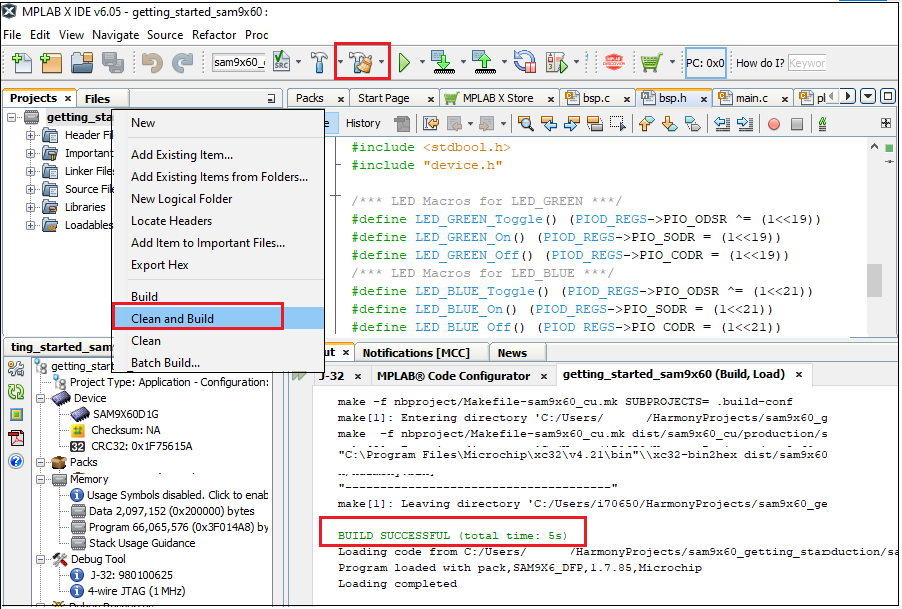

 
### Step 6: Console Serial Communications

  
 Details

    

Console Serial communications between the Host PC and the SAM9X60 Curiosity Development Board take place through UART debug port J11. 
A terminal emulation program running on the Host PC communicates with the SAM9X60 Curiosity DBGU UART port.
Ensure the terminal emulation program(Eg: PUTTY) is configured to the COM port and settings are:

  *	Speed: 115200
  * Data: 8
  * Parity: None
  * Stop Bits: 1

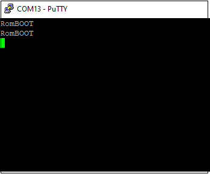

### Step 7: Building/Downloading the at19Bootstrap

  
 Details

    
The boot process of SAM9X60 begins with the MPU’s power-ON reset and progresses in stages reading binary files from external Non-Volatile Memory (NVM) and loading them into volatile memory (internal Static RAM (SRAM) and external Dynamic RAM (DRAM)).

* <mark>7.1.</mark> User can build the at91bootstrap file required to debug the application on MPLAB X IDE by following the [steps mentioned here](../sam9x60_configure_second_stage_bootloader/readme.md)

                                          or

* <mark>7.2.</mark> User can get the pre-built at91bootstrap libraries by downloading the [project from here](https://www.microchip.com/en-us/development-tool/EV40E67A#Software) as shown below.
	          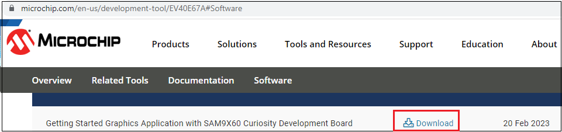
 
 Unzip the downloaded project, at91bootstrap.elf can be found in the project folder(\sam9x60_cu_graphics_getting_started\firmware\sam9x60_cu.X)

### Step 8: Debugging the Project

  
 Details

    
Ensure external JTAG debugger is connected to J12.

* <mark>8.1.</mark>  Now, check debugger settings are proper . To do that right click on project --> project properties --> In the Categories pane (on left), select Conf: --> J-Link --> choose the connected external JTAG.

  Ensure, the device chosen is SAM9X60D1G. Choose the latest compiler version and latest Device Family Pack(DFP) as shown below.
 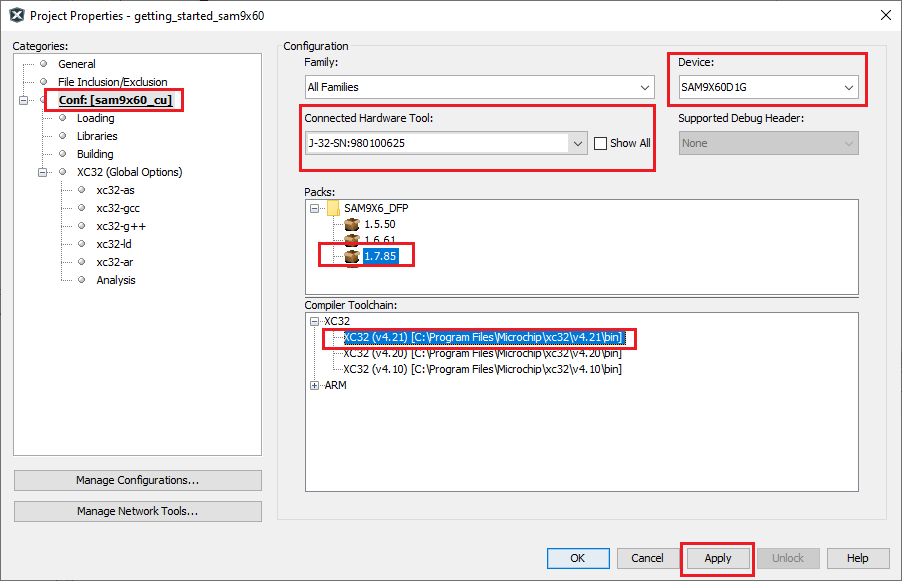

* <mark>8.2.</mark> Click Apply.

* <mark>8.3.</mark>  Now, load at91bootstrap. From Project properties --> Config --> Bootstrap --> load bootstrap File(Use boot file from section 7) --> Apply --> Ok.
 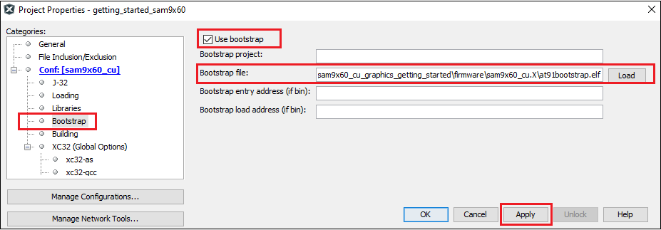
 
* <mark>8.4.</mark> By default, MPLAB X only produces ELF and Hex format output files.
    To generate binary files for SAM-BA programming, a post build step needs to be added to the project properties.
	To do this project properties --> Building --> Click the check box "Execute this line after build" --> Enter the below command.

	***${MP_CC_DIR}/xc32-objcopy -O binary ${DISTDIR}/${PROJECTNAME}.${IMAGE_TYPE}.elf ${DISTDIR}/harmony.bin***
	 
	 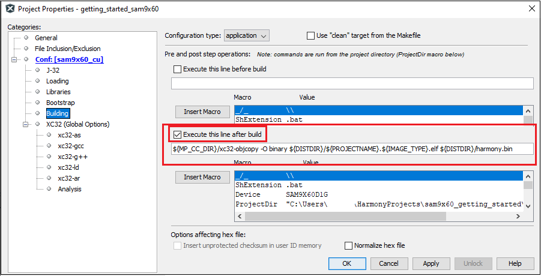
Click Apply and ok.
	
* <mark>8.5.</mark>  Observe debug reset and startup options. 

  * To do this, In MPLAB X IDE, click on Tools --> Options. An Options window opens.
  * Click on the Embedded icon at the top and the Generic Settings tab.
  * Observe the settings for:
    * Debug Reset – Main
    * Debug startup – Halt at Main

In the next step, when you debug the project, MPLAB X IDE will compile the project and download it to the target. With the debug settings listed above, the IDE will reset and halt at the beginning of main.c.
    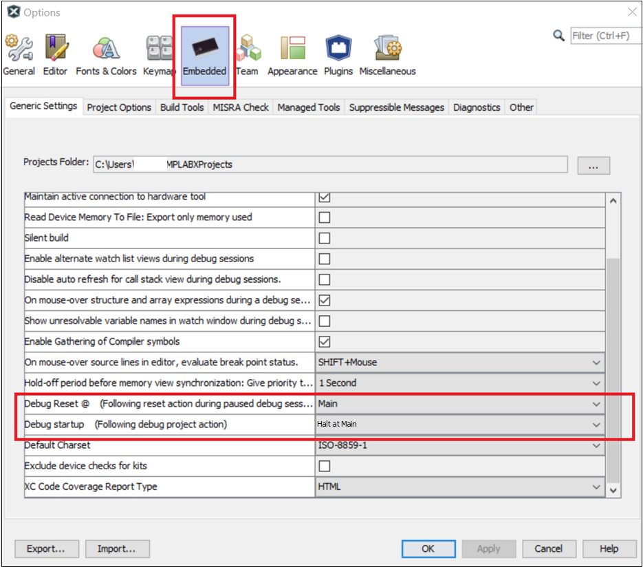
	
* <mark>8.6.</mark> Click on the Debug Main Project by left clicking the Debug icon on the toolbar.
  The project will build with debugging parameters and load the application binary to the SAM9X60 Curiosity Development Board(otherwise known as the target).

  Once the build is complete and the application binary is loaded into the target, the toolbar expands to show additional debugging icons.
    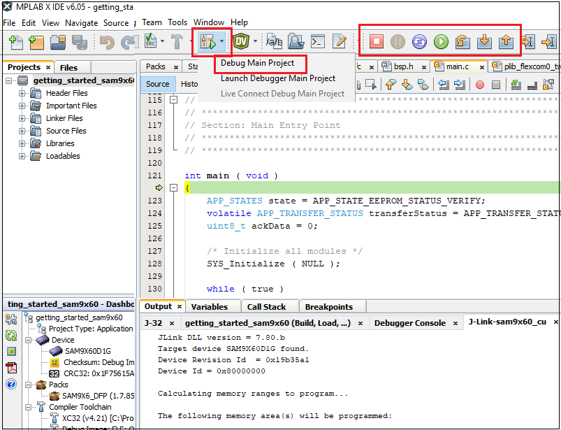

* <mark>8.7.</mark> Click on the Continue button. The application binary runs within the target.
User can observe the following output in the serial console terminal emulation application as shown below.

Congratulations! You have opened, configured, built, and debugged an application program for MPLAB Harmony 3 Software Framework in MPLAB X IDE on SAM9X60 Curiosity Development Board.

* **NOTE**
  * **[Click here to learn how to configure first stage bootloader for SAM9X60 MPU](../sam9x60_configure_first_stage_bootloader/readme.md)**
  * **[Click here to learn how to configure/built and debug second stage bootloader(at91bootstrap) for SAM9X60 MPU](../sam9x60_configure_second_stage_bootloader/readme.md)**
  * **[Click here to flash the at91bootstrap and harmony application binaries using SAM-BA tool to NVMs like QSPI External Flash, NAND Flash or to SD Card](../sam9x60_getting_started_application_using_mcc/readme.md)**
  
## Reference Links
  &nbsp; &nbsp; &nbsp;   &nbsp; &nbsp; &nbsp;   &nbsp; &nbsp;    
