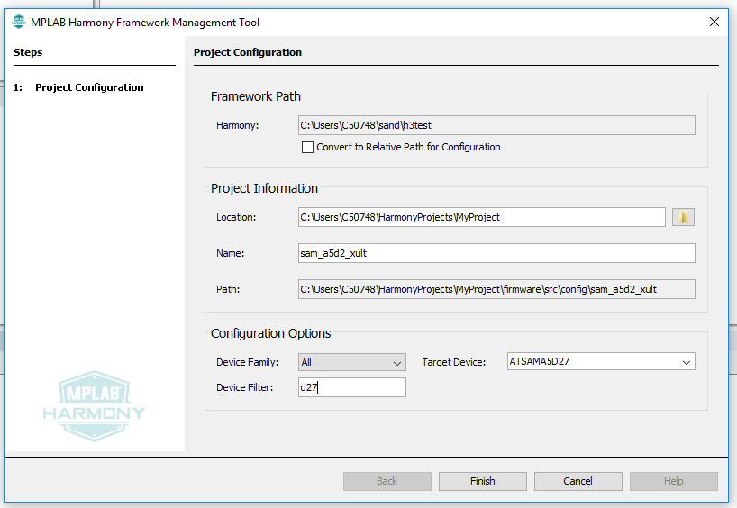
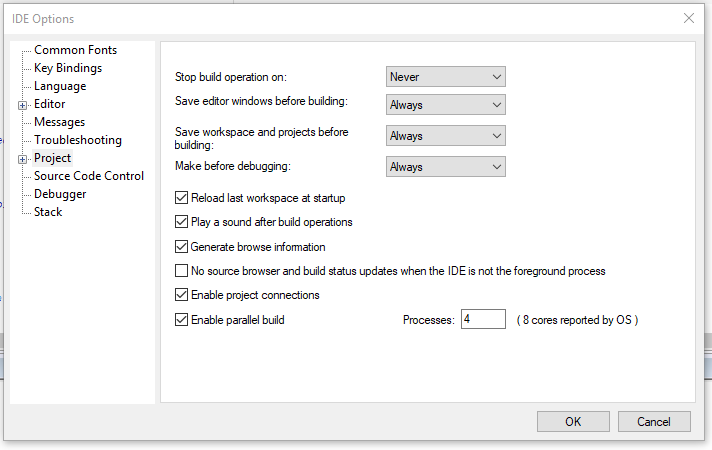
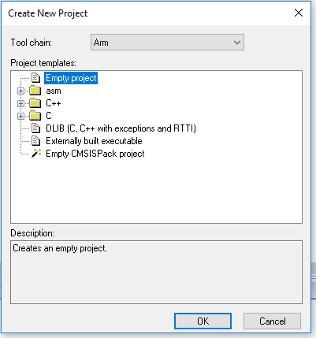
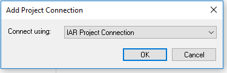
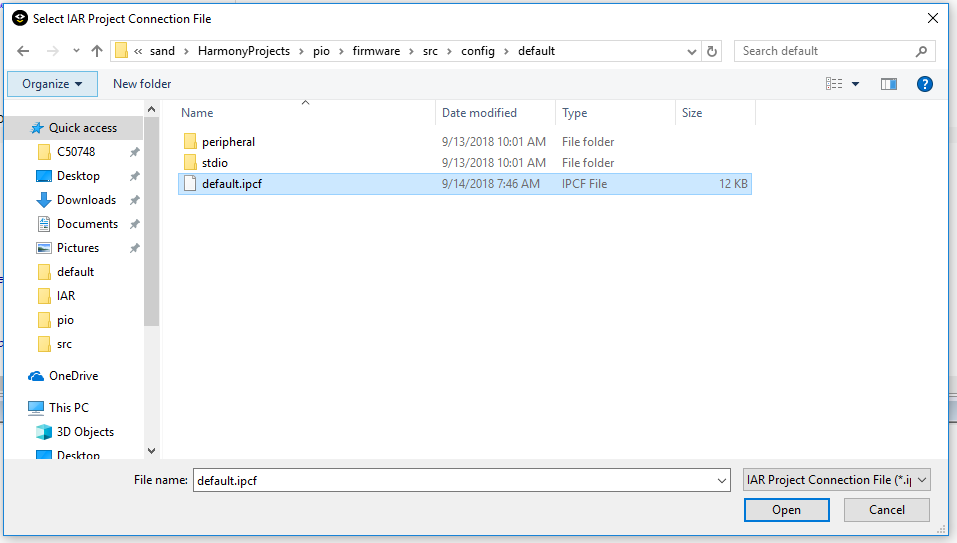
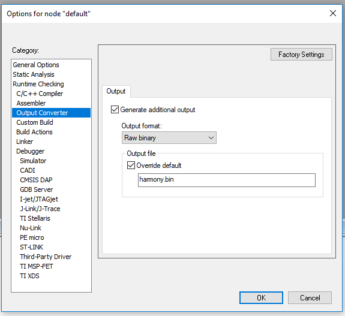

&nbsp;&nbsp;&nbsp;&nbsp;&nbsp;&nbsp;&nbsp;&nbsp;&nbsp;&nbsp;&nbsp;&nbsp;&nbsp;&nbsp;&nbsp;&nbsp;&nbsp;&nbsp;&nbsp;&nbsp;&nbsp;&nbsp;&nbsp;&nbsp;&nbsp;&nbsp;&nbsp;&nbsp; &nbsp;&nbsp;&nbsp;&nbsp;&nbsp;&nbsp;&nbsp;&nbsp;&nbsp;&nbsp;&nbsp;&nbsp;&nbsp;&nbsp;&nbsp;&nbsp;&nbsp;&nbsp;&nbsp;&nbsp;&nbsp;&nbsp;&nbsp;&nbsp;&nbsp;&nbsp;&nbsp;&nbsp;&nbsp;&nbsp;&nbsp;&nbsp;&nbsp;&nbsp;&nbsp;&nbsp;&nbsp;&nbsp;&nbsp;&nbsp;&nbsp;&nbsp;&nbsp;&nbsp;&nbsp;&nbsp;&nbsp;&nbsp;&nbsp;&nbsp;&nbsp;&nbsp;&nbsp;&nbsp;&nbsp;&nbsp;&nbsp;&nbsp;&nbsp;&nbsp;&nbsp;&nbsp;&nbsp;&nbsp;&nbsp;&nbsp;&nbsp;&nbsp;&nbsp;&nbsp;&nbsp;&nbsp; 

### Note:
 **MPLAB Harmony v3 is now configurable through MPLAB Code Configurator (MCC). Though the instructions in this guide are for the MPLAB Harmony Configurator (MHC), the flow and experience of creating a project, configuring peripherals, and generating code using MCC is similar. Refer to the below links for specific instructions to use MPLAB Harmony v3 with MCC.**
- [Create a new MPLAB Harmony v3 project using MCC](https://microchipdeveloper.com/harmony3:getting-started-training-module-using-mcc)
- [Update and Configure an Existing MHC-based MPLAB Harmony v3 Project to MCC-based Project](https://microchipdeveloper.com/harmony3:update-and-configure-existing-mhc-proj-to-mcc-proj)
- [Getting Started with MPLAB Harmony v3 Using MPLAB Code Configurator](https://www.youtube.com/watch?v=KdhltTWaDp0)

# Getting started with MPLAB® Harmony 3 on the SAMA5D2
The SAMA5D2's ROM boot loader looks for a second stage boot loader in external NVM, relocates it to internal SRAM, and executes it. Harmony uses the AT91Bootstrap as its second stage boot loader. The AT91Bootstrap initializes clocks, PIO, and DDR prior to relocating the application image from NVM to DDR and starting it.

As of the 3.2 release of Harmony only loading the AT91bootstrap and Harmony application from an external SD card has been tested. To boot your Harmony application for the SD card, first format the card with the FAT file system.
Next, download the AT91Bootstrap binary from <a href="https://github.com/Microchip-MPLAB-Harmony/at91bootstrap/blob/master/boot.bin" target="_blank">here</a>  and place the boot.bin on the SD card.

The next step is to download the Harmony 3 framework. This process can be automated using the MPLAB® Harmony Framework Management Tool. First clone the MHC repository found <a href="https://github.com/Microchip-MPLAB-Harmony/contentmanager" target="_blank">here</a>  and launch the harmony-content-manager.jar
>`java -jar harmony-content-manager.jar`.

The downloader will clone the Harmony 3 repositories that you select.

NOTE: From here on when the document references launching MHC it refers to the mhc.jar file downloaded by the content manager with the mhc repository, along with the rest of the Harmony Framework.

### Launching an Existing Project
Demo applications can be found in the apps directory in each Harmony repository
downloaded.  To load the demo application in MHC run:
>`java -jar mhc.jar -fw"=(path to where you downloaded harmony)" -mode=gui -c="(path to harmony.prj file associated with the demo application you'd like to run. e.g. ../csp/apps/uart/uart_echo_interrupt/firmware/src/config/sam_a5d2_xult/harmony.prj)"`

**NOTE: MHC must be launched from inside the mhc directory.  You can't be in another directory and give a path to mhc.jar, you must be inside the same directory as the mhc.jar file or MHC won't run correctly.**

**Make sure the firmware path (-fw=) contains a trailing directory separator (/ on Linux, \ on Windows)**

This will launch the existing project in MHC. For documentation on the demo applications shipped with Harmony refer to the github.io pages for the repository containing the app you'd like to run (e.g. <a href="https://microchip-mplab-harmony.github.io/csp" target="_blank"> csp</a>) . Once the project is loaded the code can be regenerated by selecting
>`Generate->Generate Code`

from the menu.

The IAR project has already been created for any demo applications and can be opened by opening **<demo application's firmware directory>/sam_a5d2_xult.IAR/(project name).eww**. Once IAR is launched simply build the application and load the harmony.bin image as described below.

### Creating a New Project
Once you've cloned the Harmony 3 framework launch MHC by running:
>`java -jar mhc.jar -fw="(path to where you downloaded harmony)" -mode=gui`.

With the MHC running create a new Harmony project under
>`File->New Configuration`.

NOTES:
1. As of the 3.2 release using relative paths in MHC causes issues when
   generating code.  Please uncheck the box marked "Convert to Relative Path for
   Configuration"
2. The diff tool should be configured immediately after tool install, before
   code generation is attempted, otherwise User changes may be lost.
   1. Select File > Preferences from the menu.
   2. Enter the pathname to the executable file for your preferred "diff" tool
      and click Close.  (Pass command line arguments as {0} {1} and so on.)

Add the desired plibs, drivers, and system services your application requires
and configure them accordingly, then generate the code.

To compile your project launch IAR Embedded Workbench for ARM.  (Harmony has
been tested with version 8.30.1 of IAR EW.)  Make sure you have IAR
configured to use project connections by going to
>`Tools->Options->Project->Enable project connections`.

Create a new empty project in a new direcotry under the firmware directory created by MHC (e.g. `HarmonyProjects/myApp/firmware/sam_a5d2_xult.IAR/myApp_sam_a5d2_xult.ewp`).

Under the Project menu bar select
>`Add Project Connection`

Browse to the ipcf file MHC generated.

Since the AT91Bootstrap is looking to load a raw binary, we need to have IAR
convert the ELF it builds into a raw binary.  Right click on the project name
and select options.  Under Output Converter select the
>`Generate additional output`

box, select Raw binary as the Output format, select the
>`Override default`

box and type
>`harmony.bin`

in the text field.

Now build your application.  Once the application is built copy the harmony.bin
file that was generated to the SD card.  Insert the SD card into the board, apply
power, and your Harmony application should boot and run.

#### Debugging your application:
IAR supports source-level debugging of your application.  First connect the SAM-ICE JTAG debugger to the JTAG header on the development board. Go to
>`Options->Debugger`

and select
>`J-Link/J-Trace`

as the Driver.  If the application
has booted from the SD card, simply load your project in IAR and select
>`Project->Attach to Running Target`

This will allow you to halt the running
program, set breakpoints, view and change memory and registers, etc.

## Note
 *This page has been verified with the following versions of software tools:*
- [MPLAB Harmony v3 "csp" repo v3.8.3](https://github.com/Microchip-MPLAB-Harmony/csp/releases/tag/v3.8.3)
- [MPLAB Harmony v3 "dev_packs" repo v3.8.0](https://github.com/Microchip-MPLAB-Harmony/dev_packs/releases/tag/v3.8.0)
- [MPLAB Harmony v3 "mhc" repo v3.6.5](https://github.com/Microchip-MPLAB-Harmony/mhc/releases/tag/v3.6.5)
- MPLAB Harmony 3 Launcher Plugin v3.6.2
- [MPLAB X IDE v5.45](https://www.microchip.com/mplab/mplab-x-ide)
- [MPLAB XC32 Compiler v2.41](https://www.microchip.com/mplab/compilers)

 Because Microchip regularly update tools, occasionally there could be minor differences with the newer versions of the tools. 
## Reference Links
  &nbsp; &nbsp; &nbsp;   &nbsp; &nbsp; &nbsp;   &nbsp; &nbsp;  
