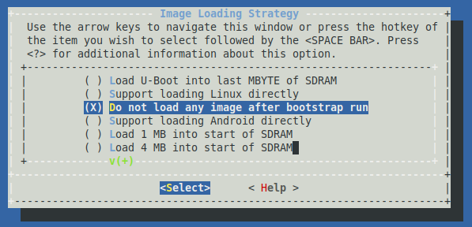
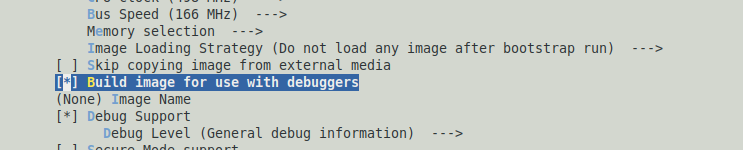
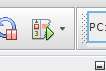

&nbsp;&nbsp;&nbsp;&nbsp;&nbsp;&nbsp;&nbsp;&nbsp;&nbsp;&nbsp;&nbsp;&nbsp;&nbsp;&nbsp;&nbsp;&nbsp;&nbsp;&nbsp;&nbsp;&nbsp;&nbsp;&nbsp;&nbsp;&nbsp;&nbsp;&nbsp;&nbsp;&nbsp; &nbsp;&nbsp;&nbsp;&nbsp;&nbsp;&nbsp;&nbsp;&nbsp;&nbsp;&nbsp;&nbsp;&nbsp;&nbsp;&nbsp;&nbsp;&nbsp;&nbsp;&nbsp;&nbsp;&nbsp;&nbsp;&nbsp;&nbsp;&nbsp;&nbsp;&nbsp;&nbsp;&nbsp;&nbsp;&nbsp;&nbsp;&nbsp;&nbsp;&nbsp;&nbsp;&nbsp;&nbsp;&nbsp;&nbsp;&nbsp;&nbsp;&nbsp;&nbsp;&nbsp;&nbsp;&nbsp;&nbsp;&nbsp;&nbsp;&nbsp;&nbsp;&nbsp;&nbsp;&nbsp;&nbsp;&nbsp;&nbsp;&nbsp;&nbsp;&nbsp;&nbsp;&nbsp;&nbsp;&nbsp;&nbsp;&nbsp;&nbsp;&nbsp;&nbsp;&nbsp;&nbsp;&nbsp;[](../../../readme.md) [](../readme.md)
## Getting started with MPLAB® Harmony 3 on Microchip SAM MPU's

The SAM MPU's, like the SAMA5D2 and SAM9X60, have a ROM based boot loader that
looks for a second stage boot loader in external NVM, relocates it to internal
SRAM, and executes it. Harmony uses the AT91Bootstrap as its second stage boot
loader. The AT91Bootstrap initializes clocks, PIO, and DDR prior to relocating
the application image from NVM to DDR and starting it.

To make development easier, rather than loading the AT91Bootstrap and Harmony
images into NVM, we can use MPLAB X to load both the bootloader and application
via the debug interface (e.g. JTAG/JLINK).  The github page for the <a href="https://github.com/linux4sam/at91bootstrap" target="_blank">bootloader </a> has instructions on how
to configure and build on both Windows and Linux platforms.  For now, we'll just 
focus on only the configuration changes needed to build an image for use with MPLAB X.
Some of our existing boards already have a defconfig for use with MPLAB X.  Look
for a defconfig with the name bkptnone in it, e.g, sama5d2\_xplained\_bkptnone\_defconfig.
You can then simply run:
>`make sama5d2_xplained_bkptnone_defconfig`

If your board doesn't already have a defconfig, not to worry, we can easily
create one.  To start, pick the defconfig for your board that runs out of some
NVM, like an SD card, e.g. sama5d2\_xplainedsd\_uboot\_defconfig.  Run:

```
make sama5d2_xplainedsd_uboot_defconfig
make menuconfig
```

Select "Image Loading Strategy"
Select "Do not load any image after bootstrap run"

  

Select "Build image for use with debuggers"

 

Save the configuration and exit kconfig.  Compile the bootloader.  You'll need
the boot.bin file created as part of the build process.

Prebuilt binaries are also available in this repository.
* SAMA5D2
    * <a href="https://github.com/Microchip-MPLAB-Harmony/csp/wiki/binaries/sama5d2/xplained/sdcard/boot.bin" target="_blank">SAMA5D2 XULT HARMONY</a> 
    * <a href="https://github.com/Microchip-MPLAB-Harmony/csp/wiki/binaries/sama5d2/xplained/mplab/boot.bin" target="_blank">SAMA5D2 XULT MPLAB</a> 
    
* SAM9X60
    * <a href="https://github.com/Microchip-MPLAB-Harmony/csp/wiki/binaries/sam9x60/ek/sdcard/boot.bin" target="_blank">SAM9X60 EK HARMONY</a> 
    * <a href="https://github.com/Microchip-MPLAB-Harmony/csp/wiki/binaries/sam9x60/ek/mplab/boot.bin" target="_blank">SAM9X60 EK MPLAB</a>     

Next we need to tell MPLAB X how to use the boot.bin image we just created or
downloaded.  We do this by creating a python script named autoload.py in the
root folder of the MPLAB X project.  For example, if we want to run the pit
led\_toggle\_interrupt project we would create the autoload.py file in

>`.../csp/apps/pit/led_toggle_interrupt/firmware/sam_a5d2_xult_xc32.X`

The contents of a typical autoload.py are shown below.

```
global g_mpu_config

g_mpu_config = {'type':'application',

    'entry_addr':0x26f00000,

    'bootstrap_entry_addr':0x200000,

    'bootstrap_bin_path':'./boot.bin'}

def on_pre_program():

    pass
```
Note that for the SAM9X60 the entry\_addr is 0x23f00000 and the
bootstrap\_entry\_addr is 0x300000.
Now copy the boot.bin file from the AT91Bootstrap build done previously to the
same directory where the autoload.py script is.

Now that the autoload.py and bootstrap are in place, we can use MPLAB X to
download and debug our Harmony application.  Start by loading the project in
MPLAB X. Right click on the project name and select "Properties".

 

Select the correct HW debugging tool and Compiler.  In this example the J-Link
and XC-32 v2.41 are used.  Simply hit the debug image button

 

The IDE will connect to the hardware, load the bootloader, wait for it to enter
debug mode, then load the Harmony application into DDR and execute it.  You can
set breakpoints, examine variables, and debug the hardware as you normally
would.

## Note
<span style="color:blue"> *This page has been verified with the following versions of software tools:*</span>  

 - [MPLAB Harmony v3 "csp" repo v3.8.1](https://github.com/Microchip-MPLAB-Harmony/csp/releases/tag/v3.8.1)
 - [MPLAB Harmony v3 "dev_packs" repo v3.8.0](https://github.com/Microchip-MPLAB-Harmony/dev_packs/releases/tag/v3.8.0)
 - [MPLAB Harmony v3 "mhc" repo v3.5.1](https://github.com/Microchip-MPLAB-Harmony/mhc/releases/tag/v3.5.1)
 - MPLAB Harmony Configurator Plugin v3.6.0
 - [MPLAB X IDE v5.40](https://www.microchip.com/mplab/mplab-x-ide)
 - [MPLAB XC32 Compiler v2.41](https://www.microchip.com/mplab/compilers)

<span style="color:blue"> Because Microchip regularly update tools, occasionally there could be minor differences with the newer versions of the tools. </span>  


## Reference Links
[<a href="https://www.microchip.com/design-centers/32-bit" target="_blank">  </a>]()  &nbsp; &nbsp; &nbsp; [<a href="https://www.microchip.com/design-centers/32-bit-mpus" target="_blank">  </a>]()  &nbsp; &nbsp; &nbsp; [<a href="https://www.microchip.com/mplab/mplab-x-ide" target="_blank">  </a>]()  &nbsp; &nbsp; [<a href="https://www.microchip.com/mplab/mplab-harmony" target="_blank">  </a>]() [<a href="https://www.microchip.com/mplab/compilers" target="_blank">  </a>]()  