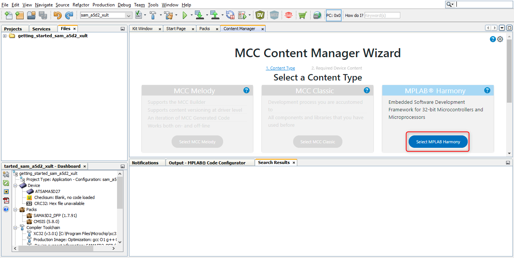
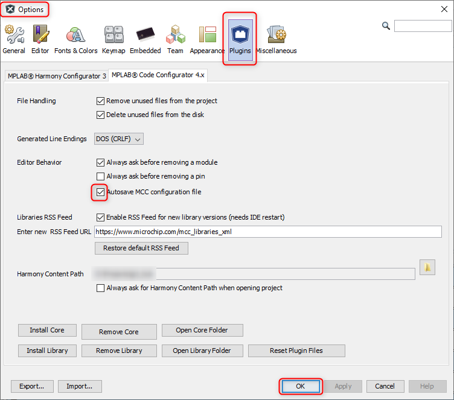

&nbsp;&nbsp;&nbsp;&nbsp;&nbsp;&nbsp;&nbsp;&nbsp;&nbsp;&nbsp;&nbsp;&nbsp;&nbsp;&nbsp;&nbsp;&nbsp;&nbsp;&nbsp;&nbsp;&nbsp;&nbsp;&nbsp;&nbsp;&nbsp;&nbsp;&nbsp;&nbsp;&nbsp; &nbsp;&nbsp;&nbsp;&nbsp;&nbsp;&nbsp;&nbsp;&nbsp;&nbsp;&nbsp;&nbsp;&nbsp;&nbsp;&nbsp;&nbsp;&nbsp;&nbsp;&nbsp;&nbsp;&nbsp;&nbsp;&nbsp;&nbsp;&nbsp;&nbsp;&nbsp;&nbsp;&nbsp;&nbsp;&nbsp;&nbsp;&nbsp;&nbsp;&nbsp;&nbsp;&nbsp;&nbsp;&nbsp;&nbsp;&nbsp;&nbsp;&nbsp;&nbsp;&nbsp;&nbsp;&nbsp;&nbsp;&nbsp;&nbsp;&nbsp;&nbsp;&nbsp;&nbsp;&nbsp;&nbsp;&nbsp;&nbsp;&nbsp;&nbsp;&nbsp;&nbsp;&nbsp;&nbsp;&nbsp;&nbsp;&nbsp;&nbsp;&nbsp;&nbsp;&nbsp;&nbsp;&nbsp; 

### Note:
 **MPLAB Harmony v3 is now configurable through MPLAB Code Configurator (MCC). Though the instructions in this guide are for the MPLAB Harmony Configurator (MHC), the flow and experience of creating a project, configuring peripherals, and generating code using MCC is similar. Refer to the below links for specific instructions to use MPLAB Harmony v3 with MCC.**
- [Create a new MPLAB Harmony v3 project using MCC](https://microchipdeveloper.com/harmony3:getting-started-training-module-using-mcc)
- [Update and Configure an Existing MHC-based MPLAB Harmony v3 Project to MCC-based Project](https://microchipdeveloper.com/harmony3:update-and-configure-existing-mhc-proj-to-mcc-proj)
- [Getting Started with MPLAB Harmony v3 Using MPLAB Code Configurator](https://www.youtube.com/watch?v=KdhltTWaDp0)
- [MPLAB® Code Configurator Content Manager for MPLAB Harmony v3 Projects](https://www.youtube.com/watch?v=PRewTzrI3iE)

# Getting started with MPLAB® Harmony 3 on Microchip SAM MPU's
The SAM MPU's, like the SAMA5D2 and SAM9X60, have a ROM based boot loader that
looks for a second stage boot loader in external NVM, relocates it to internal
SRAM, and executes it. Harmony uses the AT91Bootstrap as its second stage boot
loader. The AT91Bootstrap initializes clocks, PIO, and DDR prior to relocating
the application image from NVM to DDR and starting it.

To facilitate the debugging and running of the MPU application, go through the 
<a href="https://github.com/Microchip-MPLAB-Harmony/csp_apps_sam_a5d2/blob/master/apps/docs/readme_bootstrap.md" target="_blank">Bootstrapping MPU applications using At91bootstrap loader</a>

Also, this document shows you how to create an MPLAB X IDE Harmony v3 project for a SAM MPU from scratch using the MPLAB Harmony v3 software framework.
### Create a new MPLAB Harmony v3 MPU project Using MCC on MPLAB X IDE
* Select **File > New Project** from the main IDE menu.
* In the **Categories** pane of the **New Project** dialog, select **Microchip Embedded**. In the **Projects** pane, select **32-bit MCC Harmony Project**, then click **Next**.

 

  **Note:** If 32-bit MCC Harmony Project is not displayed, <a href="https://microchipdeveloper.com/harmony3:getting-started-training-module-using-mcc#Install_MCC_anchor" target="_blank">install MCC</a>.

* In the **Framework Path** edit box, browse to the folder where you downloaded the framework. If you haven't done this, or want to download it to a different folder, click the **Launch Content Manager** button, then click **Next**.

  **Note:** For more information on the content manager, see the <a href="https://microchipdeveloper.com/harmony3:getting-started-training-module-using-mcc#download" target="_blank">Download MPLAB Harmony Framework</a> section of the *"MPLAB Harmony Configurator Overview"* page.

 

* In the **Project Settings** window, apply the following settings:
  * **Location:** Indicates the path to the root folder of the new project. All project files will be placed inside this folder. The project location can be any valid path, for example: *<Folder of your choice>\dev\sama5d2_getting_started*.
  * **Folder:** Indicates the name of the *MPLABX .X* folder. Enter "sam_a5d2_xult" to create a *sam_a5d2_xult.X* folder.

    **Note:** This must be a valid directory name for your operating system.

  * **Name:** Enter the project’s logical name as "getting_started_sam_a5d2_xult". This is the name that will be shown from within MPLAB X IDE.

    **Note:** The **Path** box is read-only. It will update as you make changes to the other entries.

  * Click **Next** to proceed to Configuration Settings.

 

  **Note:** Clicking on the **Show Visual Help** button will open a help window providing a detailed description of the various fields in the **Project Settings** window.

 

* Follow the steps below to set the project’s Configuration Settings.
  * **Name:** Enter the configuration name as “sam_a5d2_xult”.
  * **Target Device:** Select **ATSAME51J20A** as the target device.

    **Note:** You can select the Device Family or enter a partial device name to filter the list in Target Device to make it easier to locate the desired device.
  * After selecting the target device, click **Finish** to create and open MPLAB Harmony v3 Project.

   

    **Note:** If the Finish button is greyed out and if you are seeing the Update device pack button is enabled, then click on the **Update device pack** button to update the device pack.

    

* Before proceeding, set up the compiler toolchain. Click on the **Project Projects** icon in **getting_started_sam_a5d2_xult - Dashboard** tab.

 

 Make sure that **XC32 (v3.00)** is selected as the Compiler Toolchain for XC32. Click on **Apply** and then click on **OK**.

 

* After the project is created, click on the **MCC** button to launch the MCC tool if the **Content Manager** window is not opened.

 

 In the **Content Manager** window, click on **Select MPLAB Harmony** button to launch MPLAB Harmony.

 

 Now, click on **Finish** button to launch the MCC.

 

* The MCC plugin’s main window for the project will be displayed.

 

  * **Resource Manager** has two sections. One is Project Resources and another one is Device Resources.
    * **Project Resources** The project resources area displays all of the peripherals currently configured for the project. For example (CMSIS and Device Family Packs (DFP)). Select peripheral here, and the peripheral is ready to be configured in the Composer area. In the Project Resource area, the System module is always present. The System module simplifies the setting of configuration bits and configures the system clock.
    * **Device Resources** The Device resources area displays available peripherals for the device. Click on the peripheral you want to add to your project. The peripheral moves to the MCC Project Resources area and is ready to be configured to your project's requirements. For example, Harmony Peripheral Libraries (PLIBs) for your device.
    * **Versions** show MPLAB Code Configurator Plugin version information and different libraries and their version. For example, the supported Harmony v3 library.
    * **Project Graph:** shows the instantiated components. You can instantiate available components by double-clicking on the component in the Device Resources panel. After successful component instantiation, you can see the instantiated components under the Project Resources panel.
    * **Configuration Options:** Displays the tree view of the selected component under the Project Graph area. You can configure the selected component in this section.

  **Tool Tip:** MCC, by default, has Autosave MCC configuration File option enabled. If you want to disable the MCC autosave option, go to **Tools > Options**. After opening the **Options** window, go to **Plugins** and disable the **Autosave MCC configuration file** option.
  

## Note
 *This page has been verified with the following versions of software tools:*
- [MPLAB Harmony v3 "csp" repo v3.12.0](https://github.com/Microchip-MPLAB-Harmony/csp/releases/tag/v3.12.0)
- [MPLAB Harmony v3 "dev_packs" repo v3.12.0](https://github.com/Microchip-MPLAB-Harmony/dev_packs/releases/tag/v3.12.0)
- [MPLAB Harmony v3 "mhc" repo v3.8.5](https://github.com/Microchip-MPLAB-Harmony/mhc/releases/tag/v3.8.5)
- MPLAB Harmony 3 Launcher Plugin v3.6.4
- [MPLAB X IDE v6.00](https://www.microchip.com/mplab/mplab-x-ide)
- [MPLAB XC32 Compiler v4.00](https://www.microchip.com/mplab/compilers)

 Because Microchip regularly update tools, occasionally there could be minor differences with the newer versions of the tools. 

## Reference Links
  &nbsp; &nbsp; &nbsp;   &nbsp; &nbsp; &nbsp;   &nbsp; &nbsp;    
