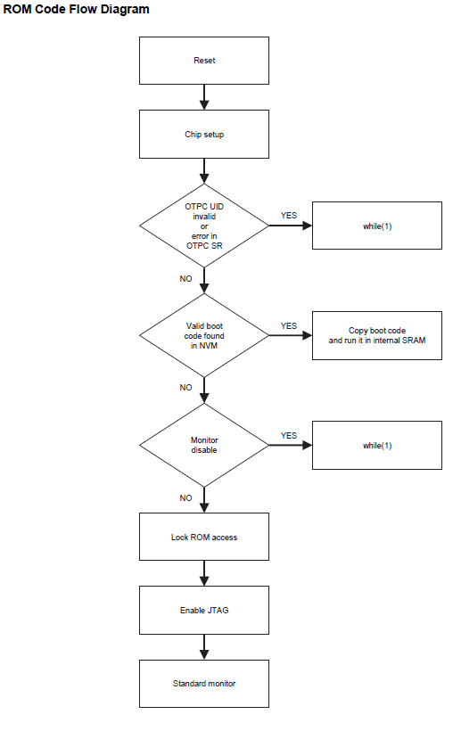
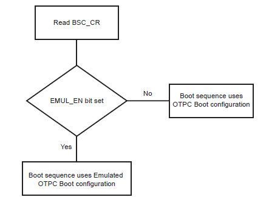
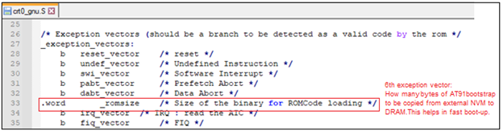

&nbsp;&nbsp;&nbsp;&nbsp;&nbsp;&nbsp;&nbsp;&nbsp;&nbsp;&nbsp;&nbsp;&nbsp;&nbsp;&nbsp;&nbsp;&nbsp;&nbsp;&nbsp;&nbsp;&nbsp;&nbsp;&nbsp;&nbsp;&nbsp;&nbsp;&nbsp;&nbsp;&nbsp; &nbsp;&nbsp;&nbsp;&nbsp;&nbsp;&nbsp;&nbsp;&nbsp;&nbsp;&nbsp;&nbsp;&nbsp;&nbsp;&nbsp;&nbsp;&nbsp;&nbsp;&nbsp;&nbsp;&nbsp;&nbsp;&nbsp;&nbsp;&nbsp;&nbsp;&nbsp;&nbsp;&nbsp;&nbsp;&nbsp;&nbsp;&nbsp;&nbsp;&nbsp;&nbsp;&nbsp;&nbsp;&nbsp;&nbsp;&nbsp;&nbsp;&nbsp;&nbsp;&nbsp;&nbsp;&nbsp;&nbsp;&nbsp;&nbsp;&nbsp;&nbsp;&nbsp;&nbsp;&nbsp;&nbsp;&nbsp;&nbsp;&nbsp;&nbsp;&nbsp;&nbsp;&nbsp;&nbsp;&nbsp;&nbsp;&nbsp;&nbsp;&nbsp;&nbsp;&nbsp;&nbsp;&nbsp; 

### Note:
 **This guide will explain how to configure first stage bootloader for SAMA7G54 family of microprocessors.**
- [SAMA7G54 data sheet](https://www.microchip.com/en-us/product/SAMA7G54)
- [SAMA7G54 Evaluation kit ](https://www.microchip.com/en-us/development-tool/EV21H18A)

# Introduction
This document guides the user on how to configure boot configuration packet for first stage bootloader and how to ensure a valid code is available in second stage bootloader.

The first stage bootloader (ROM code or Boot ROM or NVM bootloader) is a small piece of mask code, executed on power-on or reset. The first stage bootloader is responsible for loading the second-stage bootloader (User Application) from an external NVM into internal SRAM and execute it (Harmony uses the at91Bootstrap as its second stage boot loader).

# First stage bootloader - Boot Sequence

* The boot sequence is an ordered list of embedded memory controllers from which the ROM code tries to boot. User can modify the boot sequence by writing a valid Boot Configuration packet into the OTPC (One Time Programmable Memory controller) or Emulated OTPC (One Time Programmable Memory controller).
* When no Boot Configuration Packet is available, ROM code will try to boot from one of the external NVMs in the following order:
  * **SDMMC1 IOSET1**

If no bootable file or no valid boot code is found in memory, the ROM code goes to the SAM-BA monitor.

# First stage bootloader- Boot flow process

* The ROM code boot flow process is shown below:
 

* The boot flow process is based on the values of the Boot Configuration Packet.

* By default, the value of the Boot Configuration Packet is 0x0.

* When no Boot Configuration Packet is available in the OTP User area, the ROM code uses the following settings:
  * FLEXCOM3 IOSET 5 is used as a console.
  * Boot from SDMMC1 IOSET1 (uses card detect pin).

* If no valid code is found in the SD Card or e.MMC, the ROM code goes to the standard monitor.

# Configure First stage bootloader
* User can write the boot configuration packet either into the OTP matrix or emulation SRAM by setting emulation bit in the boot sequence controller configuration register (BSC_CR).

* Boot configuration loading step is explained in the below flowchart:
 

* Using boot configuration packet, user can:
  * **Modify the boot sequence steps by enabling only the user preferred NVMs as below:** 
    **1. QSPI**  
	**2. e.MMC** </b>  
	**3. SDCARD** </b>  
  * **Configure the console serial communications.**
  * **Disable SAM-BA Monitor.**
  
* User can write boot sequence controller configuration register (BSC_CR) and the boot configuration packet into OTPC or OTPC Emulated SRAM using **SAM-BA** tool.

* [Go to this link to download and configure SAM-BA.](https://microchipdeveloper.com/32mpu:sam-ba-install)

* [Refer this document to install and setup SAM-BA.](../sama7g54_samba_installation_setup/readme.md)

**Note:** 
* **Boot configuration using Emulation SRAM must be set every power cycle. Boot configuration using OTPC is one time.** 
* **It is recommended to write boot configuration packet (BCP) into Emulation SRAM in development phase and to OTPC (One Time Programmable Memory Controller) in the production phase.**

**WARNING: once any user area packet has been programmed into the OTP matrix (OTPC), the emulation mode can never be enabled again. Be careful before writing a packet in the OTPC matrix !**        

## 1. Configure First Stage Bootloader To Boot From QSPI Flash Memory 

Use the below SAM-BA commands to configure the first stage bootloader to load the at91bootstrap from QSPI flash memory into SRAM and execute from SRAM.
To learn about the boot process and first stage boot configuration, refer to section 19-Boot Strategies of the SAMA7G5 series data sheet.  
Note: ***It is mandatory to enable boot configuration packet to boot from QSPI for SAMA7G5 series.***

**Steps to program Boot Configuration packet into Emulation SRAM:**

* Enable Emulation  
  ***sam-ba -p j-link -b sama7g5-ek -a bootconfig -c writecfg:bscr:EMULATION_ENABLED***
* Read bscr and verify emulation is enabled  
  ***sam-ba -p j-link -b sama7g5-ek -a bootconfig -c readcfg:bscr*** 
* Emulation SRAM Reset  
  ***sam-ba -p j-link -b sama7g5-ek -a bootconfig -c resetemul***  
* Refresh Emulation SRAM  
  ***sam-ba -p j-link -b sama7g5-ek -a bootconfig -c refreshcfg:emul*** 
* Enable debug, QSPI0 as external NVM  
  ***sam-ba -p j-link -b sama7g5-ek -a bootconfig -c writecfg:bcp-emul:DBGU,QSPI0_IOSET1*** 
* Read bcp_emul and verify whether QSPI is set as external NVM  
  ***sam-ba -p j-link -b sama7g5-ek -a bootconfig -c readcfg:bcp-emul*** 
   
Now reset the board by pressing reset(nRST) button.  

**Steps to program Boot Configuration packet into OTPC:**

*	Disable Emulation  	
***sam-ba -p j-link -b sama7g5-ek -a bootconfig -c writecfg:bscr:EMULATION_DISABLED***
*	Read bscr and verify emulation is disabled  
***sam-ba -p j-link -b sama7g5-ek -a bootconfig -c readcfg:bscr*** 
*	Refresh otp  
***sam-ba -p j-link -b sama7g5-ek -a bootconfig -c refreshcfg:otp***
*	Enable debug, QSPI0 as external NVM  
***sam-ba -p j-link -b sama7g5-ek -a bootconfig -c writecfg:bcp-otp:DBGU,QSPI0_IOSET1*** 
*   Read bcp_otp and verify whether QSPI is set as external NVM	 
***sam-ba -p j-link -b sama7g5-ek -a bootconfig -c readcfg:bcp-otp*** 
 Now reset the board by pressing the reset(nRST) button.

## 2. Configure First Stage Bootloader to Boot From e.MMC Flash Memory 

Use the below SAM-BA commands to configure the first stage bootloader to load the at91bootstrap from e.MMC flash memory into SRAM and execute from SRAM.
To learn about the boot process and first stage boot configuration, refer to section 19-Boot Strategies of the SAMA7G5 series data sheet.  
Note: ***It is mandatory to enable boot configuration packet to boot from e.MMC for SAMA7G5 series.***

**Steps to program Boot Configuration packet into Emulation SRAM:**

* Enable Emulation  
  ***sam-ba -p j-link -b sama7g5-ek -a bootconfig -c writecfg:bscr:EMULATION_ENABLED***
* Read bscr and verify emulation is enabled  
  ***sam-ba -p j-link -b sama7g5-ek -a bootconfig -c readcfg:bscr*** 
* Emulation SRAM Reset  
  ***sam-ba -p j-link -b sama7g5-ek -a bootconfig -c resetemul***  
* Refresh Emulation SRAM  
  ***sam-ba -p j-link -b sama7g5-ek -a bootconfig -c refreshcfg:emul*** 
* Enable debug, SDMMC0 as external NVM  
  ***sam-ba -p j-link -b sama7g5-ek -a bootconfig -c writecfg:bcp-emul:DBGU,SDMMC0_IOSET1*** 
* Read bcp_emul and verify whether SDMMC0 is set as external NVM  
  ***sam-ba -p j-link -b sama7g5-ek -a bootconfig -c readcfg:bcp-emul*** 
   
Now reset the board by pressing reset(nRST) button.  

**Steps to program Boot Configuration packet into OTPC:**

*	Disable Emulation  	
***sam-ba -p j-link -b sama7g5-ek -a bootconfig -c writecfg:bscr:EMULATION_DISABLED***
*	Read bscr and verify emulation is disabled  
***sam-ba -p j-link -b sama7g5-ek -a bootconfig -c readcfg:bscr*** 
*	Refresh otp  
***sam-ba -p j-link -b sama7g5-ek -a bootconfig -c refreshcfg:otp***
*	Enable debug, SDMMC0 as external NVM  
***sam-ba -p j-link -b sama7g5-ek -a bootconfig -c writecfg:bcp-otp:DBGU,SDMMC0_IOSET1*** 
*   Read bcp_otp and verify whether SDMMC0 is set as external NVM	 
***sam-ba -p j-link -b sama7g5-ek -a bootconfig -c readcfg:bcp-otp*** 
 Now reset the board by pressing the reset(nRST) button.
   
  
## 3. Configure First Stage Bootloader to Boot From SDCARD Memory

Use the below SAM-BA commands to configure the first stage bootloader to load the at91bootstrap from SDCARD memory into SRAM and execute from SRAM.
To learn about the boot process and first stage boot configuration, refer section 19-Boot Strategies of the SAMA7G5 series data sheet.  
Note: ***By default boot from SDCARD will be enabled in boot configuration packet for SAMA7G5 series.***

**Steps to program Boot Configuration packet into Emulation SRAM:**

* Enable Emulation  
  ***sam-ba -p j-link -b sama7g5-ek -a bootconfig -c writecfg:bscr:EMULATION_ENABLED***
* Read bscr and verify emulation is enabled  
  ***sam-ba -p j-link -b sama7g5-ek -a bootconfig -c readcfg:bscr*** 
* Emulation SRAM Reset  
  ***sam-ba -p j-link -b sama7g5-ek -a bootconfig -c resetemul***  
* Refresh Emulation SRAM  
  ***sam-ba -p j-link -b sama7g5-ek -a bootconfig -c refreshcfg:emul*** 
* Enable debug, SDMMC1 as external NVM  
  ***sam-ba -p j-link -b sama7g5-ek -a bootconfig -c writecfg:bcp-emul:DBGU,SDMMC1_IOSET1*** 
* Read bcp_emul and verify whether SDMMC1 is set as external NVM  
  ***sam-ba -p j-link -b sama7g5-ek -a bootconfig -c readcfg:bcp-emul*** 
   
Now reset the board by pressing reset(nRST) button.  

**Steps to program Boot Configuration packet into OTPC:**

*	Disable Emulation  	
***sam-ba -p j-link -b sama7g5-ek -a bootconfig -c writecfg:bscr:EMULATION_DISABLED***
*	Read bscr and verify emulation is disabled  
***sam-ba -p j-link -b sama7g5-ek -a bootconfig -c readcfg:bscr*** 
*	Refresh otp  
***sam-ba -p j-link -b sama7g5-ek -a bootconfig -c refreshcfg:otp***
*	Enable debug, SDMMC1 as external NVM  
***sam-ba -p j-link -b sama7g5-ek -a bootconfig -c writecfg:bcp-otp:DBGU,SDMMC1_IOSET1*** 
*   Read bcp_otp and verify whether SDMMC1 is set as external NVM	 
***sam-ba -p j-link -b sama7g5-ek -a bootconfig -c readcfg:bcp-otp*** 
 Now reset the board by pressing the reset(nRST) button.  

## 4. SAM-BA command to invalidate the Boot Configuration packet. 

Use below command to remove last set configuration in boot configuration packet. 
*   To invalidate bcp-emul. 
***sam-ba -p j-link -b sama7g5-ek -a bootconfig -c invalidatecfg:bcp-emul***  
*   To invalidate bcp-otp. 
***sam-ba -p j-link -b sama7g5-ek -a bootconfig -c invalidatecfg:bcp-otp*** 
  
# How first stage bootloader ensures the presence of valid second stage bootloader
* The Boot ROM reads and analyzes the first 28 bytes corresponding to the first seven ARM exception vectors of second Stage bootloader (at91bootstrap) to decide whether the AT91bootstrap can be considered as valid, or it should be skipped. 

* Except for the sixth vector, other exception vector bytes must implement the ARM instructions for either branch or load PC with PC-relative addressing. The ROM code fetches the 6th exception vector value to know exactly how many bytes it should transfer from the external NVM instead of reading the maximum size allowed to the user application, hence speeding up the boot process.

* If the external NVM chosen is SDCard/e.MMC, then BootROM looks for boot.bin file in the FAT formatted SDCard/e.MMC in addition to the ARM-exception vectors check.

* The at91bootstrap code ensures the presence of the valid code by having the proper exception vector. [It can be seen in crt0_gnu.s file in at91bootstrap source code.](https://github.com/linux4sam/at91bootstrap/blob/master/crt0_gnu.S)

   
  
## Reference Links
  &nbsp; &nbsp; &nbsp;   &nbsp; &nbsp; &nbsp;   &nbsp; &nbsp;    
