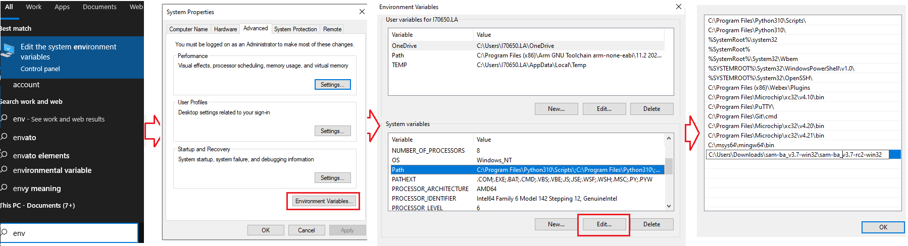

&nbsp;&nbsp;&nbsp;&nbsp;&nbsp;&nbsp;&nbsp;&nbsp;&nbsp;&nbsp;&nbsp;&nbsp;&nbsp;&nbsp;&nbsp;&nbsp;&nbsp;&nbsp;&nbsp;&nbsp;&nbsp;&nbsp;&nbsp;&nbsp;&nbsp;&nbsp;&nbsp;&nbsp; &nbsp;&nbsp;&nbsp;&nbsp;&nbsp;&nbsp;&nbsp;&nbsp;&nbsp;&nbsp;&nbsp;&nbsp;&nbsp;&nbsp;&nbsp;&nbsp;&nbsp;&nbsp;&nbsp;&nbsp;&nbsp;&nbsp;&nbsp;&nbsp;&nbsp;&nbsp;&nbsp;&nbsp;&nbsp;&nbsp;&nbsp;&nbsp;&nbsp;&nbsp;&nbsp;&nbsp;&nbsp;&nbsp;&nbsp;&nbsp;&nbsp;&nbsp;&nbsp;&nbsp;&nbsp;&nbsp;&nbsp;&nbsp;&nbsp;&nbsp;&nbsp;&nbsp;&nbsp;&nbsp;&nbsp;&nbsp;&nbsp;&nbsp;&nbsp;&nbsp;&nbsp;&nbsp;&nbsp;&nbsp;&nbsp;&nbsp;&nbsp;&nbsp;&nbsp;&nbsp;&nbsp;&nbsp; 

### Note:
 **This guide will explain how to use SAM-BA to  Write Boot Configuration Packet & Flash at91bootstrap, RTOS/Baremetal applications to external NVM for SAMA7G54.**
- [SAMA7G54 data sheet](https://www.microchip.com/en-us/product/SAMA7G54)
- [SAMA7G54 Evaluation kit ](https://www.microchip.com/en-us/development-tool/EV21H18A)

# Introduction
This document will guide the user on how to, 
  * Write boot sequence controller configuration register (BSC_CR) & boot configuration packet to configure first stage bootloader.
  * Flash boot.bin (at91bootstrap) & harmony.bin (RTOS/Baremetal application) file to external NVMs like QSPI flash, e.MMC & SD-Card.

# Prerequisites

  
 Details

    

* Familiar with the features of the SAM7G54-EK (board can be evaluation Kit) and understanding about the jumpers & Connectors on the board.
* Install SAM-BA tool on your windows host PC.
  * To Download the latest version of SAM-BA tool for Windows [click this link](https://www.microchip.com/en-us/development-tool/SAM-BA-In-system-Programmer).
  * Download the ZIP file and unzip it into a working directory of your choice.
  * Add the SAM-BA directory path to the environment variables.
    * To do this from your PC --> Open the Start Search, type in “env”.
    * Choose “Edit the system environment variables” --> Click "Environment Variables" --> "System Variables" --> add SAM-BA directory path to path variables.
      
  * Once the SAM-BA Host program has been installed, the execution of the application is from the Windows command prompt.

* [Refer this link](../sama7g54_configure_second_stage_bootloader/readme.md) to configure and build the at91bootstrap to load the application from the user preferred NVM like QSPI flash, e.MMC & SDCard.
  
  **Note:** This resultant at91bootstrap file (boot.bin) built with the preferred NVM configuration only to be used here.
* [Refer this link](https://github.com/search?q=org%3AMicrochip-MPLAB-Harmony+sam_a7g5&type=repositories) to build harmony application.

 

# Setup SAM-BA Host to Monitor Communications 

  
 Details

    
In this section you will establish SAM-BA Host Application communications with the target’s (SAMA7G54) SAM-BA Monitor. Then you will use the SAM-BA Host Applet (qspiflash) to erase and then write the boot.bin (at91bootstrap) and harmony.bin (MPLAB Harmony 3 application) binary images to NOR Flash Memory. 
 

Step 1: To communicate with the SAM-BA Monitor on the target, you must have installed the SAM-BA Host on a Host Computer. 

Step 2: Ensure there is no SD memory card inserted.

Step 3: Power the board by connecting a Micro-B USB cable to USBA port (J7) on the SAMA7G54-EK.

Step 4: Establish UART serial communication with PC through J24 on SAMA7G54 Evaluation Kit.

Step 5: Open Disable boot Jumper(J22) on SAMA7G54 Evaluation Kit.

Step 6: Follow below steps for SAMA7G54 Evaluation Kit: 
  *  Push and hold the "DISABLE BOOT" button. (This disables booting from the onboard memories - e.MMC Flash, SDCARD and QSPI flash Memory). 
  *  Reset the board by pressing and then releasing the reset "nRST" button. 
  *  Release the "DISABLE BOOT" button. 

Now, the SAMA7G54-EK will boot to the SAM-BA Monitor and start communications with the SAM-BA Host Application. 

***Note:***
  * SAM-BA communication Port can be j-link, serial or secure.

  * If user wants to program the SAMA7G54 Evaluation Kit, using j-link instead of serial UART port, then connect J24 with PC via USB cable and replace “serial” in SAM-BA commands with “j-link”.

    * Eg: Replace ***sam-ba -p serial -b sama7g5-ek -a lowlevel*** with ***sam-ba -p j-link -b sama7g5-ek -a lowlevel***

 

# 1. Program External QSPI flash memory

  
 Details

   

## 1.1. Erase QSPI flash memory
   Erase the contents of the QSPI Flash memory on the SAMA7G54-EK with the following command: 
   
   ***sam-ba -p j-link -b sama7g5-ek -a qspiflash -c erase***

   <mark>Example:</mark>

## 1.2. Program boot.bin to QSPI flash memory
   Program the boot.bin file on the SAMA7G54-EK with the following command: 
   
   ***sam-ba -p j-link -b sama7g5-ek -a qspiflash -c writeboot:boot.bin***
   * Note: Change directory to the location of boot.bin

   <mark>Example:</mark>

**Note:** [Refer this link](../sama7g54_configure_second_stage_bootloader/readme.md) to configure and build the at91bootstrap to load the application from QSPI.

The at91bootstrap file (boot.bin) built with QSPI configuration only to be used here.

## 1.3. Program harmony.bin to QSPI flash memory
   To program the application binary, harmony.bin file on the SAMA7G54-EK, use the following command:
   
   ***sam-ba -p j-link -b sama7g5-ek -a qspiflash -c write:harmony.bin:\<QSPI_OFFSET\>***
   
   **Note:** 
     * The \<QSPI_OFFSET\> should be the same offset used in the KCONFIG, while configuring the at91bootstrap to load from external QSPI  
     * Change directory to the location of harmony.bin.

   <mark>Example:</mark>

## <mark>Note:</mark>
To learn about more SAM-BA applet commands, refer your **SAM-BA installation directory**/doc/applet.html

 

# 2. Program External e.MMC Flash Memory

  
 Details

    		   
  To boot from e.MMC flash memory, we need to flash sdcard.img file in user partition area in e.MMC flash memory. 

## 2.1. Create sdcard.img file for boot.bin and harmony.bin.	
   
   To create **.img** file we need an SDCARD and a windows tool named **Win32DiskImager**. Click [here](https://win32diskimager.download/download-win32-disk-imager/) to download the tool.
   * First Partition the SDCARD with size of 4MB and format SDCARD with FAT or FAT32 file system.
   * Now place the boot.in and harmony.bin in SDCARD.
   * Install Win32DiskImager Tool and open the tool.
       * In Device tab, select the drive for which the image file needs to be created.
	     
       * In ImageFile tab, enter the path and file name with extention(.img) to store the generated image file.
	     
       * Now select the check box next to **Read Only Allocated Partitions** and click on **Read** button.
	     
	   * When reading is completed, a pop-up window will be displayed with status as **Read Successful**.
	     
	   * Now the generated image(.img) file will be available in above mentioned location. 	 

## 2.2. Program sdcard.img file to e.MMC flash memory
   To program the sdcard.img file on the SAMA7G54-EK with the following command:
   
   ***sam-ba -p j-link -b sama7g5-ek -a sdmmc -c write:sdcard.img***

 <mark>Example:</mark>

**Note:** [Refer this link](../sama7g54_configure_second_stage_bootloader/readme.md) to configure and build the at91bootstrap to load the application from e.MMC flash memory.

The at91bootstrap file (boot.bin) built with e.MMC configuration only to be used here.

## <mark>Note:</mark>
To learn about more SAM-BA applet commands, refer your **SAM-BA installation directory**/doc/applet.html

 

# 3. Program External SD CARD

  
 Details

    
To program the at91bootstrap -boot.bin file and application binary -harmony.bin file on SD-card:

  * (i) Format the SD card using your PC/Laptop.
  * (ii) Copy and paste boot.bin and harmony.bin into the SD card from your host PC.

**Note:** [Refer this link](../sama7g5_configure_second_stage_bootloader/readme.md) to configure and build the at91bootstrap to load the application from SD Card.

The at91bootstrap file (boot.bin) built with SD card configuration should be used here.

# 4. Program BSC_CR & Boot Configuration Packet

  
 Details

    
After a reset, The ROM code reads the Boot Configuration Packet from the SRAM dedicated to Emulation mode if the bit BSC_CR.EMUL_EN is set to 1 or from the OTP matrix and configure boot sequence, Enable/Disable Monitor, configure the serial console UART.

Using Emulated OTP enables the user to test several boot configuration options, including secure boot mode without programming the OTP.

**Note:** If Emulation mode is enabled, the emulation SRAM is not backed up. After a power off/on, the configuration and content are lost.

## 4.1. Enable/Disable Emulation mode in BSC_CR

To Enable/Disable Emulation mode in Boot Sequence Controller Configuration Register (BSC_CR), the following SAM-BA command should be used:

To Enable Emulation Mode:

***sam-ba -p j-link -b sama7g5-ek -a bootconfig -c writecfg:bscr: EMULATION_ENABLED***

To Disable Emulation Mode:

***sam-ba -p j-link -b sama7g5-ek -a bootconfig -c writecfg:bscr: EMULATION_DISABLED***

## 4.2. Steps to write Boot Configuration Packet to emulated SRAM
 1. Emulation enable : sam-ba -p j-link -b sama7g5-ek -a bootconfig -c writecfg:bscr:EMULATION_ENABLED
 2. Reset            : sam-ba -p j-link -b sama7g5-ek -a bootconfig -c resetemul
 3. Refresh config   : sam-ba -p j-link -b sama7g5-ek -a bootconfig -c refreshcfg:emul
 4. Write Config     : sam-ba -p j-link -b sama7g5-ek -a bootconfig -c writecfg:bcp-emul:DBGU,SDMMC0_IOSET1 
 5. Lock config      : sam-ba -p j-link -b sama7g5-ek -a bootconfig -c lockcfg:bcp-emul

## 4.3. Steps to write Boot Configuration Packet to OTP
 1. Emulation disable: sam-ba -p j-link -b sama7g5-ek -a bootconfig -c writecfg:bscr:EMULATION_DISABLED
 2. Refresh config   : sam-ba -p j-link -b sama7g5-ek -a bootconfig -c refreshcfg:otp
 3. Write Config     : sam-ba -p j-link -b sama7g5-ek -a bootconfig -c writecfg:bcp-otp:DBGU,SDMMC0_IOSET1 
 4. Lock config      : sam-ba -p j-link -b sama7g5-ek -a bootconfig -c lockcfg:bcp-otp

## 4.4. Boot Configuration Packet different configurations available
The writecfg command programs the Boot Configuration Packet (BCP) into the ***Emulated SRAM***, if the ***emulation mode of the OTPC is enabled***. Else BCP packets are stored inside the ***OTP matrix***.

User can use the below command to get the full list of boot configurations possible:

***sam-ba -p j-link -b sama7g5-ek -a bootconfig -c writecfg:help***

<mark>Example boot configurations:</mark>

boot config with Serial Console on FLEXCOM0, boot from SDMMC1 store in OTP matrix

***sam-ba -p j-link -b sama7g5-ek -a bootconfig -c writecfg: bcp-otp:FLEXCOM0_USART_IOSET1,SDMMC1_IOSET1***

Empty boot configuration packet in OTP matrix

***sam-ba -p j-link -b sama7g5-ek -a bootconfig -c writecfg: bcp-otp:***

Boot config with SAM-BA Monitor Disabled, boot from SDMMC1 store in OTP-Emulation mode

***sam-ba -p j-link -b sama7g5-ek -a bootconfig -c writecfg: bcp-emul:MONITOR_DISABLED,SDMMC1_IOSET1***

Empty boot configuration packet in OTP-Emulation mode- Emulated SRAM

***sam-ba -p j-link -b sama7g5-ek -a bootconfig -c writecfg: bcp-emul:***

## <mark>Note:</mark>

To learn about more bootconfig SAM-BA applet commands: Refer your **SAM-BA installation directory**/doc/bootconfig-otp.html

**Links**
  * **[Click here to learn how to configure first stage bootloader for SAMA7G54 MPU](../sama7g54_configure_first_stage_bootloader/readme.md)**
  * **[Click here to learn how to configure/built and debug second stage bootloader(at91bootstrap) for SAMA7G54 MPU](../sama7g54_configure_second_stage_bootloader/readme.md)**

## Reference Links
  &nbsp; &nbsp; &nbsp;   &nbsp; &nbsp; &nbsp;   &nbsp; &nbsp;    
