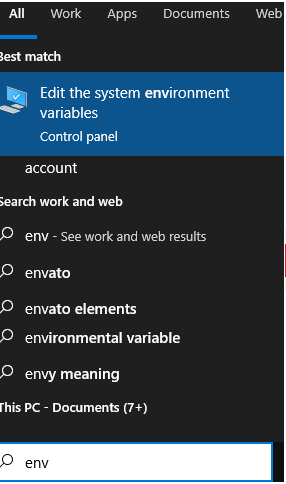
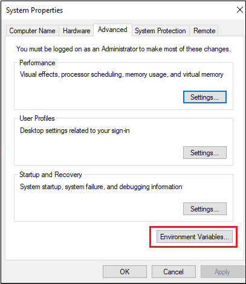
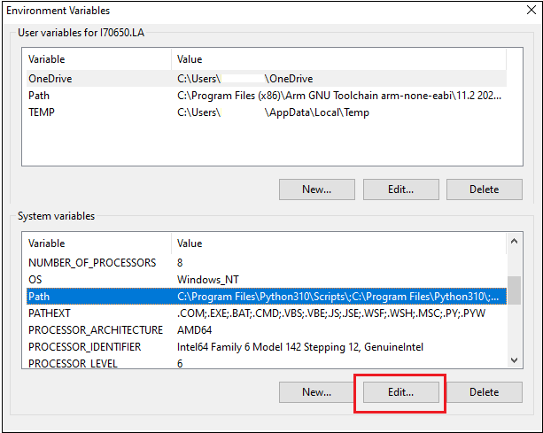
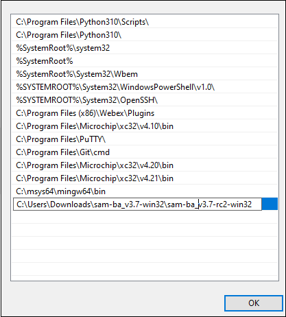
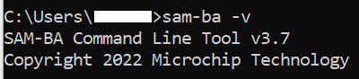
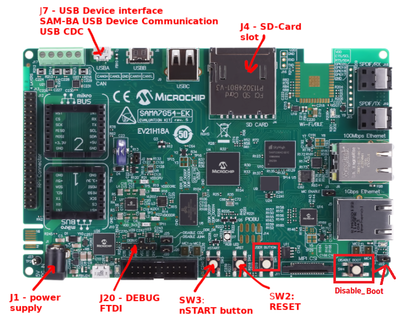

# SAM-BA Installation and Setup.

This training module describes how to Install and Setup SAM-BA tool. 

## SAM-BA Installation and Setup:
* Install SAM-BA tool on your windows host PC.
  * To Download the latest version of SAM-BA tool for Windows [click this link](https://www.microchip.com/en-us/development-tool/SAM-BA-In-system-Programmer).
  * Download the ZIP file and unzip it into a working directory of your choice.
  * Add the SAM-BA directory path to the environment variables.
    * To do this from your PC --> Open the Start Search, type in “env”.
    * Choose “Edit the system environment variables”.   
      
	* In **System Properties** window, Click on "Environment Variables" in **Advanced** tab. 
	  
	* In **Environment Variables** window, double click on "path" in **System Variables** section. 
	  
	* Add SAM-BA directory path to path variables. 
	  
  * Once the SAM-BA Host program has been installed, the execution of the application is from the Windows command prompt.
  * Now open Windows command prompt and enter the below command to ensure sam-ba is installed properly. 
    ***sam-ba -v*** 
	
	
* Setup to flash using SAM-BA:
  * Open Disable boot Jumper(J22) on SAMA7G54-EK Evaluation Kit.
  * Ensure there is no SD memory card inserted.
  * Power up the SAMA7G54-EK Evaluation Kit by connecting 5V/2A power adapter to J1 connector or by connecting a micro-usb cable to J7 connector.
  * Connect micro-usb cable to J24. J24 will work as CDC COM Port as well as Onboard debugger.
  * Press and release start(nSTART) button.
  * Push and hold the "DISABLE_BOOT" button. (This disables booting from the onboard memories - QSPI, e.MMC and SDCARD)
  * Reset the board by pressing and then releasing the reset "nRST" button.
  * Release the "DISABLE_BOOT" button.
  
