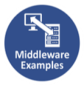
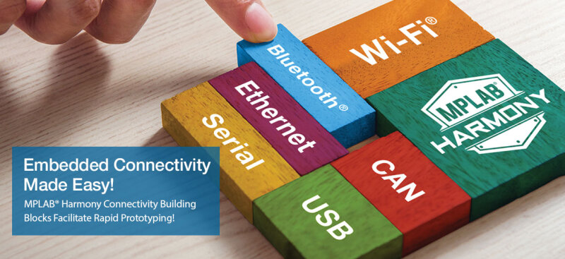
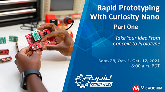

 &nbsp;&nbsp;&nbsp;&nbsp;&nbsp;&nbsp;&nbsp;&nbsp;&nbsp; &nbsp;&nbsp;&nbsp;&nbsp;&nbsp;&nbsp;&nbsp;&nbsp;&nbsp;&nbsp;&nbsp;&nbsp;&nbsp;&nbsp;&nbsp;&nbsp;&nbsp;&nbsp;&nbsp;&nbsp;&nbsp;&nbsp;&nbsp;&nbsp;&nbsp;&nbsp;&nbsp;&nbsp;&nbsp;&nbsp;&nbsp;&nbsp;&nbsp;&nbsp;&nbsp;&nbsp;&nbsp;&nbsp;&nbsp;&nbsp;&nbsp;&nbsp;&nbsp;&nbsp;&nbsp;&nbsp;&nbsp;&nbsp;&nbsp;&nbsp;&nbsp;&nbsp;&nbsp;&nbsp;&nbsp;&nbsp;&nbsp;&nbsp;&nbsp;&nbsp;&nbsp;&nbsp;&nbsp;&nbsp;&nbsp;&nbsp;&nbsp;&nbsp;&nbsp;&nbsp;&nbsp;&nbsp;   

# MPLAB Harmony Middleware Example Documentation

This page contains quick documentation for MPLAB® Harmony 3 Middleware Libraries usage.  

- ### [Getting Started with Harmony v3 Drivers and Middleware on PIC32MZ EF MCUs using FreeRTOS](./pic32mz_getting_started_middleware/readme.md)
- ### [Getting Started with USB on SAM MCUs Using MPLAB Harmony v3](./same70_getting_started_middleware/readme.md)
- ### [Rapid prototyping with Curiosity Nano Evaluation Kit using MPLAB Harmony v3](./rapid_prototyping/readme.md)
- ### [Digit Recognition AI/ML Application on SAM E51 IGAT CURIOSITY EVALUATION KIT Using MPLAB Harmony v3](./digit_recognition_ai_ml/readme.md)
- ### [Getting Started with MPLAB Harmony v3 to Create a Web-Enabled Digital Photo Frame](./web_photo_frame/readme.md)
- ### [Secure Boot on PIC32CM LS60 Curiosity Pro Evaluation Kit using MPLAB Harmony v3](./pic32cmls60_secure_boot/readme.md)

## Audio
- ### [MPLAB Harmony 3 Audio Overview](./harmony_3_audio_overview/readme.md)
- ### [Creating your first Audio Application](./create_first_audio_application/readme.md)
- ### [Creating Your first Audio Decoder Application](./create_first_audio_decoder_application/readme.md)
- ### [SD Card Audio Player/Reader Tutorial](./sdcard_audio_player_reader_tutorial/readme.md)
    - ### [Audio-Tone Generation Using a Lookup Table](./sdcard_audio_player_reader_tutorial/audio_tone_using_a_lookup_table/readme.md)
    - ### [Audio-Tone Generation from a Text File Stored in an SD Card](./sdcard_audio_player_reader_tutorial/audio_tone_using_text_file_in_sd_card/readme.md)
    - ### [SD Card Reader Support to Load Audio Files](./sdcard_audio_player_reader_tutorial/sd_card_reader_to_load_audio_files/readme.md)
    - ### [Play a WAV Audio File from an SD Card](./sdcard_audio_player_reader_tutorial/play_wav_audio_file_from_sd_card/readme.md)
    - ### [Display Graphics Support to Select and Play Audio File](./sdcard_audio_player_reader_tutorial/display_graphics_to_select_and_play_audio_file/readme.md)

## Graphics
- ### [Quickstart Prebuilt Graphics Applications](./quickstart_prebuilt_graphics_applications/readme.md)
- ### [Creating a new Graphics Application](./creating_a_new_graphics_application/readme.md)
- ### [Graphics Quick Start Application Guides](./graphics_quick_start_application_guides/readme.md)
- ### [Harmony Graphics Suite User Guide](./harmony_graphics_suite_user_guide/readme.md)

## USB
- ### [Create your first USB Device Application](./create_first_usb_device_application/readme.md)
- ### [Create Your First USB Host Application](./create_first_usb_host_application/readme.md)
- ### [Harmony USB Stack User Guide](./harmony_usb_stack_user_guide/readme.md)

## TCP/IP
- ### [Create your first TCP/IP Application](./create_first_tcpip_application/readme.md)
- ### [Harmony TCP/IP User Guide](./harmony_tcpip_user_guide/readme.md)
- ### [File Transfer Protocol Using MPLAB Harmony v3 TCP/IP Stack for SAM E54 MCU](./ftp_harmony_tcpip/readme.md)

## Touch
- ### [Create a Touch Project in Harmony](./create_a_touch_project/readme.md)
- ### [Create Touch Surface & Gesture Project in Harmony](./create_touch_surface_gesture_project/readme.md)
- ### [Harmony QTouch User Guide](./harmony_qtouch_user_guide/readme.md)

## Crypto
- ### [Harmony Crypto Overview - Board Examples](./harmony_crypto_overview/readme.md)

## Wireless
- ### [Create Your First WINC Bypass Mode Example](./create_first_winc_bypass_mode_example/readme.md)
- ### [Harmony WINC Driver Architecture](./harmony_winc_driver_architecture/readme.md)

## Bluetooth
- ### [Create your First Bluetooth Application in Harmony](./create_first_bluetooth_application/readme.md)

## Motor control
- ### [Create your first Motor Control Application](./create_first_motor_control_application/readme.md)

## Web Links
- <a href="http://ww1.microchip.com/downloads/en/DeviceDoc/How_to_Use_Harmony_v3_Debug_System_Service_DS90003246A.pdf" target="_blank">How to Use the MPLAB Harmony v3 Debug System Service</a>
- <a href="https://www.microchip.com/en-us/education/technical-learning-center/webinars/rapid-prototyping-webinar-series" target="_blank">Rapid Prototyping Webinar Series</a>

### **Note:**  
This page provides a quick reference covering the MPLAB Harmony 3 Middleware Libraries usage. MPLAB Harmony 3 solutions provides more peripheral or technology specific documentation.  

## Videos

Peripheral/Technology specific documentation are available in technology repositories like <a href="https://github.com/Microchip-MPLAB-Harmony/csp" target="_blank">csp</a>, <a href="https://github.com/Microchip-MPLAB-Harmony/core" target="_blank">core</a>, <a href="https://github.com/Microchip-MPLAB-Harmony/usb" target="_blank">usb</a>, <a href="https://github.com/Microchip-MPLAB-Harmony/net" target="_blank">net</a>, <a href="https://github.com/Microchip-MPLAB-Harmony/audio" target="_blank">audio</a>, <a href="https://github.com/Microchip-MPLAB-Harmony/gfx_apps" target="_blank">gfx_apps</a>, etc.

## Reference Links  
  &nbsp; &nbsp; &nbsp;   &nbsp; &nbsp; &nbsp;   &nbsp; &nbsp;   
