&nbsp;&nbsp;&nbsp;&nbsp;&nbsp;&nbsp;&nbsp;&nbsp;&nbsp;&nbsp;&nbsp;&nbsp;&nbsp;&nbsp;&nbsp;&nbsp;&nbsp;&nbsp;&nbsp;&nbsp;&nbsp;&nbsp;&nbsp;&nbsp;&nbsp;&nbsp;&nbsp;&nbsp; &nbsp;&nbsp;&nbsp;&nbsp;&nbsp;&nbsp;&nbsp;&nbsp;&nbsp;&nbsp;&nbsp;&nbsp;&nbsp;&nbsp;&nbsp;&nbsp;&nbsp;&nbsp;&nbsp;&nbsp;&nbsp;&nbsp;&nbsp;&nbsp;&nbsp;&nbsp;&nbsp;&nbsp;&nbsp;&nbsp;&nbsp;&nbsp;&nbsp;&nbsp;&nbsp;&nbsp;&nbsp;&nbsp;&nbsp;&nbsp;&nbsp;&nbsp;&nbsp;&nbsp;&nbsp;&nbsp;&nbsp;&nbsp;&nbsp;&nbsp;&nbsp;&nbsp;&nbsp;&nbsp;&nbsp;&nbsp;&nbsp;&nbsp;&nbsp;&nbsp;&nbsp;&nbsp;&nbsp;&nbsp;&nbsp;&nbsp;&nbsp;&nbsp;&nbsp;&nbsp;&nbsp;&nbsp; 
# Application migration from 8-bit AVR to 32-bit SAM D21 MCU

> This page acts as a reference for migrating applications from 8-bit AVR Microcontroller (MCU) to 32-bit SAM MCU. This page shows how to migrate an application from **ATMega4809** MCU to **SAMD21G17D** MCU with the help of an example.

> For the migration to a 32-bit MCU, the application uses SAM D21 Curiosity Nano Evaluation Kit and is developed on MPLAB® Harmony v3 software framework.

> The [SAM D21 Curiosity Nano Evaluation Kit](https://www.microchip.com/developmenttools/ProductDetails/DM320119) is a hardware platform to evaluate the SAMD21G17D microcontroller (MCU). It is supported by the MPLAB® X Integrated Development Environment (IDE) and MPLAB Harmony v3 software development framework. The evaluation kit provides easy access to the features of the SAM D21 MCU to integrate the device into a custom design. Because the evaluation kit contains an On-Board Nano Debugger for programming and debugging, no external tools are necessary to program the SAMD21G17D device. The evaluation kit is compatible with Curiosity Nano  Base board (Part Number - [AC164162](https://www.microchip.com/Developmenttools/ProductDetails/AC164162)) which allows you to quickly scale and prototype your next innovative design using the SAMD21G17D MCU.

> [MPLAB® Harmony v3](https://www.microchip.com/mplab/mplab-harmony) is a flexible, fully integrated embedded software development framework for 32-bit microcontrollers (MCUs) and microprocessors (MPUs). MPLAB Harmony v3 includes the MPLAB Harmony Configurator (MHC) tool, a set of modular Peripheral Libraries (PLIBs), drivers, system services, middleware, and numerous example applications, all of which are designed to help quickly and easily develop powerful and efficient embedded software for Microchip’s 32-bit PIC® and SAM devices.

> This migration guide refers an existing application “[Getting Started with UART on ATmega4809](https://microchiptechnology.sharepoint.com/:u:/s/DeveloperHelp/ESUxJWNxFBJPpJZLVUJ5IrQBZOc05J4HPtWhStudpct0VQ?download=1)” developed on [ATmega4809 Curiosity Nano Evaluation Kit](https://www.microchip.com/DevelopmentTools/ProductDetails/DM320115) using [MPLAB® Code Configurator (MCC)](https://www.microchip.com/mplab/mplab-code-configurator) and discuss steps to migrate the existing application to SAM D21 Curiosity Nano Evaluation Kit which using MPLAB® Harmony Configurator (MHC). The application is further extended by adding more peripheral specific functionality.

> The application developed on SAM D21 MCU will utilize:
- PORT PLIB to control the LED.
- External Interrupt Controller (EIC) PLIB and Systick PLIB to toggle the LED on SWITCH press event
- SERCOM (as Universal Synchronous Asynchronous Receiver Transmitter (USART)), STDIO Library and Direct Memory Access (DMA) PLIBs to print the Info messages on a COM (serial) port terminal application running on a PC and to receive command from serial terminal.
- SERCOM (as SPI) to run a self-loopback test.

> Two ways to use this guide:
1. Create the project from scratch:
  -	Follow step-by-step instructions below.
2. Use the solution project as an example:
  - Build the [solution project](https://github.com/Microchip-MPLAB-Harmony/reference_apps/releases/latest/download/atmega4809_to_samd21_migration.zip) and program it to the SAM D21 Curiosity Nano Evaluation Kit to observe the expected behavior.  

> This following bullet points provides links to the topics:

- [Hardware Used](#hardware-used)
- [Software/Tools Used](#software-tools-used)
- [Hardware Setup](#hardware-setup)
- [Description](#Description)
  - [Overview](#Overview)
  - [Install MHC](#Install-MHC)  
  - [Create MPLAB Harmony v3 Project](#Create-MPLAB-Harmony-v3-Project)  
  - [Configure Clock](#Configure-Clock)  
  - [Add SERCOM (USART) Peripheral](#Add-SERCOM-(USART)-Peripheral)  
  - [Generate Code](#Generate-Code)  
  - [Add Code](#Add-Code)  
  - [Build and Program](#Build-and-Program)  
  - [Verify "Hello World" output](#Verify-Hello-World-output)  
  - [Configure/Enable Formatted STDIO, USART Receive and SWITCH/LED functionality](#Configure_Enable-Formatted-STDIO-USART-Receive-and-SWITCH_LED-functionality)  
  - [Verify Formatted STDIO, USART Receive and SWITCH/LED functionality](#Verify-Formatted-STDIO,-USART-Receive-and-SWITCH/LED-functionality)  
  - [Extend application to configure SPI loopback using DMA based Transfers](#Extend-application-to-configure-SPI-loopback-using-DMA-based-Transfers)  
  - [Verify extended functionality - SPI loopback](#Verify-extended-functionality---SPI-loopback)  
- [Results](#results)
- [Analysis](#analysis)
- [Conclusions](#conclusions)

## 
## Hardware Used:
- [SAM D21 Curiosity Nano Evaluation Kit](https://www.microchip.com/Developmenttools/ProductDetails/DM320119)   
- Connection wires

## 
## Software/Tools Used:
 *This project has been verified to work with the following versions of software tools:*  

- [MPLAB Harmony v3 "csp" repo v3.12.0](https://github.com/Microchip-MPLAB-Harmony/csp/releases/tag/v3.12.0)
- [MPLAB Harmony v3 "dev_packs" repo v3.12.0](https://github.com/Microchip-MPLAB-Harmony/dev_packs/releases/tag/v3.12.0)
- [MPLAB Harmony v3 "mhc" repo v3.8.5](https://github.com/Microchip-MPLAB-Harmony/mhc/releases/tag/v3.8.5)
- MPLAB Harmony 3 Launcher Plugin v3.6.4
- [MPLAB X IDE v6.00](https://www.microchip.com/mplab/mplab-x-ide)
- [MPLAB XC32 Compiler v4.00](https://www.microchip.com/mplab/compilers)
- Any Serial Terminal application like Tera Term terminal application.  

 *Because Microchip regularly update tools, occasionally issue(s) could be discovered while using the newer versions of the tools. If the project doesn’t seem to work and version incompatibility is suspected, It is recommended to double-check and use the same versions that the project was tested with.* 

## 
## Hardware Setup
- Connect the SAM D21 Curiosity Nano Development Board to the Host PC as a USB Device through a Type-A male to micro-B USB cable connected to Micro-B USB (Debug USB) port
- Connect a wire from **PA16 to PA19** on SAM D21 Curiosity Nano Development Kit for SPI Self Loopback testing.  

    
    

## 
## Description
## 
### Overview
This migration guide uses the AVR ATMega4809 application which helps in “**Getting Started with UART on AVR**”.  
- Click [Here](https://microchiptechnology.sharepoint.com/:u:/s/DeveloperHelp/ESUxJWNxFBJPpJZLVUJ5IrQBZOc05J4HPtWhStudpct0VQ?download=1) to download the application.

The AVR ATMega4809 application shows how to implement a command line interface. This way, the microcontroller can receive control commands via the USART. In this use case, an LED is controlled using commands sent from the MPLAB Data Visualizer.  

The application flow is as follows:
1.	Configures the system clock   
The clock is configured to 1 MHz using 16 MHz Internal Oscillator
2.	Configures USART3  
USART3 is configured for 9600 baud rate and the standard 8-N-1 (eight data bits, no parity bit and one Stop bit) frame format.
3.	 Configures pins   
The USART TX, RX pins and LED pin are configured
4.	 Implements STDIO receive and send functions   
STDIO library is implemented to receive and send commands from serial terminal
5.	 Reads and execute valid commands  
Receives command from serial terminal and executes it

Follow the below steps to get started migrating to SAMD21 and later extend the functionality by adding more peripherals.

### Install MHC
1.	Install the MPLAB® Harmony Configurator (MHC) Plug-in in the MPLAB X IDE if not installed.
2.	Verify the MPLAB® Harmony Configurator (MHC) Plug-in is installed.
 - Launch MPLAB X IDE from the Windows® Start Menu. Close all the projects and files that are currently open.
 - Go to **Tools > Embedded**.
 -	You will see **MPLAB Harmony 3 Configurator** in the menu    
   

### Create MPLAB Harmony v3 Project
3.	Create MPLAB Harmony v3 Project Using MPLAB X IDE  
 - Select **File > New Project** from the main IDE menu    
   
 - In the **Categories pane** of the **New Project** dialog window, select **Microchip Embedded**. In the **Projects pane**, select **32-bit MPLAB Harmony 3 Project**, then click **Next**    
 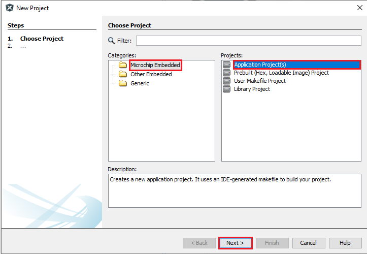  
 - In the **Framework Path** edit box, browse to the folder you downloaded the framework to and select **Next**    
   
 - In the **Project Settings** window, apply the following settings:  
    1. **Location**: indicates the path to the root folder of the new project. All project files will be placed inside this folder. The project location can be any valid path, for example: `<your project path>`/atmega4809_to_samd21
    2. **Folder**: indicates the name of the MPLAB X .X folder. Enter "*atmega4809_to_samd21_migration*" to create an atmega4809_to_samd21_migration.X folder.
   3. **Name**: enter the project’s logical name as "*atmega4809_to_sam_d21_cnano*". This is the name that will be shown from within the MPLAB X IDE.
 - Click Next to proceed to configuration settings      
 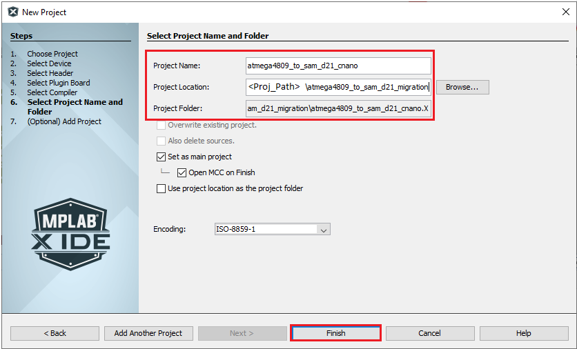  
 - Follow the steps below to set the project’s configuration settings:
  1. **Name**: enter the configuration name as "sam_d21_cnano".
  2. **Target Device**: select **ATSAMD21G17D** as the target device.
  3. After selecting the target device, click **Finish** to launch MHC.    
    
 - Device family pack path can be modified in below window. For now, use the default values    
    
 - The MHC plugin’s main window for the project will be displayed as shown in the following image    
   

### Configure Clock
4.	Configuring Clock Settings  
The SAM D21 family of microcontrollers (MCUs) contains a sophisticated clock distribution system designed to give maximum flexibility to the user application. The clock system allows the tuning of the performance and power consumption of the device in a dynamic manner. The MHC provides an easy to use UI (User Interface) window, and a Clock Easy View window to configure the system and peripheral clocks.
 - Launch **Clock Easy View** by going to **Tools** menu of MHC window and then select **Clock Configuration**    
   
 -	In the **Clock Easy View**, SAM D21 can operate at maximum 48 MHz, therefore **Main Clock** is set to 48 MHz.
 -	Change the **Main Clock** to 1MHz
 -	The Open loop Digital Frequency Locked Loop (DFLL 48 MHz) is configured and enabled to run the main clock. The configured DFLL is fed as input to the GCLK generator ‘0’ and a suitable clock divider (48) and masker must be selected to achieve a maximum frequency of 1 MHz. Refer to the following figure to configure the main clock to run at 1MHz    

      

  MHC clock easy view provides all the clock options available in the SAMD21 in a UI, which makes easier to configure the clock whenever necessary.

### Add SERCOM (USART) Peripheral
5.	Adding SERCOM (USART) Peripheral  
MHC Graphical User Interface helps in selecting and configuring the peripherals needed by the project. It lists all the peripherals available in SAMD21 in an Active Component tab.  

 -	Click on the **Available Components** tab in the left pane in the MPLAB® Harmony Configurator (MHC) window. Expand **Peripherals > SERCOM**
 -	Double click or drag and drop **SERCOM5** to add the USART Peripheral Library (PLIB) to the project graph.  

 **Note:** SAM D21 Curiosity Nano On-Board Nano Debugger also includes a Virtual Com port which is routed to SERCOM5, therefore in this application, SERCOM5 is chosen.    
 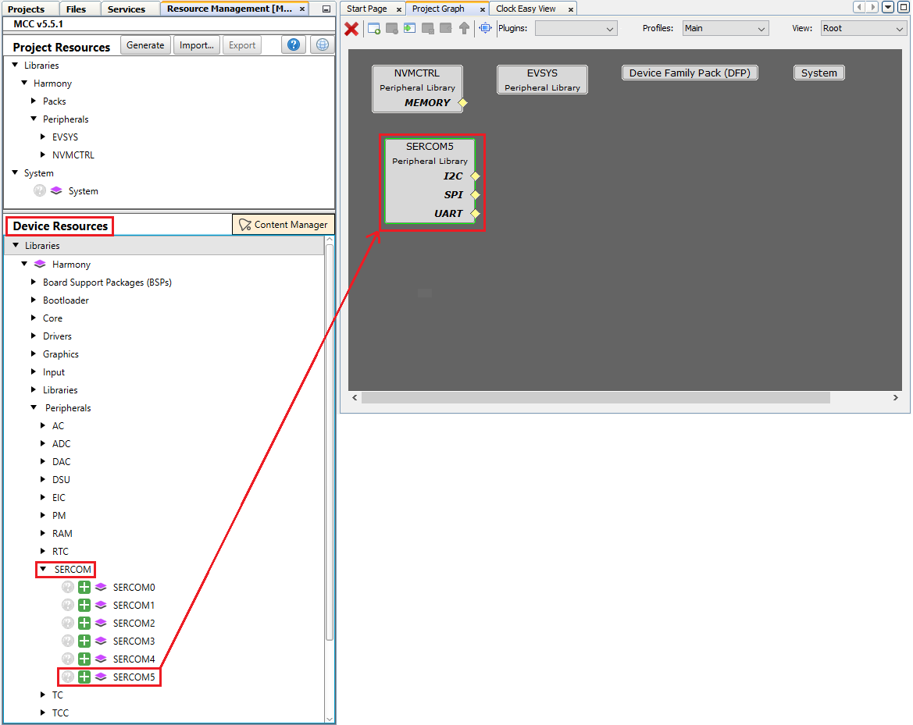    

 -	Select the **SERCOM5 Peripheral Library** in the project graph. Verify that the default "SERCOM Operation Mode" configuration is set as USART and configure 9600 baud rate and the standard 8-N-1 (eight data bits, no parity bit and one Stop bit) frame format.    

   

6. Configuring USART pins using MHC PIN Configurator  
The Pin Manager consists of Pin Settings, the Pin Diagram, and the Pin Table tabs, which enables users to configure (assign peripheral function, set pin direction, configure pull-up or pull-down and so on) and map the I/O pins.  

  The following color combinations are associated with the pins in the graphical or table View:  
  	**Gray**: This pin is not usable in the selected configuration, and there is no enabled module which has any functionality on that pin. The grayed-out locks on a white background indicates the pins that are locked out by selected system functions.  
  	**Blue**: This pin is available and can be allocated to a module.  
  	**Green** (with a lock): This pin is allocated and selected for a module. The name displayed against the pin is either the name of the pin in the module’s context or a custom name entered.
 -	Open the **Pin Configuration** tabs by clicking on **MHC > Tools > Pin Configuration**.   
 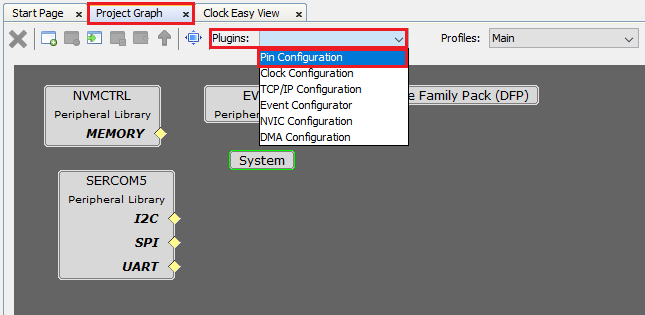  
 -	Launching Pin configuration opens Pin Settings, the Pin Diagram, and the Pin Table tabs.
 -	select the MHC **Pin Table** tab and then scroll down to the **SERCOM5** module as shown below.  
 	Enable USART_TX on PA22 (Pin #31)    
 	Enable USART_TX on PB22 (Pin #37)    
     

### Generate Code
7.	Generate Code  
 -	When done, before generating code, click the **Save** icon in MPLAB® Harmony Configurator (MHC) as shown below.    
   
 -	Save the configuration in its default location when prompted.    
   
 -	Click on the **Code Generate** button as shown below to start generating code.    
     

 -	Click on the **Generate** button in the **Generate Project** window, keeping the default settings as shown below. If prompted for saving the configuration, click **Save**.    
       
      
  -	As the code is generated, MHC displays the progress as shown below.  
      
  -	Navigate to the **Projects** tab in MPLAB X IDE to view the project tree structure.
  -	Examine the generated code as shown below.  
 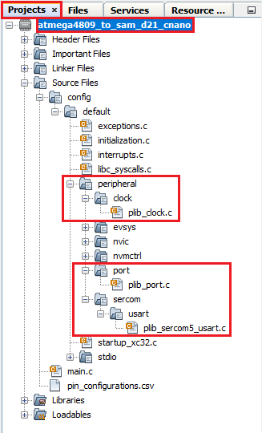    

  MHC will include all the MPLAB Harmony library files and generate the code based on the MHC selections. The generated code would add files and folders to your Harmony project as shown.
  Among the generated code, notice the Peripheral Library (PLIB) files generated for SERCOM 5 (as Universal Synchronous Asynchronous Receiver Transmitter (USART)), Clock and PORT peripherals.

### Add Code

8. Navigate to the **Projects** tab in MPLAB X IDE and select main.c, add below code snippet in main function to print “Hello World” string on the serial terminal.  
        uint8_t welcomeData[]  = "Hello World\r\n";

        while ( true )
        {
          SERCOM5_USART_Write(&welcomeData[0],sizeof(welcomeData));
        }  
   

### Build and Program
9.	Before proceeding to Build and program, set up the compiler toolchain. Click on the **Projects** tab on the top left pane in MPLAB X IDE. Right click on the project name **pic18f_to_sam_d21_cnano** and go to **Properties**.  
 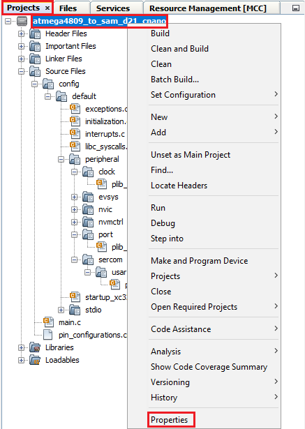  
10.	Make sure that XC32 (v2.41) is selected as the Compiler Toolchain for XC32. Click on **Apply** and then click on **OK**.  
 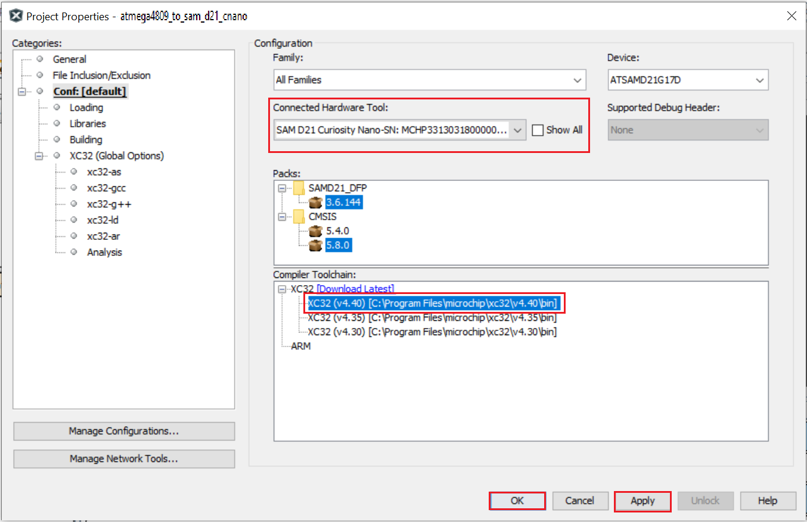  
11.	Clean and build your application by clicking on the **Clean and Build** button as shown below.   
   
12.	Program your application to the device by clicking on the **Make and Program** button as shown below.    
     
 The lab should build and program successfully.  

### Verify "Hello World" output

13.	Now, open the **Tera Term** terminal application on your PC (from the Windows® Start menu by pressing the **Start** button). Select the **Serial Port** as shown below.    
 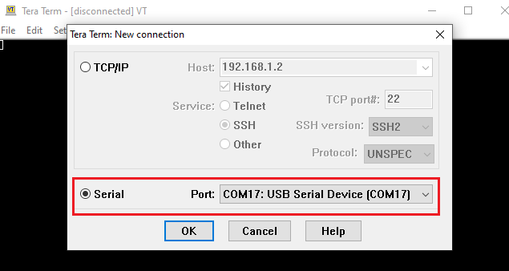      
14.	Change the baud rate to 9600.    
     
15.	You should see the “Hello World” message displayed on the terminal as shown below.    
   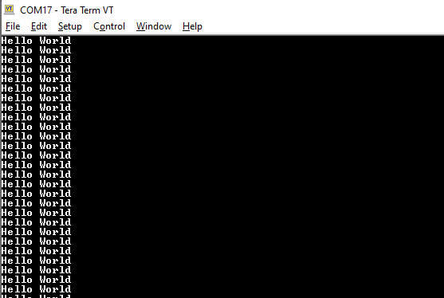    

   You successfully completed printing the “Hello World” message on serial terminal. Let us continue and extend the functionality of the application as below.  

### Configure/Enable Formatted STDIO, USART Receive and SWITCH/LED functionality  

 - Configure STDIO Library to use **printf** and **scanf** function to write and read data from the serial terminal respectively  
 - Receive the command from serial terminal and control the LED0 on the SAM D21 Curiosity evaluation kit  
 - Use Switch SW0 on the SAM D21 Curiosity Evaluation Kit to toggle the LED twice when it is pressed. External Interrupt controller (EIC) and Systick peripherals are used to achieve this  

16.	If you closed MHC accidently and would like to open it again, go to **Tools > Embedded > MPLAB Harmony 3 Configurator** in MPLAB X IDE.
17.	In the **Project Graph**, Select **SERCOM5**. Right click on yellow diamond and select consumer as **STDIO** as shown below  
     
18.	Select the MHC **Pin Settings** tab and then scroll down to the PORT pin **PB10** (Pin Number 19) in the **Pin ID** column and configure **PB10** as an output pin for LED functionality as shown below.  
     
19.	Select the **Pin Settings** tab and then scroll down to the PORT pin **PB11** (Pin Number 20) in the **Pin ID** column and configure **PB11** as an external interrupt pin for switch functionality as shown below. Internal pull-up is enabled to avoid false edge detection as there is no external pull-up on the SAM D21 Curiosity Nano Evaluation Kit.
     
20.	Select the Project Graph tab.  
   - Under the **Available Components** tab, expand **Peripheral > EIC**. Select and double click on **EIC** to add the EIC module to the project.      

        

   - Configure the EIC block to generate an interrupt every time the user presses the switch SW0 as shown below and enable filter functionality to avoid electrical noise on the switch pin.    
       
21.	Enable Systick to create a delay for toggling LED0, click on **System** in **Project Graph** and Configure as below.
   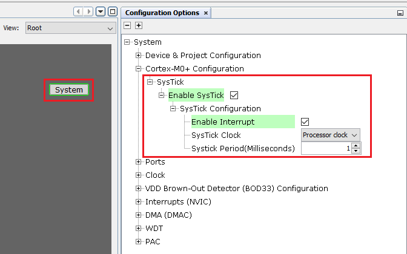  
22.	When done, before generating code, click the **Save** icon in MPLAB® Harmony Configurator (MHC). Save the configuration in its default location when prompted.
23.	Click on the **Code Generate** button to start generating code.
24.	Click on the **Generate** button in the **Generate Project** window, keeping the default settings. If prompted for saving the configuration, click **Save**.
25.	Navigate to the **Projects** tab in MPLAB X IDE and select main.c, add below code snippet to receive the command from serial terminal and a function to control the LED0 on the SAM D21 Curiosity Nano Evaluation Kit.
 -	In main.c, add the below function above “main” function
                         #include <string.h>

                         void executeCommand(char *command)
                         {
                             if(strcmp(command, "ON") == 0)
                             {
                                 LED_Clear();
                                 printf("OK, LED ON.\r\n");
                             }
                             else if (strcmp(command, "OFF") == 0)
                             {
                                 LED_Set();
                                 printf("OK, LED OFF.\r\n");
                             }
                             else
                             {
                                 printf("Incorrect command.\r\n");
                             }
                         }    
                                
 -	Move “SERCOM5_USART_Write” function above while loop and add **scanf** inside the while loop as shown below.    
      
26.	Now, open the **Tera Term** terminal application on your PC. Enable **Local echo** in **Setup > Terminal** as shown below.  
     
27.	Clean and build your application by clicking on the **Clean and Build** button.

### Verify Formatted STDIO, USART Receive and SWITCH/LED functionality
28.	Program your application to the device by clicking on the **Make and Program** button. The lab should build and program successfully.
29.	In Tera Term you should see “**Hello World**” message displayed.
30.	Type **ON** in serial terminal and press **Enter** to turn on LED0 on SAMD21 Curiosity Nano kit and Type **OFF** in serial terminal and press **Enter** to turn off LED0 on SAMD21 Curiosity Nano Evaluation Kit.  
     
31.	Switch SW0 is configured as interrupt using EIC peripheral, therefore register a call back in main function. Whenever user presses the switch, a callback will be notified and inside the call back, toggle the LED0 twice.
 - In main.c file, inside main function, add the below code.
                   EIC_CallbackRegister(EIC_PIN_11,EIC_User_Handler, 0);
                   SYSTICK_TimerStart();
 - In main.c, add the below code above main function
                  static void EIC_User_Handler(uintptr_t context)
                  {
                     uint8_t i = 0;

                     while(i<4){
                      LED_Toggle();
                      SYSTICK_DelayMs(500);
                      i++;
                     }
                  }  
     

32.	Clean and build your application by clicking on the **Clean and Build** button.
33.	Program your application to the device by clicking on the **Make and Program** button.
34.	Press the Switch SW0 on SAM D21 Curiosity Nano Evaluation Kit and observe LED0 Toggling twice at 500ms rate.

    You successfully completed controlling the LED0 on the SAMD21 Curiosity Nano Evaluation Kit by receiving the commands from the serial terminal through USART and also toggled the LED0 on Switch SW0 press using EIC and Systick peripheral.

### Extend application to configure SPI loopback using DMA based Transfers

    Let us extend the functionality and add Serial Peripheral Interface (SPI) to perform a Self-Loopback test and add Direct memory address (DMA) to send the status of the SPI Transfer to the terminal without using CPU.

35.	 Select the **Project Graph** tab. Under the **Available Components** tab, expand **Peripheral > SERCOM**. Select and double click on **SERCOM1** to add the SPI module to the project.    
         
36.	In **Project Graph** select **SERCOM1** and configure as below  
       

37.	Open **Pin Table**, Select **SERCOM1** and configure the pins as shown below  
     

38.	Launch **DMA Configurator** from **MHC > Tools > DMA Configuration**  
     
39.	Click on **ADD Channel** and Select **SERCOM5_Transmit** to configure the DMA  
   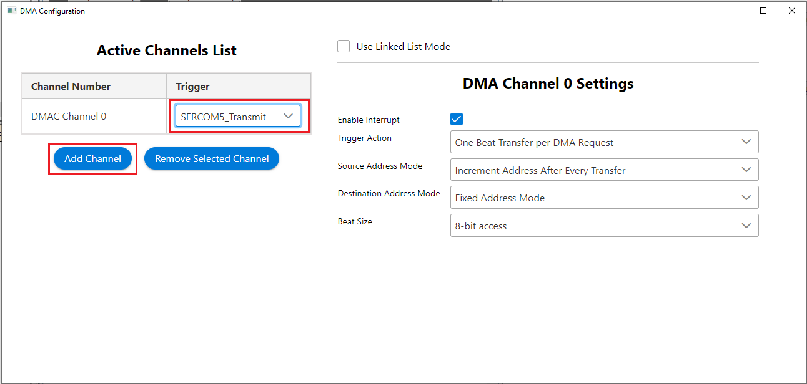  
40.	When done, before generating code, click the ***Save** icon in MPLAB® Harmony Configurator (MHC). Save the configuration in its default location when prompted.  
41.	Click on the **Code Generate** button to start generating code.  
42.	Click on the **Generate button** in the **Generate Project** window, keeping the default settings.
43.	If prompted for saving the configuration, **click Save**.
44.	In main.c, Add below code snippet
            SERCOM1_SPI_WriteRead(&txData[0], sizeof(txData), &rxData[0], sizeof(rxData));

            /* Compare received data with the transmitted data */
            if ((memcmp(txData, rxData, sizeof(txData)) == 0))
            {
                /* Pass: Received data is same as transmitted data */
                DMAC_ChannelTransfer(DMAC_CHANNEL_0, "Received SPI Valid Data\r\n", \
                (const void *)&(SERCOM5_REGS->USART_INT.SERCOM_DATA), \
                25);
            }
            else
            {       
                /* Fail: Received data is not same as transmitted data */
                DMAC_ChannelTransfer(DMAC_CHANNEL_0, "Received Invalid SPI Data\r\n", \
                (const void *)&(SERCOM5_REGS->USART_INT.SERCOM_DATA), \
                27);
            }
 - Add below code snippet above main function
             uint8_t txData[]  = "SELF LOOPBACK DEMO FOR SPI!";
             uint8_t rxData[sizeof(txData)];  
  

45.	Clean and build your application by clicking on the Clean and Build button.
46.	Program your application to the device by clicking on the Make and Program button.

### Verify extended functionality - SPI loopback

47.	Connect PA16 and PA19 on SAM D21 Curiosity Nano Evaluation Kit using a connecting wire.
48.	Open Tera Term and observe the data as shown below.    
       

   You can still control the LED0 by sending the commands through serial terminal.

## 
## Results
 You observed the migration of application from ATmega4809 to SAMD21. You successfully used USART and STDIO to print the messages and receive the commands. Ports and EIC were used to control the LED and also configured SPI and DMA to perform self-loop back test.

## 
## Analysis
 You have successfully created your first application using MPLAB Harmony v3 on a SAM D21 microcontroller. Your application used all the fundamental elements that go into building a real-time application. Your successfully migrated application from ATmega4809 to SAMD21.
 In this application, you used MPLAB Harmony Configurator (MHC) to configure the SAM D21 and also used the MPLAB Harmony v3 Framework. You used the clock configurator to set up the CPU clock and also configured Systick. You configured SERCOM 5 (as Universal Synchronous Asynchronous Receiver Transmitter (USART)), SERCOM 1 (SPI), and External Interrupt Controller (EIC) Peripheral Libraries (PLIBs). You also configured the Direct Memory Access (DMA) using the DMA configurator. You used the pin configurator to set up the pins for LED and switch functions.

## 
## Conclusions
 This guide provided you overview of migrating an application from ATmega4809 to SAMD21.
 This guide also provided steps to configure and using all the fundamental components needed to build an application on a SAM D21 microcontroller with MPLAB Harmony v3 framework.

## Reference Links
  &nbsp; &nbsp; &nbsp;   &nbsp; &nbsp; &nbsp;   &nbsp; &nbsp;  
