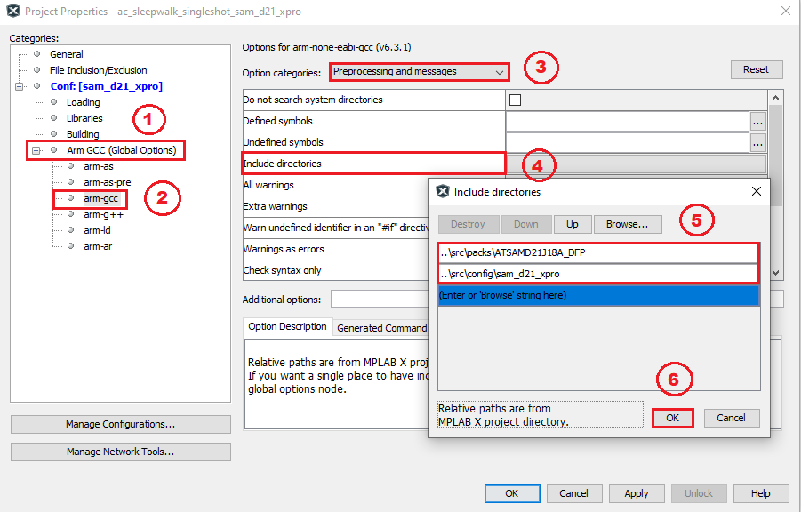
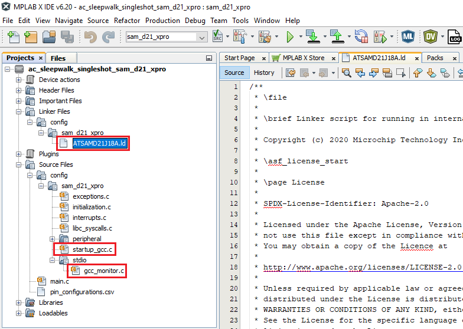
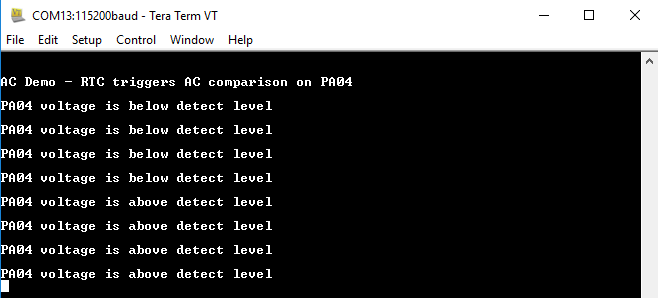

&nbsp;&nbsp;&nbsp;&nbsp;&nbsp;&nbsp;&nbsp;&nbsp;&nbsp;&nbsp;&nbsp;&nbsp;&nbsp;&nbsp;&nbsp;&nbsp;&nbsp;&nbsp;&nbsp;&nbsp;&nbsp;&nbsp;&nbsp;&nbsp;&nbsp;&nbsp;&nbsp;&nbsp; &nbsp;&nbsp;&nbsp;&nbsp;&nbsp;&nbsp;&nbsp;&nbsp;&nbsp;&nbsp;&nbsp;&nbsp;&nbsp;&nbsp;&nbsp;&nbsp;&nbsp;&nbsp;&nbsp;&nbsp;&nbsp;&nbsp;&nbsp;&nbsp;&nbsp;&nbsp;&nbsp;&nbsp;&nbsp;&nbsp;&nbsp;&nbsp;&nbsp;&nbsp;&nbsp;&nbsp;&nbsp;&nbsp;&nbsp;&nbsp;&nbsp;&nbsp;&nbsp;&nbsp;&nbsp;&nbsp;&nbsp;&nbsp;&nbsp;&nbsp;&nbsp;&nbsp;&nbsp;&nbsp;&nbsp;&nbsp;&nbsp;&nbsp;&nbsp;&nbsp;&nbsp;&nbsp;&nbsp;&nbsp;&nbsp;&nbsp;&nbsp;&nbsp;&nbsp;&nbsp;&nbsp;&nbsp; 
# Build MPLAB Harmony v3 project with ARM GCC toolchain in MPLAB X IDE

> This page describes steps to build an MPLAB Harmony v3 project with [ARM GNU Toolchain](https://www.microchip.com/mplab/avr-support/avr-and-arm-toolchains-c-compilers) in MPLABX IDE. The page demonstrates configuring, building, and running an MPLAB Harmony v3 peripheral library (PLIB) application with the ARM GCC toolchain developed on the **SAM D21 Xplained Pro Evaluation Kit**.

> The application demonstrates how to use the AC (Analog Comparators) Peripheral library to perform a single-shot conversion when the peripheral is triggered by the RTC (Real-Time Counter) compare event. The generation of a trigger and compare operation is done while the CPU is in the standby sleep mode. The AC generates the interrupt at the end of the comparison which wakes the CPU.

> The [SAM D21 Xplained Pro Evaluation Kit](https://www.microchip.com/developmenttools/ProductDetails/atsamd21-xpro) is ideal for evaluating and prototyping with the SAM D21 ARM® Cortex®-M0+ based microcontrollers. Xplained Pro Extension kits compatible with SAM D21 Xplained Pro can be purchased individually.

> [MPLAB® Harmony v3](https://www.microchip.com/mplab/mplab-harmony) is a flexible, fully integrated embedded software development framework for 32-bit microcontrollers (MCUs) and microprocessors (MPUs). MPLAB Harmony v3 includes the MPLAB Harmony Configurator (MHC) tool, a set of modular Peripheral Libraries (PLIBs), drivers, system services, middleware, and numerous example applications, all of which are designed to help quickly and easily develop powerful and efficient embedded software for Microchip’s 32-bit PIC® and SAM devices.

## 
## Prerequisite:
- Make sure MPLAB X IDE is installed and Harmony v3 repositories are cloned. For detailed information, refer [MPLAB Harmony v3](https://www.microchip.com/mplab/mplab-harmony/mplab-harmony-v3)
- Download and install [ARM GNU Toolchain v6.3.1](https://www.microchip.com/mplab/avr-support/avr-and-arm-toolchains-c-compilers)
- **Note:** If [Atmel Studio](https://www.microchip.com/mplab/avr-support/atmel-studio-7) is already installed in PC, then installing ARM GCC toolchain is not required as [Atmel Studio](https://www.microchip.com/mplab/avr-support/atmel-studio-7) is already bundled with [ARM GNU Toolchain](https://www.microchip.com/mplab/avr-support/avr-and-arm-toolchains-c-compilers).

**There are two ways to use this guide:**
1. Use the solution project as an example:
    - Build the [solution project](https://github.com/Microchip-MPLAB-Harmony/reference_apps/releases/latest/download/samd21_ac_sleepwalk_singleshot_gcc.zip) and program it to the [SAM D21 Xplained Pro Evaluation Kit](https://www.microchip.com/developmenttools/ProductDetails/atsamd21-xpro) to observe the expected behavior.
2. Create the project from scratch:
    - Follow step-by-step instructions below.

## Instructions to configure, build and run MPLAB Harmony v3 project with ARM GCC toolchain in MPLAB X IDE
The following bullet points provides links to the topics:
- [Hardware Used](#hardware-used)
- [Software/Tools Used](#software-tools-used)
- [Description](#Description)
  - [Overview](#Overview)
  - [Open Project and Compile using XC32 Toolchain](#Open-Project-and-Compile-using-XC32-Toolchain)
  - [Configure the project to use ARM GCC Toolchain](#Configure-the-project-to-use-ARM-GCC-Toolchain)
  - [Compile the project using ARM GCC Toolchain](#Compile-the-project-using-ARM-GCC-Toolchain)
  - [Running the Demo](#Running-the-Demo)
- [Results](#Results)
- [Conclusions](#Conclusions)

## 
## Hardware Used:
- [SAM D21 Xplained Pro Evaluation Kit](https://www.microchip.com/developmenttools/ProductDetails/atsamd21-xpro)

## 
## Software/Tools Used:
 *This project has been verified to work with the following versions of software tools:*  

- [MPLAB Harmony v3 "csp" repo v3.12.0](https://github.com/Microchip-MPLAB-Harmony/csp/releases/tag/v3.12.0)
- [MPLAB Harmony v3 "csp_apps_sam_d21_da1" repo v3.2.0](https://github.com/Microchip-MPLAB-Harmony/csp_apps_sam_d21_da1/releases/tag/v3.2.0)
- [MPLAB Harmony v3 "dev_packs" repo v3.12.0](https://github.com/Microchip-MPLAB-Harmony/dev_packs/releases/tag/v3.12.0)
- [MPLAB Harmony v3 "mhc" repo v3.8.5](https://github.com/Microchip-MPLAB-Harmony/mhc/releases/tag/v3.8.5)
- MPLAB Harmony 3 Launcher Plugin v3.6.4
- [MPLAB X IDE v6.00](https://www.microchip.com/mplab/mplab-x-ide)
- [ARM GNU Toolchain v6.3.1](https://www.microchip.com/mplab/avr-support/avr-and-arm-toolchains-c-compilers)
- [MPLAB XC32 Compiler v4.00](https://www.microchip.com/mplab/compilers)
- Any Serial Terminal application like Tera Term terminal application.

 *Because Microchip regularly update tools, occasionally issue(s) could be discovered while using the newer versions of the tools. If the project doesn’t seem to work and version incompatibility is suspected, It is recommended to double-check and use the same versions that the project was tested with.* 

## Setting up SAM D21 Xplained Pro Evaluation Kit:
- Connect a voltage below VDD to pin 17 of the EXT1 connector
- Connect the Debug USB port on the board to the computer using a micro USB cable

## 
## Description

## 
### Overview:
The [AC Sleepwalking](https://microchip-mplab-harmony.github.io/csp_apps_sam_d21_da1/apps/ac/ac_sleepwalk_singleshot/readme.html) Harmony v3 Application on [SAM D21 Xplained Pro Evaluation Kit](https://www.microchip.com/developmenttools/ProductDetails/atsamd21-xpro) is used to show the steps to compile the project with [ARM GCC Toolchain](https://www.microchip.com/mplab/avr-support/avr-and-arm-toolchains-c-compilers) in MPLAB X IDE.

**Note:** The **AC Sleepwalking** demo application is chosen as an example. The user could chose to use any MPLAB Harmony v3 application developed on MPLAB X IDE to be built with the ARM GCC toolchain.

### Open project and compile using XC32 Toolchain:

**Note:** This is an optional step. This could be followed to verify whether the existing Harmony v3 example used in this guide builds and works on the XC32 compiler toolchain.

- Open MPLAB X IDE and close if any projects are opened.
- Download the **Harmony 3 peripheral library application examples for SAM D21/DA1 family** [**csp_apps_sam_d21_da1**](https://github.com/Microchip-MPLAB-Harmony/csp_apps_sam_d21_da1/releases/tag/v3.0.1) then goto **/apps/ac/ac_sleepwalk_singleshot/firmware** and select the **“sam_d21_xpro.X”** configuration.
- Before changing the toolchain to ARM GCC, ensure the example application demo is compiling and working fine with existing the XC32 toolchain. This is to avoid any errors because of missing library or source files.
- Select the Project -> Right Click -> Properties -> ensure correct hardware and XC32 compiler version is selected.
- Compile the project.
- Run on hardware to ensure the project is working as expected.

### Configure the project to use ARM GCC Toolchain:
This can be done with two methods, either automatically or manually.

1. Automatic Detection: If Atmel Studio is installed in PC, By default, MPLAB X IDE detects the ARM GCC toolchain (installed as a part of Atmel Studio) and shows it in the MPLAB X IDE's Project properties. Refer the [figure](#ARM-GCC-Toolchain-Selection) which shows ARM GCC Toolchain selection.
Since the ARM GCC toolchain is already available, switch to the ARM GCC toolchain from the project properties.
2. Manual: If Atmel Studio is not installed, install the ARM GCC toolchain manually.  Go to MPLAB X IDE -> Tools -> Options -> Embedded -> Build Tools -> Add -> give the base directory -> **<toolchain_path>/toolchain/arm/arm-gnu-toolchain/bin"**. Save it.
    - 
    - Now, select the ARM GCC toolchain in the example application demo project properties. Select the Project -> Right Click -> Properties -> select the ARM GCC toolchain in compiler options and save.
    
    - 

### Compile the project using ARM GCC Toolchain:
If the project is compiled at this point, the compiler may throw some errors. To avoid compiler errors, follow the below steps.
- Add include directories as shown in the following image to avoid missing file errors for device.h and device_cache.h.
    - The include directory paths are shown below:
        - **csp_apps_sam_d21_da1/apps/ac/ac_sleepwalk_singleshot/firmware/src/config/sam_d21_xpro**
        - **csp_apps_sam_d21_da1/apps/ac/ac_sleepwalk_singleshot/firmware/src/packs/ATSAMD21J18A_DFP**
    - 
- Comment the user row configuration bits **#pragmas** from the "initialization.c" file. This is because #pragmas are not recognized by the ARM GCC compiler.
    - 
- Add or Edit the below files to make the project work with ARM GCC toolchain.
    - Add custom Linker file to the project.
    - Replace XC32 startup code with ARM GCC startup code. This can be done by adding **"startup_gcc.c"** file and excluding (or removing) **"startup_xc32.c"** file from project. Edit **"libc_syscalls.c"** file to compile with ARM GCC toolchain.
    - Add STDIO -> **"gcc_monitor.c"** file to make printf/scanf work properly. Exclude (or remove) the **"xc32_monitor.c"** file from the MPLAB Harmony v3 project.
        - 
        - This can be done as follows:
        - Go to config folder of Harmony v3 project config folder
        - Download the SAM D21 AC Sleepwalking solution project -> [samd21_ac_sleepwalk_singleshot_gcc.zip](https://github.com/MicrochipTech/MPLAB-Harmony-Reference-Apps/releases/latest/download/samd21_ac_sleepwalk_singleshot_gcc.zip)
        - After downloading the solution project, copy the files from `/apps/sam_d21_xpro/samd21_ac_sleepwalk_singleshot_gcc/src_gcc_toolchain` and paste in the example application (downloaded from [csp_apps_sam_d21_da1](https://github.com/Microchip-MPLAB-Harmony/csp_apps_sam_d21_da1/releases/tag/v3.0.1)) folder `apps/ac/ac_sleepwalk_singleshot/firmware/src/config/sam_d21_xpro`
        - Paste the files **"ATSAMD21J18A.ld"**, **"startup_gcc.c"** in "sam_d21_xpro" folder and **"gcc_monitor.c"** file in **"stdio"** folder.
        - Right click Linker Files in MPLABX project -> Click Add Existing Item -> select corresponding recently added linker file and add to project. Below image is for reference.
            - 
        - Similarly, add **"startup_gcc.c"** file and **"gcc_monitor.c"** file to the project.
        - To Exclude a file from Project -> select the file -> Right Click -> select “Exclude file(s) from current configuration” or Remove file from the Project. The former option just exclude from the project and latter option will remove the file from project.
        - Replace the contents of **"libc_syscalls.c"** file in the project with the contents of **"libc_syscalls.c"** file in the zip. This file has definition of_sbrk() needed for ARM GCC compiler in addition to content what already present in it.
    - After completing the above steps, compile the project.
    - The project should compile successfully.

### Running the Demo:
- Perform [Prerequisite](#prerequisite), [Configure the project to use ARM GCC toolchain](#Configure-the-project-to-use-ARM-GCC-Toolchain), [Compile the project using ARM GCC Toolchain](#Compile-the-project-using-ARM-GCC-Toolchain) and [Setting up SAM D21 Xplained Pro Evaluation Kit](#Setting-up-SAM-D21-Xplained-Pro-Evaluation-Kit) steps mentioned above, if not done already.
- Open the Tera Term terminal application on your PC (from the Windows® Start menu by pressing the Start button)
- Connect to the EDBG Virtual COM port and configure the baud rate to **115200**
- Build and Program the application using the MPLAB X IDE.

## 
## Results:
- The console displays the message stating whether voltage at PA04 is lower or greater than the internal bandgap voltage (1.1 V)
- LED0 toggles when comparison is done.
    - 

## 
## Conclusions:
This guide demonstrated building an MPLAB Harmony v3 peripheral Libraries (PLIBs) example with ARM GCC Toolchain. The same approach can be followed for any other Harmony v3 project.

## Reference Links
  &nbsp; &nbsp; &nbsp;   &nbsp; &nbsp; &nbsp;   &nbsp; &nbsp;  
